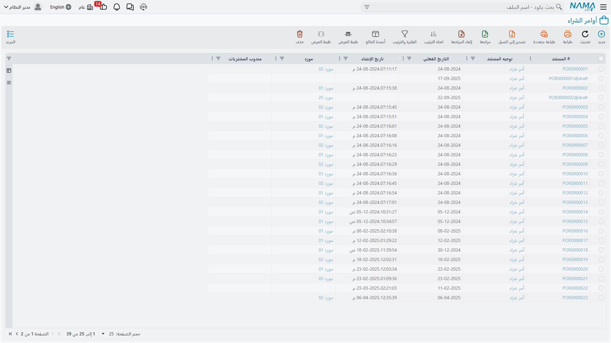
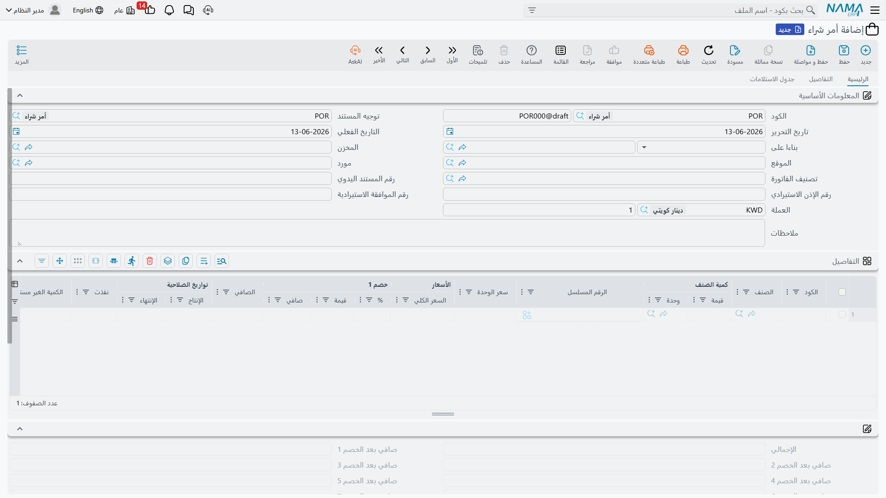

# رحلة الشراء (The Purchasing Journey)

لنتابع القصة الكاملة لكيفية شراء الأصناف - من "نحتاج شيئًا" إلى "وصل إلى مخزننا ودفعنا ثمنه." تشمل هذه الرحلة أشخاصًا كثيرين ووثائق متعددة وقرارات مهمة. فهم هذا المسار يساعدك على معرفة أي مستند تستخدمه في كل موقف.

## الصورة الكاملة

قبل الغوص في التفاصيل، هذا هو مسار الشراء النموذجي:

```
حاجة → طلب → عروض أسعار → مقارنة → أمر شراء → استلام → فاتورة → سداد
```

ليس كل عملية شراء تمر بكل خطوة (أحيانًا تقفز مباشرةً إلى أمر الشراء)، لكن فهم المسار الكامل يساعدك على اختيار المستوى المناسب من الإجراءات لكل حالة.



## الخطوة الأولى: تحديد الحاجة

كل عملية شراء تبدأ بحاجة. شخص ما في مؤسستك يدرك أنه يحتاج إلى شيء.

### طلب الصنف (ItemRequest)

**طلب الصنف** هو نقطة البداية. فكّر فيه كـ"قائمة تسوق" رسمية تقول: "نحتاج 500 كغ من الحديد، و200 مسمار، و50 لترًا من الطلاء لخط الإنتاج الأسبوع القادم." ويتضمن الأصناف المطلوبة وكمياتها، ووقت الحاجة إليها، وسببها (أمر إنتاج، مشروع، تجديد مخزون)، ودرجة الإلحاح.

يُنشئ هذه الطلبات مخططو الإنتاج، ورؤساء الأقسام، ومديرو المشاريع، وأمناء المخازن. ثم تمر بسير عمل الموافقة حيث يراجع المديرون ضرورتها، ومطابقتها للميزانية، وما إذا كان بعضها متوفرًا في المخزون، أو ينبغي دمجها مع طلبات أخرى.

### تجميع الطلبات (ConsolidatedPurchaseReq)

يمكن تجميع طلبات صغيرة متعددة. **طلب الشراء المجمَّع** يجمع احتياجات أقسام مختلفة حسب المورّد، أو الفئة، أو الإلحاح. لماذا التجميع؟ لأنه يقلل تكاليف الشحن، ويرفع القدرة التفاوضية (الطلبات الأكبر = أسعار أفضل)، ويقلل الأعباء الإدارية، ويبسّط إدارة الموردين.

## الخطوة الثانية: الحصول على عروض الأسعار

الآن تعرف ما تحتاجه. حان الوقت لمعرفة من يمكنه التوريد وبأي سعر.

### طلب عرض الأسعار (PurchaseQuotationRequest)

يُرسَل **طلب عرض الأسعار** إلى الموردين المحتملين للسؤال: هل يمكنك توريد هذه الأصناف؟ بأي سعر؟ بأي إطار زمني للتسليم؟ وبأي شروط دفع؟ عادةً يُرسَل إلى عدة موردين (3-5 أمر شائع) للحصول على أسعار تنافسية، متضمنًا مواصفات واضحة للأصناف حتى يقدّم الجميع عروضًا على الشيء ذاته.

### استلام عروض الأسعار (PurchaseQuotation)

يردّ الموردون بعروضهم، وتُسجَّل كمستندات **عرض أسعار شراء**. يلتقط كل عرض الأسعار المعروضة لكل صنف، ووقت التسليم الموعود، وشروط الدفع، وفترة الصلاحية، وأي ملاحظات. والواقع أن الموردين لا يردّون جميعًا في الوقت المحدد، وبعض الأسعار مرتفع، وبعض العروض فيه شروط مخفية - وهنا تأتي فائدة المقارنة.

### مقارنة عروض الأسعار (PurchasePriceComparing)

يضع مستند **مقارنة أسعار الشراء** جميع العروض جنبًا إلى جنب للتحليل:

| الصنف | سعر المورد أ | سعر المورد ب | سعر المورد ج | تسليم أ | تسليم ب | تسليم ج |
|-------|-------------|-------------|-------------|---------|---------|---------|
| حديد | 2.50/كغ | 2.30/كغ | 2.60/كغ | 5 أيام | 7 أيام | 3 أيام |
| مسامير | 0.10/قطعة | 0.12/قطعة | 0.09/قطعة | 5 أيام | 7 أيام | 3 أيام |

**عوامل القرار ما وراء السعر:** الجودة (الأرخص ليس دائمًا الأفضل)، والموثوقية (هل يسلّم في الوقت المحدد؟)، وشروط الدفع (الفرق بين 30 و60 يومًا ائتمانًا يصنع فرقًا في التدفق النقدي)، والعلاقات القائمة، والخدمة والدعم. ويدعم المستند سير عمل الموافقة لاعتماد المورد المختار.

## الخطوة الثالثة: إصدار أمر الشراء (PurchaseOrder)

بعد مقارنة العروض واختيار المورد والحصول على الموافقة، حان وقت الطلب الرسمي! **أمر الشراء** هو المستند الذي يقول: "عزيزي المورد، يرجى توريد هذه الأصناف وفق هذه الشروط."

ما الذي يجعله رسميًا؟ إنه التزام بين الطرفين، يحدّد الأصناف والكميات، والأسعار المتفق عليها، وشروط التسليم (أين ومتى)، وشروط الدفع (متى وكيف)، ورقم أمر يكون مرجعًا لك وللمورد. ويتضمن بياناتك (الشركة، عنوان التسليم، عنوان الفوترة، جهة الاتصال)، وبيانات المورد، وسطور الأصناف بأوصافها وكمياتها ووحداتها وأسعارها، والشروط (تاريخ وموقع التسليم، طريقة الشحن، العملة، معالجة الضرائب)، والإجماليات (الإجمالي الفرعي، الخصومات، الضرائب، الإجمالي الكلي).



### البديل المبدئي (ProformaPurchaseInvoice)

أحيانًا تحتاج إلى أمر شراء غير ملزم تمامًا - ربما لاعتماد الميزانية، أو للحصول على موافقة مبدئية، أو لطلب اعتماد مستندي. استخدم **فاتورة المشتريات المبدئية** لهذه "الطلبات شبه الرسمية" التي لم تُلتزَم بعد.

### بعد إرسال الأمر

بمجرد إرساله، يؤكد المورد استلامه، ويدخل الأمر في حالة "مفتوح"، فتنتظر التسليم بينما يتتبع النظام: ما الذي استُلم؟ وما الذي لا يزال معلقًا؟ يمكنك تتبع حالة الأمر: مفتوح (لم يُستلَم شيء)، مستلَم جزئيًا، مستلَم بالكامل، ملغى.

## الخطوة الرابعة: استلام البضائع

وصلت الشاحنة! حان وقت استلام ما طلبته. فعليًا: تُسلّم الشاحنة البضائع، فيعدّها موظف الاستلام ويفحصها، ويقارن الكمية المستلمة بقائمة التعبئة، وقائمة التعبئة بأمر الشراء. وفي النظام: تُنشئ توريدًا مخزنيًا مرتبطًا بأمر الشراء، وتُدخل الكميات المستلمة فعليًا، وتسجّل أي فروقات.

**الفروقات الشائعة:** طُلب 100 واستُلم 95 (نقص)، أو استُلم 105 (زيادة)، أو استُلم صنف خاطئ، أو أصناف تالفة، أو كمية صحيحة بمواصفات خاطئة. كل حالة تتطلب معالجة: قبول الجزئي والانتظار، أو قبول الكل، أو الرفض والإرجاع، أو قبول السليم ورفض التالف. تفاصيل الاستلام في [استلام المخزون](./receiving-stock.md).

للأصناف الحرجة، استخدم الاستلام على مرحلتين عبر [فحص الاستلام](./quality-control.md): استلام أولي إلى منطقة الفحص، ثم فحص جودة، ثم قرار نهائي بالقبول أو الرفض أو القبول الجزئي.

## الخطوة الخامسة: استلام الفاتورة (PurchaseInvoice)

بعد أيام أو أسابيع (أو أحيانًا مع البضاعة)، يرسل المورد **فاتورة المشتريات**: "استلمت هذه البضائع، ادفع لنا هذا المبلغ." تتضمن رقم فاتورة المورد وتاريخها وتاريخ استحقاقها وشروط دفعها ومرجع أمر شرائك، وسطور الأصناف المستلمة بأسعارها وضرائبها، وملخصًا بالإجمالي الفرعي والخصومات والشحن والرسوم الأخرى والضرائب والإجمالي.

### المطابقة الثلاثية

أفضل ممارسة هي مطابقة ثلاثة مستندات:
1. **أمر الشراء**: ما اتفقت على شرائه
2. **مستند الاستلام**: ما استلمته فعليًا
3. **فاتورة المشتريات**: ما يفوتر به المورد

تحقّق من تطابق الكميات (أو شرح الفروقات)، وتطابق الأسعار مع المتفق، وصحة الحسابات، والشروط كما اتُّفق عليها. ادفع فقط الفواتير التي تجتاز المطابقة الثلاثية؛ والفروقات تستوجب التحقيق والحل.

### ما يفعله النظام

عند حفظ فاتورة المشتريات (ليس كمسودة): إذا لم يُنشأ توريد بعد، يمكن للنظام إنشاؤه تلقائيًا فيزداد المخزون؛ وتُنشأ القيود المحاسبية (مدين أصل المخزون أو المصروف، مدين الضريبة المدخلة القابلة للاسترداد، دائن ذمم المورد)؛ ويُنشأ جدول السداد بناءً على شروط الدفع مع تنبيهات قرب الاستحقاق.

## الخطوة السادسة: الدفع

في النهاية تدفع للمورد عبر تحويل بنكي أو شيك أو نقدًا أو غيرها. يتتبع النظام أي الفواتير مدفوعة، ومتى، وكم، وبأي طريقة، والرصيد المتبقي. وتُتابَع **جداول السداد** على الفاتورة (دفعة بعد 30 يومًا، وأخرى بعد 60) عبر سطور الجدولة، بينما تربط **سطور السداد الخارجية** الفاتورة بسندات الدفع في المحاسبة، فتكتمل الصلة بين الذمم الدائنة والنقدية/البنك. (تفاصيل السداد والجدولة في وحدة الفوترة والمحاسبة.)

## التعامل مع المرتجعات (PurchaseReturn)

الأمور قد تسوء، فتحتاج إلى إرجاع الأصناف. **مرتجع المشتريات** يعكس عملية الشراء في حالات وصول أصناف معيبة، أو شحن أصناف خاطئة، أو رسوبها في فحص الجودة، أو طلب كمية زائدة يقبل المورد إرجاعها.

**العملية:** الحصول على تفويض الإرجاع من المورد، ثم إنشاء مرتجع مرتبط بالمشتريات الأصلية، فصرف الأصناف من مخزنك وشحنها للمورد، وانتظار إشعار الدائن، وتطبيقه على رصيد الذمم الدائنة. **الأثر المحاسبي:** دائن المخزون (تخفيض الأصل)، مدين الذمم الدائنة (تخفيض الالتزام). وإذا كنت قد دفعت مسبقًا فقد تحصل على إشعار دائن لمشتريات مستقبلية أو استرداد نقدي.

ويبدأ المسار غالبًا بـ**طلب مرتجع المشتريات** (PurchaseReturnReq): يحدّد المخزن الأصناف، فيتواصل قسم المشتريات مع المورد للترخيص، ثم يُنشأ المرتجع الفعلي.

## سيناريوهات وأدوات خاصة

- **المشتريات الاستيرادية**: للمشتريات الدولية بجماركها وشحنها وضمان دفعها، يُدار المسار عبر [الاعتمادات المستندية](./letters-of-credit.md) بمستنداتها (الفاتورة المبدئية للاعتماد، وفواتير الشحنات ضمنه).
- **تعديلات ما بعد الشراء**: عندما تحتاج إلى تعديل عملية شراء بعد وقوعها (خصم متأخر من المورد، تصحيح كمية، رسوم إضافية، تعديل ضريبة)، يتولى ذلك **تحديث مستند المشتريات** (PurchaseDocumentUpdate) - فكّر فيه كـ"تعديلات" على الشراء الأصلي.
- **التنبؤ بالمشتريات**: لتحويل الشراء من تفاعلي إلى استباقي، راجع [التنبؤ بالمشتريات](./purchase-forecast.md).

## نصائح للشراء الفعّال

::: tip أفضل الممارسات
**قيّس الطلبات**: استخدم طلبات أصناف موحّدة بمواصفات واضحة تمنع سوء الفهم وتسهّل المقارنة.

**قارن قبل الطلب**: حتى مع الموردين المفضلين، احصل دوريًا على عروض تنافسية؛ فالأسواق تتغير والعلاقات قد تصبح مريحة أكثر من اللازم.

**طبّق المطابقة الثلاثية بصرامة**: لا تتخطَّ المطابقة؛ فهي تكشف الأخطاء وتمنع الاحتيال وتضمن أنك تدفع ما يجب.

**تتبّع أداء الموردين**: لاحظ من يلتزم بالمواعيد، ومن لديه مشكلات جودة، ومن يتعامل بشكل جيد مع المشكلات - تُوجّه هذه البيانات قراراتك.

**تفاوض على شروط الدفع**: السعر ليس كل شيء؛ 30 يومًا إضافية للسداد قد تفوق قيمة خصم 2% إذا كان التدفق النقدي ضيقًا.

**أبلغ بأوقات استلام واقعية**: الوعد بأقل وتسليم أكثر أفضل من العكس.
:::

## أسئلة شائعة

**س: هل يمكننا إنشاء فاتورة مشتريات قبل استلام البضائع؟**

ج: نعم، لكن لا يُنصح. أفضل ممارسة هي الاستلام أولًا للتحقق، ثم مطابقة الفاتورة بالاستلام. ومع ذلك تصل الفواتير أحيانًا أولًا - والنظام يمكنه إنشاء الاستلام تلقائيًا من الفاتورة.

**س: ماذا لو حدّد المورد سعرًا أعلى من أمر الشراء؟**

ج: عادةً يُنبّهك النظام عن فروقات الأسعار، فإما ترفض الفاتورة وتتواصل مع المورد، أو تقبلها إذا كان الفرق بسيطًا وموثقًا، أو تحدّث أمر الشراء إذا أُعيد التفاوض.

**س: كيف نتعامل مع التسليمات الجزئية؟**

ج: أنشئ توريدًا لما وصل؛ يتتبع أمر الشراء ما لا يزال معلقًا، وعند وصول الباقي أنشئ توريدًا آخر مقابل الأمر ذاته.

**س: ماذا يحدث إذا ألغينا أمر شراء بعد استلام جزء منه؟**

ج: يمكنك إغلاق الأمر على الكميات المتبقية؛ يبقى ما استُلم مستلمًا، ولا ينتظر النظام الرصيد بعد ذلك.

## الخطوات التالية

- [رحلة المبيعات](./sales-journey.md) - العملية المقابلة للبيع
- [التنبؤ بالمشتريات](./purchase-forecast.md) - تخطيط المشتريات بشكل استباقي
- [استلام المخزون](./receiving-stock.md) - عمليات الاستلام التفصيلية
- [الاعتمادات المستندية](./letters-of-credit.md) - المشتريات الاستيرادية
