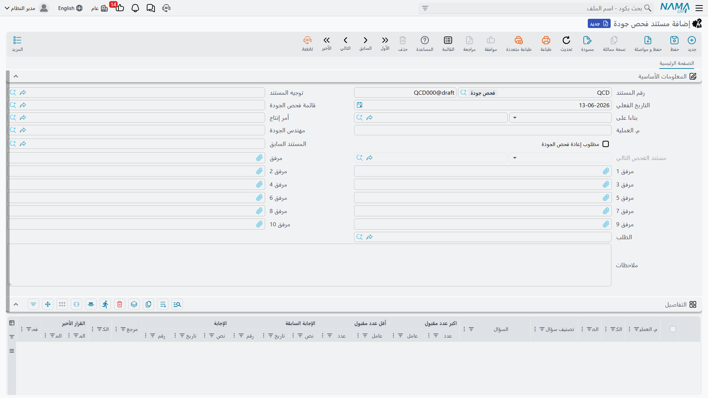
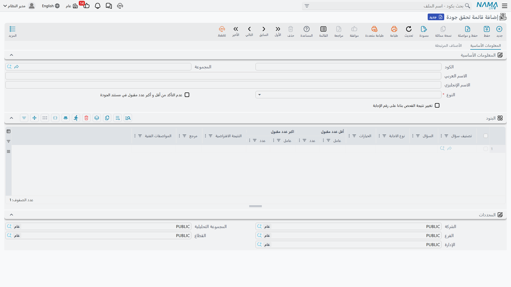

# ضبط الجودة (Quality Control)

ليس كل ما يصل يستوفي معاييرك، وليس كل ما تنتجه جاهزًا للعميل. **ضبط الجودة** هو البوابة التي تضمن ألا يدخل المخزون المتاح أو يصل العميل إلا ما اجتاز الفحص. يتكامل النظام مع الاستلام والإنتاج فيمنع انتقال الأصناف إلى المخزون المتاح حتى تكتمل فحوصاتها.

## مفهومان: ضبط الجودة وتوكيدها

يميّز النظام بين مسارين متكاملين:

- **ضبط الجودة (Quality Control)**: فحص الأصناف الواردة أو قيد التشغيل مقابل معايير القبول - "هل هذه الدفعة مطابقة؟".
- **توكيد الجودة (Quality Assurance)**: التحقق من سلامة العملية ذاتها عند مراحل التشغيل، بإسناد مهندس جودة - "هل نُفِّذت الخطوة وفق المواصفة؟".

كلاهما يقوم على نمط **الطلب ← المستند**: طلب يبدأ الفحص، ومستند يسجّل نتيجته.

## مستندات ضبط الجودة (QualityControlDoc)

يبدأ المسار بـ**طلب ضبط الجودة** (QualityControlReq) الذي يحدّد معايير الفحص ومستوياته، ثم يُنفَّذ عبر **مستند ضبط الجودة** (QualityControlDoc) الذي يسجّل نتائج الفحص (نجاح/رسوب/إعادة عمل)، ويرتبط بالطلب، ويدعم التسلسل بين فحوصات متعددة المراحل (مستند سابق ولاحق) لضمان استمرارية التتبع.

النتائج الممكنة بعد الفحص:
- **قبول**: تنتقل الأصناف إلى المخزون المتاح.
- **رفض**: تُعَدّ مرتجعًا للمورّد أو تُنقل إلى البضائع المعيبة.
- **قبول جزئي**: قبول جزء من الكمية ورفض الباقي.

## مستندات توكيد الجودة (QualityAssuranceDoc)

للتحقق أثناء التشغيل، يبدأ **طلب توكيد الجودة** (QualityAssuranceReq) بتحديد تسلسل العملية ومهندس الجودة، ثم يُنفَّذ عبر **مستند توكيد الجودة** (QualityAssuranceDoc) الذي يستخدم قائمة فحص معيارية، ويدعم فحوصات متعددة المراحل بربط المستند السابق وتوجيه الفحص التالي، ويُرفَق بمستندات سلسلة التوريد (استلامات، صرفيات، تجميعات).

## قائمة الفحص (QualityCheckList)

**قائمة الفحص** هي القالب المعياري للفحص: مجموعة أسئلة/معايير لكل نوع صنف أو تجميع أو منتج نهائي. تدعم أنواع نتائج متعددة (نعم/لا، رقمية، نطاقات) مع تصنيف للإجابات، وقواعد تأكيد قائمة على الكمية. وتُصنَّف أسئلتها عبر **تصنيف الأسئلة** (QuestionClassification) لتنظيمها وإعادة استخدامها.

عند ربط قائمة فحص بصنف (راجع [فهم أصناف المخزون](./understanding-items.md#تهيئة-التصنيع-وضبط-الجودة))، يفرض النظام اجتياز الفحص قبل إتاحة الصنف.

## التكامل مع الاستلام والإنتاج

ضبط الجودة ليس معزولًا، بل خطوة ضمن مسارات أكبر:

- **مع الاستلام**: عبر [فحص الاستلام](./receiving-stock.md)، تصل البضاعة إلى مخزن/موقع "تحت الفحص" أولًا، ولا تنتقل إلى المتاح إلا بعد القبول.
- **مع الإنتاج والتجميع**: تُدرَج فحوصات الجودة ضمن مراحل [التجميع](./assembly-and-packaging.md) وأوامر الإنتاج، فلا يُعتمد الناتج قبل اجتياز فحصه.
- **إعادة الاختبار**: للأصناف ذات مدة إعادة الاختبار (مواد كيميائية وأدوية)، يذكّر النظام بإعادة الفحص دوريًا.

## أفضل الممارسات

::: tip نصائح عملية
**اربط قوائم الفحص بالأصناف الحرجة**: اجعل الفحص إلزاميًا للأصناف التي يؤثر خللها على السلامة أو الامتثال.

**افصل مخزن الفحص**: استقبل الوارد في مخزن فحص مستقل حتى لا يُباع قبل اعتماده.

**وثّق سبب الرفض**: سجّل سبب رسوب كل دفعة؛ فتحليل أنماط الرفض يكشف جودة الموردين ومشكلات العمليات.

**استخدم توكيد الجودة للعمليات لا للأصناف فقط**: افحص سلامة الخطوة نفسها، لا الناتج وحده، لتمنع تكرار الخطأ.
:::

## الخطوات التالية

- [استلام المخزون](./receiving-stock.md) - فحص الاستلام كبوابة للمخزون
- [التجميع والتعبئة](./assembly-and-packaging.md) - الجودة ضمن مراحل التجميع
- [فهم أصناف المخزون](./understanding-items.md) - ربط قوائم الفحص بالأصناف
