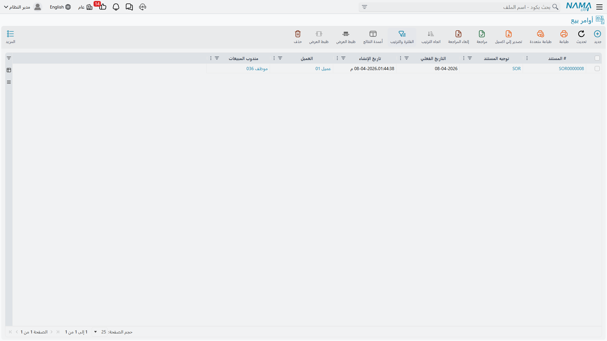
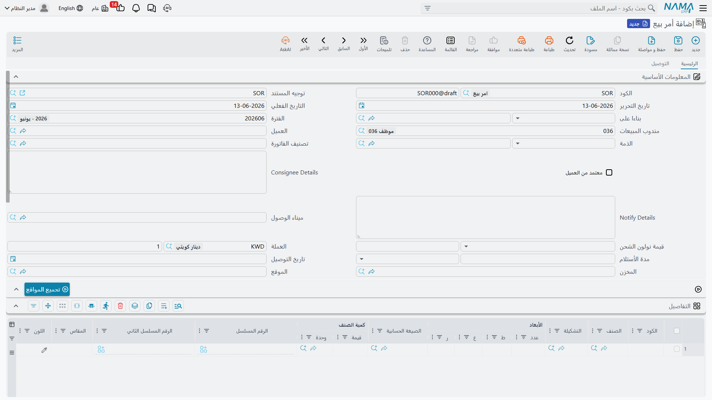

# رحلة المبيعات (The Sales Journey)

رحلة المبيعات هي الصورة المعاكسة للمشتريات — بدلًا من إدخال الأصناف، أنت تبيعها وتسلّمها للعملاء. لكن المبادئ متشابهة: عرض أسعار ← أمر بيع ← تنفيذ ← فاتورة ← تحصيل. لنستعرض هذه الرحلة ونفهم متى يُستخدم كل مستند.

## الصورة الكاملة

```
استفسار → عرض أسعار → أمر بيع → حجز → تحضير → تسليم → فاتورة → تحصيل
```

ليست كل عملية بيع تمر بكل هذه الخطوات (البيع النقدي يتخطى معظمها!)، لكن فهم المسار الكامل يساعدك على تصميم العملية الصحيحة لكل نوع بيع.



## الخطوة الأولى: استفسار العميل (SalesQuotationRequest)

كل عملية بيع تبدأ باهتمام. **طلب عرض أسعار المبيعات** يُسجّل استفسار العميل: "نحن مهتمون بـ100 كرسي مكتبي، هل يمكنكم تزويدنا بسعر؟" ويلتقط بيانات العميل، والأصناف المطلوبة وكمياتها، ومتطلبات التسليم، وأي متطلبات خاصة.

لماذا نُضفي طابعًا رسميًا على الاستفسارات؟ لتتبع فرص البيع المحتملة (رؤية خط الأنابيب)، وقياس معدلات تحويل العروض إلى أوامر، وضمان المتابعة في الوقت المناسب، وتعيين ممثلي المبيعات. وقبل تقديم العرض يساعدك النظام بعرض المخزون المتاح، ومدد التوريد للأصناف غير المتوفرة، ومعلومات التكلفة (لتسعير مربح)، وسجل العميل (مشترياته السابقة وسلوك دفعه وشروطه الخاصة).

## الخطوة الثانية: عرض الأسعار (SalesQuotation)

**عرض أسعار المبيعات** هو اقتراحك الرسمي بالسعر للعميل. يتضمن رقم العرض وتاريخه ومدة صلاحيته، وبيانات العميل وشروط التسليم والدفع وممثل المبيعات، وسطور الأصناف بأوصافها وكمياتها وأسعارها وخصوماتها وضرائبها، والإجماليات.

أما تفاصيل التسعير والخصومات والعروض — قوائم الأسعار، والتسعير التلقائي بهامش الربح، وطبقات الخصم، والحد الأدنى للسعر — فلها صفحتها المخصّصة: [التسعير والعروض والكوبونات](./pricing-offers-and-coupons.md).

**دورة حياة العرض:** بعد الإنشاء يراجعه مدير المبيعات (خاصةً عند التسعير الخاص)، ثم يُرسَل للعميل، فتُتابَع استجابته. والنتائج المحتملة: التحويل لأمر (قبول العميل)، أو المراجعة (تفاوض فتُنشئ عرضًا معدلًا)، أو الانتهاء (انتهاء الصلاحية)، أو الخسارة (اختيار جهة أخرى).

## الخطوة الثالثة: أمر البيع (SalesOrder)

قبِل العميل عرضك! حان وقت الالتزام الرسمي. **أمر البيع** يقول: "سنبيعك هذه الأصناف وفق هذه الشروط."

**التحويل من عرض الأسعار** هو الأسهل: ينسخ النظام كل المعلومات من العرض، ويربط الأمر به (مسار التدقيق)، ويغيّر الحالة من "عرض" إلى "أمر"، ويُطلق التنفيذ. وللعملاء الحاليين بأصناف معيارية يمكن تخطّي العرض وإنشاء الأمر مباشرةً.

يحمل الأمر كل ما في العرض، مضافًا إليه تفاصيل التنفيذ (تاريخ التسليم المطلوب، عنوان التسليم الذي قد يختلف عن عنوان الفوترة، طريقة الشحن)، وتخصيص المخزون (أي مخزن سينفّذ، وهل الأصناف متوفرة)، والشروط المالية (الأسعار النهائية، وشروط الدفع نقدًا أو آجلًا أو أقساطًا، والتحقق من حد الائتمان للعملاء الآجلين).



### الفاتورة المبدئية (ProformaSalesInvoice)

**فاتورة المبيعات المبدئية** نقطة منتصف الطريق: تبدو كفاتورة وتعمل كعرض أسعار، وتُستخدم لموافقة ميزانية العميل أو الجمارك أو الدفع المسبق. وبمجرد دفع العميل أو موافقته تتحول إلى أمر فعلي.

## الخطوة الرابعة: الحجز والتحضير والتسليم

بعد تأكيد الأمر تأتي مرحلة التنفيذ المادي، ولها صفحتان مخصّصتان:

- **الحجز**: يحجز النظام المخزون للأمر فلا يُباع لغيره، ويضمن قدرتك على التنفيذ. تفاصيله الكاملة في [دليل نظام الحجوزات](./reservation-system-guide.md).
- **التحضير والتحميل والتسليم**: من قائمة التحضير (Pick) في المخزن، إلى مستند التحميل، إلى مستند التسليم وإثبات الاستلام. تجد ذلك في [التسليم والتحميل](./delivery-and-loading.md).

## الخطوة الخامسة: فاتورة المبيعات (SalesInvoice)

**فاتورة المبيعات** هي في آنٍ واحد الفاتورة (العميل مدين لك بمبلغ) وحركة المخزون (الأصناف تغادر مخزونك). تتضمن رقمها وتاريخها وبيانات العميل وعنواني الفوترة والشحن وممثل المبيعات ومرجع الأمر وشروط الدفع، وسطور الأصناف المباعة بكمياتها وأسعارها وخصوماتها وضرائبها، والملخص المالي والإجمالي.

### ما يفعله النظام

عند حفظ الفاتورة (ليس كمسودة):
- **حركة المخزون**: يُولِّد النظام تلقائيًا صرف الأصناف المباعة، فتنخفض كميات المخزون، وتُزال من مواقعها، وتُتتبَّع الأرقام التسلسلية/الدفعات المباعة، وتُسجَّل تكلفة البضاعة المبيعة.
- **القيود المحاسبية**: مدين الذمم المدينة (أو النقد عند الدفع الفوري)، دائن إيرادات المبيعات، دائن الضريبة المحصّلة، مدين تكلفة البضاعة المبيعة، دائن المخزون.
- **حساب العميل**: يزيد رصيده، ويُحدَّث استهلاك حد الائتمان، ويُنشأ تاريخ الاستحقاق.

### الفوترة الإلكترونية

في الدول التي تعتمد الفواتير الإلكترونية، يُنشئ النظام الفاتورة بالصيغة الضريبية المعتمدة ويرسلها لمنظومة الهيئة ويستقبل معرّفها الفريد ورمز QR. تفاصيل ذلك في [وحدة الفوترة](/ar/modules/invoicing/).

## الخطوة السادسة: تحصيل المدفوعات

الخطوة الأخيرة هي تحصيل ما هو مستحق. في **البيع النقدي** يُدفَع فورًا فتُغلق الفاتورة دون ذمة مدينة (أو تُصفّى فورًا). وفي **البيع الآجل** تُنشئ الفاتورة ذمة مدينة بتاريخ استحقاق وفق الشروط (صافي 30، صافي 60)، فيتتبع النظام التقادم ويُنبّه قرب الاستحقاق. وفي **البيع بالأقساط** تُقسَّم القيمة إلى دفعات مجدولة يتتبعها النظام كلًّا على حدة. وعند تسجيل الدفعة يُخفَّض رصيد العميل ويُحدَّث التقادم وتُغلق الفاتورة إن سُدِّدت بالكامل. (تفاصيل السداد والجدولة في وحدتي الفوترة والمحاسبة.)

## المرتجعات والاستبدالات

أحيانًا لا تكتمل المبيعات. **مرتجع المبيعات** يُستخدم عندما يريد العميل الإرجاع (صنف معيب، أو شحن خاطئ، أو تغيّر رأي ضمن فترة الإرجاع، أو تلف أثناء الشحن). يبدأ المسار غالبًا بـ**طلب مرتجع المبيعات** (SalesReturnRequest) للترخيص، ثم يُنشأ المرتجع الفعلي، فتُستلَم البضاعة وتُعالَج قيمتها.

**الأثر المحاسبي للمرتجع:** مدين مردودات المبيعات (حساب مضاد للإيراد)، مدين المخزون (عودة البضاعة)، مدين الضريبة (عكسها)، دائن الذمم المدينة (انخفاض مديونية العميل).

أما **استبدال المبيعات** (SalesReplacement) فيعالج التبديل في معاملة واحدة: العميل اشترى مقاسًا وسط ويريد كبيرًا، فيُرجِع النظام الوسط ويُصدِر الكبير ويعالج فرق السعر. مفيد لاستبدالات المقاس/اللون، والضمان، والترقية أو التخفيض.

## التنبؤ بالمبيعات

يساعد **التنبؤ بالمبيعات** (SalesForecast) على التخطيط للمبيعات المستقبلية اعتمادًا على الأنماط التاريخية والاتجاهات الموسمية وخط الأنابيب المفتوح، فيغذّي تخطيط المخزون وجدولة الإنتاج و[التنبؤ بالمشتريات](./purchase-forecast.md).

::: info البيع بالتجزئة في نقاط البيع
البيع النقدي السريع عبر الكاشير له وحدته المستقلة الآن. راجع [وحدة نقاط البيع](/ar/modules/pos/).
:::

## نصائح لإدارة مبيعات فعّالة

::: tip أفضل الممارسات
**استجب للعروض بسرعة**: العملاء غير صبورين؛ سرعة الاستجابة ترتبط بمعدلات تحويل أعلى.

**تابع بمنهجية**: لا تدع العروض تموت بصمت؛ تابع بعد أيام وقبل انتهاء الصلاحية، وتتبّع أسباب الكسب والخسارة.

**احجز المخزون بحكمة**: احجز للأوامر المؤكدة لا للاستفسارات الاحتمالية، فربط المخزون بـ"ربما" يمنع البيع لـ"نعم".

**أصدر الفواتير فورًا**: كلما أسرعت بالفوترة أسرعت بالتحصيل؛ افوتر ما سُلّم دون انتظار اكتمال كل التسليمات.

**تتبّع المرتجعات**: ارتفاع إرجاع صنف يشير لمشكلة جودة، وارتفاعه من عميل يشير لحاجة تدريب أو ملاءمة؛ حلّل الأنماط.
:::

## أسئلة شائعة

**س: هل يمكننا الفوترة قبل التسليم؟**

ج: نعم، وتُسمّى الفوترة المسبقة - شائعة للطلبات المخصّصة (دفع قبل التصنيع)، أو الطلبات الكبيرة (عربون)، أو العملاء عالي مخاطر الائتمان. يمكن للنظام الفوترة قبل صرف المخزون.

**س: ماذا لو أراد العميل تسليمًا جزئيًا؟**

ج: أنشئ فواتير متعددة للأمر ذاته؛ افوتر وسلّم المتاح الآن والباقي لاحقًا، ويتتبع النظام المُنفَّذ مقابل المعلّق.

**س: هل يمكن تغيير الأسعار بعد إنشاء الأمر؟**

ج: يعتمد على ضوابطك؛ بعض المنظمات تثبّت الأسعار عند تأكيد الأمر، وأخرى تسمح بالتعديل حتى الفاتورة.

**س: ماذا يحدث إن لم نتمكن من تنفيذ أمر؟**

ج: الخيارات: إنشاء أمر تأخير (تنفيذ عند توفر المخزون)، أو عرض بديل، أو الإلغاء والاسترداد، أو التنفيذ الجزئي. وأفضل ممارسة هي التواصل الفوري مع العميل للقرار معًا.

## الخطوات التالية

- [التسعير والعروض والكوبونات](./pricing-offers-and-coupons.md) - كيف تُحسب الأسعار والخصومات
- [دليل نظام الحجوزات](./reservation-system-guide.md) - حجز المخزون للعملاء
- [التسليم والتحميل](./delivery-and-loading.md) - تنفيذ الأوامر وتسليمها
- [رحلة الشراء](./purchasing-journey.md) - العملية المعاكسة
