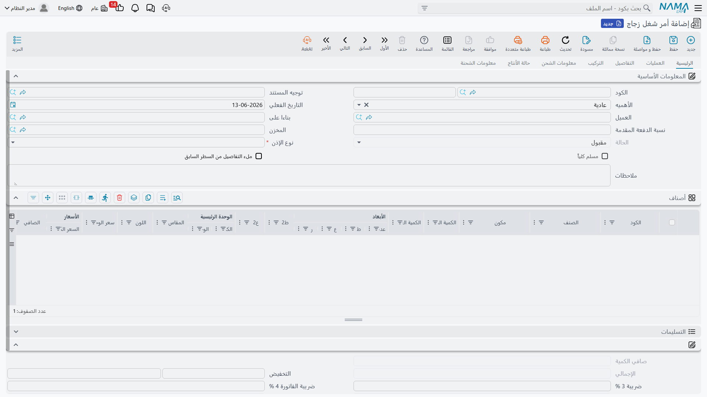

# سيناريوهات متخصصة (Specialized Scenarios)

تغطّي الصفحات السابقة المسارات الأساسية لسلسلة التوريد. لكن تبقى حالات متخصصة لا تتّسع لها صفحة بعينها: أوامر عمل خاصة بقطاع، وأدوات أتمتة لتوليد المستندات، والمناقصات. يجمعها هذا الدليل، ويشير إلى مواطنها حين تتبع وحدات أخرى.

## أوامر عمل الزجاج (Glass Job Order)

لقطاع تصنيع الزجاج وما يشبهه من تصنيع قائم على العمليات، يوفّر النظام مسار **أوامر عمل الزجاج** المتخصص: من تقدير الطلب إلى التنفيذ التشغيلي إلى التسليم.

يبدأ المسار بـ**طلب أمر العمل** (GlassJobOrderReq) لدراسة التكلفة وعرض السعر، ثم يتحوّل إلى **أمر عمل الزجاج** (GlassJobOrder) الذي يحمل قائمة المواد والعمليات وأصناف التسليم. وتُعرّف العمليات عبر **خريطة العمليات** (GlassOperationMap)، وتُسجَّل التنفيذات عبر **تنفيذ العملية** (OrderExecution) التي تتتبع الموظف المسؤول والوقت والتكلفة الفعلية وتولّد صرف المواد. وتُحدَّث الحالة عبر **تحديث حالة أمر العمل** (GlassJobOrderStatusUpdate)، ويُسلَّم الناتج عبر **تسليم الأمر** (OrderDelivery) و**إنهاء الأمر** (OrderFinished). كما يدعم المسار التعاقد الخارجي عبر **طلب/صرف/استلام التعهيد** (OutsourceRequest / OutsourceIssue / OutsourceReceipt)، وتوثيق التلف عبر **تلف الأمر** (OrderDamage)، والمصاريف عبر **مصروف أمر العمل** (JOrderExpense).

::: info قطاع متخصص
أوامر عمل الزجاج وحدة فرعية موجَّهة لقطاع محدد؛ إن لم يكن عملك في هذا المجال فلن تحتاج إليها. وتعتمد على نفس مفاهيم [التجميع](./assembly-and-packaging.md) و[الموارد](#الموارد-والأنشطة) لكن بمسار أوامر مخصّص.
:::

## أدوات أتمتة المستندات

تتكرر في سلسلة التوريد عمليات توليد مستند من آخر (توريد من أمر شراء، فاتورة من تسليم...). يوفّر النظام أدوات تجعل هذا التوليد آليًا ومنضبطًا:

- **مجموعة قواعد المستندات** (SCDocRuleSet): محرّك قواعد مركزي يُطلق إنشاء مستندات تلقائيًا من مستندات مصدر وفق شروط محددة.
- **قاعدة إنشاء مستند إضافي** (SCExtraDocCreationRule): تعرّف توليد مستند إضافي عند حدث معيّن.
- **حقول النسخ الإضافية** (SCCopierExtraFields): تحدّد الحقول التي تُنسخ عند اشتقاق مستند من آخر، مع نصوص نسخ خاصة بنوع الكيان.
- **إعداد تتبع حالة الكمية** (OrderStatusQtyTrackConfig): يضبط انتقالات حالة الأمر بناءً على الكميات المستلمة/المصروفة، فيؤتمت سير العمل المدفوع بالكمية.
- **إعداد التسليم** (DeliveryConfiguration): يعرّف قيود التسليم وعلاقات الكميات ومعايير تجميعه عبر الأوامر.

هذه الأدوات للمستخدمين المتقدمين ومسؤولي التطبيق الذين يفصّلون سلوك النظام دون برمجة.

## المناقصات (Tender)

عندما يجري الشراء عبر منافسة رسمية، يوفّر النظام **المناقصة** (Tender): دعوة الموردين لتقديم عروضهم وفق مواصفات، وتتبّع العروض ومقارنتها، ودعم التقييم الموزون والاختيار. وتُعرّف الشروط والأحكام القياسية للعروض عبر **شرط المناقصة** (TenderCondition). يكمّل هذا [رحلة الشراء](./purchasing-journey.md) في الحالات التي تستلزم تنافسًا منظّمًا.

## الموارد والأنشطة

تستند بعض المسارات المتخصصة (كأوامر العمل) إلى ملفات أساسية مشتركة:
- **المورد** (Resource): يعرّف الموارد البشرية والآلية لعمليات أوامر العمل والتصنيع، بمعدّلات وفترات وتكاليف وإعداد محاسبي.
- **النشاط** (Activity): ملف مرن لتتبع أنشطة ومراحل متنوّعة ضمن أوامر العمل.
- **تصنيف المواد** (MaterialClassification): تصنيف للمواد حسب النوع أو الدرجة أو المصدر لأغراض التقارير والتحليل.

## سيناريوهات تتبعها وحدات أخرى

بعض السيناريوهات المتخصصة لها وحداتها المستقلة وإن تقاطعت مع سلسلة التوريد:
- **نقاط البيع (POS)**: البيع بالتجزئة السريع له [وحدته الخاصة](/ar/modules/pos/).
- **الصيدليات والمستلزمات الطبية**: في وحدة إدارة المستشفيات (HMS) بمساراتها الخاصة.
- **مواد مواقع المشاريع**: في وحدة المقاولات.
- **التصنيع المعقّد**: في [وحدة التصنيع](/ar/modules/manufacturing/).

## الخطوات التالية

- [التجميع والتعبئة](./assembly-and-packaging.md) - الأساس الذي تبني عليه أوامر العمل
- [رحلة الشراء](./purchasing-journey.md) - المناقصات ضمن الشراء
- [الأسئلة الشائعة لسلسلة التوريد](./supply-chain-faq.md) - حالات وأسئلة متفرقة
