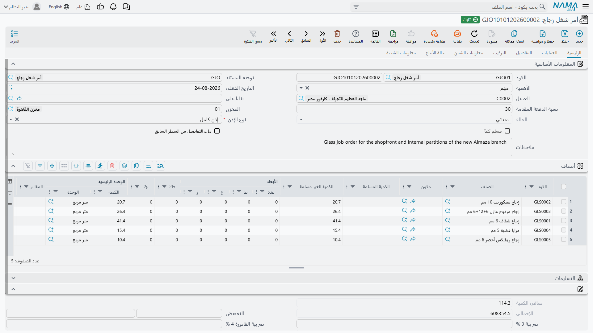

# سيناريوهات متخصصة (Specialized Scenarios)

تغطّي الصفحات السابقة المسارات الأساسية لسلسلة التوريد. لكن تبقى حالات متخصصة لا تتّسع لها صفحة بعينها: أوامر عمل خاصة بقطاع، وأدوات أتمتة لتوليد المستندات، والمناقصات. يجمعها هذا الدليل، ويشير إلى مواطنها حين تتبع وحدات أخرى.

## أوامر عمل الزجاج (Glass Job Order)

لقطاع تصنيع الزجاج وما يشبهه من تصنيع قائم على العمليات، يوفّر النظام مسار **أوامر عمل الزجاج** المتخصص: من تقدير الطلب إلى التنفيذ التشغيلي إلى التسليم.

يبدأ المسار بـ**طلب أمر العمل** (GlassJobOrderReq) لدراسة التكلفة وعرض السعر، ثم يتحوّل إلى **أمر عمل الزجاج** (GlassJobOrder) الذي يحمل قائمة المواد والعمليات وأصناف التسليم. وتُعرّف العمليات عبر **خريطة العمليات** (GlassOperationMap)، وتُسجَّل التنفيذات عبر **تنفيذ العملية** (OrderExecution) التي تتتبع الموظف المسؤول والوقت والتكلفة الفعلية وتولّد صرف المواد. وتُحدَّث الحالة عبر **تحديث حالة أمر العمل** (GlassJobOrderStatusUpdate)، ويُسلَّم الناتج عبر **تسليم الأمر** (OrderDelivery) و**إنهاء الأمر** (OrderFinished). كما يدعم المسار التعاقد الخارجي عبر **طلب/صرف/استلام التعهيد** (OutsourceRequest / OutsourceIssue / OutsourceReceipt)، وتوثيق التلف عبر **تلف الأمر** (OrderDamage)، والمصاريف عبر **مصروف أمر العمل** (JOrderExpense).

::: info قطاع متخصص
أوامر عمل الزجاج وحدة فرعية موجَّهة لقطاع محدد؛ إن لم يكن عملك في هذا المجال فلن تحتاج إليها. وتعتمد على نفس مفاهيم [التجميع](./assembly-and-packaging.md) و[الموارد](#lmwrd-wlnshT) لكن بمسار أوامر مخصّص.
:::

## قوائم مكونات الخدمات (Service Item BOM)

أمر عمل الزجاج لا يقصّ لوح الزجاج فحسب. بل يقسّيه، ويثقبه، ويصقل حوافه. وكل عملية من هذه صنفٌ قائم بذاته — صنف نوعه **خدمة** لا **مخزون**. لكن الخدمة تستهلك أشياء رغم ذلك: لاصقًا، وأقراص جلخ، وساعة على ماكينة، وعاملين يقفان عليها.

وشاشة **تفاصيل التشغيل** (أوامر الشغل ← الملفات ← تفاصيل التشغيل) هي المكان الذي يُكتب فيه ذلك، مرة واحدة لكل خدمة. وهي السبب في أن تنفيذ الأوامر يستطيع أن يحسب ما يُصرف من المخزن وما تكلّفه العملية دون أن يُدخل أحد أيًّا من الرقمين.

يسمّي الرأس الخدمة والمقياس الذي يُقاس عليه كل ما تحته:

- **التشغيلة** — لا تعرض قائمة الاختيار إلا الأصناف من نوع خدمة. واختيار أحدها ينسخ كوده واسمه إلى السجل ويضع **كمية التشغيل** = 1 بوحدة الصنف الأساسية.
- **كمية التشغيل** و**وحدة التشغيل** — مقدار الخدمة الذي تصفه بقية الشاشة. وكل ما تحتهما نسبة إلى هذا الرقم، فقائمة مكتوبة على 10 م² تُقاس وحدها حين يغطي التنفيذ 3 م².
- **طريقة حساب التكلفة** — **شحنة** (Lot) أو **صنف** (Item): هل تُتكبَّد التكلفة مرة واحدة عن التشغيلة كلها أم ترتفع بارتفاع الكمية المنتَجة. وهي أيضًا القيمة الافتراضية التي ترثها السطور الجديدة في جدول موارد التشغيل.

وتحتها الجدولان اللذان تتكون منهما القائمة فعليًا.

**قطع غيار** هو قائمة المواد. كل سطر يسمّي **الصنف** (أصناف المخزون فقط)، و**كمية مادة التشغيل** المستهلكة، وكمية **لانتاج تشغيل** التي يقابلها ذلك الاستهلاك — «1.5 لتر لاصق لكل 10 م² تقسية». وتسجيلها كزوج بدل رقم واحد لكل وحدة هو ما يتيح لك كتابة النسبة بالوحدات التي يعمل بها المصنع فعلًا.

**موارد التشغيل** هو قائمة الموارد — الماكينات والأشخاص. كل سطر يسمّي **مورد تشغيل**، و**المدة** التي يُشغَل فيها (ووحدة المدة تأتي افتراضيًا من نوع معدّل المورد نفسه)، و**العدد**، أي كم واحدًا منها في وقت واحد. أما **التكلفة** في السطر فتُحسب لك من معدّل المورد والمدة والعدد؛ وليست شيئًا تكتبه بنفسك.

::: tip طريقتان لتكليف الخدمة، ومفتاح واحد يختار بينهما
اترك **تكلفة مباشرة** مغلقًا فتُبنى التكلفة من جدول موارد التشغيل، موردًا موردًا — ويبقى حقل التكلفة الثابتة بجواره معطّلًا. وافتحه فيحدث العكس: يُفرَّغ جدول موارد التشغيل ويُعطَّل، وتكتب رقمًا واحدًا في **التكلفة المباشرة** بدلًا منه. استخدمه للخدمات التي تُشترى بسعر مقطوع، أو لأي خدمة تعرف تكلفتها ببساطة ولا تريد نمذجتها.
:::

أما **سحب آلي** فيتعلق بالصنف الأساسي لا بقطع الغيار. فمع تفعيله، يضيف تسجيل التنفيذ صنفَ السطر المنفَّذ نفسه إلى المواد المصروفة تلقائيًا، إلى جانب كل ما يسهم به جدول قطع الغيار. وكل قطعة تُصرف مرة واحدة فقط، فتسجيل تنفيذ ثانٍ على القطعة نفسها لا يصرفها مرتين، والسطور المعلَّمة كأصناف مجانية تُستثنى.

::: info قائمة واحدة لكل خدمة، والأمر لا يُحفظ بدونها
هنا قاعدتان تعملان معًا. فحفظ قائمة مكونات ثانية لخدمة لها قائمة بالفعل مرفوض تمامًا. وأمر عمل الزجاج يتحقق، عن كل خدمة مطبَّقة على صنف مخزون فيه، من وجود قائمة مكونات لها — وحين تغيب لا يمكن حفظ الأمر، وتذكر الرسالة الخدمةَ والصنفَ المطبَّقة عليه معًا. فقوائم مكونات الخدمات إذن شيء تُعدّه قبل أول أمر لا بجانبه.
:::

## أدوات أتمتة المستندات

تتكرر في سلسلة التوريد عمليات توليد مستند من آخر (توريد من أمر شراء، فاتورة من تسليم...). يوفّر النظام أدوات تجعل هذا التوليد آليًا ومنضبطًا:

- **مجموعة قواعد المستندات** (SCDocRuleSet): محرّك قواعد مركزي يُطلق إنشاء مستندات تلقائيًا من مستندات مصدر وفق شروط محددة.
- **قاعدة إنشاء مستند إضافي** (SCExtraDocCreationRule): تعرّف توليد مستند إضافي عند حدث معيّن.
- **حقول النسخ الإضافية** (SCCopierExtraFields): تحدّد الحقول التي تُنسخ عند اشتقاق مستند من آخر، مع نصوص نسخ خاصة بنوع الكيان.
- **إعداد تتبع حالة الكمية** (OrderStatusQtyTrackConfig): يضبط انتقالات حالة الأمر بناءً على الكميات المستلمة/المصروفة، فيؤتمت سير العمل المدفوع بالكمية.
- **إعداد التسليم** (DeliveryConfiguration): يعرّف قيود التسليم وعلاقات الكميات ومعايير تجميعه عبر الأوامر.

هذه الأدوات للمستخدمين المتقدمين ومسؤولي التطبيق الذين يفصّلون سلوك النظام دون برمجة.

## المناقصات (Tender)

عندما يجري الشراء عبر منافسة رسمية، يوفّر النظام **المناقصة** (Tender): دعوة الموردين لتقديم عروضهم وفق مواصفات، وتتبّع العروض ومقارنتها، ودعم التقييم الموزون والاختيار. وتُعرّف الشروط والأحكام القياسية للعروض عبر **شرط المناقصة** (TenderCondition). يكمّل هذا [رحلة الشراء](./purchasing-journey.md) في الحالات التي تستلزم تنافسًا منظّمًا.

## الموارد والأنشطة

تستند بعض المسارات المتخصصة (كأوامر العمل) إلى ملفات أساسية مشتركة:
- **المورد** (Resource): يعرّف الموارد البشرية والآلية لعمليات أوامر العمل والتصنيع، بمعدّلات وفترات وتكاليف وإعداد محاسبي.
- **النشاط** (Activity): ملف مرن لتتبع أنشطة ومراحل متنوّعة ضمن أوامر العمل.
- **تصنيف المواد** (MaterialClassification): تصنيف للمواد حسب النوع أو الدرجة أو المصدر لأغراض التقارير والتحليل.

## الإجراءات في هذه الشاشات

**في أمر شغل الزجاج وطلبه:**

- **تجميع الأوامر** (Collect Orders) — يملأ سطور قائمة الخامات من أوامر العميل المفتوحة بدل إدخالها من جديد.
- **تنفيذ** (Apply) — يقرأ نوع الأمر وحالته ونسبة الدفعة المقدمة من الرأس ويطبّقها على الأمر، وبها ينتقل أمر الزجاج من مُدخَل إلى قابل للتنفيذ.

**في تنفيذ الأوامر:**

- **إضافة أمر** (Add Order) — يسأل عن أمر وعميل، ويلحق عمل ذلك الأمر بسطور التنفيذ، على العملية المذكورة في الرأس.
- **تجميع البيانات** (Collect Data) — النسخة المجمَّعة: تملأ السطور من النطاقات الموجودة في الرأس (من/إلى صنف، ومن/إلى أمر شغل، وغيرها) بدل إضافة أمر واحد في كل مرة.
- **تفريغ أوامر الشغل** (Clear Job Orders) و**تفريغ سطور التفاصيل** (Clear Details Lines) — يفرّغان جدول أوامر الشغل وجدول التفاصيل على الترتيب، وبهما تبدأ التجميع من جديد بعد ضبط نطاقات مختلفة.

**في قائمة أوامر الزجاج:** **تجميع الأوامر** (Collect Orders) يملأ القائمة، و**إظهار** (View) يفتح ما يشير إليه السطر، و**تصدير** (Export) يخرج القائمة في ملف.

## سيناريوهات تتبعها وحدات أخرى

بعض السيناريوهات المتخصصة لها وحداتها المستقلة وإن تقاطعت مع سلسلة التوريد:
- **نقاط البيع (POS)**: البيع بالتجزئة السريع له [وحدته الخاصة](/ar/modules/pos/).
- **الصيدليات والمستلزمات الطبية**: في وحدة إدارة المستشفيات (HMS) بمساراتها الخاصة.
- **مواد مواقع المشاريع**: في وحدة المقاولات.
- **التصنيع المعقّد**: في [وحدة التصنيع](/ar/modules/manufacturing/).

## الخطوات التالية

- [التجميع والتعبئة](./assembly-and-packaging.md) - الأساس الذي تبني عليه أوامر العمل
- [رحلة الشراء](./purchasing-journey.md) - المناقصات ضمن الشراء
- [الأسئلة الشائعة لسلسلة التوريد](./supply-chain-faq.md) - حالات وأسئلة متفرقة
