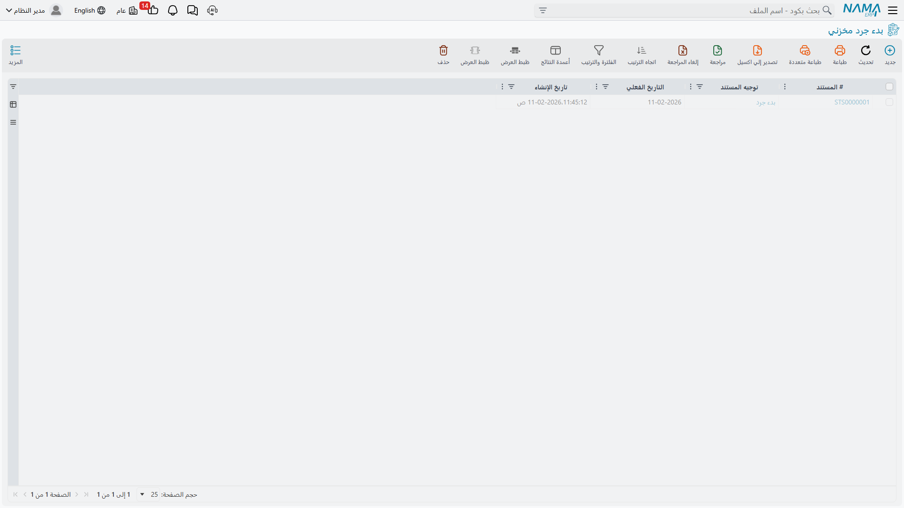
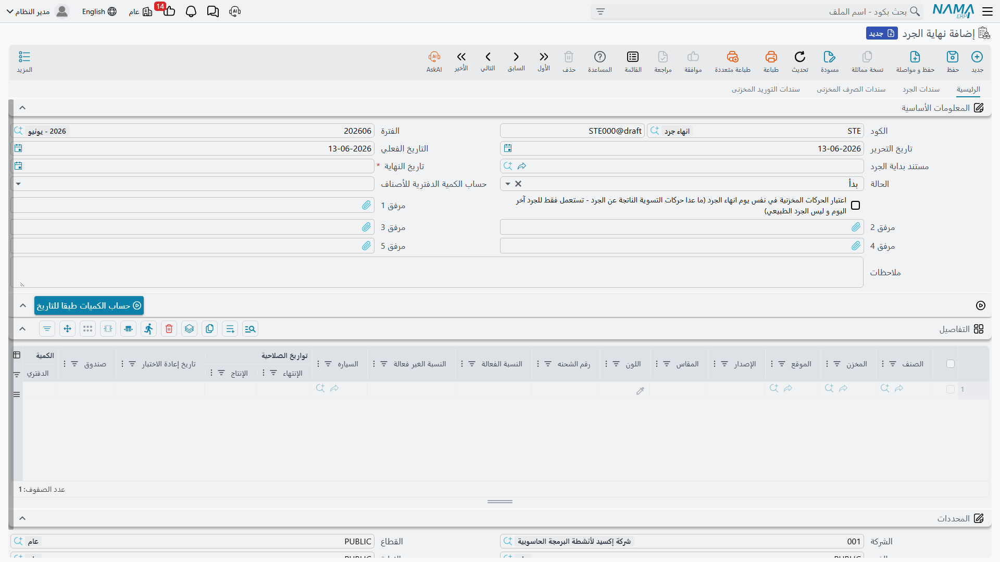

# الجرد المخزني (Stock Taking)

مهما كان نظامك دقيقًا، يبقى السؤال الجوهري: هل ما في الدفاتر يطابق ما على الرفوف فعلًا؟ **الجرد المخزني** هو العملية التي تتحقق بها من ذلك وتسوّي الفروق. إنه نبض الثقة في أرقام مخزونك.

## لماذا نجرد؟

حتى مع التسجيل الفوري لكل حركة، تتسرب الفروق:
- نقص أو فقدان أو سرقة
- تلف لم يُسجَّل
- معاملات أُدخلت بكميات أو مواقع خاطئة
- نقص طبيعي (تبخّر، جفاف، فاقد وزني)
- أخطاء بشرية في العد أو المناولة

الجرد يكشف هذه الفروق ويعيد مطابقة الرصيد الدفتري مع الواقع، فتبقى قراراتك (الشراء، البيع، التسعير) مبنية على أرقام صحيحة.

## دورة الجرد: البداية والنهاية

يُبنى الجرد في Nama ERP على مستندَين متلازمَين يحدّدان نافذة العد:

### بدء الجرد (StartStockTaking)

**مستند بدء الجرد** يلتقط لقطة لرصيد المخزون عند لحظة بدء العد. من هذه اللحظة:
- يُثبَّت الرصيد المتوقع للأصناف المشمولة كمرجع للمقارنة
- يُحدَّد نطاق الجرد (المخزن، الموقع، مجموعة الأصناف، الفرع)
- يُختار ما إذا كان جردًا افتتاحيًا شاملًا أم جردًا دوريًا جزئيًا (Cycle Count)

### إنهاء الجرد (EndStockTaking)

**مستند إنهاء الجرد** يُغلق النافذة ويعالج النتائج: يقارن الكميات المعدودة فعليًا بالرصيد المتوقع، ثم **يولّد تلقائيًا** مستندات التسوية اللازمة - توريدات للأصناف الزائدة وصرفًا للأصناف الناقصة - لتعود الدفاتر مطابقةً للواقع. ويمكنك ضبط طريقة الاحتساب وما إذا كانت حركات يوم الجرد تُحتسب ضمن المطابقة.

::: tip النافذة الزمنية للجرد
بين بدء الجرد وإنهائه توجد نافذة يجري فيها العد. كلما قصرت هذه النافذة قلّت حركة المخزون أثناء العد وزادت دقة المطابقة. للمخازن الكبيرة، الجرد الدوري المتكرر على نطاقات أصغر أدق من جرد سنوي واحد ضخم.
:::

## إدخال نتائج العد

### تفاصيل الجرد (StockTakingDetails)

يحمل **مستند تفاصيل الجرد** الكميات المعدودة فعليًا سطرًا بسطر، فيُقارَن المتوقع بالفعلي ويُبرَز الفرق لكل صنف/موقع. هنا تُدخَل نتائج فرق العد الميداني.

### الجرد الإلكتروني (StockTakingElectronic)

عندما يجري العد بأجهزة المسح الضوئي للباركود، يلتقط **الجرد الإلكتروني** القراءات إلكترونيًا ويغذّيها إلى عملية الجرد مباشرةً. يقلّل هذا أخطاء الإدخال اليدوي ويسرّع العد في المخازن الكبيرة وكثيفة الأصناف.

## التصويت على العد: عندما يعدّ أكثر من شخص

في المخازن الكبيرة قد يعدّ الصنف ذاته أكثر من شخص لضمان الدقة. يتولّى ذلك نظام **التصويت**:

- **وثيقة التصويت (ItemVotingDoc)**: يسجّل فيها كل "مصوِّت" (عادّ) الكمية التي عدّها للصنف في الموقع نفسه.
- **ملف التصويت (ItemVotingFile)**: يجمع وثائق التصويت ضمن نطاق وفترة، ويحدّد قائمة المصوّتين وآلية الوصول إلى الرقم المعتمد (توافق أو متوسط) قبل اعتماد الفرق.

الفائدة: لا يُعتمد فرق صنف ثمين بناءً على عدّ شخص واحد فقط، بل بعد تطابق عدّتين أو أكثر - ما يقلّل أخطاء العد ويضيف رقابة على عملية الجرد ذاتها.

## معالجة النقص الطبيعي والفاقد

::: warning هنا تُعالَج خسائر الوزن
الفاقد الطبيعي - كنقص وزن اللحوم أو جفاف بعض المواد أو التبخّر - لا يُسجَّل بمستند تلف يدوي، بل يظهر كفرق عند العد ويُسوّى عبر الجرد. هذه هي الطريقة الصحيحة في النظام لمعالجة النقص الوزني والفاقد الطبيعي، إذ يعيد الرصيد الدفتري إلى مطابقة الوزن الفعلي مع قيد محاسبي سليم للخسارة.
:::

أما التلف العارض المحدد (واقعة بعينها) فيُسجَّل عبر [صرف مخزني](./issuing-stock.md) موجَّه إلى حساب خسائر، لا عبر الجرد.

## أفضل الممارسات للجرد

::: tip نصائح عملية
**جمِّد الحركة أثناء العد**: قلّل أو أوقف حركات المخزن المشمول أثناء فترة العد لتفادي تغيّر الرصيد بين البدء والإنهاء.

**اعتمد الجرد الدوري**: لا تنتظر جردًا سنويًا واحدًا. جرد دوري منتظم على نطاقات صغيرة يكتشف المشكلات مبكرًا ويبقي الدقة عالية على مدار العام.

**استخدم التصويت للأصناف الثمينة**: للأصناف عالية القيمة، اشترط أكثر من عدّة قبل اعتماد الفرق.

**وثّق سبب الفرق**: عند تسوية فرق، سجّل ما كشف عنه التحقيق (موقع معيّن دائمًا ناقص؟ وردية بعينها تواجه مشكلات تسجيل؟) - فالأنماط أهم من الأرقام المفردة.

**طابق المحاسبة بعد الجرد**: بعد إنهاء الجرد، تحقق من أن قيمة المخزون في الدفاتر تطابق إجمالي التسويات.
:::

## الخطوات التالية

- [تكلفة المخزون وإعادة التقييم](./inventory-costing.md) - تعديل قيم المخزون بعد التسويات
- [إصدار المخزون](./issuing-stock.md) - تسجيل التلف العارض عبر صرف
- [المخازن والمواقع التخزينية](./warehouses-and-locators.md) - تنظيم المخزون لتسهيل العد
