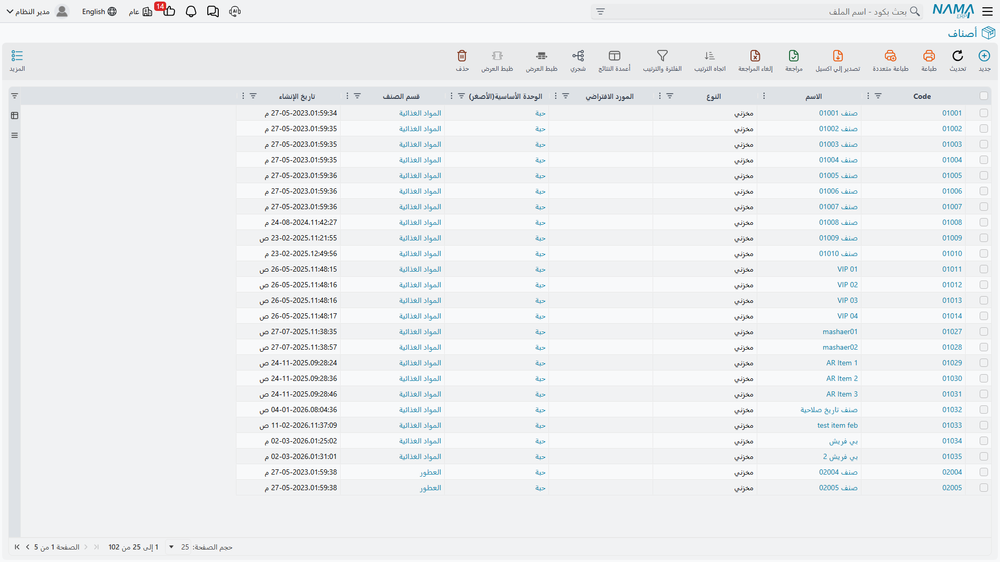
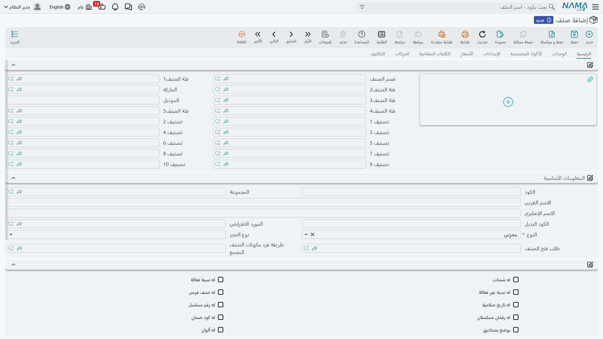

# فهم أصناف المخزون (Understanding Inventory Items)

لنتحدث عن **الأصناف (Items)** - اللبنات الأساسية لنظام سلسلة التوريد بأكمله.

## ما هو الصنف حقًا؟

في Nama ERP، يمثّل "الصنف" أي شيء تتتبعه في عملك. قد يكون:
- منتجًا ماديًا تبيعه (لابتوب، كرسي، زجاجة عصير)
- مادة خام تشتريها (فولاذ، قماش، دقيق)
- قطعة غيار للصيانة (محمل، فلتر)
- خدمة تقدّمها (ساعات استشارية، خدمة تركيب)
- مستهلكًا تستخدمه داخليًا (مستلزمات مكتبية، مواد تنظيف)

تكمن روعة الصنف الرئيسي في مرونته الكافية للتعامل مع كل هذه السيناريوهات مع التقاط المعلومات التي تحتاجها بالضبط لكل نوع.



## كود الصنف: هوية الصنف الخاصة بك

كل صنف يحتاج إلى معرّف فريد - نسمّيه **كود الصنف**. يمكنك التفكير فيه كرقم هوية الشخص.

لديك خياران لطريقة الحصول على الأكواد:
1. **الترقيم التلقائي**: يُنشئ النظام الأكواد نيابةً عنك (مثل IT-00001 وIT-00002 وما إلى ذلك)
2. **الإدخال اليدوي**: تكتب أكوادك الخاصة (مثل "LAPTOP-DELL-5540" أو "STEEL-REBAR-12MM")

تستخدم كثير من المؤسسات الأكواد اليدوية لأنها تحمل معنى - يمكنك النظر إلى "DESK-WOOD-120" ومعرفة فورًا أنه مكتب خشبي عرضه 120 سم. لكن الترقيم التلقائي يضمن عدم إنشاء نسخ مكررة.

علاوةً على الكود الأساسي، يمكن أن يمتلك الصنف:
- **أكواد بديلة** للأنظمة القديمة أو الأقسام المختلفة
- **أكواد المورّد** (ما يسمّي المورّد هذا الصنف به)
- **أكواد العميل** (ما يسمّي العملاء هذا الصنف به)
- **باركودات** - باركودات متعددة لكل صنف عند الحاجة
- **أكواد هيئة الزكاة والضريبة** للامتثال

## الأسماء والأوصاف: التواصل حول الأصناف

كود الصنف دقيق لكنه غير ودود. لذا يمتلك كل صنف اسمًا عربيًا واسمًا إنجليزيًا، إضافةً إلى عدة حقول وصف مطوّلة للمواصفات أو الشروحات المختلفة.

لماذا كل هذه الأوصاف؟ لأن أشخاصًا مختلفين يحتاجون معلومات مختلفة. قسم المشتريات قد يحتاج مواصفات تقنية، وفريق المبيعات يحتاج لغة تسويقية، والمستودع يحتاج تعليمات المناولة - وكل ذلك يمكن أن يعيش في حقول وصف منفصلة على الصنف ذاته.

## تنظيم أصنافك: الفئات والتصنيفات

تخيّل أن لديك 10,000 صنف في نظامك. كيف تفهم كل هذا؟ من خلال التصنيف!

### الفئات الهرمية (Hierarchical Categories)

يمنحك Nama ERP خمسة مستويات من الفئات تعمل بشكل هرمي:

```
الفئة 1: إلكترونيات
  الفئة 2: حاسبات
    الفئة 3: لابتوبات
      الفئة 4: لابتوبات أعمال
        الفئة 5: لابتوبات Dell للأعمال
```

يتيح لك هذا التسلسل الهرمي:
- تشغيل تقارير بأي مستوى ("أرني مبيعات الإلكترونيات كلها")
- تطبيق قواعد على فئات بأكملها ("كل لابتوبات الأعمال تستلزم أرقامًا تسلسلية")
- البحث بكفاءة ("ابحث عن أصناف في فئة الحاسبات")

### محددات تصنيف إضافية (Additional Classification Dimensions)

أحيانًا لا تكفي الفئات الهرمية. ماذا لو احتجت أيضًا إلى التصنيف حسب:
- العلامة التجارية (Dell, HP, Lenovo)
- خط المنتج (اقتصادي، مميز، للمؤسسات)
- مصدر المورّد (محلي، مستورد)
- القسم الذي يستخدمه (تقنية المعلومات، الإدارة، الإنتاج)

هنا يأتي دور **تصنيفات الصنف العشرة** (محددات التصنيف). هذه محددات مستقلة يمكنك تعريفها بالطريقة التي تحتاجها: قد تخصّص الأول للعلامة التجارية، والثاني لخط المنتج، والثالث للنطاق السعري، وهكذا.

إلى جانب ذلك تتوفر تصنيفات جاهزة المعنى يقدّمها النظام، مثل **العلامة التجارية** و**القطاع** و**التشكيلة (Assortment)**، تستطيع استخدامها مباشرةً دون إعداد إضافي.

::: tip استراتيجية التصنيف
ابدأ بسيطًا! لا تحاول تعريف جميع التصنيفات العشرة من اليوم الأول. أعدّ تصنيفين أو ثلاثة تحتاجها أكثر، وأضف المزيد كلما تطورت احتياجاتك. يمكنك دائمًا إعادة تصنيف الأصناف لاحقًا.
:::

## معضلة وحدة القياس (Unit of Measure)

هنا تصبح الأمور مثيرة. تخيّل أنك تبيع عصيرًا:
- **تشتريه** بالكرتون (24 زجاجة لكل كرتون)
- **تخزّنه** في مستودعك بالكرتون
- **تبيعه** بالزجاجة
- **تُعدّ تقاريره** بالليتر للتحليل

كيف يعالج النظام هذا؟ من خلال نظام وحدة القياس (UOM) المتطور.

### نظام UOM الأساسي

كل صنف له **وحدة أساسية** - الوحدة الجوهرية لتتبع المخزون. في مثال العصير قد تكون "زجاجة".

ثم تُعرّف **معاملات التحويل**:
- 1 كرتون = 24 زجاجة
- 1 زجاجة = 0.5 ليتر

الآن يمكنك:
- إنشاء أمر شراء بالكرتون
- استلام 10 كراتين (يُسجّل النظام 240 زجاجة في المخزون)
- بيع 50 زجاجة (يصرف النظام 50 زجاجة أي 2.08 كرتون)
- تشغيل تقارير بالليتر (يُظهر النظام بيع 125 ليتر)

كل التحويل يتم تلقائيًا خلف الكواليس! وتستطيع لكل صنف تحديد وحدة الشراء الافتراضية، ووحدة البيع الافتراضية، ووحدات للتقارير - فيختار النظام الوحدة المناسبة في كل مستند.

### نظام UOM الثانوي: عندما تحتاج قياسين

بعض الأصناف تحتاج **قياسًا مزدوجًا**. مثال كلاسيكي هو اللحوم:
- تُتتبّع أساسًا بـ**الوزن** (كيلوغرام)
- لكن أيضًا بـ**العدد** (كم قطعة)

قد تشتري "10 كجم دجاج (5 قطع)" وتحتاج إلى تتبع كلا الرقمين بشكل مستقل. عند تفعيل الوحدة الثانية للصنف، يلتقط النظام القياسين في كل معاملة.

### لماذا يهم هذا

ضبط وحدات القياس بدقة أمر حاسم لأن:
- تحويلات خاطئة تعني أعداد مخزون خاطئة
- أعداد مخزون خاطئة تعني قوائم مالية خاطئة
- قوائم مالية خاطئة تعني... حسنًا، تعرف الباقي!

خذ الوقت اللازم لإعداد التحويلات بدقة، واختبرها بمعاملات تجريبية قبل البدء الفعلي.



## تتبع السمات الخاصة

تحتاج أصناف مختلفة إلى طرق تتبع مختلفة:

### الأرقام التسلسلية (Serial Numbers)

للأصناف التي تكون كل وحدة منها فريدة وقابلة للتتبع (لابتوبات، مركبات، معدات عالية القيمة)، تستطيع تفعيل **تتبع الأرقام التسلسلية**.

الآن في كل مرة تستلم أو تصرف هذا الصنف يطلب النظام الأرقام التسلسلية. يمكنك تتبع:
- من أين جاء الرقم التسلسلي #12345؟
- من يملكه حاليًا؟
- ما حالة الضمان؟
- هل خضع للصيانة؟

بعض الأصناف تحتاج **رقمين تسلسليين** - تخيّل مكيّف هواء برقمي تسلسلي منفصلين للوحدة الداخلية والخارجية.

### أرقام الدفعات/التشغيلات (Batch/Lot Numbers)

للأصناف المنتجة أو المشتراة على دفعات (أدوية، منتجات غذائية، مواد كيميائية)، يمكنك تفعيل تتبع الدفعات. تحصل كل دفعة على رقم تشغيلة فريد، لذا عند وجود مشكلة جودة تعرف بالضبط أي دفعة متأثرة ويمكنك تتبع كل صنف من تلك الدفعة.

### تواريخ الانتهاء (Expiration Dates)

للأصناف القابلة للتلف، يتتبع النظام تواريخ الانتهاء ويستطيع:
- تحذيرك من الأصناف التي تقترب من انتهاء صلاحيتها
- استخدام FEFO (First Expiry First Out) لاختيار التشغيلات تلقائيًا
- منع صرف الأصناف منتهية الصلاحية

### تتبع الضمان (Warranty Tracking)

للأصناف التي تحظى بتغطية ضمان، يتتبع النظام فترات الضمان ويمكنه تنبيهك عند اقتراب انتهائها.

## الخصائص المادية

يستطيع النظام تتبع السمات المادية التي تؤثر على التخزين والشحن والمناولة:

- **الأبعاد**: الطول والعرض والارتفاع والمساحة والحجم
- **الوزن**: وزن الصنف (حاسم لحسابات الشحن)
- **الكثافة**: للسوائل والمواد السائبة

لماذا تتبع هذا؟ لأن:
- مستودعك يحتاج إلى معرفة ما إذا كان الصنف يناسب رفًا قياسيًا
- شركات الشحن تحتسب رسومًا على أساس الوزن الحجمي
- الإنتاج يحتاج إلى معرفة المساحة التي تشغلها المواد
- تخطيط الطاقة يعتمد على القيود المادية

## الألوان والأحجام والتنويعات

تجارة الأزياء وكثير من الصناعات الأخرى تحتاج إلى تتبع الأصناف بتنويعات متعددة. قميص T-shirt قد يأتي بـ:
- 5 أحجام (S, M, L, XL, XXL)
- 8 ألوان (أحمر، أزرق، أخضر، أصفر، أسود، أبيض، رمادي، وردي)

هل تُنشئ 40 صنفًا منفصلًا؟ لا! تُنشئ صنفًا واحدًا مع تفعيل تتبع المقاس واللون، ثم تُعرّف مصفوفة الحجم/اللون. الآن يمكنك:
- شراء "100 قميص (20 من كل حجم، ألوان مختلطة)"
- تتبع المخزون بصورة منفصلة لـ"أحمر-كبير" مقابل "أزرق-صغير"
- عرض التقارير على مستوى النمط ("إجمالي مبيعات القميص") أو مستوى التنويع ("مبيعات أحمر-كبير")

## أنواع الأصناف: ما الذي يمكنك فعله بهذا الصنف؟

كل صنف يحتوي على علامات تُحدّد كيفية استخدامه:

- **قابل للشراء**: يمكن شراء هذا الصنف من الموردين؛ وإلا يمنع النظام إنشاء أوامر شراء له.
- **قابل للبيع**: يمكن بيع هذا الصنف للعملاء؛ وإلا يمنع النظام إضافته لفواتير المبيعات.
- **قابل للتصنيع**: يمكن إنتاج هذا الصنف، فيتيح النظام إنشاء أوامر إنتاج له.
- **قابل للإرجاع**: يمكن للعملاء إرجاعه بعد الشراء؛ وإلا يمنع النظام مرتجعات المبيعات.
- **قابل للاستبدال**: السماح بالاستبدال - مفيد لاستبدالات الضمان أو تبديل الأحجام.

تمنحك هذه العلامات تحكمًا دقيقًا. قد يكون لديك:
- مواد خام (قابلة للشراء لكن غير قابلة للبيع)
- منتجات نهائية (قابلة للبيع والتصنيع لكن غير قابلة للشراء)
- أصناف خدمية (قابلة للبيع لكن غير قابلة للتخزين)
- مستهلكات (قابلة للشراء لكن غير قابلة للبيع أو الإرجاع)

## ضبط المخزون: كيف يتصرف المخزون؟

### المخزون الاحتياطي ونقاط إعادة الطلب

يمكن لكل صنف أن يمتلك مستوى **مخزون احتياطي** - الحد الأدنى للكمية التي تريد الاحتفاظ بها. النزول دون هذا الحد يُطلق تنبيه النظام.

يمكنك ضبط:
- **كمية المخزون الاحتياطي**: "لا تدع مخزون اللابتوب يقل عن 10 وحدات"
- **نقطة إعادة الطلب**: "عند الوصول إلى 10 وحدات، اقترح تلقائيًا إنشاء طلب شراء"

كما يساعدك النظام في تحديد الأصناف غير الرائجة عبر **فترة الركود (Slow Moving Period)**: إذا لم يتحرك صنف منذ 180 يومًا، ربما حان وقت تخفيضه أو التوقف عن تخزينه.

### سياسة السحب على المكشوف: ماذا يحدث عند نفاد المخزون؟

الواقع ليس مثاليًا. أحيانًا تحتاج لصرف أكثر مما لديك - ربما وصل طلب عميل عاجل قبل تسليمك المقرر. تُحدّد **سياسة السحب على المكشوف** ما يحدث:

- **منع**: لا تسمح بالمخزون السالب بأي حال
- **تحذير**: أظهر تحذيرًا لكن اسمح بالمعاملة
- **سماح**: تابع، سنتتبع الرصيد السالب

تحتاج أصناف مختلفة لسياسات مختلفة. المستلزمات الطبية الحرجة قد تمنع السحب على المكشوف، بينما مستلزمات المكتب قد تكتفي بالتحذير.

### الحجز: الاحتفاظ بالمخزون لأغراض محددة

يمكن للنظام **حجز** الأصناف لغرض محدد:
- هل يمكن حجز المخزون لأمر مبيعات؟ (يضمن عدم بيعه لشخص آخر)
- هل يمكن الحجز لأمر إنتاج؟ (يضمن توافر المواد عند بدء الإنتاج)
- في أي مرحلة يتم الحجز؟ (إدخال الطلب، اعتماد الطلب، قبيل التسليم؟)

الحجوزات قوية لأنها تضمن الوفاء بالالتزامات دون تحريك المخزون فعليًا حتى اللحظة الأخيرة. وللتفاصيل الكاملة راجع [دليل نظام الحجوزات الشامل](./reservation-system-guide.md).

## التسعير: كم يكلف؟ كم نتقاضى؟

### إدارة التكلفة

كل صنف له **تكلفة معيارية** (ما تتوقع أن يكلفه في المتوسط). لكن النظام يتتبع أيضًا التكلفة وفق طرق مختلفة - مثل الوارد أولًا صادر أولًا (FIFO)، ومتوسط التكلفة، وآخر تكلفة شراء - وتختار الطريقة التي تستخدمها لكل صنف أو قطاع.

### تسعير المبيعات

يمكن أن يمتلك الصنف أسعارًا في **قوائم أسعار** متعددة (تجزئة، جملة، عملاء مميزون، عروض ترويجية). عند إنشاء فاتورة مبيعات تختار قائمة الأسعار المناسبة فيملأ النظام الأسعار تلقائيًا. كما يمكنك تفعيل **التسعير التلقائي** بهوامش ربح (هامش افتراضي، وحد أدنى، وحد أقصى) فيعيد النظام حساب أسعار البيع عند تغيّر التكاليف مع الالتزام بسياسة الهامش. تجد تفاصيل ذلك في [التسعير والعروض والكوبونات](./pricing-offers-and-coupons.md).

كما يمكنك ضبط **حد أدنى للسعر** لمنع مندوبي المبيعات من الخصم المفرط؛ فيحذّر النظام أو يمنع البيع دون هذا السعر.

## تهيئة الشراء

للأصناف التي تشتريها، يمكنك تهيئة:

- **وقت الانتظار (Lead Time)**: المدة اللازمة من الطلب حتى الاستلام؛ يؤثر ذلك على توقيت إنشاء طلبات الشراء، والمواعيد الموعودة للعملاء، وجدولة الإنتاج.
- **المورّد المفضّل**: من تشتري منه عادةً، ليقترحه النظام تلقائيًا عند إنشاء أوامر الشراء.
- **كميات الطلب**: الحد الأدنى للطلب (حدود المورّد الدنيا)، والحد الأقصى في كل مرة، وما إذا كان النظام يقترح إعادة الطلب تلقائيًا عند انخفاض المخزون.

## التكامل المحاسبي

هنا تحدث السحر. يمكن لكل صنف أن يحمل إعداداته المحاسبية الخاصة (حساب أصل المخزون الرئيسي، إضافةً إلى حسابات متخصصة لسيناريوهات أو فروع أو مراكز تكلفة مختلفة).

عند استلام مشتريات يقوم النظام تلقائيًا بـ:
- مدين حساب المخزون
- دائن الذمم الدائنة
- تسجيل ضرائب المدخلات

عند إجراء بيع:
- مدين تكلفة البضاعة المبيعة
- دائن المخزون
- مدين الذمم المدينة
- دائن إيرادات المبيعات
- تسجيل ضرائب المخرجات

لن تضطر أبدًا لإنشاء قيود يومية يدوية - النظام يتولى كل ذلك بناءً على كيفية تهيئتك للصنف.

### تهيئة الضريبة

يمكن أن تكون الأصناف خاضعة للضريبة أو معفاة منها، وبمعدلات مختلفة حسب خطة الضريبة. ويمكنك حتى ضبط إعفاءات محددة إذا كان الصنف معفيًا من ضرائب معينة دون غيرها.

## تهيئة التصنيع وضبط الجودة

للأصناف المصنّعة يمكنك ضبط مدة الإنتاج، والناتج المتوقع لكل وحدة مدخلات، ومواصفات الجودة، وقوائم فحص الجودة المطلوبة، وطريقة التفكيك إلى المكونات. تستخدم وحدة التصنيع هذه الإعدادات لجدولة الإنتاج وحساب احتياجات المواد وضمان معايير الجودة.

وعلى صعيد الجودة، يمكن أن تمتلك الأصناف قائمة فحص عند الاستلام، ومتطلبات ضمان جودة مستمرة، ومدة لإعادة الاختبار (مهمة للمواد الكيميائية والأدوية). وعند تهيئة هذه الإعدادات لن يسمح النظام بانتقال الأصناف من الاستلام إلى المخزون المتاح حتى اكتمال فحوصات الجودة. لمزيد من التفاصيل راجع [ضبط الجودة](./quality-control.md).

## الحقول المخصصة والمرفقات

كل عمل مختلف. لذا تمتلك الأصناف حقولًا مخصصة (أرقام، وعلامات منطقية، وتواريخ، ومراجع لكيانات أخرى) تستخدمها بأي طريقة تحتاجها - ربما "مدة الصلاحية بالأيام" أو "يستلزم التبريد". النظام يخزّن هذه القيم ويسترجعها لاستخدامها في التقارير وسير العمل وقواعد الأعمال.

كما يمكن أن يحمل كل صنف عدة مرفقات: صور المنتج، والمواصفات التقنية، وأوراق بيانات السلامة، وكتالوجات الموردين، وتعليمات الاستخدام - تُخزَّن مع تعريف الصنف وتكون متاحة دائمًا عند الحاجة.

## المراجعات والتحكم في الإصدارات

في الهندسة والتصنيع، يمكن أن تمتلك الأصناف **مراجعات (Revisions)**. كل مراجعة لها رقم إصدار، وتاريخ سريان، وبيان لما تغيّر، ومن أجاز التغيير. هذا حاسم عند تحسين تصميم منتج مع الحاجة إلى دعم الإصدارين القديم والجديد خلال فترة انتقالية.

## تجميع كل شيء معًا

إعداد الأصناف يبدو عملًا كثيرًا - وهو كذلك! لكن الأمر هو: تفعله مرة واحدة لكل صنف، ومن تلك النقطة فصاعدًا تتدفق مئات المعاملات عبر النظام مستخدمةً تلك التهيئة.

تعريف الصنف المُهيَّأ جيدًا يعني:
- تتم المشتريات بسلاسة (النظام يعرف المورّد والوحدات والحسابات)
- تتم المبيعات بسلاسة (النظام يعرف السعر والوحدات والحسابات)
- يُتتبع المخزون بدقة (النظام يعرف الأرقام التسلسلية والدفعات والمواقع)
- المحاسبة تلقائية (النظام يعرف أي حسابات يُقيّد لها)
- التقارير ذات معنى (النظام يعرف الفئات والتصنيفات)

::: tip ابدأ بسيطًا
لا تحاول تهيئة كل شيء بصورة مثالية في الصنف الأول. ابدأ بالأساسيات:
1. الكود والاسم
2. وحدة القياس الأساسية
3. الفئة
4. ما إذا كان قابلًا للشراء/البيع
5. الحسابات المحاسبية الأساسية

يمكنك دائمًا العودة لاحقًا لإضافة تتبع الأرقام التسلسلية وقوائم فحص الجودة أو التسعير التلقائي. أدخل الأصناف في النظام وابدأ باستخدامها - ستعرف بسرعة ما من التهيئة الإضافية تحتاجه.
:::

## الخطوات التالية

الآن وقد فهمت الأصناف، أنت مستعد لتتعلم أين تخزّنها وما تفعله بها:
- [المخازن والمواقع التخزينية](./warehouses-and-locators.md) - أين يعيش مخزونك
- [استلام المخزون](./receiving-stock.md) - إدخال الأصناف إلى مستودعك
- [إصدار المخزون](./issuing-stock.md) - إخراج الأصناف من مستودعك
- [رحلة الشراء](./purchasing-journey.md) - كيف تدخل الأصناف إلى نظامك
- [رحلة المبيعات](./sales-journey.md) - كيف تصل الأصناف إلى عملائك
