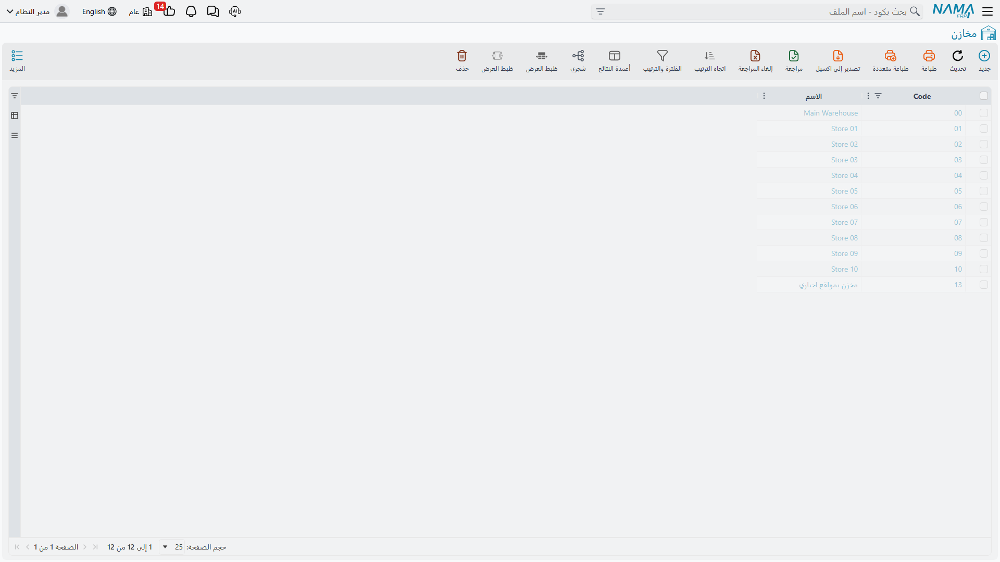
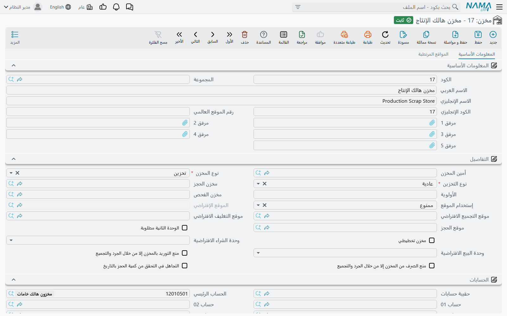

# المخازن والمواقع التخزينية (Warehouses & Locators)

عرّفت أصنافك - رائع. لكن أين ستضعها فعليًا؟ هنا يأتي دور **المخازن (Warehouses)** و**المواقع التخزينية (Locators)**. إنها الخريطة المكانية لمخزونك: المكان الذي يعيش فيه كل صنف، وكيف يتنقل، ومن المسؤول عنه.

## المخزن: حاوية مخزونك الأساسية

المخزن في Nama ERP ليس بالضرورة مبنى. إنه أي مكان تريد أن تتتبع فيه رصيدًا منفصلًا للمخزون. قد يكون:
- مستودعًا فعليًا كبيرًا
- رفًا في صالة عرض
- شاحنة توزيع متنقلة
- منطقة "بضاعة في الطريق" بين فرعين
- منطقة فرز أو حجر صحي للبضاعة قيد الفحص

القاعدة البسيطة: **إذا أردت أن تعرف "كم لديّ هنا؟" بشكل مستقل، فاجعله مخزنًا.**

### أنواع المخازن

ليست كل المخازن متشابهة. يميّز النظام بين عدة أنواع، ولكل منها سلوك مختلف:

- **مخزن عادي**: التخزين الاعتيادي للبضاعة المتاحة للبيع والصرف.
- **مخزن بضاعة في الطريق (Transit)**: يحتجز البضاعة أثناء تنقلها بين موقعين، فلا تظهر متاحة في الطرف المُرسِل ولا المُستقبِل حتى يكتمل التحويل.
- **مخزن فحص/فرز (Inspection)**: تصل إليه البضاعة المستلمة قبل اعتمادها، فلا تدخل المخزون المتاح حتى يجيزها قسم الجودة.
- **مخزن حجوزات (Reservation)**: مخصص للأصناف المحجوزة لعملاء أو أوامر بعينها.

اختيار النوع الصحيح مهم لأنه يحدد متى يُحتسب مخزون هذا المكان ضمن "المتاح للبيع".

### من المسؤول؟ أمين المخزن والصلاحيات

لكل مخزن يمكنك تعيين **أمين مخزن** - الموظف المسؤول عنه. يفيد ذلك في:
- توجيه مهام الاستلام والصرف للشخص الصحيح
- ضبط صلاحيات تمنع المستخدمين من التحريك في مخازن ليست من اختصاصهم
- المساءلة عند الجرد وتسوية الفروقات

كما يمكنك ربط المخزن بفرع ومجموعة، وضبط أولويته (لترشيح المخزن الأنسب تلقائيًا)، ووحدات الشراء والبيع الافتراضية الخاصة به.

### مخازن وتخطيط الاحتياجات (MRP)

يمكنك تحديد ما إذا كان مخزن معيّن مشمولًا في حسابات تخطيط احتياجات المواد (MRP). فمخزن العرض في صالة البيع قد لا ترغب في احتسابه ضمن المتاح للإنتاج، بينما مخزن المواد الخام الرئيسي يجب أن يُحتسب.

## المواقع التخزينية: الدقة داخل المخزن

داخل مخزن كبير، معرفة أن لديك "200 علبة" لا يكفي - أين هي بالضبط؟ في أي ممر، أي رف، أي طبلية؟ هنا يأتي دور **المواقع التخزينية (Locators)**.

الموقع التخزيني هو تقسيم داخل المخزن: ممر A، رف 3، أو منطقة "بضاعة سريعة الحركة". تفعيل المواقع التخزينية يمنحك:
- معرفة المكان الدقيق لكل صنف
- توجيه عمال المستودع مباشرةً إلى موقع التحضير
- تنظيم البضاعة حسب الحركة أو الحجم أو متطلبات التخزين

### سياسة المواقع: مطلوبة أم ممنوعة؟

لكل مخزن تضبط سياسة المواقع التخزينية:
- **مطلوبة**: لا يمكن استلام أو صرف أي صنف دون تحديد موقعه - مثالي للمستودعات الكبيرة المنظمة.
- **ممنوعة**: لا تستخدم المواقع إطلاقًا - مناسب لمخزن صغير أو شاحنة توزيع.

كما يمكن لكل موقع تخزيني أن يمنع الاستلام أو الصرف على حدة (مثلًا موقع "تالف" يستقبل البضاعة لكن يمنع صرفها للبيع)، وأن يُربط بمورّد أو عميل بعينه عند الحاجة، وأن يأخذ أولوية ترشيح ضمن التحضير الآلي.

### تصنيف المواقع (Location Classes)

عندما تتعدد المواقع، يساعدك **تصنيف المواقع** على تجميعها بحسب طبيعتها: تبريد، تجميد، عالية القيمة، حجر صحي... ثم تطبيق قواعد على فئة كاملة بدلًا من موقع واحد. صنف يستلزم التبريد يمكن توجيهه تلقائيًا إلى مواقع من فئة "مبرّد".

### تتبع الأرفف (Rack Quantities)

للمستودعات التي تحتاج دقة أعلى من مستوى الموقع، يتيح النظام تتبع الكميات على مستوى **الرف** داخل الموقع الواحد - مفيد في مراكز التوزيع الكبيرة حيث يضم الموقع الواحد عدة أرفف.

## ربط الأصناف بالمخازن

من غير العملي أن يُخزَّن كل صنف في كل مخزن. لذا يتيح النظام **ربط الصنف بالمخزن** لتحديد المخازن المفضّلة لكل صنف بأولوية معيّنة. الفائدة:
- يرشّح النظام المخزن الأنسب تلقائيًا عند الاستلام أو الصرف
- يمنع تخزين أصناف في مخازن غير مناسبة لها
- يبسّط إدخال المستندات على المستخدم

## مجموعات المخازن

عندما يكبر عدد المخازن، تجمعها **مجموعات المخازن** لأغراض التقارير والتنظيم: مثلًا مجموعة "مخازن المنطقة الشمالية" أو "مخازن صالات العرض". تستطيع حينها استخراج تقرير مخزون لمجموعة كاملة دفعة واحدة.

## سياسة استخدام المخازن (Warehouse Usage Policy)

ربط الأصناف بالمخازن يخبر النظام بالمخازن التي *تناسب* الصنف. لكنك تحتاج أحيانًا إلى قاعدة معاكسة: أن *تمنع* استخدام مخزن بعينه إطلاقًا - في مستندات معيّنة، أو من مستخدمين معيّنين، أو خلال فترة معيّنة. هذا هو دور **سياسة استخدام المخازن (Warehouse Usage Policy)**.

تخيّل بعض المواقف اليومية:
- مخزن قيد الجرد هذا الأسبوع، فلا ينبغي لأحد أن يصرف منه أو يستلم فيه حتى ينتهي الجرد.
- مخزن صالة عرض موسمي يجب ألا يتعامل معه إلا فريق صالة العرض، لا المشتريات المركزية.
- مخزن قديم يجري إيقافه تدريجيًا: تريد منع المعاملات الجديدة عليه اعتبارًا من تاريخ معيّن دون حذف أي من تاريخه.

سياسة استخدام المخازن هي ملف رئيسي يضم جدولًا من القواعد. كل سطر يجيب عن أربعة أسئلة: *أي مخزن، في أي مستندات، لمن، ومتى.*

| العمود | ما الذي يتحكم فيه |
| --- | --- |
| **للنوع (For Type)** | نوع المستند الذي تنطبق عليه القاعدة - مثل صرف مخزني أو استلام مخزني أو تحويل مخزني. |
| **قائمة الأنواع (Entity List)** | قائمة قابلة لإعادة الاستخدام بعدة أنواع مستندات، حين يُراد لقاعدة واحدة أن تغطي أكثر من نوع. |
| **مطبق على (Applicable For)** | الجهة المستهدفة بالقاعدة: مستخدم بعينه، أو مجموعة مستخدمين، أو ملف صلاحيات (Security Profile)، أو معيار (Criteria Definition). اتركه فارغًا لتطبيق القاعدة على الجميع. |
| **المخزن (Warehouse)** | المخزن - أو مجموعة مخازن كاملة - الذي تحكمه القاعدة. وهو حقل إلزامي. |
| **منع الاستعمال (Prevent Usage)** | فعّل هذا الخيار لمنع استخدام المخزن فعليًا. |
| **من تاريخ / إلى تاريخ** | الفترة التي تكون فيها القاعدة فعّالة. اترك كليهما فارغين لقاعدة غير محدّدة بمدة. |

### كيف تُفعَّل القاعدة

يجري الفحص لحظة حفظ المستند المخزني - لا في تقرير تطّلع عليه لاحقًا. ينظر النظام إلى نوع المستند، والمستخدم الذي يُدخله، وتاريخ المستند، ثم يفحص مخزن الرأس ومخزن كل سطر. يُمنع السطر عندما تتطابق قاعدة في السياسة مع كل ما يلي ويكون خيار **منع الاستعمال** مفعّلًا:

- أن يشمل **للنوع** (أو قائمة الأنواع) نوعَ المستند،
- أن يكون **المخزن** هو المستخدَم - أو أن ينتمي ذلك المخزن إلى **مجموعة المخازن** المشار إليها،
- أن يقع تاريخ المستند ضمن فترة **من/إلى** (والفترة الفارغة تتطابق دائمًا)،
- وأن يطابق **مطبق على** المستخدمَ الحالي - مباشرةً، أو عبر مجموعته أو ملف صلاحياته، أو عبر معيار مطابق - أو أن يُترك فارغًا.

عند توافق كل ذلك، يُرفض الحفظ برسالة واضحة تذكر المخزن الممنوع والتاريخ والمستخدم، فيتضح سبب عدم مرور المستند. ترك **مطبق على** فارغًا يجعل المنع شاملًا للجميع، والفترة الزمنية الفارغة تجعله دائمًا.

تجد سياسة استخدام المخازن ضمن الملفات الرئيسية للمخازن، بجوار المخازن ومجموعات المخازن تمامًا.

## سحب شحنة من التداول (Prevent Using Batch)

قد يكون المخزن صالحًا للاستخدام تمامًا بينما شحنة واحدة بداخله ليست كذلك. شحنة زبادي تبلغ تاريخ صلاحيتها. توريدة تُحتجز حتى تصل نتيجة المعمل. دفعة إنتاج يسحبها المورد. شحنة وُعد بها عميل بعينه فلا يجوز بيعها لغيره. وفي كل هذه الحالات تكون البضاعة موجودة على الرف فعلًا وفي الدفاتر - والذي يجب أن يتوقف هو *استخدامها*.

شاشة **منع إستخدام الشحنة** (المخازن ← الملفات ← منع إستخدام الشحنة) هي الملف الرئيسي الذي يوقف ذلك. وهي - مثل سياسة استخدام المخازن قبلها - قائمة قواعد لا مفتاحًا على الشحنة نفسها، وهذا ما يتيح لك حجز شحنة في مخزن وترك الشحنة نفسها صالحة للاستخدام في مخزن آخر.

وكل سطر في جدول **التفاصيل** يجيب عن أربعة أسئلة: *أي شحنة من أي صنف، وفي أي مكان، ولأي مدة، ومن المستثنى.*

| العمود | ما الذي يتحكم فيه |
| --- | --- |
| **الصنف (Item)** | الصنف الذي تُمنع شحنته. ولا تعرض قائمة الاختيار إلا الأصناف المفعّل فيها **له شحنات**، إذ لا شحنات لغيرها أصلًا. |
| **كود الشحنة (Lot ID)** | الشحنة نفسها. والحقل يقترح أرقام الشحنات المسجّلة بالفعل على الصنف الذي اخترته. |
| **المخزن (Warehouse)** | يقصر المنع على مخزن واحد. اتركه فارغًا فتُمنع الشحنة أينما كانت. |
| **الموقع (Locator)** | يضيّق النطاق أكثر إلى موقع تخزيني واحد، ويجب أن يتبع المخزن المذكور في السطر نفسه. |
| **من تاريخ / إلى تاريخ** | الفترة التي يمنع فيها هذا السطر. اترك كليهما فارغين فيكون المنع دائمًا. |
| **نوع الصلاحيات (Capability Types)** | السبيل الوحيد لتجاوز المنع - انظر أدناه. |

و**من تاريخ** و**إلى تاريخ** في الرأس تسهيلٌ لا قاعدة: فكلما أضفت سطرًا نُسِخا إلى تاريخي السطر نفسه، ولك أن تغيّرهما بعد ذلك سطرًا سطرًا. والتواريخ التي يُبنى عليها الحكم هي تواريخ الجدول. (على أن للتاريخين في الرأس فحصًا واحدًا خاصًا بهما: **إلى تاريخ** الأسبق من **من تاريخ** مرفوض.)

### متى يعمل المنع

يجري الفحص لحظة حفظ المستند المخزني، في نفس الجولة التي تفحص سياسة المخازن الموصوفة أعلاه. وتُفحص كل سطور المستند، ويُقارَن **التاريخ الفعلي** للمستند - لا تاريخ تحريره - بفترة القاعدة.

ويُرفض سطر المستند حين تتحقق كل هذه الشروط معًا:

- أن تسمّي القاعدة **الصنف** الموجود في السطر،
- أن تكون **كود الشحنة** في القاعدة هي شحنة السطر،
- أن يقع التاريخ الفعلي للمستند ضمن فترة **من/إلى** في القاعدة (والفترة الفارغة تتطابق دائمًا)،
- وأن يكون **المخزن** و**الموقع** في القاعدة فارغين أو مطابقين تمامًا لما في السطر.

وأمران في ذلك يستحقان التصريح بهما. الأول أن هذا **منع صارم لا تنبيه**: فالحفظ يُرفض ويُؤشَّر على عمود كود الشحنة في السطر المخالف، فلا يوجد المستند أصلًا. والثاني أنه يمنع الشحنة **في الاتجاهين**. فمن الطبيعي أن يُفترض أن قاعدة كهذه لا توقف إلا خروج المخزون، لكن الفحص لا يسأل أبدًا إن كان السطر صرفًا أم استلامًا - فاستلام مخزني أو فاتورة شراء أو تحويل *إلى* مخزن يذكر تلك الشحنة يُرفض تمامًا كما يُرفض بيعها. وهذا هو المطلوب عادةً لشحنة مسحوبة أو منتهية الصلاحية؛ وهو أحيانًا مفاجأة لمن يحاول إعادة إدخال بضاعة محتجزة بمستند تصحيحي.

::: warning سطر القاعدة يحتاج الصنف وكود الشحنة معًا
من المغري أن تسمّي الصنف وتترك **كود الشحنة** فارغًا توقعًا بمنع كل شحنات ذلك الصنف. وليس هذا ما يحدث - فكود الشحنة الفارغ لا يطابق إلا سطور المستندات التي لا تحمل شحنة أصلًا. ولمنع عدة شحنات من صنف واحد، أفرد لكل شحنة سطرًا.
:::

::: tip السماح لشخص واحد بالمرور
**نوع الصلاحيات** في السطر استثناءٌ لا استهداف. فإذا وجّهته إلى نوع صلاحية، جاز لأي مستخدم يمنحه ملف صلاحياته تلك الصلاحية *على نوع المستند الجاري حفظه* أن يستخدم الشحنة رغم المنع - كمدير الجودة المخوَّل بتحريك البضاعة المحتجزة، بينما يُمنع الآخرون جميعًا. واتركه فارغًا فلا يُستثنى أحد. وأنواع الصلاحيات نفسها تُعرَّف من إدارة النظام ← الصلاحيات ← نوع الصلاحيات؛ راجع [ملف الصلاحيات](/ar/platform/security/security-profiles.md).
:::

والقواعد تسري فورًا. فحفظ سجل منع إستخدام الشحنة أو تعديله ينطبق على أول مستند يُحفظ بعده، دون إعادة تشغيل ودون انتظار.

## كيف يتلاءم كل هذا معًا

تخيّل مركز توزيع نموذجيًا:

1. تصل شحنة، فتُستلم أولًا في **مخزن الفحص**.
2. بعد إجازتها من الجودة، تُحوَّل إلى **المخزن الرئيسي**، وتحديدًا إلى **موقع تخزيني** في الممر المناسب.
3. الأصناف التي تستلزم تبريدًا تُوجَّه تلقائيًا إلى مواقع من **تصنيف "مبرّد"**.
4. عند ورود أمر بيع، يرشّح النظام المخزن والموقع وفق **ربط الأصناف بالمخازن** و**أولويات المواقع**.
5. تُحجز البضاعة الموزّعة على فروع بعيدة في **مخزن بضاعة في الطريق** أثناء النقل حتى تصل ويُستلم التحويل.

هذه البنية المكانية هي الأساس الذي تعمل فوقه كل حركات المخزون التي سنتناولها في الأقسام التالية.

## الخطوات التالية

- [استلام المخزون](./receiving-stock.md) - إدخال الأصناف إلى هذه المخازن
- [إصدار المخزون](./issuing-stock.md) - إخراجها منها
- [تحريك المخزون بين المخازن](./moving-stock.md) - نقلها من مخزن إلى آخر
- [الجرد المخزني](./stock-taking.md) - التحقق من المطابقة بين الرصيد الدفتري والفعلي
