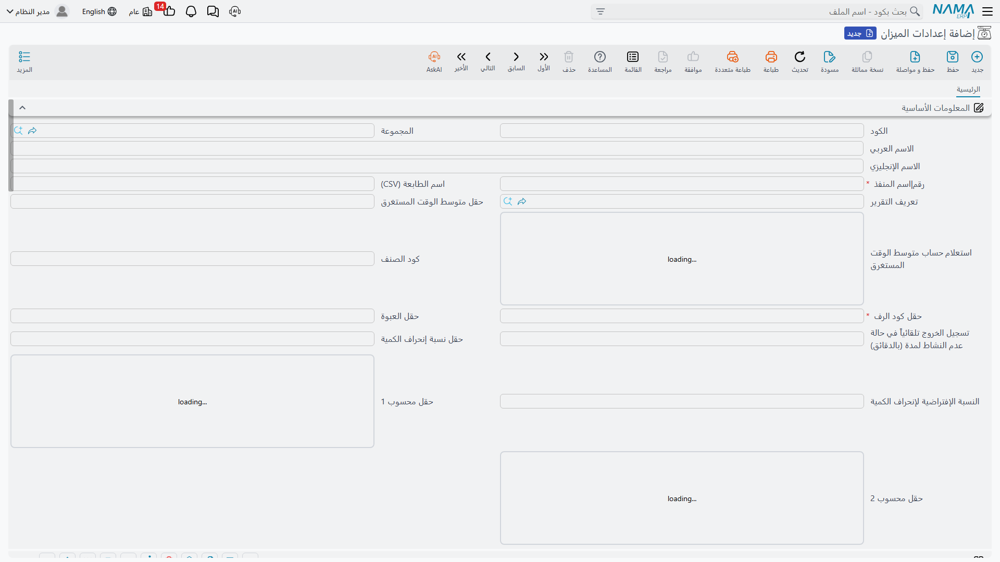

# موازين الوزن (Weight Scale)

في المنشآت التي تتعامل مع مواد سائبة تُباع أو تُستلم بالوزن - حبوب، خرسانة، ركام، معادن - يصبح الميزان جزءًا من خط العمل. يربط Nama ERP موازين الوزن الإلكترونية بمحطات الاستلام والتحميل، فيلتقط الأوزان مباشرةً ويحوّلها إلى حركات مخزنية دون إدخال يدوي.

## إعداد الميزان (WeightScaleConfig)

**إعداد ميزان الوزن** هو الملف المركزي الذي يهيّئ محطات الموازين عند مواقع الاستلام والتحميل. يضبط:
- **صيغ الباركود**: حتى خمس صيغ، لكل منها مواصفاتها ومكوّناتها، لقراءة كود الصنف والعبوة والأرفف والوزن من ملصق الميزان.
- **ربط الحقول**: تعيين معرّفات الحقول لكود الصنف والعبوة والأرفف ومتوسط الوقت والقيم المحسوبة.
- **الصلاحيات**: مصفوفة صلاحيات لعمليات الميزان وأدوار المستخدمين.
- **الطباعة والاتصال**: تعريف التقرير المرتبط، وإعداد الطابعة والمنفذ، ومؤقّت الخروج عند الخمول.
- **التحكم بالصرف**: طرق ترتيب طلبات الصرف، وحدود انحراف الكمية المسموح بها.

## مستند تحضير الصرف (WeightScalePreparationDoc)

**مستند تحضير الصرف بالميزان** يربط قراءة الوزن بعملية الصرف الفعلية: يلتقط الوزن من الميزان ويحضّر الكمية الصافية المراد صرفها، فتنتقل البيانات إلى حركة المخزون دون أخطاء الإدخال اليدوي. ولتوليد هذه المستندات بكميات أو دفعات، يساعد **مولّد تحضير الصرف** (WeightScalePrepGenerator) في إنشائها وفق قواعد محددة.

## كيف تعمل العملية

تخيّل استلام شاحنة حبوب:
1. تُوزَن الشاحنة محمّلة (الوزن الإجمالي).
2. تُفرَّغ الحمولة.
3. تُوزَن الشاحنة فارغة (وزن الفارغ/التاريه).
4. يحسب النظام الوزن الصافي تلقائيًا.
5. يلتقط **مستند التحضير** القيمة الصافية، فتُنشأ حركة المخزون المقابلة وفق الإعداد.

هذا يُلغي أخطاء إدخال الوزن يدويًا ويُسرّع الاستلام والصرف في المواقع كثيفة الحركة.

## الخطوات التالية

- [استلام المخزون](./receiving-stock.md) - استلام المواد السائبة الموزونة
- [إصدار المخزون](./issuing-stock.md) - صرف المواد بالوزن الصافي
- [فهم أصناف المخزون](./understanding-items.md) - الأصناف ذات القياس الوزني
