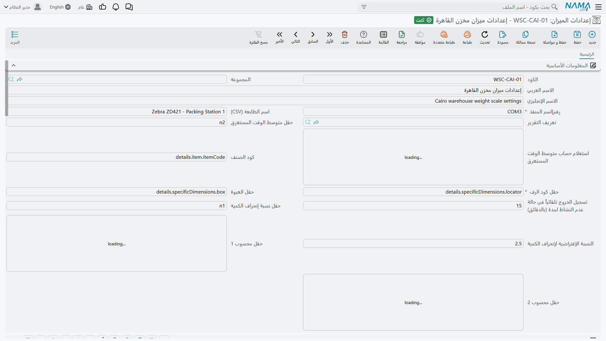

# موازين الوزن (Weight Scale)

في المنشآت التي تتعامل مع مواد سائبة تُباع أو تُستلم بالوزن - حبوب، خرسانة، ركام، معادن - يصبح الميزان جزءًا من خط العمل. يربط Nama ERP موازين الوزن الإلكترونية بمحطات الاستلام والتحميل، فيلتقط الأوزان مباشرةً ويحوّلها إلى حركات مخزنية دون إدخال يدوي.

## إعداد الميزان (WeightScaleConfig)

**إعداد ميزان الوزن** هو الملف المركزي الذي يهيّئ محطات الموازين عند مواقع الاستلام والتحميل. يضبط:
- **صيغ الباركود**: حتى خمس صيغ، لكل منها مواصفاتها ومكوّناتها، لقراءة كود الصنف والعبوة والأرفف والوزن من ملصق الميزان.
- **ربط الحقول**: تعيين معرّفات الحقول لكود الصنف والعبوة والأرفف ومتوسط الوقت والقيم المحسوبة.
- **الصلاحيات**: مصفوفة صلاحيات لعمليات الميزان وأدوار المستخدمين.
- **الطباعة والاتصال**: تعريف التقرير المرتبط، وإعداد الطابعة والمنفذ، ومؤقّت الخروج عند الخمول.
- **التحكم بالصرف**: طرق ترتيب طلبات الصرف، وحدود انحراف الكمية المسموح بها.

## مستند تحضير الصرف (WeightScalePreparationDoc)

**مستند تحضير الصرف بالميزان** يربط قراءة الوزن بعملية الصرف الفعلية: يلتقط الوزن من الميزان ويحضّر الكمية الصافية المراد صرفها، فتنتقل البيانات إلى حركة المخزون دون أخطاء الإدخال اليدوي. ولتوليد هذه المستندات بكميات أو دفعات، يساعد **مولّد تحضير الصرف** (WeightScalePrepGenerator) في إنشائها وفق قواعد محددة.

## كيف تعمل العملية

تخيّل استلام شاحنة حبوب:
1. تُوزَن الشاحنة محمّلة (الوزن الإجمالي).
2. تُفرَّغ الحمولة.
3. تُوزَن الشاحنة فارغة (وزن الفارغ/التاريه).
4. يحسب النظام الوزن الصافي تلقائيًا.
5. يلتقط **مستند التحضير** القيمة الصافية، فتُنشأ حركة المخزون المقابلة وفق الإعداد.

هذا يُلغي أخطاء إدخال الوزن يدويًا ويُسرّع الاستلام والصرف في المواقع كثيفة الحركة.

## الإجراءات في هذه الشاشة

**في منشئ مستندات تحضير الميزان:**

- **المستندات التي سيتم تجهيزها** (Documents To Prepare) — يقرأ المستند الذي أنت فيه ويملأ جدوله بالمستندات المنتظرة للتحضير على الميزان، فتختار من قائمة حقيقية بدل البحث عنها.
- **إنشاء مستندات التحضير** (Generate Weight Scale Preparation Documents) — يجب حفظ المنشئ؛ ثم ينشئ مستندات التحضير لما يحويه الجدول.

## رسائل قد تظهر لك

| الرسالة | لماذا | ما تفعله |
|---|---|---|
| «لا يمكن حذف سطر تم تعبئته» | حُذف سطر من **سند تحضير ميزان** محفوظ بعد أن وصل إلى حالة *تم التعبئة* — فالكمية وراءه وُزنت وعُبِّئت. | أعد السطر واحفظ؛ وتعامل مع الكمية المعبَّأة بمرتجع أو تسوية لا بحذف السطر. |
| «لا يمكن حذف هذا المستند لان السطر {0} تم تعبئته بالفعل» | يُحذف سند التحضير كله وأحد سطوره في حالة *تم التعبئة*. والرسالة تذكر رقم السطر. | لا يمكن حذف السند بعد تعبئة أي شيء فيه — ألغِه من خلال الدورة بدلًا من ذلك. |
| «تم إيجاد عدد سطور {0} للحقل {الوقت المستغرق} في طلب الصرف المخزني {1}, ولكن ينبغي أن يوجد {2} سطر» | **حقل الوقت المستغرق** في إعدادات الميزان يقرأ حقلًا من طلب الصرف، فأعاد عددًا من القيم مختلفًا عن عدد سطور الطلب، فلا يستطيع المولِّد مطابقتها. | اجعل الإعداد يشير إلى حقل على سطور الطلب نفسها، ليعطي قيمة واحدة لكل سطر. |
| «تم إيجاد عدد سطور {0} للحقل {إستعلام الوقت المستغرق} في طلب الصرف المخزني {1}, ولكن ينبغي أن يوجد {2} سطر» | عدم التطابق نفسه عندما يأتي الوقت من **استعلام الوقت المستغرق** في الإعدادات بدل الحقل — فالاستعلام أعاد عددًا خاطئًا من السطور. | صحّح الاستعلام ليعيد سطرًا واحدًا لكل سطر من طلب الصرف. |
| «تم إيجاد عدد سطور {0} للحقل {الترتيب بناءاً على حقل} في طلب الصرف المخزني {1}, ولكن ينبغي أن يوجد {2} سطر» | عدم التطابق نفسه في إحدى قواعد الترتيب: **حقل الترتيب** في طرق الترتيب بالإعدادات لم يعطِ قيمة لكل سطر. | استخدم حقلًا على مستوى السطر في طريقة الترتيب، أو احذف سطر الترتيب ذاك. |
| «تم التحضير بالفعل» | كل سطور طلبات الصرف في جدول المولِّد مرتبطة بسند تحضير بالفعل، فلم يبق ما يُحضَّر. | حدِّث الجدول بزر **المستندات المطلوب تحضيرها**؛ فالطلبات التي تنظر إليها مرّت على الميزان بالفعل. |
| «أقصى وقت تنفبذ لسند تحضير الميزان صفر. يرجى مراجعة متوسط وقت التنفيذ لسطور طلبات الصرف» | المولِّد يجمع متوسط وقت التنفيذ لسطور التحضير فيحصل على صفر، فلا أساس لديه لتقسيمها إلى سندات. | املأ متوسط الوقت — عبر الحقل أو الاستعلام في إعدادات الميزان — على سطور طلب الصرف، ثم ولِّد من جديد. |

## الخطوات التالية

- [استلام المخزون](./receiving-stock.md) - استلام المواد السائبة الموزونة
- [إصدار المخزون](./issuing-stock.md) - صرف المواد بالوزن الصافي
- [فهم أصناف المخزون](./understanding-items.md) - الأصناف ذات القياس الوزني
