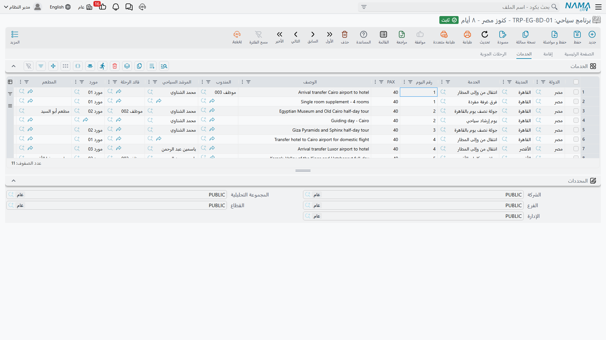
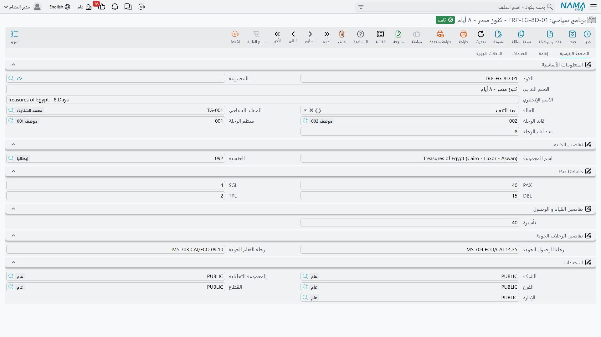
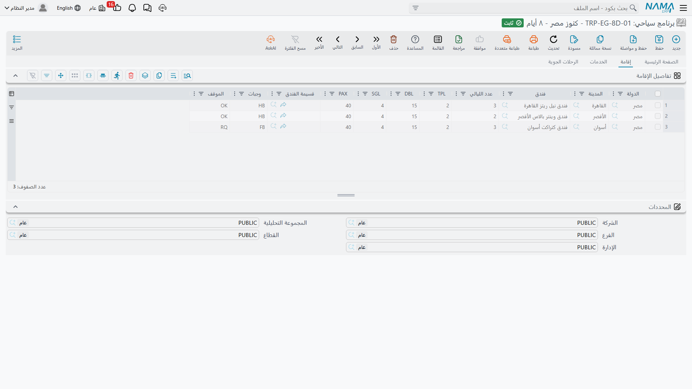
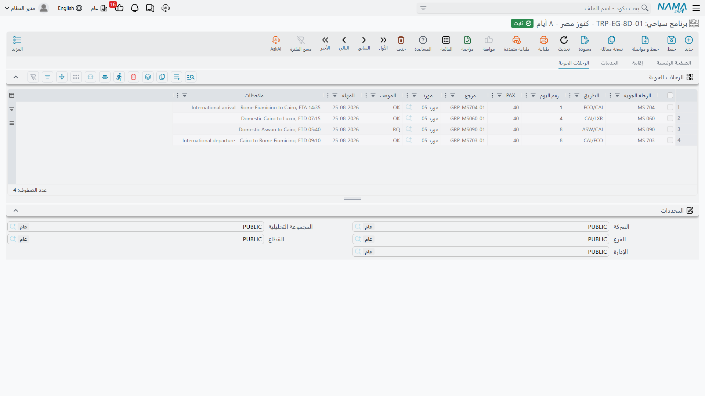

# البرامج السياحية

منظّم الرحلات لا يخترع رحلة جديدة لكل مجموعة تهبط في المطار. فبرنامج «عشرة أيام كلاسيك: القاهرة –
الأقصر – أسوان» يعمل في مارس، ثم في أبريل، ثم في أكتوبر، لمجموعة إسبانية من 40 فرداً ومجموعة إيطالية
من 22. والثابت في كل هذه المرات هو *شكل* الرحلة: كم يوماً تستغرق، وفي أي فنادق وكم ليلة، وأي زيارة
تقع في أي يوم، وأي رحلات طيران داخلية تربط المدن.

و**البرنامج السياحي** هو هذا الشكل بالضبط، يُكتب مرة واحدة ويُعاد استخدامه في كل تشغيلة. تجده تحت
**السفر والرحلات ← الملفات ← برنامج سياحي**. وهو ملف رئيسي وليس مستنداً: لا يُعتمد، ولا تُعالَج له
آثار، ولا يمسّ المال من قريب أو بعيد.

::: info البرنامج بلا تواريخ وبلا أسعار
شيئان لن تجدهما أبداً على البرنامج السياحي: تاريخ من التقويم، وسعر. فهو يقول «اليوم الرابع» لا
«12 أبريل»، ويقول «شيراتون الأقصر، ليلتان» لا «ليلتان بسعر 85 للغرفة». التواريخ تأتي حين تبني منه
[رحلة سياحية](./tours) حقيقية، والأسعار تأتي بعد ذلك على مستندات [الشراء](./travel-purchase-cycle)
و[البيع](./travel-sales-cycle).
:::

## لماذا أرقام الأيام بدلاً من التواريخ

هذه هي الفكرة الوحيدة التي بُنيت عليها الشاشة كلها، فتستحق أن تُقال صراحة.

لو حمل البرنامج تواريخ حقيقية لصلح للاستخدام مرة واحدة فقط — للمجموعة التي تصل في تلك التواريخ
تحديداً. أما بترقيم الأيام («اليوم 1: الوصول والانتقال إلى الفندق»، «الأيام 1–3: فندق خمس نجوم في
القاهرة»، «اليوم 4: الطيران إلى الأقصر») فيصير المسار قالباً يناسب أي تاريخ وصول. وحين تنشئ لاحقاً
رحلة لمجموعة تصل في 12 أبريل، يعدّ النظام من تاريخ الوصول: اليوم 1 يصبح 12 أبريل، واليوم 4 يصبح
15 أبريل، وتتسلسل إقامات الفنادق واحدة خلف الأخرى بعدد ليالي كل منها.

فالقاعدة التي تحفظها وأنت تملأ البرنامج: **اليوم 1 هو يوم الوصول نفسه، لا اليوم التالي له**. فإقامة
ثلاث ليالٍ في القاهرة تبدأ من اليوم 1 تغطي الأيام 1 و2 و3، وتبدأ الإقامة التالية في اليوم 4.

## بناء البرنامج: البيانات الرئيسية

### المعلومات الأساسية

| الحقل | ماذا تضع فيه |
|---|---|
| **الكود** (Code) | المرجع المختصر الذي سيكتبه موظفوك — `CLASSIC10`، `NILE7` |
| **المجموعة** (Group) | مجموعة الملف الرئيسي، إن كنت تصنّف البرامج في عائلات |
| **الاسم العربي / الاسم الإنجليزي** (Name1 / Name2) | اسما البرنامج |
| **الحالة** (Status) | مبدئي، قيد التنفيذ، منتهي، ألغيت — انظر التنبيه أدناه |
| **المرشد السياحي** (Tour Guide) | المرشد الذي تنفّذ معه هذا المسار عادةً |
| **قائد الرحلة** (Tour Leader) | الموظف الذي يقودها عادةً |
| **منظم الرحلة** (Tour Operator) | الموظف صاحب الملف. يبدأ البرنامج الجديد بالموظف المرتبط بالمستخدم الذي أنشأه، ويمكنك تغييره |
| **عدد أيام الرحلة** (Tour Days) | كم يوماً يستغرق المسار كله — وهو الرقم الذي يحدد تاريخ القيام في كل رحلة تُبنى من البرنامج |

**عدد أيام الرحلة** أهم حقل في الشاشة. فهو الذي يحوّل تاريخ الوصول إلى تاريخ قيام في كل رحلة تُبنى
من هذا البرنامج، والنظام يقابله بجدول الإقامة: مجموع ليالي كل إقامات الفنادق يجب أن يساوي هذا الرقم
بالضبط قبل أن يقبل البرنامج الحفظ.

::: tip الحالة وصف تحتفظ به لنفسك
قائمة الحالة — **مبدئي**، **قيد التنفيذ**، **منتهي**، **ألغيت** — للعلم فقط. لا يتصرف النظام بناءً
عليها: لا يمنع شيئاً ولا يُخفي شيئاً ولا يُشغّل شيئاً، وتُنسخ إلى الرحلات المبنية على البرنامج.
استخدمها لتمييز القوالب العاملة من المتقاعدة، ولفلترة شاشة القائمة حين يصير عندك خمسون برنامجاً.
:::

### تفاصيل الضيف

**اسم المجموعة** (Group Name) و**الجنسية** (Nationality) — القيم الافتراضية لنوع المجموعة التي
كُتب البرنامج من أجلها. فبرنامج موجّه للمجموعات التحفيزية الإسبانية يمكنه أن يحمل إسبانيا هنا،
فيوفّر على المنظّم كتابتها في كل رحلة.

### Pax Details

**PAX** و**SGL** و**DBL** و**TPL** — حجم المجموعة المعتاد وتوزيع غرفها: كم غرفة مفردة ومزدوجة
وثلاثية تحتاجها عادةً. هذا هو الشكل النمطي للمجموعة، لا حجزاً فعلياً.

واحرص على اتساق الحساب، لأن الرحلة الحقيقية تُلزمك به: **PAX = (TPL × 3) + (DBL × 2) + SGL**.
فمجموعة من 40 فرداً محمولة على 16 غرفة ثلاثية تعطي `16 × 3 = 48` — وهذا خطأ. أما
`10 TPL + 4 DBL + 2 SGL` فتعطي `30 + 8 + 2 = 40` — وهذا صحيح. وضبطه هنا يعني أن كل رحلة تُنسخ من
البرنامج تُعتمد دون عناء.

### تفاصيل القيام و الوصول

حقل واحد: **تأشيرة** (VISA) — عدد التأشيرات التي تحتاجها المجموعة عادةً.

### تفاصيل الرحلات الجوية

**رحلة الوصول الجوية** (Arrival Flight) و**رحلة القيام الجوية** (Departure Flight) — نص حر للرحلتين
الدوليتين اللتين تفتحان الرحلة وتغلقانها، مثل `MS 986` و`MS 985`. هاتان هما الرحلتان اللتان تصل
عليهما المجموعة وتغادر بهما، أما الرحلات *الداخلية* فمكانها جدول الرحلات الجوية أسفل الشاشة.

### المحددات

الخمسة المعتادة: **الشركة** (Legal Entity)، **المجموعة التحليلية** (Analysis Set)،
**الفرع** (Branch)، **القطاع** (Sector)، **الإدارة** (Department) — حتى يمكن حصر البرامج على المكتب
الذي يبيعها.

## الجداول الثلاثة

كل ما يحدث فعلاً في الرحلة يقع في واحد من ثلاثة جداول. اقرأها بوصفها ثلاثة مسارات زمنية متوازية على
الأيام المرقّمة نفسها: أين تنام المجموعة، وماذا تفعل، وكيف تنتقل بين المدن.

### تفاصيل الإقامة (Accommodation Details)

السطر الواحد = **إقامة واحدة**. لا ليلة واحدة، بل إقامة متصلة في فندق واحد. فثلاث ليالٍ في ماريوت
القاهرة سطر واحد فيه `3` في عدد الليالي.

| العمود | المعنى |
|---|---|
| **الدولة** (Country) / **المدينة** (City) | موقع الفندق. اختر الدولة أولاً — فتضيق قائمة المدن عليها، ويرفض النظام مدينة لا تنتمي إلى دولة السطر |
| **فندق** (Hotel) | ملف الفندق. البحث مفلتر بدولة السطر ومدينته، فلا ترى إلا الفنادق الموجودة هناك فعلاً |
| **عدد الليالي** (Nights) | كم ليلة تستغرق هذه الإقامة. ومجموع كل السطور يجب أن يساوي **عدد أيام الرحلة** |
| **TPL / DBL / SGL / PAX** | توزيع الغرف لهذه الإقامة |
| **قسيمة الفندق** (Hotel Voucher) | ارتباط بـ[قسيمة فندق](./travel-vouchers) |
| **وجبات** (Meals) | نص حر لأساس الإعاشة — `BB` و`HB` و`FB` و`AI` — بالصيغة التي تكتبها عقودك |
| **الموقف** (Situation) | **OK** أو **RQ** أو **WL** — موقف الحجز. للعلم فقط |

وترتيب السطور *هو* ترتيب الرحلة. فالسطر الأول هو مبيت ليلة الوصول، ثم يتلوه الثاني، وهكذا — وهذا
بالضبط ما تحوّله الرحلة الحقيقية إلى تواريخ إدخال وإخراج.

::: info أرقام الأفراد في الرأس هي المعتمدة
في كل مرة تحفظ فيها البرنامج، تُكتب قيم **PAX** و**TPL** و**DBL** و**SGL** من الرأس على كل سطر
إقامة، وقيمة **PAX** على كل سطر خدمة. فالرأس هو الموضع الوحيد لتحديد حجم المجموعة على البرنامج،
أما الاختلافات سطراً سطراً فمكانها الرحلة الحقيقية حيث تضبطها بنفسك.
:::

### الخدمات (Services)

السطر الواحد = **خدمة واحدة تُقدَّم في يوم مرقّم واحد** — انتقال، أو تذكرة دخول متحف، أو عشاء على
النيل، أو يوم إرشادي في وادي الملوك.

| العمود | المعنى |
|---|---|
| **الدولة** / **المدينة** | أين تُقدَّم الخدمة، بالتحقق نفسه من انتماء المدينة للدولة |
| **الخدمة** (Service) | ملف الخدمة السياحية |
| **رقم اليوم** (Day No) | في أي يوم من المسار تقع. و`1` هو يوم الوصول |
| **PAX** | كم فرداً يستفيد منها |
| **الوصف** (Description) | نص حر طويل — الصياغة التي يحتاجها موظفو التشغيل والمورّد |
| **المندوب** (Representative) | الموظف الذي يستقبل المجموعة |
| **المرشد السياحي** / **قائد الرحلة** | من يرافق هذه الخدمة تحديداً حين يختلف عن الرأس |
| **مورد** (Supplier) | الجهة التي تقدّمها حين تُشترى من الخارج |
| **المطعم** (Restaurant) | المطعم في خدمة الإعاشة. وبحثه مفلتر أيضاً بدولة السطر ومدينته |
| **قسيمة المطعم** (Restaurant Voucher) | ارتباط بـ[قسيمة مطعم](./travel-vouchers) |

وتستحق أعمدة **مورد** و**المرشد السياحي** و**المطعم** عناية في ملئها وإن كانت شاشة البرنامج نفسها لا
تستخدمها: فهي الأطراف التي ستجمّع الرحلة الحقيقية أوامر شرائها عليها لاحقاً. وسطر خدمة يذكر من يقدّمها
يصير سطر أمر شراء دون أن يعيد أحد كتابة شيء.

### الرحلات الجوية (Flights)

السطر الواحد = **رحلة داخلية واحدة** — القاهرة إلى الأقصر في اليوم 4، وأسوان إلى القاهرة في اليوم 8.

| العمود | المعنى |
|---|---|
| **الرحلة الجوية** (Flight) | رقم الرحلة أو وصفها |
| **الطريق** (Route) | `CAI-LXR`، `ASW-CAI` — بالصيغة التي يقرأها موظفوك |
| **رقم اليوم** (Day No) | في أي يوم من المسار تقع |
| **PAX** | عدد المقاعد المطلوبة |
| **مرجع** (Reference) | رقم الحجز لدى شركة الطيران |
| **مورد** (Supplier) | من تشتري منه المقاعد |
| **الموقف** (Situation) | OK / RQ / WL |
| **المهلة** (Time Limit) | الموعد النهائي لإصدار التذاكر |
| **ملاحظات** (Remarks) | نص حر طويل |

## ما يتحقق منه النظام قبل الحفظ

أربع قواعد، كلها من النوع الذي يمسك خطأً حقيقياً:

1. **عدد أيام الرحلة لا يكون سالباً.**
2. **الليالي تُطابق الأيام.** مجموع عمود **عدد الليالي** في كل سطور الإقامة يجب أن يساوي
   **عدد أيام الرحلة**. فبرنامج من 10 أيام لا بد أن يغطي 10 ليالٍ إقامة.
3. **المدينة داخل دولتها.** على سطور الإقامة والخدمات معاً، إن ذكرت الاثنين فلا بد أن تنتمي المدينة
   إلى الدولة.
4. **أرقام الأيام لا تكون سالبة** على سطور الخدمات أو الرحلات الجوية.

## مثال كامل: برنامج العشرة أيام

هذه هي الشاشة كلها مملوءة لمسار حقيقي — القاهرة، الأقصر، أسوان، ثم القاهرة، عشرة أيام.

**الرأس**: الكود `CLASSIC10`، الاسم `10-Day Classic Egypt`، عدد أيام الرحلة `10`، PAX `40`،
TPL `10`، DBL `4`، SGL `2` (والحساب سليم: 30 + 8 + 2 = 40)، تأشيرة `40`، رحلة الوصول `MS 986`،
رحلة القيام `MS 985`.

**الإقامة** — أربعة سطور، 3 + 2 + 2 + 3 = 10 ليالٍ، مطابقة لعدد أيام الرحلة:

| # | الدولة | المدينة | الفندق | الليالي | الوجبات |
|---|---|---|---|---|---|
| 1 | مصر | القاهرة | ماريوت القاهرة | 3 | BB |
| 2 | مصر | الأقصر | شيراتون الأقصر | 2 | HB |
| 3 | مصر | أسوان | موفنبيك أسوان | 2 | HB |
| 4 | مصر | القاهرة | ماريوت القاهرة | 3 | BB |

**الخدمات** — بضعة سطور تحمل أرقام أيام:

| رقم اليوم | المدينة | الخدمة | PAX | المورد / المطعم |
|---|---|---|---|---|
| 1 | القاهرة | انتقال من المطار | 40 | نيل ترانسبورت |
| 2 | القاهرة | جولة الأهرام وأبو الهول | 40 | — |
| 2 | القاهرة | غداء | 40 | مطعم: أندريا |
| 5 | الأقصر | وادي الملوك | 40 | — |
| 10 | القاهرة | انتقال إلى المطار | 40 | نيل ترانسبورت |

**الرحلات الجوية** — رحلتان داخليتان:

| رقم اليوم | الرحلة | الطريق | PAX | المورد |
|---|---|---|---|---|
| 4 | MS 063 | CAI-LXR | 40 | مصر للطيران |
| 8 | MS 082 | ASW-CAI | 40 | مصر للطيران |

وهذا البرنامج صار قابلاً لإعادة الاستخدام إلى الأبد. ولا شيء فيه يقول *متى*.

## من البرنامج إلى الرحلة

يؤتي البرنامج ثمرته لحظة تأكيد مجموعة حقيقية. ففي [رحلة سياحية](./tours) جديدة تُدخل تاريخ الوصول،
ثم تختار هذا البرنامج في حقل **برنامج الرحلة**، فيملأ النظام الرحلة كلها: القيم الافتراضية في الرأس،
وتاريخ القيام محسوباً من عدد أيام الرحلة، وإقامات الفنادق الأربع بتواريخ إدخال وإخراج متسلسلة واحدة
خلف الأخرى، وكل سطر خدمة أو رحلة جوية مؤرَّخاً بعدّ رقم يومه من تاريخ الوصول.

فلمجموعة تصل في 12 أبريل: اليوم 1 هو 12 أبريل، وإقامة القاهرة من 12 إلى 15 أبريل، ورحلة الأقصر في
اليوم 4 تقع في 15 أبريل، ويخرج تاريخ القيام 22 أبريل.

وهذا النسخ لقطة تحدث مرة واحدة — فالرحلة بعدها ملكك تعدّلها كما تشاء ولا تعود تنظر إلى البرنامج
أبداً. وصفحة [الرحلات السياحية](./tours) تشرح ذلك بالتفصيل.
