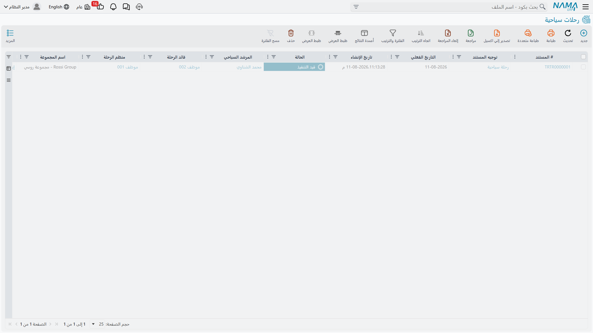
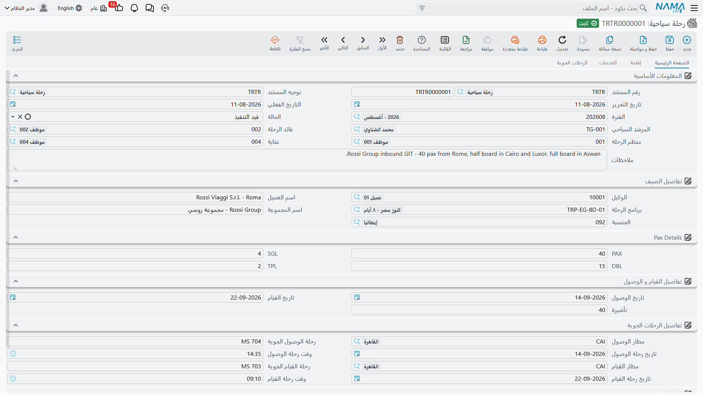
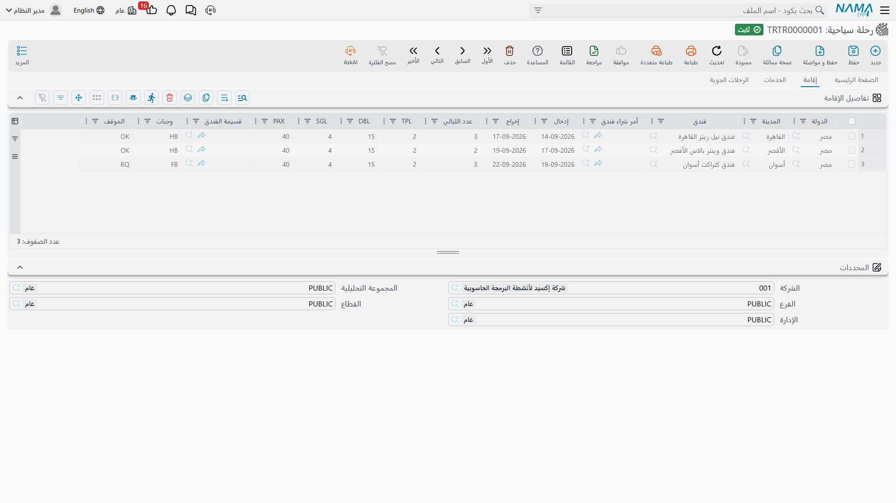
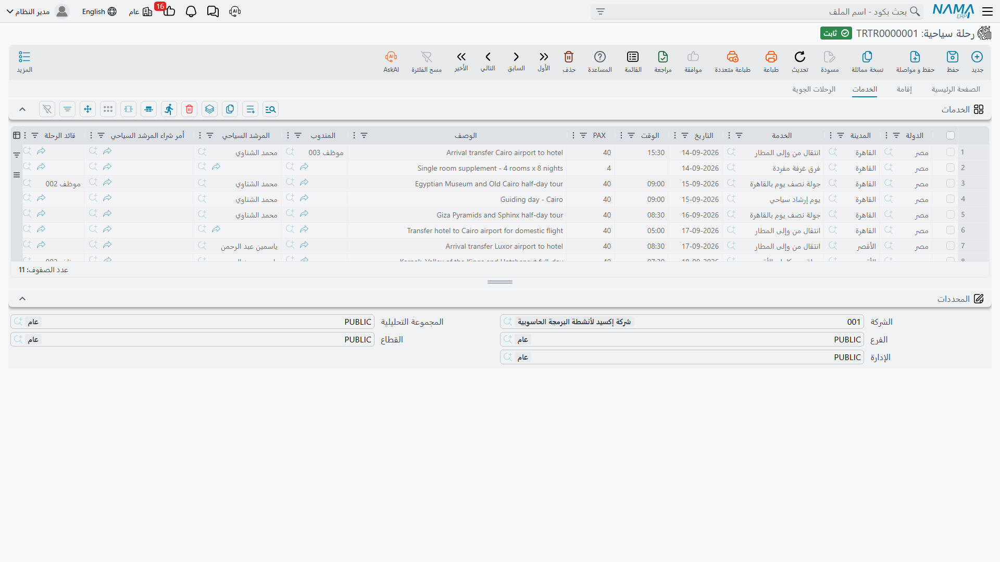
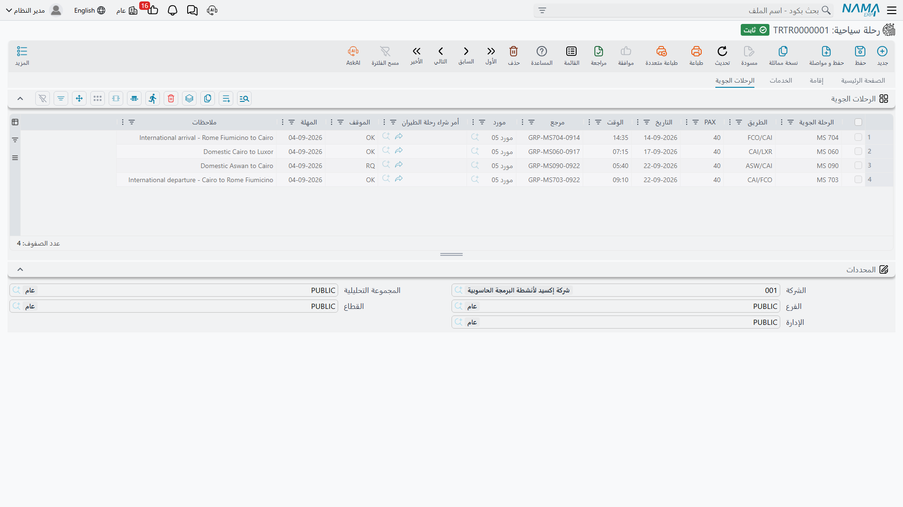
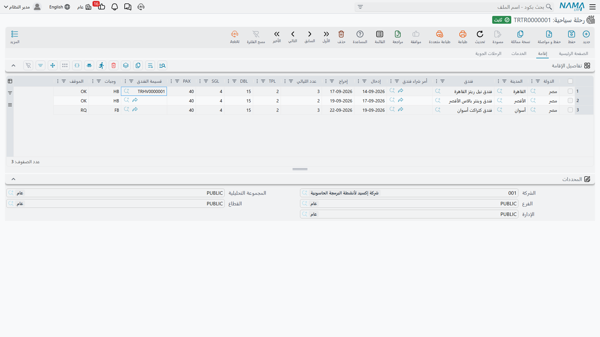

# الرحلات السياحية

[البرنامج السياحي](./tour-programs) هو الوصفة. أما **الرحلة السياحية** فهي الطبخة نفسها وهي تُطهى،
لمجموعة لها اسم، في تاريخ محدد.

الوكيل في برشلونة يؤكد 40 مسافراً إسبانياً يصلون على الرحلة MS 986 في 12 أبريل، ويريدون برنامج
العشرة أيام الكلاسيكي. لا بد أن يحجز أحدهم أربع إقامات فندقية بتواريخ دخول حقيقية، ويحجز 40 مقعداً
على رحلة القاهرة – الأقصر، ويُبلّغ مرشداً، ويرتّب انتقالين من المطار وإليه وغداءً في أندريا، ويُبقي
ذلك كله في موضع واحد يراه موظفو التشغيل. وهذا الموضع الواحد هو الرحلة السياحية.

تصل إليها من **السفر والرحلات ← المستندات ← رحلة سياحية**.

::: info الرحلة السياحية لا تحمل أسعاراً على الإطلاق
لا يوجد معدل ولا تكلفة ولا إجمالي ولا عملة في أي موضع من الرحلة — لا في الرأس ولا في أي من جداولها
الثلاثة. وحفظ الرحلة لا يُنشئ قيداً محاسبياً ولا مديونية ولا التزاماً، ولا يمسّ المخزون.

وهذا تصميم مقصود، وهو شكل الوحدة كلها. فالرحلة هي **ملف التشغيل**: من قادم، وأين ينام، وماذا يفعل،
ومتى يطير. أما المال فيُسجَّل منفصلاً على [مستندات الشراء السياحية](./travel-purchase-cycle) لما
تشتريه، و[مستندات البيع السياحية](./travel-sales-cycle) لما تبيعه. والفصل بينهما يعني أن مكتب
التشغيل يستطيع تبديل فندق أو تحريك زيارة دون أن يتحرك دفتر أحد، وأن مكتب الحسابات يستطيع التسعير
والفوترة دون أن يمسّ المسار.

والجسر الوحيد بين النصفين زرٌّ واحد، تشرحه نهاية هذه الصفحة:
**إنشاء أوامر الشراء** (Create Tourism Service Purchase Orders).
:::

## البيانات الرئيسية

### المعلومات الأساسية

| الحقل | المعنى |
|---|---|
| **رقم المستند** (Document Code) | الدفتر والكود كما في كل مستندات النظام |
| **توجيه المستند** (Term) | [توجيه المستند](./travel-document-terms). املأه — فزر أوامر الشراء لا يعمل بدونه |
| **تاريخ التحرير** (Issue Date) / **التاريخ الفعلي** (Value Date) | تاريخا المستند. وكلاهما يُنقل إلى أي أوامر شراء تُولّدها الرحلة |
| **الفترة** (Fiscal Period) | الفترة التي ينتمي إليها المستند |
| **الحالة** (Status) | مبدئي، قيد التنفيذ، منتهي، ألغيت — للعلم فقط، انظر أدناه |
| **المرشد السياحي** (Tour Guide) | المرشد المنفّذ للرحلة |
| **قائد الرحلة** (Tour Leader) | الموظف الذي يقودها |
| **منظم الرحلة** (Tour Operator) | الموظف صاحب الملف. تبدأ الرحلة الجديدة بالموظف المرتبط بالمستخدم الذي أنشأها |
| **عناية** (Care Of) | الموظف الذي يتعامل معه الوكيل. واختيار الوكيل يملأ هذا الحقل من مندوب ذلك العميل، ويمكنك تغييره |
| **ملاحظات** (Description) | نص حر لما يحتاج ملف المجموعة أن يقوله |

### تفاصيل الضيف

| الحقل | المعنى |
|---|---|
| **الوكيل** (Agent) | العميل الذي أرسل إليك المجموعة — وكالة السفر في الخارج أو العميل المباشر. وهو ملف عميل عادي، وهو من ستُصدر له الفاتورة لاحقاً |
| **اسم العميل** (Agent Name) | نص حر، حين يختلف الاسم على الملف عن اسم السجل الرئيسي |
| **برنامج الرحلة** (Tour Program) | [البرنامج](./tour-programs) المبنية عليه الرحلة. واختياره يملأ الرحلة — انظر القسم التالي |
| **اسم المجموعة** (Group Name) | ما يسمّي به موظفو التشغيل هذه المجموعة: `SPANISH GRP 12/04` |
| **الجنسية** (Nationality) | جنسية المجموعة |

### Pax Details

**PAX** و**SGL** و**DBL** و**TPL** — حجم المجموعة وتوزيع الغرف الواجب حجزها.

ويُتحقق من ذلك عند اعتماد الرحلة: **PAX يجب أن يساوي (TPL × 3) + (DBL × 2) + SGL**. فمسافرونا
الأربعون بتوزيع `10 TPL + 4 DBL + 2 SGL` يعطون `30 + 8 + 2 = 40` فتُحفظ الرحلة. وأي شيء غير ذلك
يُرفض برسالة تذكر الرقمين، وهو غالباً دليل على أن أحدهم غيّر توزيع الغرف دون إعادة عدّ الأفراد.

### تفاصيل القيام و الوصول

**تاريخ الوصول** (Arrival Date) و**تاريخ القيام** (Departure Date) و**تأشيرة** (VISA، عدد
التأشيرات). ولا يجوز أن يسبق تاريخ القيام تاريخ الوصول، وهذان التاريخان يصيران النافذة التي تُقاس
عليها كل التواريخ الأخرى في المستند.

### تفاصيل الرحلات الجوية

الرحلتان الدوليتان بتفصيلهما:

| الحقل | المعنى |
|---|---|
| **مطار الوصول** (Arrival Airport) | مدينة السفر التي تهبط فيها المجموعة |
| **رحلة الوصول الجوية** (Arrival Flight) | رقم الرحلة، نص حر — `MS 986` |
| **تاريخ رحلة الوصول** / **وقت رحلة الوصول** | موعد الهبوط. والتاريخ يجب أن يقع داخل نافذة الوصول والقيام |
| **مطار القيام** (Departure Airport) | المدينة التي تغادر منها |
| **رحلة القيام الجوية** (Departure Flight) | رقم رحلة المغادرة |
| **تاريخ رحلة القيام** / **وقت رحلة القيام** | موعد المغادرة، داخل النافذة نفسها |

### المحددات

**الشركة** و**المجموعة التحليلية** و**الفرع** و**القطاع** و**الإدارة** — وتُنقل إلى أي أوامر شراء
تُولّدها الرحلة.

## اختيار البرنامج السياحي يملأ الرحلة

هذه هي الخطوة التي توفّر أكبر قدر من الكتابة، وسلوكها محدد جداً، ويستحق أن تعرفه بدقة.

### أدخل تاريخ الوصول أولاً

النسخ كله محكوم بتاريخ الوصول، ولذلك يشترطه النظام قبل أن ينفّذ. فإن اخترت برنامجاً و**تاريخ
الوصول** ما زال فارغاً ظهرت لك رسالة «يجب إدخال تاريخ الوصول» ولم يُنسخ شيء. أدخل تاريخ الوصول ثم
اختر البرنامج.

### ما ينزل في الرأس

نسخ مباشر من البرنامج: **المرشد السياحي** و**قائد الرحلة** و**منظم الرحلة** و**الحالة**
و**اسم المجموعة** و**الجنسية** و**TPL** و**DBL** و**SGL** و**PAX** و**تأشيرة** و**مطار الوصول**
و**رحلة الوصول الجوية** و**مطار القيام** و**رحلة القيام الجوية**.

وحقل واحد يُحسب ولا يُنسخ: **تاريخ القيام = تاريخ الوصول + عدد أيام الرحلة**. فبرنامج من 10 أيام
يُختار على رحلة تصل في 12 أبريل يجعل تاريخ القيام 22 أبريل.

### ما ينزل في جدول الإقامة

كل إقامة في البرنامج تنتقل بدولتها ومدينتها وفندقها وتوزيع غرفها ولياليها ووجباتها وموقفها وقسيمتها،
ثم يمنحها النظام تواريخ حقيقية بـ**تسلسل الإقامات واحدة خلف الأخرى** ابتداءً من تاريخ الوصول:

- السطر الأول يدخل في تاريخ الوصول ويخرج بعد عدد لياليه؛
- والسطر الثاني يدخل في اليوم الذي يخرج فيه الأول؛
- وهكذا حتى نهاية الجدول، بلا فجوات.

ولمثالنا الواصل في 12 أبريل:

| # | الفندق | الليالي | الإدخال | الإخراج |
|---|---|---|---|---|
| 1 | ماريوت القاهرة | 3 | 12 أبريل | 15 أبريل |
| 2 | شيراتون الأقصر | 2 | 15 أبريل | 17 أبريل |
| 3 | موفنبيك أسوان | 2 | 17 أبريل | 19 أبريل |
| 4 | ماريوت القاهرة | 3 | 19 أبريل | 22 أبريل |

وآخر إخراج يقع تماماً على تاريخ القيام المحسوب — ولهذا يشترط البرنامج أن تساوي لياليه عدد أيامه.

### ما ينزل في جدولي الخدمات والرحلات الجوية

كل سطر خدمة أو رحلة جوية يحتفظ بكل ما قاله عنه البرنامج، ويكتسب تاريخاً:

**تاريخ السطر = تاريخ الوصول + (رقم اليوم − 1)**

فاليوم 1 هو يوم الوصول نفسه، واليوم 4 بعده بثلاثة أيام. فالانتقال من المطار في اليوم 1 يقع في
12 أبريل، ورحلة القاهرة – الأقصر في اليوم 4 تقع في 15 أبريل، والانتقال إلى المطار في اليوم 10 يقع
في 21 أبريل. والسطر الذي لا رقم يوم له يصل بلا تاريخ فتضبطه بنفسك. أما الأوقات فلا يملؤها النسخ
أبداً — اضبطها حيث تهمّك.

### إنها نسخة تحدث مرة واحدة

::: warning الرحلة لا تبقى مرتبطة بالبرنامج
اختيار البرنامج ينسخ محتواه إلى هذه الرحلة، مرة واحدة، في تلك اللحظة. وبعدها يستقل الاثنان:

- **تعديلاتك اللاحقة على البرنامج لا تصل إلى الرحلات المنشأة من قبل.** غيّر فندقاً على البرنامج
  الشهر القادم، وستبقى الرحلات التي أنشأتها الشهر الماضي على الفندق القديم. وهذا هو المقصود —
  فمجموعة في الطائرة لا يصح أن يُعاد كتابة مسارها من تحتها.
- **وتعدّل الرحلة بحرية.** أضف إقامة، أو بدّل فندقاً، أو انقل خدمة إلى يوم آخر، أو عدّل عدد الأفراد
  على سطر واحد. لا شيء يرتدّ إلى البرنامج، ولا شيء يطمس تعديلاتك.

ويبقى حقل **برنامج الرحلة** مملوءاً بوصفه سجلاً لمصدر الرحلة. وإعادة اختيار برنامج تستبدل الجداول
بنسخة جديدة، فتعامل معها بوصفها بداية من جديد لا تحديثاً.
:::

## الجداول الثلاثة

### تفاصيل الإقامة (Accommodation Details)

أين تنام المجموعة، سطر لكل إقامة.

| العمود | المعنى |
|---|---|
| **الدولة** / **المدينة** | موقع الفندق. والمدينة يجب أن تنتمي إلى الدولة |
| **فندق** (Hotel) | الفندق. وبحثه مفلتر بدولة السطر ومدينته |
| **أمر شراء فندق** (Hotel Purchase Order) | يملؤه زر أوامر الشراء — الأمر الصادر لهذه الإقامة |
| **إدخال** (Check In) / **إخراج** (Check Out) | التاريخان الحقيقيان. وكلاهما يجب أن يقع داخل نافذة الوصول والقيام |
| **عدد الليالي** (Nights) | يُعاد حسابه تلقائياً كلما غيّرت أحد التاريخين، فيظل مطابقاً لهما دائماً |
| **TPL / DBL / SGL / PAX** | غرف هذه الإقامة. وإدراج سطر — أو اختيار فندق عليه — ينسخ أرقام الرأس إليه، ثم تعدّلها من هناك |
| **قسيمة الفندق** (Hotel Voucher) | [قسيمة الفندق](./travel-vouchers) الصادرة لهذه الإقامة |
| **وجبات** (Meals) | نص حر لأساس الإعاشة — `BB`، `HB`، `FB` |
| **الموقف** (Situation) | OK / RQ / WL |

### الخدمات (Services)

ماذا تفعل المجموعة، سطر لكل خدمة.

| العمود | المعنى |
|---|---|
| **الدولة** / **المدينة** | أين تُقدَّم |
| **الخدمة** (Service) | الخدمة السياحية |
| **التاريخ** (Date) / **الوقت** (Time) | متى تُقدَّم. والتاريخ يجب أن يقع داخل نافذة الوصول والقيام |
| **PAX** | كم فرداً يستفيد منها. واختيار الخدمة ينسخ عدد أفراد الرأس إلى السطر |
| **الوصف** (Description) | نص حر طويل |
| **المندوب** (Representative) | الموظف الذي يستقبل المجموعة |
| **المرشد السياحي** / **قائد الرحلة** | من يرافق هذه الخدمة. واختيار الخدمة يجلب مرشد الرأس وقائده إلى السطر |
| **مورد** (Supplier) | من يقدّم الخدمة |
| **المطعم** (Restaurant) | المطعم في خدمة الإعاشة. مفلتر بدولة السطر ومدينته |
| **قسيمة المطعم** (Restaurant Voucher) | [قسيمة المطعم](./travel-vouchers) لهذه الوجبة |
| **أمر شراء الخدمة السياحية** (Service Purchase Order) | الأمر الصادر للمورد |
| **أمر شراء المرشد السياحي** (Tour Guide Purchase Order) | الأمر الصادر للمرشد |
| **أمر شراء المطعم** (Restaurant Purchase Order) | الأمر الصادر للمطعم |

وأعمدة أوامر الشراء الثلاثة هي ما يجعل سطر الخدمة أكثر سطور الوحدة ازدحاماً: فزيارة واحدة قد
تُشترى من ثلاثة أطراف مختلفة — مورد نقل، ومرشد حر، ومطعم — ويأخذ كل منهم أمره الخاص. فلا تذكر على
السطر إلا الأطراف التي تدين لها فعلاً.

### الرحلات الجوية (Flights)

كيف تنتقل المجموعة بين المدن، سطر لكل رحلة.

| العمود | المعنى |
|---|---|
| **الرحلة الجوية** (Flight) | رقم الرحلة أو وصفها |
| **الطريق** (Route) | `CAI-LXR` |
| **التاريخ** / **الوقت** | متى تطير، داخل نافذة الوصول والقيام |
| **PAX** | المقاعد |
| **مرجع** (Reference) | رقم الحجز لدى شركة الطيران |
| **مورد** (Supplier) | من تشتري منه المقاعد |
| **الموقف** (Situation) | OK / RQ / WL |
| **المهلة** (Time Limit) | الموعد النهائي للإصدار — التاريخ الذي تُفرَّغ فيه المقاعد إن لم تُصدر التذاكر |
| **ملاحظات** (Remarks) | نص حر طويل |
| **أمر شراء رحلة الطيران** (Flight Purchase Order) | الأمر الصادر لهذه المقاعد |

### إنشاء القسائم من سطر الجدول مباشرة

عمودا **قسيمة الفندق** و**قسيمة المطعم** ليسا مجرد مرجعين، بل اختصاران. استخدم الإنشاء السريع على
العمود فيفتح لك النظام قسيمة جديدة مملوءة من السطر الذي كنت واقفاً عليه:

- **قسيمة الفندق**: الضيف هو وكيل الرحلة، مع عدد الأفراد وتوزيع الغرف والفندق وتاريخي الإدخال
  والإخراج من السطر.
- **قسيمة المطعم**: الضيف هو الوكيل، مع عدد الأفراد والمطعم وتاريخ الوجبة مأخوذاً من تاريخ سطر
  الخدمة.

::: tip احفظ الرحلة أولاً
أنشئ القسائم من رحلة سبق حفظها. فالقسيمة المنشأة من رحلة محفوظة تحمل معها مرجع الرحلة، فيمكن الوصول
من كل منهما إلى الآخر. وانظر [قسائم الفنادق والمطاعم](./travel-vouchers) لما تفعله القسائم بعد ذلك.
:::

## الحالة والموقف

تظهر على الرحلة قائمتان، وكلتاهما **وصف للعلم فقط لا يتصرف النظام بناءً عليه**.

**الحالة** (Status) في الرأس — **مبدئي**، **قيد التنفيذ**، **منتهي**، **ألغيت**. لا يمنع شيء بسببها،
ولا يُشغَّل شيء بسببها، ولا توجد قاعدة تمنعك من الانتقال من أي قيمة إلى أي قيمة. وتُنسخ من البرنامج
حين تختاره.

**الموقف** (Situation) على سطور الإقامة والرحلات الجوية — **OK** و**RQ** و**WL**، وهي الاختصارات
المعروفة في المهنة لمؤكَّد وتحت الطلب وقائمة الانتظار. وهي أيضاً وصفية محضة.

ولأن شيئاً لا يعتمد عليهما، فهما أداتان بين يديك للمتابعة والتقارير. اتفقوا في المكتب على معنى واحد
لهما، وحافظوا على تحديثهما، ثم افلتر قائمة الرحلات بالحالة لترى ملفات هذا الشهر العاملة، أو استعرض
رحلة بحثاً عن سطور ما زالت عند `RQ` قبل أن تنقضي مهلة الإصدار.

## ما يتحقق منه النظام قبل الاعتماد

كل قواعد التحقق تدور حول اتساق الملف مع نفسه:

1. **PAX يساوي (TPL × 3) + (DBL × 2) + SGL.**
2. **تاريخ القيام ليس قبل تاريخ الوصول.**
3. **تاريخا رحلتي الوصول والقيام الجويتين داخل نافذة الوصول والقيام.**
4. **كل تاريخ إدخال وإخراج في الإقامة داخل النافذة نفسها.**
5. **كل تاريخ خدمة وتاريخ سطر رحلة جوية داخل النافذة نفسها.**
6. **المدينة داخل دولتها** على سطور الإقامة والخدمات.

وقواعد النافذة لا تعمل إلا بعد ملء تاريخي الوصول والقيام معاً، فأكمل الرأس قبل أن تنتقل إلى الجداول.

## إنشاء أوامر الشراء (Create Tourism Service Purchase Orders)

الرحلة تسجّل كل ما تدين به لأحد — أربع إقامات فندقية، ورحلتان جويتان، وخمس خدمات، وأيام مرشد، وغداء
في أندريا — دون أن تقول كم يكلّف أي منها. وتحويل هذه الصورة التشغيلية إلى مستندات يعمل عليها مكتب
الحسابات هو وظيفة زر واحد في قائمة **المزيد**: **إنشاء أوامر الشراء**.

احفظ الرحلة أولاً؛ فالزر لا يعمل إلا على مستند محفوظ.

### ماذا يفعل

يمرّ على الرحلة ويسأل عن كل حجز فيها: *لمن ندين بهذا؟* ثم يجمّع الحجوزات على الأطراف ويُصدر
**أمر شراء خدمات سياحية واحداً لكل طرف**.

ويفعل ذلك خمس مرات، مرة لكل نوع مما تشتريه:

| المرور | يقرأ | يجمّع على | فيُنتج |
|---|---|---|---|
| **الفنادق** | سطور الإقامة | **الفندق** | أمراً لكل فندق يغطي إقاماته |
| **الرحلات الجوية** | سطور الرحلات الجوية | **مورد** السطر | أمراً لكل شركة طيران أو مجمّع |
| **الخدمات** | سطور الخدمات | **مورد** السطر | أمراً لكل مورد خدمة |
| **المرشدون السياحيون** | سطور الخدمات | **المرشد السياحي** على السطر | أمراً لكل مرشد |
| **المطاعم** | سطور الخدمات | **المطعم** على السطر | أمراً لكل مطعم |

فرحلتنا ذات العشرة أيام، التي تنام مجموعتها مرتين في ماريوت القاهرة، تُنتج أمراً **واحداً** لماريوت
يضم الإقامتين معاً — لا أمرين — إضافة إلى أمر لشيراتون، وأمر لموفنبيك، وأمر لمصر للطيران يغطي
الرحلتين الداخليتين، وأمر لنيل ترانسبورت يغطي الانتقالين، وأمر لأندريا.

وكل أمر مولَّد مرتبط في الاتجاهين: يسجّل الرحلة بوصفها المستند الذي جاء منه، ويتذكر كل سطر فيه سطر
الرحلة الذي أنتجه بالضبط، ويُكتب الأمر في عمود **أمر شراء الفندق / الخدمة / المرشد / المطعم / رحلة
الطيران** على سطر الرحلة. فتستطيع أن تقف على أي سطر في أي جدول وتنتقل إلى الأمر الصادر عنه.

كما يرث الأمر من الرحلة تاريخها الفعلي وتاريخ تحريرها وفترتها وملاحظاتها والمحددات الخمسة، فيقع في
الفترة الصحيحة والفرع الصحيح دون إعادة كتابة.

### الأوامر تصل كهيكل بلا أسعار

::: info سطر لكل حجز، بكمية 1، وبلا سعر
الأوامر المولّدة لا تحمل مالاً عن قصد. فكل سطر فيها حجز واحد بكمية **1** و**بلا سعر** — لأن الرحلة
لم تحمل سعراً أصلاً لتعطيه.

ثم تفتح كل أمر وتُدخل الأسعار المتفق عليها: كم يطلب ماريوت مقابل تلك الليالي، وكم تطلب مصر للطيران
مقابل 40 مقعداً. وهذه هي اللحظة التي تُسجَّل فيها الشروط التجارية للرحلة، وتقع على أمر الشراء حيث
تنتمي الأسعار والضرائب وشروط السداد. وصفحة [الشراء من الموردين](./travel-purchase-cycle) تكمل من
هنا: تسعير الأمر، والفوترة عليه، وسداد مستحق الفندق.
:::

### الإعداد الذي يعتمد عليه

يقرأ الزر **توجيه المستند** على الرحلة ليعرف كيف يبني كل عائلة من الأوامر. فلكل مرور من المرورات
الخمسة يحدد التوجيه **الدفتر** و**التوجيه** اللذين يستخدمهما الأمر المولَّد — دفتر وتوجيه لأمر شراء
الفندق، وآخران لرحلة الطيران، وآخران للخدمة السياحية، وآخران للمرشد السياحي، وآخران للمطعم. والمرور
الذي يكون دفتره وتوجيهه فارغين معاً لا يعمل أصلاً، وبهذا تُوقف شركة لا تشتري المرشدين على حدة إصدار
أوامر المرشدين.

وهناك حقلان آخران على التوجيه يهمّان المرورين اللذين لا تقودهما خدمة مذكورة على السطر. فسطر الإقامة
يذكر فندقاً ولا يذكر خدمة سياحية، وسطر الرحلة الجوية يذكر مورداً ولا يذكر خدمة سياحية، فيوفّر
التوجيه لكل منهما خدمة ثابتة: **خدمة الفندق** (Hotel Service) و**خدمة رحلة الطيران** (Flight
Service). اضبطهما على الخدمتين السياحيتين اللتين تستخدمهما لليالي الغرف ولتذاكر الطيران، فيحمل كل
سطر فندق أو طيران مولَّد الخدمة الصحيحة.

أما سطور الخدمات والمرشدين والمطاعم فلا تحتاج ضبطاً كهذا — لأنها تستخدم الخدمة المذكورة على سطر
الرحلة نفسه.

ولشاشة الإعداد كاملة، انظر [توجيهات المستندات](./travel-document-terms).

### إعادة تشغيله

ضغط الزر مرة أخرى لا يضيف إلى ما هو موجود، بل يعيد بناء الأوامر من الرحلة بوضعها الحالي. فيُعاد
النظر في كل أمر أنشأته الرحلة: الفندق أو المورد أو المرشد أو المطعم الذي ما زال على المسار يحتفظ
بأمره لكن تُكتب سطوره من جديد من الحجوزات الحالية، والأمر الذي غادر طرفه المسار تمامًا **يُحذف**.

ولذلك يهمّ الترتيب. فالأسعار تعيش على أوامر الشراء، وإعادة البناء تعيد كتابة السطور نفسها التي
تحملها. اضبط إذن ملف التشغيل أولاً — الفنادق والرحلات والخدمات والأطراف — ثم اضغط الزر بعد أن يستقر
المسار، ثم سعّر الأوامر بعد ذلك. وإن تغيّر المسار فعلًا بعد ذلك، فتوقّع مراجعة الأسعار على كل أمر
مسّته إعادة البناء.
