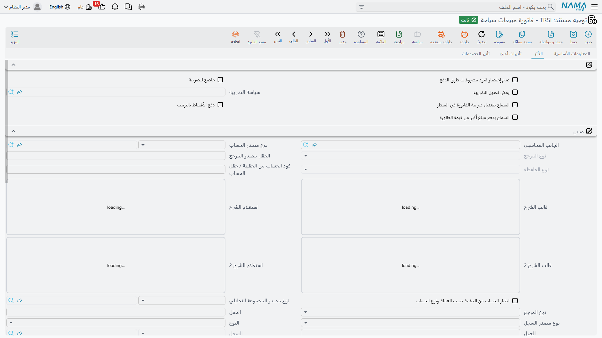
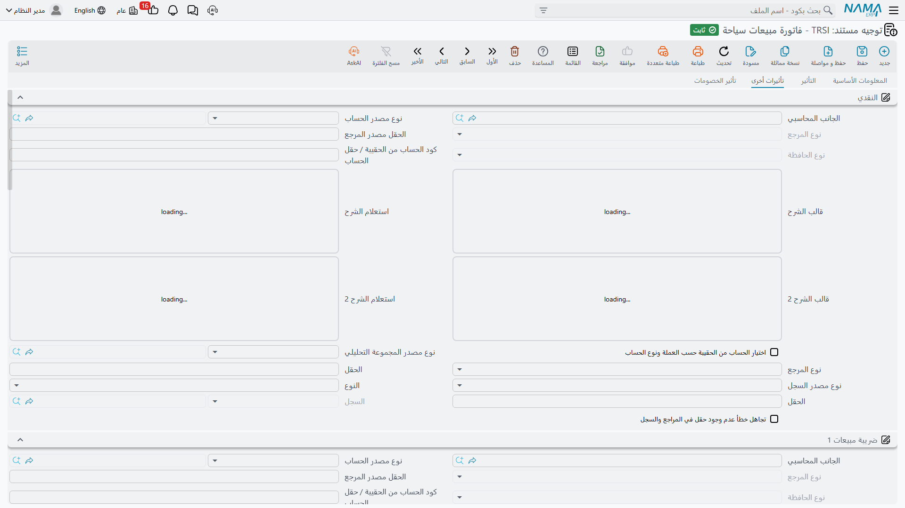
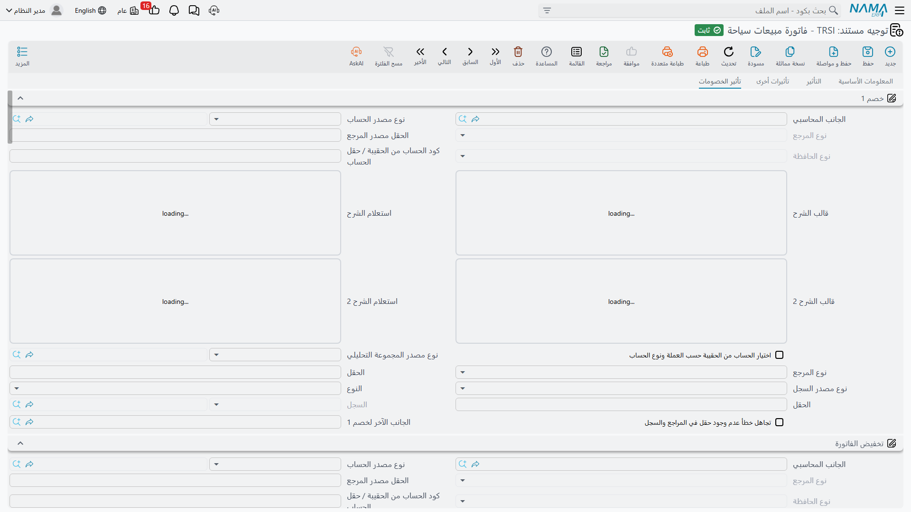
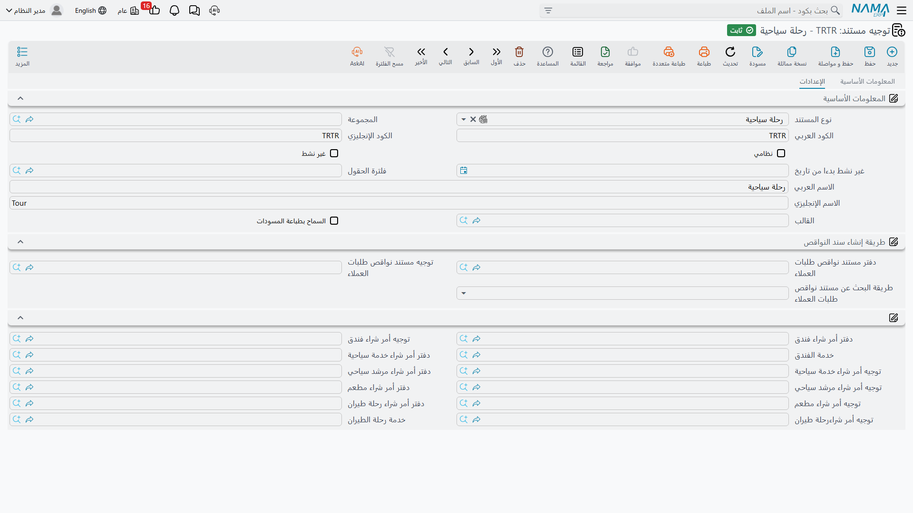

# توجيهات المستندات

افتح قائمة السفر والرحلات تجد فيها مجموعتين لا ثالث لهما: **الملفات** و**المستندات**. لا توجد شاشة
إعدادات، ولا مدخل تهيئة، ولا مكان تقول فيه «إيراد الرحلات النيلية يذهب إلى الحساب 4102». وليس هذا
سهواً. ففي وحدة السفر — كما في بقية نما — يعيش هذا القرار في **توجيه المستند**، ذلك الحقل الجالس
بجوار دفتر المستند في كل مستند سفر.

فاتورة مبيعات الخدمات السياحية تعرف الكثير: تعرف أنها باعت أربعين مقعداً في برنامج القاهرة – الأقصر
لشركة «هورايزون» بمبلغ 240,000، وأن 6,000 منها خصم و33,600 ضريبة، وأن 40,000 دخلت ببطاقة. والشيء
الوحيد الذي لا تعرفه هو الحساب الذي ينتمي إليه كل رقم من هذه الأرقام، وكيف ينبغي أن تتصرف. والتوجيه
هو السجل الذي يمدّها بالأمرين. غيّر التوجيه فتنتج شاشة الفاتورة نفسها قيداً مختلفاً تماماً — وهذا
بالضبط ما يجعل شاشة فاتورة واحدة تخدم فرع القاهرة وفرع الإسكندرية، ونشاطاً بالعملة المحلية وآخر
بعملة أجنبية، وخط سياحة وافدة وخط سياحة مغادرة، في وقت واحد.

وفي وحدة السفر شكلان اثنان من التوجيهات فقط:

- **توجيه الفاتورة**، وتشترك فيه المستندات المالية الستة — أمر البيع وفاتورة المبيعات ومردود
  المبيعات وأمر الشراء وفاتورة المشتريات ومردود المشتريات؛
- **توجيه الرحلة**، ولا يهيئ شيئاً مالياً البتة، وإنما وُجد ليقود زر إنشاء أوامر الشراء في الرحلة.

## توجيه الفاتورة

شكل واحد من التوجيهات يغطي [دورة البيع](./travel-sales-cycle) كاملة و[دورة الشراء](./travel-purchase-cycle)
كاملة. وستنشئ منه عدة توجيهات بطبيعة الحال — واحداً لكل نوع مستند كحد أدنى، وغالباً واحداً لكل فرع أو
خط نشاط فوق ذلك — لكنها كلها تبدو واحدة حين تفتحها.

### الجانب المحاسبي، مرة واحدة

كل ما في الشاشة تقريباً **جانب محاسبي**: نصف واحد من طرفَي القيد. ونفس مجموعة الحقول تتكرر عشرات
المرات، فاقرأها هنا مرة واحدة.

| الحقل | ما يحدده |
|---|---|
| الجانب المحاسبي | هل يُستعمل هذا الجانب أصلاً، وكيف يتصرف كطرف في القيد |
| نوع مصدر الحساب | من أين يأتي الحساب: حساب ثابت تسميه هنا، أم حساب يُقرأ من مرجع على المستند |
| نوع المرجع / حقل المصدر | حين يتبع الحساب المستند — مثلاً: اقرأ الحساب من عميل الفاتورة، أو من الفندق المسمّى ذمةً في فاتورة المشتريات |
| نوع الحافظة | نوع الذمة التي يُختم بها سطر القيد الناتج |
| حساب الحقيبة / معرّف الحقل | الحساب المأخوذ من حقيبة حسابات، في الإعدادات المبنية على الحقائب |
| حساب الحقيبة حسب العملة | يختار من الحقيبة الحساب المطابق لعملة السطر ونوع الحساب |
| قالب البيان / استعلام البيان، وقالب البيان 2 / استعلام البيان 2 | سطرا الوصف المكتوبان على سطر القيد — إما قالب بمتغيرات، وإما استعلام |
| نوع مصدر المجموعة التحليلية، المجموعة التحليلية، نوع المرجع / على الحقل | من أين تأتي المجموعة التحليلية على سطر القيد — ثابتة، أو مقروءة من مرجع على المستند |

وهذه المجموعة الأخيرة هي السبب في أن
[الفنادق والمطاعم والمرشدين يحملون حساباتهم بأنفسهم](./travel-master-files): فتوجيه الشراء لا يسمي
حساب دائنية ثابتاً، وإنما يقول «اقرأ الحساب من الطرف الموجود على المستند»، فيمدّه ملف الفندق أو
المطعم أو المرشد به.

### صفحة «التأثير» — الجانبان اللذان يحملان الصفقة

الصفحة الأولى تحمل الزوج الذي يقوم بمعظم العمل: **مدين** و**دائن**. وأي معنى تجاري يقع في أيهما أمر
يتبع اتجاه المستند لا اختيارك:

| المستند | مجموعة «مدين» تحمل | مجموعة «دائن» تحمل |
|---|---|---|
| أمر بيع خدمات سياحية، فاتورة مبيعات خدمات سياحية | حساب **العميل / المدينية** | حساب **الإيراد** |
| مردود مبيعات خدمات سياحية | حساب **الإيراد** | حساب **العميل** |
| أمر شراء خدمات سياحية، فاتورة مشتريات خدمات سياحية | حساب **التكلفة / المصروف** | حساب **دائنية المورد أو الفندق أو المطعم أو المرشد** |
| مردود مشتريات خدمات سياحية | حساب **الدائنية** | حساب **التكلفة** |

والجانبان يُقيَّمان بطريقتين مختلفتين، وهذا ما يفاجئ الناس. فجانب الطرف (العميل أو المورد) يُرحَّل
بـ**ما تبقّى مستحقاً** — صافي السطر مطروحاً منه النقدية المحصّلة على الكاونتر وسطور طرق الدفع وأي
سطر سند مؤشر عليه بعدم التأثير على المتبقي. أما جانب الشركة (الإيراد أو التكلفة) فيُرحَّل بـ**سعر
السطر الإجمالي قبل الخصومات والضرائب**. وهذا مقصود: فالخصومات والضرائب لكل منها زوج جوانب خاص به في
الصفحتين الأخريين، وترحيل السعر الإجمالي هنا يمنع احتسابها مرتين.

وإلى جوار «مدين» و«دائن» تحمل الصفحة عدداً من المفاتيح:

| الخيار | ماذا يفعل |
|---|---|
| **إختصار القيود** | يدمج سطور القيد المتطابقة، فلا تنتج فاتورة بأربعين سطر تفاصيل أربعين زوجاً من القيود |
| **سياسة الضريبة**، **خاضع للضريبة**، **يمكن تعديل الضريبة**، **السماح بتعديل ضريبة الفاتورة في السطر** | الوضع الضريبي للمستند — انظر أدناه |
| **عدم إختصار قيود مصروفات طرق الدفع** | يبقي قيود رسوم طرق الدفع غير مدمجة، فتظهر رسوم كل طريقة في سطر قيد مستقل |
| **دفع الأقساط بالترتيب** | يفرض سداد أقساط [جدول الدفعات](./travel-payments-and-terms) من الأقدم فالأحدث |

::: info إعدادات الضريبة يملكها التوجيه لا المستند
سياسة الضريبة وخاضع للضريبة ويمكن تعديل الضريبة والسماح بتعديل ضريبة الفاتورة في السطر تظهر جميعاً
على المستند نفسه أيضاً — وقيم التوجيه تُنسخ على المستند **عند كل حفظ**. فإذا أخبرك أحدهم أنه يحوّل
فاتورة سفر إلى غير خاضعة للضريبة فترجع خاضعة، فالجواب في التوجيه لا في الفاتورة.
:::

وتُختتم صفحة التأثير بمجموعة **مصاريف الخدمة**: أربعة أزواج من جوانب المدين والدائن للمستندات التي
تحمل مصاريف خدمة، مع مؤشر لكل منها يبيّن هل المصروف مستقطع، إضافة إلى مفتاح لتخطي التأثير كلياً حين
لا يكون له جانب محاسبي مهيأ.

### صفحة «تأثيرات أخرى» — النقدية والضرائب الأربع

هذه الصفحة هي حيث يأخذ المال الذي ليس هو الصفقة نفسها حساباته.

- **النقدي** — حساب المال المحصَّل على الكاونتر. وهو أيضاً البديل لسطور طرق الدفع: فسطر البطاقة أو
  المحفظة يُرحَّل إلى الحساب المسمّى في ملف **طريقة الدفع** نفسه، ولا يرجع إلى جانب النقدي هذا إلا
  إذا كانت الطريقة لا تسمي حساباً.
- **ضريبة مبيعات 1** و**ضريبة مبيعات 2** و**ضريبة 3** و**ضريبة الفاتورة 4** — مجموعة لكل منها،
  وتحمل كل مجموعة جانب الضريبة و**الجانب الآخر** المقابل الذي تُرحَّل الضريبة في مواجهته. وفي مستند
  البيع تقع الضريبة في الجانب الدائن (ضريبة مخرجات)، وفي مستند الشراء تقع في الجانب المدين (ضريبة
  مدخلات قابلة للخصم). أنت تهيئ الحساب، والاتجاه يدبّر نفسه.

### صفحة «تأثير الخصومات» — كل مستويات الخصم وقواعد السندات

مستندات السفر تحمل ثمانية مستويات خصم في السطر وخصماً في الرأس، ولكل منها مجموعته هنا: **خصم 1**
لخصم السطر الأول، و**تخفيض الفاتورة** لتخفيض الرأس، ثم **خصم 2** حتى **خصم 8**. وكما في الضرائب، لكل
مجموعة جانبها و**جانبها الآخر**. وفي البيع يكون الخصم مديناً، وفي الشراء دائناً.

وفي أسفل الصفحة يقع جدول **تأثير سندات الدفع** — وهو الموضع الوحيد في التوجيه الذي هو جدول لا
مجموعة. وهو يمنح سندات الصرف والقبض التي تهبط في
[جدول سندات الدفع](./travel-payments-and-terms) في المستند تأثيراً محاسبياً خاصاً بها. يقول كل سطر:
السندات من *هذا النوع*، المنطبقة عليها *هذه المعايير* أو *هذا الاستعلام*، تُرحَّل بـ*هذا المدين*
مقابل *هذا الدائن*. واترك الجدول فارغاً فتكتفي السندات بإنقاص المتبقي دون أن تنتج قيوداً خاصة بها.

### النتيجة الوحيدة التي يجب أن تحفظها

::: warning الجانب غير المُعرَّف لا ينتج شيئاً
المحرك الذي يبني القيد لا يبني إلا السطور التي يصفها التوجيه. فالتوجيه الذي مجموعتا مدين ودائن فيه
فارغتان ينتج قيداً **بلا سطور إطلاقاً** — يُعتمد المستند، وتنجح معالجته، ولا يظهر خطأ في أي مكان،
ولا يصل إلى الأستاذ العام شيء. والتوجيه المهيأة فيه الضرائب دون جوانب الخصومات يرحّل الضرائب ويتخطى
الخصومات بصمت.

وهذا أكثر بلاغات الدعم شيوعاً في وحدة السفر. والتوجيه المُنشأ حديثاً فارغ تماماً، فـ**املأه قبل أول
مستند حقيقي يُحرَّر عليه**. وإذا كان مستند قد اعتُمد بالفعل على توجيه ناقص، فصحّح التوجيه ثم استعمل
إجراء **إعادة إنشاء التأثيرات المحاسبية** على المستند — فيعيد إصدار القيد وفق الإعداد المصحح.
:::

### أعطِ الأوامر توجيهاتها الخاصة

من السهل أن تفترض أن الفواتير وحدها هي التي ترحّل. وليس الأمر كذلك في وحدة السفر: فـ**أمر بيع
الخدمات السياحية وأمر شرائها يحملان حقل التوجيه ويُعالَجان تماماً كالفواتير**، بنفس شكل التوجيه
ونفس المحرك. فإذا وجّهت الأمر إلى توجيه الفاتورة، رحّل الأمر قيد مدينية وإيراد كاملاً، ثم رحّلته
الفاتورة المحرَّرة منه مرة ثانية.

فأنشئ توجيهات مستقلة لمستندَي الأمر. ومعظم الشركات تريد أوامرها مستندات تجارية بحتة — تأكيد حجز،
والتزام تجاه مورد — وتوجيه أمر تُترك فيه مجموعتا مدين ودائن فارغتين يعطيك هذا بالضبط: يُعتمد الأمر،
ويحمل الأسعار والأقساط والبنود التعاقدية، ولا يرحّل شيئاً. أما إن أردت فعلاً أن تنعكس الأوامر في
الأستاذ العام، فأعطها توجيهاً يشير إلى حسابات الالتزامات لا إلى حسابات الفاتورة.

### ما لا يحمله توجيه الفاتورة

هذا التوجيه قصير بالمقارنة مع توجيهات الوحدات الأخرى — وما ينقصه يستحق المعرفة:

- **لا دفتر مستندات ولا قاعدة ترقيم.** الترقيم يأتي من دفتر المستند تماماً كأي مستند آخر في نما؛
  انظر [دفاتر المستندات](/ar/platform/document-books).
- **لا قيم افتراضية.** التوجيه لا يحدد عميلاً ولا مندوباً ولا عملة ولا خدمة سياحية ولا قائمة أسعار
  افتراضية. وما ينبغي أن يُملأ مسبقاً يأتي من دفتر المستند أو من سياق المستخدم أو من الكتابة اليدوية.
- **لا إنشاء لمستندات مرتبطة.** توجيه الفاتورة لا ينشئ مستنداً آخر أبداً. والتوجيه الوحيد الذي ينشئ
  مستندات في وحدة السفر هو توجيه الرحلة، أدناه.

## توجيه الرحلة

[الرحلة السياحية](./tours) لا تحمل مالاً على الإطلاق. إنها تسجل من يسافر، وأين ينام، وماذا يأكل، ومن
يرشده — ثم يحوّل زر واحد في قائمة «المزيد» اسمه **إنشاء أوامر الشراء** ذلك كله إلى أوراق موردين.
وتوجيه الرحلة موجود ليخبر ذلك الزر بما ينشئه.

وليس فيه جوانب محاسبية ولا إعدادات ضريبة ولا ترقيم. إنما فيه خمسة أزواج من الدفاتر والتوجيهات
وخدمتان:

| الإعداد | فيمَ يُستعمل |
|---|---|
| **دفتر أمر شراء فندق** / **توجيه أمر شراء فندق** | الدفتر والتوجيه المستعملان في الأوامر المبنية من سطور الإقامة في الرحلة، أمر لكل فندق |
| **خدمة الفندق** | الخدمة السياحية التي تمثّل الإقامة في سطور تلك الأوامر |
| **دفتر أمر شراء رحلة طيران** / **توجيه أمر شراء رحلة طيران** | الدفتر والتوجيه للأوامر المبنية من سطور الطيران، أمر لكل مورد |
| **خدمة رحلة الطيران** | الخدمة السياحية التي تمثّل الطيران في سطور تلك الأوامر |
| **دفتر أمر شراء خدمة سياحية** / **توجيه أمر شراء خدمة سياحية** | الدفتر والتوجيه للأوامر المبنية من سطور الخدمات، مجمّعة حسب المورد |
| **دفتر أمر شراء مرشد سياحي** / **توجيه أمر شراء مرشد سياحي** | الدفتر والتوجيه للأوامر المبنية من سطور الخدمات، مجمّعة حسب المرشد |
| **دفتر أمر شراء مطعم** / **توجيه أمر شراء مطعم** | الدفتر والتوجيه للأوامر المبنية من سطور الخدمات، مجمّعة حسب المطعم |

والزر يمر خمس مرات، مرة لكل مجموعة من المجموعات أعلاه، و**المرور الذي دفتره وتوجيهه فارغان معاً
يُتخطى كلياً**. وهذه هي أداة التحكم التي بيدك فيما يُنشأ: فالشركة التي تشتري الفنادق والطيران وتسدد
للمرشدين من النثرية تترك زوج المرشد فارغاً ببساطة، فلا تظهر أوامر مرشدين.

وحقلا الخدمة لا يقلان أهمية. فسطور الإقامة وسطور الطيران في الرحلة تسمي فندقاً وشركة طيران، لكنها لا
تسمي خدمة سياحية — ولذلك يأخذ مرور الفندق ومرور الطيران خدمتهما من **خدمة الفندق** و**خدمة رحلة
الطيران** في التوجيه. واترك أياً منهما فارغاً فلا ينتج ذلك المرور شيئاً ولو كان دفتره وتوجيهه
مملوءين، لأن كل سطر مرشح يُستبعد لخلوه من الخدمة. فاختر لهما شيئاً عاماً ذا معنى، كخدمة سياحية اسمها
«إقامة» وأخرى اسمها «تذكرة طيران».

::: tip املأ توجيه الرحلة قبل أول رحلة
ثلاثة أمور يجب توافرها قبل أن ينتج الزر شيئاً. فالرحلة تحتاج توجيهاً أصلاً — وبدونه يرفض الزر العمل
ويقول ذلك صراحة. والأزواج الخاصة بأنواع الأوامر التي تريدها يجب أن تكون مملوءة. وخدمة الفندق وخدمة
رحلة الطيران يجب ضبطهما إن أردت أوامر إقامة وطيران. ولأن الأوامر المولَّدة تُنشأ وتُعتمد فوراً، فإن
توجيهات أوامر الشراء التي تسميها هنا تحتاج بدورها إلى حساباتها المهيأة، وإلا عولجت الأوامر بصمت دون
أن ترحّل شيئاً.
:::

وقائمتا اختيار الدفتر والتوجيه لا تعرضان إلا دفاتر وتوجيهات أمر شراء الخدمات السياحية، والفعّالة
منها فقط، فمجال الاختيار الخاطئ ضيق. كما ترث شاشة توجيه الرحلة مجموعة من مجموعات النظام تخص طريقة
إنشاء سند النواقص، ووحدة السفر لا تستعملها — اتركها فارغة.

أما ما يحدث بعد تشغيل الزر — كيف تُجمَّع الأوامر وتُسعَّر ويُعاد توليدها — فمشروح في صفحة
[الرحلات السياحية](./tours).
