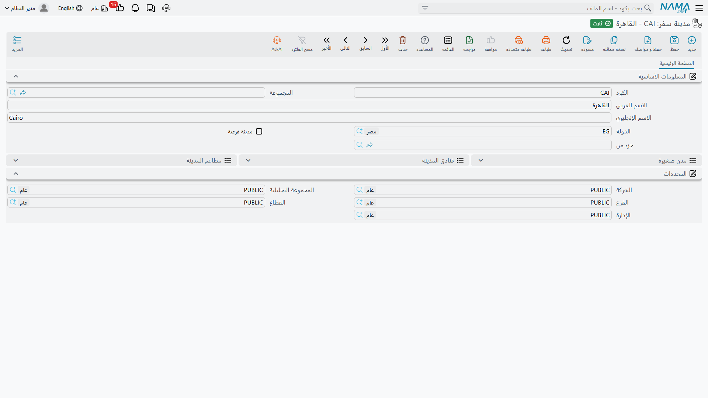
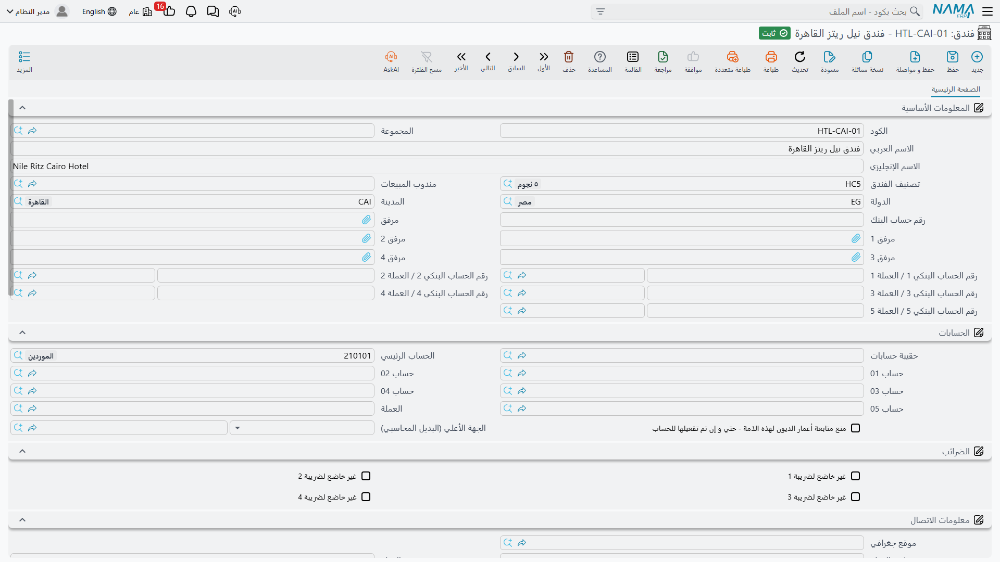
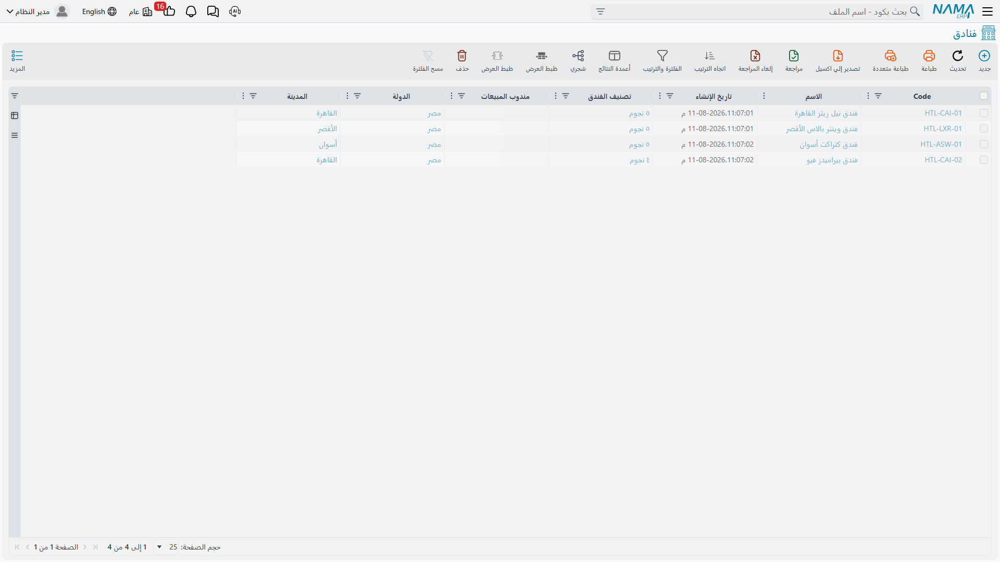
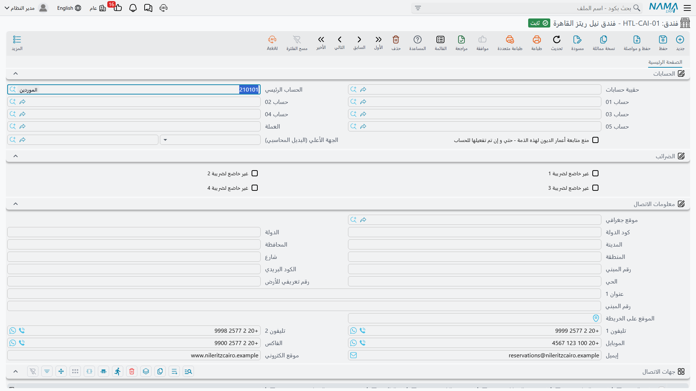
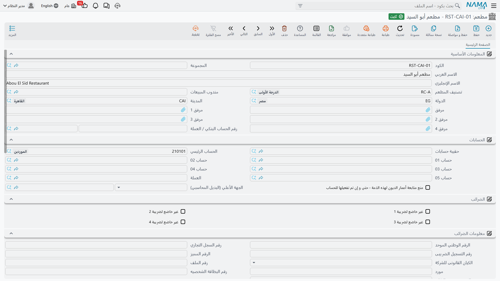
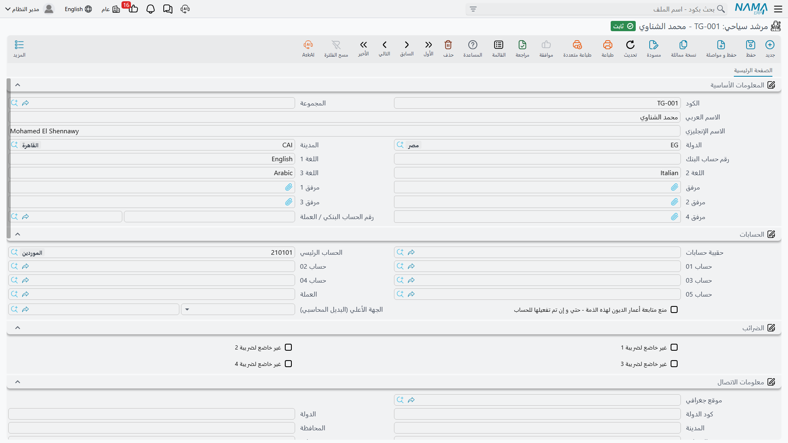
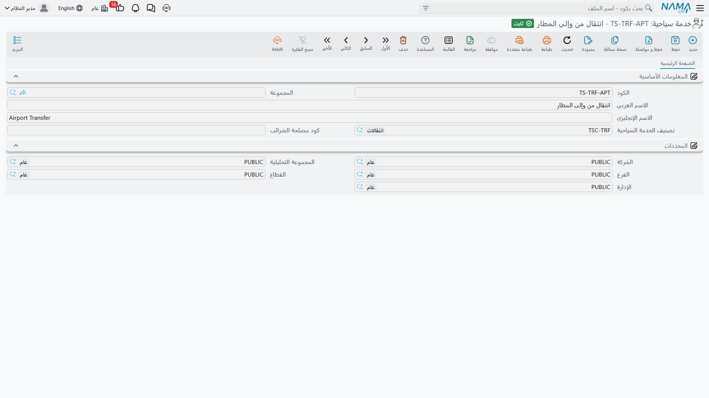

# الملفات الرئيسية للسفر والرحلات

شركة السياحة لا تبيع بضاعة من مخزن. هي تبيع خمس ليالٍ في فندق بالأقصر، وانتقالاً بالأتوبيس من مطار
القاهرة في الرابعة والنصف فجراً، ومرشداً مرخّصاً يتحدث الألمانية، وغداءً لأربعين شخصاً في مطعم بالجيزة.
وقبل أن يخطط أحد رحلة أو يطبع قسيمة أو يصدر فاتورة، لا بد أن يعرف النظام أن هذه الفنادق والمطاعم
والمرشدين والخدمات موجودة — والأهم من ذلك أن يعرف **لمن تُدفع النقود** بعد أن تعود المجموعة إلى بلدها.

هذه هي وظيفة مجموعة **الملفات** أسفل قائمة **السفر والرحلات**. كل ما فيها بيانات مرجعية: لا شيء هنا
يُنشئ قيداً محاسبياً، ولا شيء يحرّك مخزوناً، وحفظ أي من هذه السجلات لا يترك أي أثر على دفاترك. لكن كل
مستند في الوحدة مبنيّ من هذه السجلات، فجودة ملفاتك الرئيسية هي التي تحدد كم ستكتب لاحقاً — وكم ستصحّح.

## ترتيب الإنشاء

الملفات الرئيسية للسفر تكوّن سلسلة قصيرة من الاعتماديات، ولذلك فإن تجهيز شركة سياحة جديدة يمضي أسرع
ما يكون إذا سرتَ في هذا الترتيب:

1. **دولة سفر (Travel Country)** — الدول التي تعمل فيها. لا تعتمد على شيء، فابدأ منها.
2. **مدينة سفر (Travel City)** — كل مدينة تتبع دولة، فلا بد أن تكون الدول موجودة أولاً.
3. **تصنيف فندق** و**تصنيف مطعم** و**تصنيف خدمة سياحية** — ثلاث قوائم صغيرة (خمس نجوم، أربع نجوم؛
   مأكولات بحرية، شرقي؛ انتقالات، تذاكر دخول). كل واحدة تستغرق دقيقة، وتجعل شاشات الفنادق والمطاعم
   والخدمات أسهل بكثير في الملء.
4. **فندق** و**مطعم** و**مرشد سياحي** — الجهات التي تشتري منها. كل منها يحتاج إلى دولة ومدينة وتصنيف
   ومجموعة حسابات خاصة به.
5. **خدمة سياحية (Tour Service)** — ما تبيعه وتشتريه فعلياً. كل سطر فاتورة في الوحدة يشير إلى واحدة منها.

بعد ذلك تنتقل إلى [البرامج السياحية](./tour-programs)، وهي قوالب البرامج القابلة لإعادة الاستخدام، ومنها
إلى [الرحلات السياحية](./tours) التي تنفّذها فعلاً.

::: info موضع البرنامج السياحي
يظهر **البرنامج السياحي (Tour Program)** في مجموعة الملفات إلى جانب السجلات الموصوفة هنا، لكنه يتصرف
كمستند تخطيط لا كقائمة بسيطة — فهو يحمل حالة، وسطور برنامج يومي، وسطور إقامة، وسطور خدمات. وله صفحته
الخاصة: [البرامج السياحية](./tour-programs).
:::

## ما يشترك فيه كل ملف رئيسي للسفر

أياً كان السجل الذي تفتحه، فإن الجزء العلوي واحد:

| الحقل | ماذا يحمل |
|---|---|
| الكود (Code) | معرّف السجل. إذا كانت المجموعة المختارة تحمل ضوابط ترقيم آلي، يُبنى الكود لك ويجب أن يوافق تلك الضوابط. |
| المجموعة (Group) | مجموعة الملفات الرئيسية التي يتبعها السجل. يجب أن تكون مجموعة معرّفة **لهذا النوع من السجلات** — لا تصلح مجموعة فنادق على مطعم — ويجب أن تكون مجموعة طرفية لا أباً لغيرها. وإذا لم يكن هناك مولّد أكواد، صارت المجموعة إلزامية. |
| الاسم العربي (Name1) | الاسم بالعربية. |
| الاسم الإنجليزي (Name2) | الاسم بالإنجليزية. |

وفي أسفل كل شاشة توجد مجموعة **المحددات (Dimensions)** — الشركة والمجموعة التحليلية والفرع والقطاع
والإدارة — وهي تتحكم في من يرى السجل ومن يستخدمه، تماماً كما في بقية النظام.

## دولة سفر ومدينة سفر (Travel Country & Travel City)

### دولة سفر (Travel Country)

**دولة السفر** ليست أكثر من اسم وكود: مصر، الأردن، السعودية، تركيا. قيمتها فيما يتعلق بها. افتح دولة
وستجد تحت المعلومات الأساسية ثلاث قوائم للعرض تملأ نفسها بنفسها كلما بنيتَ بقية الوحدة:

- **مدن** — كل مدينة سفر مسجلة تحت هذه الدولة، مع كودها، وهل هي مدينة فرعية، وتابعة لأي مدينة.
- **فنادق الدولة** — كل فندق في الدولة، مع مدينته.
- **مطاعم الدولة** — والمثل للمطاعم.

وهكذا يصير سجل الدولة لوحة متابعة: افتح «مصر» فترى فوراً الإحدى عشرة مدينة والستين فندقاً والأربعة عشر
مطعماً المسجلة عندك هناك، دون تشغيل أي تقرير.

وحفظ الدولة لا يفعل شيئاً آخر على الإطلاق — لا توجد ضوابط تُستوفى ولا آثار تُنتظر.

### مدينة سفر (Travel City)

**مدينة السفر** مدينة داخل دولة سفر واحدة: القاهرة، الجيزة، الأقصر، أسوان، شرم الشيخ. وإلى جانب الكود
والأسماء المعتادة تحمل ثلاثة حقول:

| الحقل | ماذا يحمل |
|---|---|
| الدولة (Country) | دولة السفر التي تتبعها المدينة. |
| مدينة فرعية (Sub City) | علّم عليه حين يكون السجل حياً أو منطقة منتجعات لا مدينة قائمة بذاتها. |
| جزء من (Sub City For) | المدينة الأم. تصير إلزامية بمجرد التعليم على **مدينة فرعية**. |

المدن الفرعية هي ما يتيح لك الدقة حيث تهمّ الدقة. شرم الشيخ مدينة، وخليج نعمة وخليج نبق مدينتان
فرعيتان منها. والقاهرة مدينة، ومصر الجديدة ومدينة نصر والزمالك مدن فرعية منها. عندئذٍ يمكن تسجيل الفندق
في «خليج نعمة» بدل «في شرم» على وجه العموم — وهو بالضبط ما يحتاج السائق الذي ينفّذ انتقال المطار أن يعرفه.

وتُطبَّق قاعدتان عند الحفظ:

- إذا كان **مدينة فرعية** معلَّماً، وجب ملء **جزء من**.
- المدينة الأم في **جزء من** يجب أن تتبع **الدولة نفسها** التي تتبعها المدينة التي تحفظها. وإن لم تكن
  كذلك رُفض الحفظ برسالة تخبرك أن المدينة يجب أن تكون في تلك الدولة.

وقاعدة الدولة نفسها تتكرر على الفنادق والمطاعم والمرشدين، والنظام يعينك على الالتزام بها: متى اخترتَ
الدولة أولاً لم يعرض عليك مرجع المدينة إلا مدن تلك الدولة. والعكس صحيح أيضاً — اختر مدينة فيكتب النظام
دولتها في حقل الدولة نيابة عنك.

::: info جغرافيا السفر ليست دولة العنوان
كتلة العنوان المعتادة في النظام — تلك التي تراها تحت **معلومات الاتصال** في الفندق، وفي العملاء والموردين
وغيرهم — تخزّن الدولة والمدينة **نصاً حراً**. فيستطيع أي أحد أن يكتب فيها «القاهرة» أو «قاهرة» أو
«Cairo»، ولا شيء يراجع الكتابة.

أما **دولة السفر** و**مدينة السفر** فشيء آخر تماماً: قائمة منضبطة لا توجد إلا داخل وحدة السفر والرحلات،
وهي ما تُرشِّح به الوحدة وتُجمّع وتتحقق. لذلك سترى في شاشة الفندق حقلي دولة ومدينة مرتين — مرة في
**المعلومات الأساسية** (جغرافيا السفر، تُختار من قائمة) ومرة داخل العنوان البريدي تحت **معلومات الاتصال**
(نص حر، جزء من عنوان المراسلة). املأ دولة السفر ومدينته بعناية؛ فهما الزوج الذي تستخدمه الوحدة فعلاً.
:::

## تصنيف فندق وفندق (Hotel Class & Hotel)

### تصنيف فندق (Hotel Class)

**تصنيف الفندق** قائمة بسيطة — خمس نجوم، أربع نجوم، بوتيك، باخرة نيلية — ليس فيها سوى الكود والمجموعة
والاسمين. وهي موجودة لتصنّف الفنادق وتُرشِّح بها قائمة الفنادق حسب درجة التصنيف.

### فندق (Hotel)

سجل **الفندق** أكبر ملف رئيسي في الوحدة، وهو يؤدي وظيفتين في آنٍ واحد.

الوظيفة الأولى هي الظاهرة: وصف منشأة تحجز فيها غرفاً.

| الحقل | ماذا يحمل |
|---|---|
| تصنيف الفندق (Hotel Class) | درجة التصنيف أو الفئة، من قائمة تصنيفات الفنادق. |
| الدولة (Country) | دولة السفر التي يقع فيها الفندق. |
| المدينة (City) | مدينة السفر (أو المدينة الفرعية) التي يقع فيها. ويجب أن تتبع الدولة المختارة. |
| مندوب المبيعات (Salesman) | مرجع لموظف، متاح كذلك كفلتر على قائمة الفنادق. |
| رقم حساب البنك (Bank Account) | رقم حساب بنكي كنص حر. |
| رقم الحساب البنكي 1-5 / العملة 1-5 | حتى خمسة حسابات بنكية، لكل منها عملته — وهو مفيد لفندق يقبض بالجنيه المصري محلياً وبالدولار من منظّمي الرحلات الأجانب. |
| مرفق 1-5 (Attachment) | خمس خانات مرفقات للعقد وقائمة الأسعار والترخيص وما إليها. |

ثم تأتي كتلة **معلومات الاتصال** — العنوان البريدي كاملاً مع رقمي تليفون وموبايل وفاكس وبريد إلكتروني
وموقع إلكتروني — وكتلة **معلومات الضرائب** التي تحمل السجل التجاري والبطاقة الضريبية وما يتصل بهما من
معرِّفات، لمن يعمل بخاصية ضريبة المبيعات.

ثم يأتي **جدول جهات الاتصال**، وفيه يعيش واقع الحجز الفندقي اليومي. فكتلة معلومات الاتصال تحمل رقم
سنترال واحداً للمنشأة، أما جدول جهات الاتصال فيحمل الأشخاص الذين تتعامل معهم فعلاً:

| العمود | ماذا يحمل |
|---|---|
| الإسم (Name) | اسم الشخص. |
| الوظيفة (Job Title) | مدير الحجوزات، المحاسب، مدير مكتب الاستقبال. |
| الموبايل (Mobile) | رقم الموبايل. |
| التليفون (Phone) | الخط المباشر. |
| الفاكس (Fax) | رقم الفاكس. |
| الإيميل (Email) | البريد الإلكتروني. |
| العنوان (Address) | العنوان. |

أضف سطراً لمدير الحجوزات الذي ترسل إليه كشوف توزيع الغرف وآخر للمحاسب الذي يطالبك بالمستحقات، فلا يضطر
أحد إلى التنقيب في رسائل قديمة حين تصل مجموعة غداً.

والقاعدة الوحيدة المطبَّقة عند حفظ الفندق هي قاعدة الدولة والمدينة: يجب أن تتبع المدينة الدولة المختارة.
والحفظ لا يُنشئ قيوداً محاسبية ولا حركة مخزنية — فالفندق بيانات مرجعية، والحسابات المسجلة عليه تستهلكها
لاحقاً المستندات التي تسمّيه.

### الفندق ذمة محاسبية قائمة بذاتها

هذه أهم فكرة في وحدة السفر والرحلات كلها، وهي ما يميزها عن بقية النظام.

في سلاسل الإمداد، إذا اشتريتَ من شركة كانت تلك الشركة **مورّداً**. أما هنا، إذا اشتريتَ ليالي إقامة من
فندق فإن **الفندق نفسه هو الجهة** — لا يوجد سجل مورّد خلفه، ولستَ بحاجة إلى إنشاء واحد. سجل الفندق يحمل
كتلة حساباته الخاصة:

| الحقل | ماذا يعني |
|---|---|
| حقيبة حسابات (Accounts Bag) | حزمة حسابات جاهزة تُطبَّق على هذا الفندق، فلا تضبط كل حساب يدوياً. |
| الحساب الرئيسي (Main Account) | الحساب الذي يقوم عليه رصيد الفندق. وهو الحساب الذي يحمل ما تدين به للمنشأة. |
| حساب 01 – حساب 05 (Account 01-05) | خمسة حسابات إضافية تستطيع توجيهات المستندات أن تستدعيها — دفعات مقدمة، محتجزات، حساب مستقل لكل فرع، وهكذا. |
| العملة (Currency) | العملة التي يتعامل بها الفندق. |
| منع متابعة أعمار الديون لهذه الذمة | يستثني هذا الفندق من تحليل أعمار الديون. |
| الجهة الأعلى (البديل المحاسبي) (Parent Party) | جهة أخرى تحل محل هذه الجهة في الدفاتر. مفيدة مع السلاسل الفندقية: تحجز مع ثلاث منشآت مستقلة وتسوّي حساباً واحداً مع الإدارة الرئيسية. |

وهناك كذلك كتلة **الضرائب** فيها أربع علامات إعفاء، للفنادق غير الخاضعة لواحد أو أكثر من أنواع الضرائب عندك.

وماذا يعني ذلك عملياً؟

- **أنت مدين للفندق مباشرة.** حين تُعالَج فاتورة مشتريات سياحية لصالح الفندق، ينزل الطرف الدائن على
  الحساب الرئيسي لذلك الفندق. ولا وسيط مورّداً بينهما.
- **رصيد الفندق رصيد حقيقي في دفاترك.** وفي أي شاشة أو تقرير محاسبي يطلب منك اختيار ذمة — كشف حساب، سند
  صرف، تحليل أعمار ديون — يمكن اختيار الفندق تماماً كما يُختار عميل أو مورّد أو موظف أو حساب بنكي.
- **الفندق هو ما تختاره كجهة في مستند الشراء السياحي.** ففي
  [أمر الشراء أو فاتورة المشتريات السياحية](./travel-purchase-cycle) تكون الجهة التي تسمّيها هي الفندق
  نفسه. والأمر نفسه سطراً سطراً، فقد تحمل فاتورة مشتريات واحدة سطوراً لجهات مختلفة.
- **وتسدّد للفندق كأي دائن آخر**، من شاشات الصرف المعتادة، على الحساب الرئيسي نفسه.

::: tip سجل واحد لا اثنان
لأن الفندق **هو** الجهة، فليس ثمة ما يحتاج إلى مزامنة. أنشئ الفندق مرة واحدة، وأعطه حساباً رئيسياً
وعملة، فيصير في الحال جاهزاً ليُحجز في رحلة، ويُطبع في قسيمة، ويُشترى منه، ويُفوتر عليك، ويُسدَّد له.
:::

أما رحلات الطيران والخدمات الأخرى المُسندة إلى الغير فهي الاستثناء: تلك تمرّ فعلاً عبر سجلات **مورّد**
عادية، لأن شركة الطيران أو شركة النقل ليست فندقاً ولا مطعماً ولا مرشداً. انظر
[الشراء من الموردين](./travel-purchase-cycle) لتعرف كيف يتعايش الاثنان في المستند الواحد.

## تصنيف مطعم ومطعم (Restaurant Class & Restaurant)

**تصنيف المطعم** قائمة صغيرة من النوع نفسه — مأكولات بحرية، شرقي، عالمي، عشاء على باخرة نيلية — بكود
ومجموعة واسمين.

وسجل **المطعم** له شكل الفندق نفسه ويؤدي الدور نفسه بالضبط، لكن للوجبات بدل الغرف. يحمل تصنيفه ودولته
ومدينته ومندوب المبيعات وخمس خانات مرفقات وحساباً بنكياً واحداً بعملته، وكتلة معلومات الاتصال كاملة،
وجدول جهات الاتصال بالأشخاص المسمّين، وكتلة معلومات الضرائب.

والأهم أنه يحمل **كتلة الحسابات نفسها** — حقيبة الحسابات والحساب الرئيسي والحسابات من 01 إلى 05 والعملة
وعلامة أعمار الديون والجهة الأعلى، وعلامات الإعفاء الضريبي الأربع. فالمطعم ذمة محاسبية قائمة بذاتها
تماماً كالفندق: أنت مدين للمطعم مباشرة، ورصيده رصيد حقيقي، وهو ما تسمّيه كجهة في مستند الشراء السياحي
للوجبات. ولا دخل لسجل مورّد في الأمر.

والقاعدة الوحيدة المطبَّقة عند الحفظ هي المألوفة: يجب أن تتبع المدينة الدولة المختارة.

## مرشد سياحي (Tour Guide)

**المرشد السياحي** هو المرشد المرخّص الذي يستقبل مجموعتك في المطار ويطوف بها المتحف المصري. والمرشدون
عادةً مستقلون تدفع لهم باليوم، والوحدة تعاملهم كما تعامل الفنادق والمطاعم.

تحمل المعلومات الأساسية الكود والمجموعة والاسمين، إضافةً إلى:

| الحقل | ماذا يحمل |
|---|---|
| الدولة (Country) | دولة السفر التي يعمل فيها المرشد. |
| المدينة (City) | مدينة السفر. ويجب أن تتبع الدولة المختارة. |
| اللغة 1 و2 و3 (Language 1-3) | اللغات التي يعمل بها المرشد. وهي نص حر، فاكتبها بصيغة موحّدة — «ألمانية» دائماً، لا «ألمانية» مرة و«Deutsch» مرة — إن أردت البحث بها بثقة. |
| رقم حساب البنك (Bank Account) | رقم حساب بنكي كنص حر. |
| رقم الحساب البنكي / العملة | حساب المرشد البنكي وعملته. |
| مرفق 1-5 (Attachment) | خمس خانات مرفقات، غالباً لترخيص المرشد ومستندات هويته. |

وتحتها الكتل نفسها الموجودة في الفندق: **الحسابات** (حقيبة الحسابات، الحساب الرئيسي، الحسابات من 01 إلى
05، العملة، علامة أعمار الديون، الجهة الأعلى)، و**الضرائب**، و**معلومات الاتصال**، و**جدول جهات الاتصال**
بالأشخاص المسمّين، و**معلومات الضرائب**، و**المحددات**.

فالمرشد السياحي إذن ذمة محاسبية هو الآخر. أسنِد مرشداً إلى يوم من أيام الرحلة، فيصدر أمر الشراء الذي
تولّده الرحلة للإرشاد **باسم ذلك المرشد**، وتسوّي رصيده معه مباشرة. ولا شيء في أمر المرشد يمر عبر سجل مورّد.

## تصنيف خدمة سياحية وخدمة سياحية (Tour Service Class & Tour Service)

### تصنيف خدمة سياحية (Tour Service Class)

**تصنيف الخدمة السياحية** ثالث القوائم الصغيرة: انتقالات، تذاكر دخول، إرشاد، وجبات، إقامة، طيران،
إضافات. وهو يجمّع الخدمات السياحية حتى تبقى قائمتها سهلة التصفح بعد أن تصير مئتي خدمة.

### خدمة سياحية (Tour Service)

**الخدمة السياحية** هي الوحدة التي تتاجر بها الوحدة كلها. فكل سطر في فاتورة سياحية — مبيعات **و**مشتريات —
يبيع أو يشتري خدمة سياحية واحدة بالضبط. وهي أصغر شيء يمكن أن تضع له سعراً.

والشاشة قصيرة عن قصد:

| الحقل | ماذا يحمل |
|---|---|
| الكود (Code) | معرّف الخدمة. |
| المجموعة (Group) | مجموعتها في الملفات الرئيسية. |
| الاسم العربي / الاسم الإنجليزي | الاسمان بالعربية والإنجليزية. |
| تصنيف الخدمة السياحية (Tour Service Class) | أي فئة من فئات خدماتك تتبعها. |
| كود مصلحة الضرائب (Tax Authority Code) | الكود الذي تتوقعه مصلحة الضرائب لهذه الخدمة في الفاتورة الإلكترونية. |

وأمثلة واقعية لما يبدو عليه سجل الخدمة السياحية في شركة حقيقية:

- **انتقال مطار القاهرة — وصول، حتى 15 فرداً** (التصنيف: انتقالات)
- **جولة نصف يوم — القاهرة الإسلامية، مع مرشد** (التصنيف: جولات مصحوبة)
- **تذكرة دخول المتحف المصري — بالغ** (التصنيف: تذاكر دخول)
- **فرق غرفة مفردة، لليلة** (التصنيف: إقامة)
- **غداء، منيو محدد، للفرد** (التصنيف: وجبات)
- **طيران داخلي — القاهرة/الأقصر، سياحية** (التصنيف: طيران)

::: warning الخدمة السياحية ليست صنف مخزون
يستحق هذا أن يُقال بصراحة. تبدو الخدمة السياحية شبيهة قليلاً بصنف في سطر فاتورة — لها اسم وكود وكمية —
لكنها **ليست** صنفاً، ووحدة السفر والرحلات لا تمسّ المخزون في أي لحظة:

- لا يوجد **مخزن** على الخدمة السياحية ولا على أي سطر في مستندات السفر؛
- لا توجد **كمية متاحة** ولا رصيد مخزني ولا حد إعادة طلب؛
- لا شيء يُصرف ولا يُستلم ولا يُحجز ولا تُحسب تكلفته؛
- والفاتورة السياحية لا تُنتج **أي حركة مخزنية** — أثرها المحاسبي فقط.

تستطيع أن تنشئ خدمة سياحية اسمها «فرق غرفة مفردة» وتبيعها أربعمائة مرة في الشهر دون أن يتحرك رقم مخزني
في أي مكان، لأنه لا مخزون أصلاً. والكمية في سطر الفاتورة السياحية تعني ببساطة «كم من هذه الخدمة» — 40
انتقالاً، 65 ليلة غرفة، 40 غداءً — لا «كم وحدة خرجت من المخزن».
:::

وفي الفوترة الإلكترونية تتصرف الخدمة السياحية كالصنف: تقدّم كود مصلحة الضرائب الخاص بها، وحيث يكون
الكود معرَّفاً على مستوى المجموعة تقدّمه مجموعة الخدمة.

## قوائم الحالة والموقف

تظهر قائمتان قصيرتان على الجانب التخطيطي من الوحدة، ويحسن أن تعرفهما وأنت لا تزال في مرحلة التجهيز.

**الحالة (Status)** تظهر على [البرامج السياحية](./tour-programs) و[الرحلات السياحية](./tours) معاً،
وتخبرك أين وصلت الرحلة:

| القيمة | المعنى |
|---|---|
| مبدئي (Initial) | مسوّدة، لم تبدأ بعد. |
| قيد التنفيذ (In Progress) | جارٍ تنفيذها الآن. |
| منتهي (Finished) | اكتملت. |
| ألغيت (Canceled) | أُلغيت. |

**الموقف (Situation)** يظهر على سطور الإقامة وسطور الطيران في البرنامج السياحي وفي الرحلة، ويعرض ثلاث
علامات حجز مختصرة:

| القيمة |
|---|
| OK |
| RQ |
| WL |

وهذه هي الاختصارات المتعارف عليها التي يكتبها مكتب الحجوزات بجوار سطر الحجز. يخزّن النظام ما تختاره
ويعرضه عليك، لكنه لا يتصرف بناءً على القيمة — لا شيء يُمنع أو يُفرج عنه أو يُعاد حسابه لأن السطر يقول
RQ بدل OK. فاعتبر العمود ملاحظة لفريق العمليات، واتفقوا على معنى واحد لكل رمز حتى يقرأه الجميع بالطريقة نفسها.

## ما لن تجده هنا

**لا توجد شاشة إعدادات لوحدة السفر والرحلات.** إن بحثت عنها في قائمة السفر والرحلات فلن تجدها، وهذا
مقصود: القائمة فيها مجموعتان بالضبط، **الملفات** و**المستندات**، ولا شيء غيرهما. والوحدة كلها تُفتح
برخصة واحدة — لا رخص منفصلة للفنادق أو الرحلات أو الفوترة — فليس هناك ما يُفعَّل أصلاً.

أما التهيئة التي تضعها الوحدات الأخرى في شاشة إعدادات فتعيش هنا في **توجيهات المستندات**. هناك تقرر أي
الدفاتر والتوجيهات تستخدمها أوامر الشراء المولَّدة، وأي الحسابات تصيبها الفاتورة، وكيف تُحسب الضرائب
والخصومات، وأي خدمة سياحية تنوب عن سطور الإقامة والطيران حين تولّد الرحلة أوامر الشراء. فإن كان سلوك ما
في الوحدة لا يفسّره ملف رئيسي، فسيفسّره توجيه مستند — انظر [توجيهات المستندات](./travel-document-terms).
