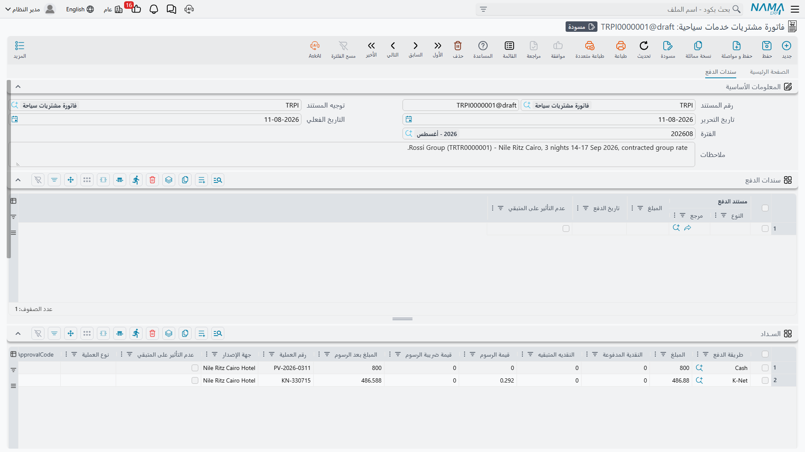
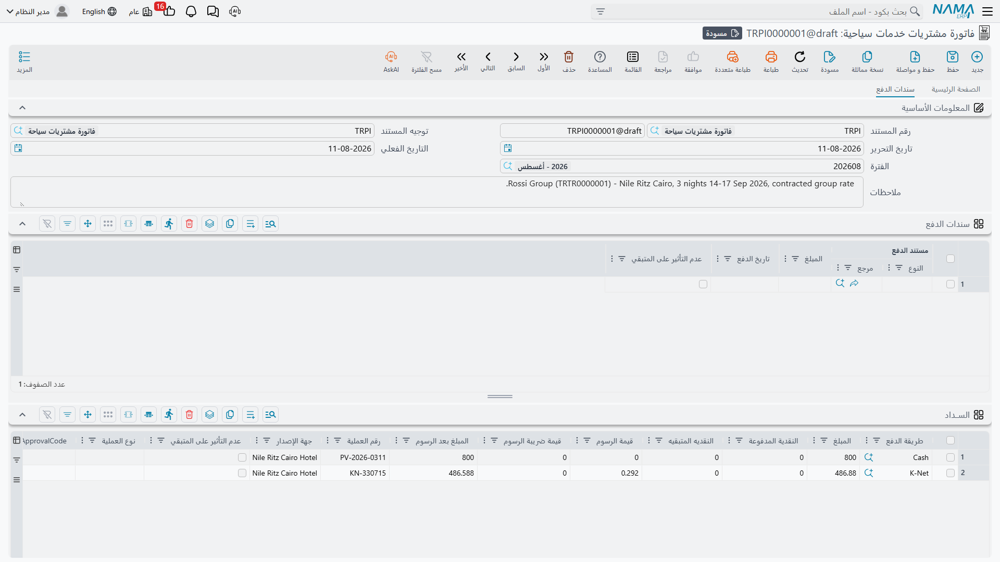

# الدفعات والأقساط وشروط التعاقد

نادراً ما تتحصّل شركة السياحة أموالها بالطريقة التي يتحصّل بها متجر التجزئة. وكيل سياحي يحجز برنامج
القاهرة – الأقصر لأربعين فرداً بقيمة 240,000، يسدد 40,000 ببطاقة على الكاونتر كعربون، ويوقّع عقداً
يقول إن الباقي يُسدد على أربعة أقساط شهرية، ثم يدفع كل قسط بحوالة بنكية بعد أسابيع — وكل حوالة تصل
في صورة سند قبض مستقل. فاتورة واحدة، وأربع حكايات مختلفة عن المال.

لهذا يحمل كل مستند مالي في وحدة السفر أربعة جداول لا علاقة لها بما يُباع، وإنما بكيفية تحصيل قيمته.
وهذه الجداول موجودة في الصفحة الثانية من المستند **سندات الدفع**، أسفل جدول التفاصيل، وهي واحدة في
المستندات الستة جميعاً — [أمر البيع وفاتورة المبيعات ومردود المبيعات](./travel-sales-cycle) و
[أمر الشراء وفاتورة المشتريات ومردود المشتريات](./travel-purchase-cycle). ولأن تكرارها في صفحتَي
الدورتين لا معنى له، شرحناها هنا مرة واحدة.

## الجداول الأربعة في نظرة واحدة

| الجدول | ماذا يسجل | من يملؤه | أين يظهر |
|---|---|---|---|
| **الســداد** (Payment Lines) | المبالغ المحصّلة في الحال، موزعة على طرق الدفع | أنت، على الكاونتر | في الفواتير والمردودات فقط |
| **سندات الدفع** (Payment Documents) | سندات القبض والصرف التي حُررت خارج المستند لسداده | النظام | في المستندات الستة |
| **الدفعات** (Payments) | خطة الأقساط — ما هو موعود به ومتى | أنت، غالباً بضغطة زر | في المستندات الستة |
| **البنود القياسية** (Standard Terms) | بنود التعاقد | أنت | في المستندات الستة |

انتبه للسطر الأول جيداً: **مستندا الأمر (أمر البيع وأمر الشراء) لا يوجد بهما جدول سداد أصلاً.** يمكن
للأمر أن يحمل خطة أقساط وبنوداً تعاقدية وسجلاً بالسندات، لكنك لا تستطيع تحصيل نقدية على أمر — هذا
عمل الفاتورة.

## جدول الســداد — المال الذي يتحرك الآن

هذا هو جدول الكاونتر. سطر لكل طريقة دفع مستعملة، فالعميل الذي يسدد 40,000 نصفها نقداً ونصفها ببطاقة
ينتج سطرين، والعميل الذي لا يدفع شيئاً اليوم لا ينتج ولا سطراً.

| العمود | فيمَ يُستعمل |
|---|---|
| **طريقة الدفع** (Payment Method) | ملف طريقة الدفع — درج النقدية، جهاز بطاقات بعينه، محفظة إلكترونية، نوع شيك. وهو العمود الإلزامي الوحيد |
| **المبلغ** (Payment Value) | ما دخل عبر هذه الطريقة |
| **النقدية المدفوعة** / **النقدية المتبقية** | ما سلّمه العميل فعلاً والباقي الذي أُعيد إليه — في سطور النقدية فقط |
| **قيمة الرسوم**، **قيمة ضريبة الرسوم**، **المبلغ بعد الرسوم** | عمولة طريقة الدفع وضريبتها وما يتبقى بعدهما |
| **رقم العملية** (Authorization Number) | رقم الموافقة من الجهاز أو من البنك |
| **جهة الإصدار** (Issuer) | مُصدر الأداة — بنك البطاقة، بنك الشيك |
| **نوع العملية** (Transaction Type) | نوع العملية التي نفّذها الجهاز |
| **عدم التأثير على المتبقي** | يسجل الدفعة دون أن تُنقص متبقي المستند |

::: info دفعات البطاقات تحمل بصمة الجهاز
حين تكون طريقة الدفع جهاز بطاقات، يحمل السطر أيضاً البيانات التي يرجعها الجهاز: نوع البطاقة ورقمها
المقنّع، ومعرّفات الجهاز والتاجر والشبكة، وأرقام العملية والبطاقة، والرقم المرجعي لنقطة البيع ورد
الجهاز الخام. ومع جهاز مربوط بالنظام تصل هذه البيانات وحدها بمجرد الموافقة على البطاقة. وهي موجودة
كي يستطيع موظف الدعم الذي يراجع عملية متنازعاً عليها بقيمة 40,000 مقابل ملف التسوية البنكي أن يصل
إلى العملية بعينها من الفاتورة وحدها.
:::

**ماذا يفعل سطر السداد؟** ينقص فوراً *إجمالي المدفوع* و*المتبقي* في المستند، وعند معالجة المستند
ينتج سطراً محاسبياً خاصاً به. والحساب الذي يُستعمل في هذا السطر يأتي أولاً من ملف **طريقة الدفع**؛
ولا يحل جانب «النقدي» في توجيه المستند محله إلا إذا كانت طريقة الدفع لا تحمل حساباً خاصاً بها.
والرسوم وضريبتها تنتجان سطورهما من طريقة الدفع كذلك. وهذا مهم عملياً: إذا ظهرت طريقة دفع جديدة في
فرع ووجدت قيودها في حساب غير متوقع، فالمكان الذي تبحث فيه هو طريقة الدفع لا التوجيه.

**وماذا لا يفعل؟** لا أثر له على خطة الأقساط أسفله. تحصيل 40,000 على الكاونتر لا يجعل أي قسط
مُسدداً، وإنما ينقص فقط المتبقي الذي يجب أن تتطابق معه خطة الأقساط.

وفي شريط الأدوات زران يوفران عليك الكتابة حين يسدد العميل كامل المبلغ: **نسخ المتبقي لأول طريقة دفع
نقدي** و**نسخ لأول سطر طريقة دفع نقدية**، وكلاهما يضع المبلغ المستحق في أول سطر نقدي.

وإذا كانت طريقة الدفع تشترط رقم عملية، فالحفظ بدونه مرفوض. كما تُعاد حسبة النقدية المدفوعة والمتبقية
عند كل حفظ، ولا يمكن اعتماد مستند بمتبقٍ سالب أو مدفوع نقداً سالب أو باقٍ سالب.

## سندات الدفع — سجل السندات الذي يحفظه النظام لك

الجدول الثاني يبدو وكأنه جدول تملؤه بنفسك، وهو ليس كذلك. **اقرأه ولا تكتب فيه.**

حين يحرر أحدهم سند قبض في وحدة الحسابات ويشير به إلى فاتورة مبيعات خدمات سياحية، فإن اعتماد السند
يضيف سطراً هنا وحده، محوّلاً قيمة السند إلى عملة الفاتورة. وإذا عُدّل السند أُعيد تقييم السطر، وإذا
أُلغي أو فُك ارتباطه اختفى السطر. وأربعة أعمدة تحكي القصة كلها: **مستند الدفع** (السند نفسه، ويمكنك
فتحه من الخلية)، و**المبلغ**، و**تاريخ الدفع**، و**عدم التأثير على المتبقي** للسند النادر الذي يجب
تسجيله على الفاتورة دون أن ينقص المستحق.

ونوع السند الذي يستجيب له كل مستند يتبع اتجاه المال:

| المستند | يُسدَّد بـ |
|---|---|
| أمر بيع خدمات سياحية، فاتورة مبيعات خدمات سياحية، مردود مشتريات خدمات سياحية | سندات **القبض** — مال داخل |
| أمر شراء خدمات سياحية، فاتورة مشتريات خدمات سياحية، مردود مبيعات خدمات سياحية | سندات **الصرف** — مال خارج |

وإذا كان لدى الطرف سندات مفتوحة لم تُطابَق بعد بشيء، فإن زرَّي شريط الأدوات **تجميع سندات القبض**
و**تجميع سندات الصرف** يجلبانها إلى هذا الجدول بدل أن تفتح سنداً سنداً.

وهذه السطور، مثل سطور السداد، تنقص *إجمالي المدفوع* و*المتبقي*. لكنها — بخلافها — يمكن أن تحمل
تأثيراً محاسبياً خاصاً: ففي توجيه المستند جدول **تأثير سندات الدفع** تقول فيه: «سند من هذا النوع
تنطبق عليه هذه المعايير يُرحَّل إلى هذين الحسابين» — انظر [توجيهات المستندات](./travel-document-terms).

وإذا أردت الصورة الكاملة لكيفية تحرير السندات ومطابقتها من الأساس، فصفحة
[سندات القبض والصرف](/ar/modules/accounting/receipts-and-payments) في وحدة الحسابات تغطي هذا الجانب.

## الدفعات — خطة الأقساط

الجدول الثالث هو جدول السداد المجدول: الوعد. عميلنا الذي دفع 40,000 عربوناً يبقى عليه 200,000، والعقد
يقول أربعة أقساط شهرية قيمة كل منها 50,000 تبدأ أول الشهر القادم. هذه السطور الأربعة هي ما يحمله هذا
الجدول.

ونادراً ما تكتبها بيدك. فوق الجدول يقع حقل **نموذج الدفع**، وفيه تختار
[نموذج جدول دفع](/ar/modules/invoicing/payment-schedules-user-guide) — نمطاً جاهزاً للاستعمال مثل
«عربون الآن والباقي على أربعة أشهر». ثم يبني زر **إنشاء الدفعات** في الصفحة الأولى من المستند
السطور: يسألك عن الدفعة المقدمة، وعدد الأقساط، والمدة بينها، وفترة السماح قبل أول قسط، ويوم الشهر
الذي تستحق فيه الدفعات، وقيم القسط الأول والثاني والأخير إن كانت مختلفة، وطريقة التقريب. ثم يوزّع
**المتبقي** على السطور التي أنشأها، ويكتب الدفعة المقدمة في **المدفوع نقداً** في رأس المستند.

وكل سطر يحمل:

| العمود | من يملؤه |
|---|---|
| **كود القسط** | أنت أو المولّد — إلزامي، والأكواد يجب ألا تتكرر في المستند. والكود الناقص يُملأ تلقائياً عند الحفظ |
| **اختيار**، **وصف القسط**، **ملاحظات** | أنت |
| **نسبة الدفعة** و**المبلغ** | المولّد، أو أنت |
| **تاريخ الدفع** | المولّد، أو أنت — إلزامي |
| **القيمة المدفوعة**، **المحصل نظامياً**، **المتبقي**، **مُسددة** | النظام، كلما سددت السندات القسط |

::: warning جدول الأقساط خطة لا سداداً
إنشاء سطور الأقساط لا يحصّل شيئاً ولا يرحّل شيئاً. الجدول لا ينتج قيداً خاصاً به — لا يقسّم مديونية،
ولا يؤجل إيراداً، ولا يجدول حدثاً في تاريخ. إنما هو وعد مكتوب ومجموعة أهداف يمكن لسندات الدفع أن
تُطابَق عليها لاحقاً، وهذه المطابقة هي ما يملأ أعمدة القيمة المدفوعة والمحصل نظامياً والمتبقي
والمُسددة.
:::

ولأن الخطة والمال يجب أن يتفقا، لن يُعتمد المستند ما لم تتطابق الخطة مع متبقي المستند مضافاً إليه ما
غطّته السندات بالفعل. فإذا عدّلت سعراً بعد إنشاء الجدول، فأعد تشغيل **إنشاء الدفعات** — وإلا افترق
الرقمان ورُفض الحفظ.

وخيار واحد في التوجيه يغيّر سلوك الخطة بمجرد أن تبدأ السندات في الوصول: **دفع الأقساط بالترتيب**
يفرض سداد الأقساط من الأقدم فالأحدث، فلا يستطيع العميل سداد القسط الرابع والثاني ما زال مفتوحاً.

## البنود القياسية — بنود التعاقد

الجدول الأخير لا علاقة له بالمال أصلاً. إنه تفاصيل العقد الدقيقة: مهلة الإلغاء، والموعد النهائي
لمستندات التأشيرات، وموعد إقفال قائمة الغرف، وغرامة تغيير الأسماء متأخراً. وكل سطر يشير إلى ملف
**بند قياسي** يحمل الصياغة نفسها، فيمكن ربط البند الواحد بمئات العقود وطباعته فيها جميعاً بصيغة واحدة.

| العمود | فيمَ يُستعمل |
|---|---|
| **البند القياسي** | البند المرتبط بالمستند |
| **تاريخ نهاية عمل البند المخططة** | التاريخ الذي يجب أن يتحقق البند قبله |
| **تاريخ نهاية عمل البند بعد التمديد** | التاريخ المعدل بعد منح تمديد — يملؤه النظام |
| **تاريخ التحقق** | متى تحقق البند فعلاً — يملؤه النظام |
| **مجموع غرامات التمديد** | الغرامات المتراكمة نتيجة التمديد — يملؤه النظام |
| **ملاحظات** | ما يخص هذا العقد بعينه |

وملف البند القياسي هو الذي يقرر: هل هذا بند يلزم إثبات تحققه أصلاً، وهل يجوز تمديده، وكم تبلغ فترة
عمله الابتدائية. وحين يكون البند مما يلزم إثبات تحققه، فإثباته عمل منفصل: يُحرَّر مستند **تحقق بند
قياسي** على البند، فيكتب النظام تاريخ التحقق ومرجع المستند في السطر. والآلية العامة موصوفة في
[الشروط والأحكام القياسية](/ar/modules/invoicing/standard-terms-feature-documentation).

وهذه السطور تسجيل تعاقدي فحسب — **لا ترحّل شيئاً**. فالبند المخالَف لا ينشئ قيد غرامة بنفسه؛ والغرامة
إن وُجدت مستند مستقل.

## كيف تلتقي الجداول الأربعة برأس المستند

كل ذلك ينتهي إلى ثلاثة أرقام في رأس المستند. **المدفوع نقداً** هو ما يسجله الرأس نفسه على أنه مسدد،
و**إجمالي المدفوع** يضيف إليه سطور السداد وسطور السندات، و**المتبقي** هو الصافي مطروحاً منه كل ما
احتُسب. أما السطور المؤشر عليها بـ *عدم التأثير على المتبقي* في أي من جدولَي الدفع فتُستبعد من هذا
الطرح عمداً — تُسجَّل لأثر المراجعة دون أن تغيّر المستحق.

وجدول الأقساط خارج هذه الحسبة تماماً. عليه أن *يتطابق* مع المتبقي، لكنه لا يغيّره أبداً.

وللعودة إلى الدورتين اللتين تنتمي إليهما هذه المستندات: [البيع للعميل](./travel-sales-cycle) و
[الشراء من الموردين](./travel-purchase-cycle). ولمعرفة الحسابات التي تنتهي إليها هذه الجداول، انظر
[توجيهات المستندات](./travel-document-terms).
