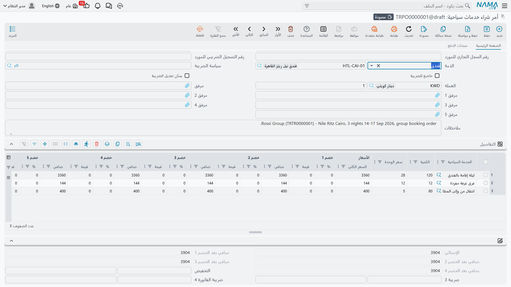
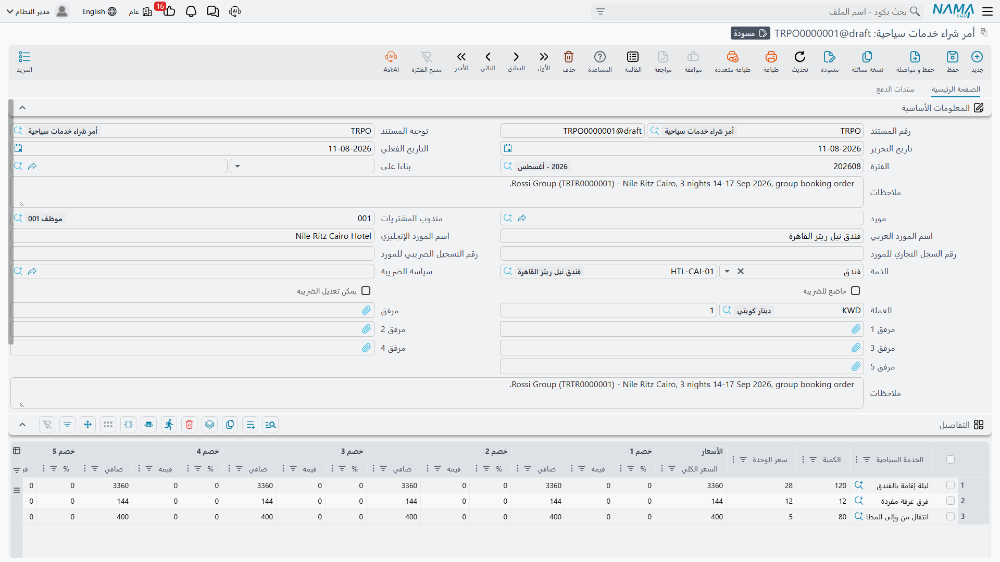
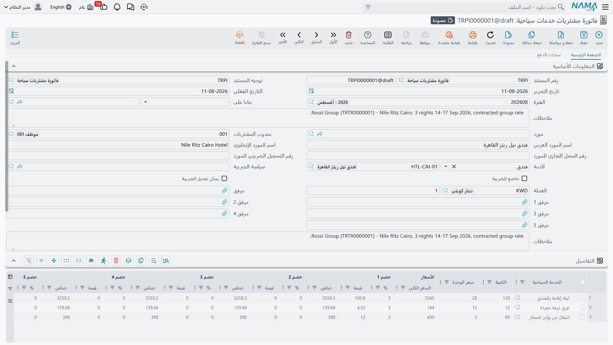
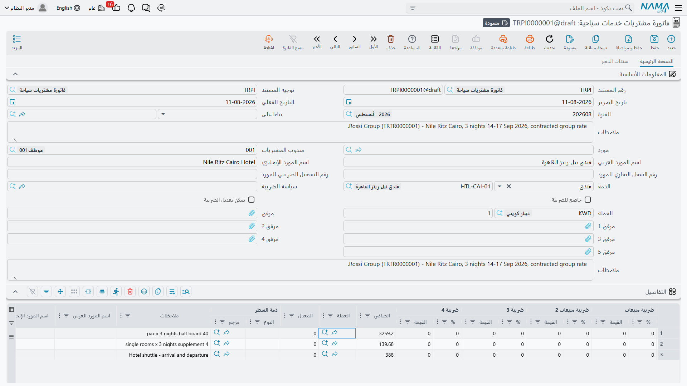

# الشراء من الموردين

الرحلة السياحية تكلّف نقوداً قبل أن تدرّ أي إيراد. مجموعة من 40 فرداً تصل إلى القاهرة لخمس ليالٍ
تحتاج إلى 200 ليلة فندقية، و40 مقعد طيران ذهاباً وإياباً، وخمسة أيام عمل لمرشد سياحي، واثنتي عشرة
وجبة في مطعم، وحافلة لكل تنقّل. لا بد لأحد أن يشتري كل ذلك، وأن يتفق على سعره، وأن ينتهي به الأمر
مديناً بالمبلغ الصحيح للجهة الصحيحة.

هذا هو دور الجانب الشرائي في وحدة السفر والرحلات. تغطّيه ثلاثة مستندات، جميعها ضمن
**السفر والرحلات ← المستندات**:

- **أمر شراء خدمات سياحية** — ما التزمت بشرائه.
- **فاتورة مشتريات خدمات سياحية** — ما صدرت به فاتورة عليك وأصبحت مديناً به.
- **مردود مشتريات خدمات سياحية** — خدمة أُعيدت أو تكلفة محجوزة أُلغيت.

## الفكرة التي يجب استيعابها أولاً

كل ما تشتريه في هذه الوحدة هو **خدمة سياحية**. لا يوجد في سطر الشراء حقل للفندق، ولا حقل للطيران،
ولا حقل لليلة الفندقية، ولا ارتباط بالقسائم. في سطر الشراء مرجع واحد فقط يجيب عن سؤال «ماذا أشتري؟»
وهو ملف **الخدمة السياحية**.

فكيف يعرف النظام إذن أنك اشتريت ليالي من فندق النيل تحديداً لا من غيره؟ من **الجهة** المسجّلة على
السطر. فالفنادق والمطاعم والمرشدون السياحيون في نما ليسوا موردين — بل هم **بديل** عن الموردين. لكل
منهم ملفه الرئيسي الذي يحمل حساباته الخاصة، ويُستخدم كل منهم مباشرةً بوصفه الذمة على مستند الشراء،
في الموضع نفسه الذي يجلس فيه المورد عادةً. أما الطيران والخدمات العامة، حيث يكون الطرف المقابل شركة
سياحة بالجملة أو شركة نقل فعلاً، فتُستخدم فيها بطاقة مورد عادية. وفكرة الذمة مشروحة بالكامل في صفحة
[الملفات الرئيسية](./travel-master-files).

اجمع الأمرين معاً فتتحول كل تكلفة تخطر ببالك إلى سطر واحد:

| ما اشتريته فعلياً | الخدمة السياحية | الكمية | الذمة |
|---|---|---|---|
| 200 ليلة فندقية في فندق النيل | إقامة فندقية | 200 | فندق النيل |
| 40 مقعداً ذهاباً وإياباً، القاهرة–الأقصر | طيران داخلي | 40 | سكاي ترافل (مورد) |
| 5 أيام عمل مرشد | إرشاد سياحي | 5 | أحمد فؤاد (مرشد سياحي) |
| 12 وجبة غداء في مطعم النيل | غداء مجموعات | 12 | مطعم النيل |
| 6 تنقلات من المطار وإليه | تنقل مطار | 6 | كايرو كوتشز (مورد) |

اقرأ السطر كأنه جملة: *الخدمة السياحية = إقامة، الكمية 200، الذمة = فندق النيل*. هذا هو النموذج
بأكمله.

ويترتب على ذلك أمران يستحق معرفتهما مبكراً. الأول أن **سياسة الضريبة للسطر تأتي من الخدمة السياحية**
التي اخترتها، لا من الذمة ولا من رأس المستند — فالخدمة المعفاة تبقى معفاة أياً كانت الجهة التي
اشتريت منها. والثاني أنه حين يأخذ توجيه المستند حساب التكلفة «من الصنف»، فإن الصنف المقصود **هو**
الخدمة السياحية، ومن ثم فإن الحسابات المسجّلة على ملف الخدمة السياحية هي التي تحدّد حساب المصروف الذي
سيقع فيه الشراء. إعداد خدماتك السياحية بعناية هو ما يجعل القيود المحاسبية تخرج صحيحة.

::: info لا شيء هنا يمسّ المخازن
دورة الشراء السياحي لا تنشئ **أي حركة مخزنية على الإطلاق**. لا يوجد إذن استلام، ولا رصيد مخزني، ولا
مخزن ولا موقع على السطر، ولا تكلفة صنف ولا تقييم. الخدمة السياحية ليست صنفاً على رف — فشراء 200 ليلة
فندقية يُنشئ تكلفة والتزاماً، وهذا كل ما يفعله. وإن كنت معتاداً على دورة الشراء في سلاسل الإمداد فهذا
هو أكبر فارق: هنا الفاتورة هي كل شيء، لأنه لا يوجد ما يُستلم.
:::

## أمر شراء خدمات سياحية (Travel Service Purchase Order)

الأمر هو المكان الذي يُسجَّل فيه الالتزام: حجزت 200 ليلة فندقية لدى فندق النيل لمجموعة مارس بسعر
متفق عليه، وتريد توثيق ذلك قبل أن تصل الفاتورة.

يحمل رأس المستند هوية المستند المعتادة — دفتر المستند والكود، و**توجيه المستند**، وتاريخ التحرير
والتاريخ الفعلي والفترة المالية — إضافة إلى الجانب الشرائي: **المورد**، و**مندوب المشتريات**، واسم
المورد بالعربية والإنجليزية ورقم سجله التجاري ورقم تسجيله الضريبي، وكلها تُملأ تلقائياً بمجرد اختيار
المورد. وإلى جانبها تقع **الذمة**، وهي الجهة المحاسبية للمستند كله؛ وهنا يوضع الفندق أو المطعم أو
المرشد السياحي حين لا يكون الطرف المقابل مورداً أصلاً. ويربط حقل **بناءاً على** الأمر بالمستند الذي
جاء منه. أما معالجة الضريبة فتضبطها حقول **سياسة الضريبة** و**خاضع للضريبة** و**يمكن تعديل الضريبة**،
وتُعبَّر النقود بـ**العملة** و**المعدل** في الرأس، وهناك خمس خانات للمرفقات وحقل للملاحظات.

وأسفل الرأس تقع كتلة النقود التي تجمع المستند: الإجمالي، والصافي بعد كل مستوى من مستويات الخصم
الأربعة، والتخفيض كنسبة أو كقيمة، وضريبتا الفاتورة 3 و4، والصافي، والمدفوع نقداً، وإجمالي المدفوع،
والمتبقي. وتفصل مجموعة **الإجماليات** إجماليات الخصومات الأربعة وإجماليات الضرائب الأربع كلاً على
حدة، بينما تحمل مجموعة **المحددات** الشركة والمجموعة التحليلية والفرع والقطاع والإدارة.

وجدول **التفاصيل** هو الأمر نفسه. كل صف فيه عملية شراء واحدة: **الخدمة السياحية**، و**الكمية**
(مطلوبة)، وسعر الوحدة والسعر الكلي، وحتى ثمانية مستويات خصم، وأربع ضرائب، والصافي، و**ذمة السطر** —
وهي جهة هذا الصف تحديداً، ويمكن أن تكون فندقاً أو مطعماً أو مرشداً سياحياً أو مورداً أو عميلاً أو
موظفاً أو حساباً بنكياً — وحقل ملاحظات. أما اسم المورد وأرقام تسجيله على مستوى السطر فتنزل من الرأس
تلقائياً.

### طريقتان لإنشاء الأمر

**يدوياً.** افتح السفر والرحلات ← المستندات ← أمر شراء خدمات سياحية، واختر المورد أو الذمة، ثم اكتب
السطور. هذا ما تفعله لتأجير حافلة لمرة واحدة أو لحجز مقاعد طيران لم يخطَّط له على أي رحلة.

**مولَّداً من رحلة سياحية.** في الرحلة المحفوظة تحمل قائمة **المزيد** زر **إنشاء أوامر الشراء**
(Create Tourism Service Purchase Orders). وهذا هو الجسر الوحيد بين النصف التشغيلي للوحدة — الذي يسجّل
من وأين ومتى وكم فرداً، ولا يحمل أي نقود — وبين النصف المالي. يمرّ الزر على الرحلة خمس مرات: مرة على
سطور الإقامة مجمّعةً حسب الفندق، ومرة على سطور الطيران مجمّعةً حسب المورد، وثلاث مرات على سطور
الخدمات، مجمّعةً حسب المورد ثم حسب المرشد السياحي ثم حسب المطعم. وينتج عن كل مرور **أمر شراء واحد لكل
جهة**، باستخدام دفتر المستند والتوجيه المخصّصين لذلك المرور على توجيه الرحلة نفسها. والمرور الذي لم
يُضبط له دفتر ولا توجيه يُتخطّى ببساطة، وبهذا تختار أي عائلات التكلفة تريد أن يولّدها الزر أصلاً.

والأوامر التي ينتجها الزر **هياكل** عن قصد: سطر واحد مقابل كل سطر في الرحلة، بكمية 1، والخدمة السياحية
الصحيحة، والجهة الصحيحة — و**بلا أي سعر**. فلا شيء في الوحدة يعرف كم يتقاضى الفندق، وتسعير الأوامر
مهمتك أنت. افتح كل أمر مولَّد وأدخل الكميات والأسعار الحقيقية: 200 ليلة بسعر 45 لليلة، وخمسة أيام
إرشاد بسعر 300 لليوم. وتشغيل الزر مرة أخرى يحدّث الأوامر في مكانها وفق الحالة الراهنة للرحلة ويزيل
الأوامر المولَّدة التي لم يعد يقابلها شيء عليها، لذا اجعل التسعير بعد أن يستقر برنامج الرحلة. وتجد
السلوك الكامل للزر، وأي سطور الرحلة تغذّي أي مرور، في صفحة [الرحلات السياحية](./tours).

::: warning الأمر مستند مالي كامل
بخلاف المستندات التشغيلية، يأخذ أمر الشراء **توجيه مستند**، وتُعالَج آثاره كأي مستند مالي آخر. فأي
جانبين مدين ودائن يحملهما ذلك التوجيه سيُقيَّدان عند حفظ الأمر. قرّر بوعي ما تريد أن يفعله الأمر —
كثير من التطبيقات تريد ألا يقيّد الأمر شيئاً وأن تُترك المحاسبة كلها للفاتورة، ويتحقق ذلك ببساطة بترك
جوانب الحسابات في التوجيه فارغة. راجع [توجيهات المستندات](./travel-document-terms).
:::

## فاتورة مشتريات خدمات سياحية (Travel Service Purchase Invoice)

الفاتورة هي المستند الذي يجعلك مديناً فعلاً. رأسها هو رأس الأمر نفسه — الدفتر والكود، والتوجيه،
والتواريخ، والمورد ومندوب المشتريات، والذمة، وإعدادات الضريبة، والعملة، والمحددات، وكتلة النقود —
وتُبنى عادةً من أمر شراء عن طريق حقل **بناءاً على**.

وجدول **التفاصيل** هو جدول الأمر مضافاً إليه عمودان: فكل سطر في الفاتورة يحمل **العملة** و**المعدل**
الخاصين به، فيمكن للمستند الواحد أن يجمع بين إقامة فندقية بالعملة المحلية وحجز طيران بالدولار. وما
عدا ذلك يُقرأ كما هو: الخدمة السياحية، والكمية، وسعر الوحدة، والسعر الكلي، وثمانية مستويات خصم، وأربع
ضرائب، والصافي، وذمة السطر، والملاحظات.

وإلى جانب التفاصيل تحمل الفاتورة ثلاثة جداول أخرى — سطور السداد، وجدول الأقساط، وسندات الدفع
الخارجية — إضافة إلى جدول البنود القياسية. وهي معرَّفة بإيجاز أدناه وموثّقة بالكامل في صفحة
[الدفعات والأقساط وشروط التعاقد](./travel-payments-and-terms).

### ماذا يحدث عند الحفظ

الحفظ فوري. فالآثار المالية للمستند تُنشأ بوصفها **طلب أعمال** يُعالَج في الخلفية، فلا تنتظر انتهاء
القيود المحاسبية لتبدأ كتابة الفاتورة التالية. وإذا فشل الطلب — لفترة مقفلة أو حساب ناقص — ظهر بحالة
معالجة فاشلة وأمكن إعادة محاولته من شاشة **طلبات الأعمال**؛ لا شيء يضيع ولا شيء يحتاج إعادة إدخال.

وما تنتجه تلك المعالجة محكوم بالكامل بتوجيه المستند، ويُبنى على طبقات:

1. **الضرائب** أولاً — تذهب كل من ضرائب السطر الأربع وضريبتي الرأس إلى الجانب الحسابي المضبوط لها على
   التوجيه. وفي الشراء تقع الضريبة على الجانب المدين، وهكذا تُلتقط ضريبة المدخلات القابلة للاسترداد.
2. **الخصومات** بعدها — لتخفيض الفاتورة، ولكل مستوى من مستويات الخصم الثمانية على السطر، ولخصم
   التقريب، جانبه الخاص، وهي في الشراء تقع على الجانب الدائن.
3. **جانب التكلفة** — قيد واحد مقابل كل صف من صفوف التفاصيل، على الجانب المدين في التوجيه، بقيمة
   **السعر الكلي للسطر قبل الخصومات والضرائب**. هذه هي تكلفة الخدمة، وهنا تدخل حسابات الخدمة السياحية
   نفسها في الحسبان حين يأخذ التوجيه حسابه من الصنف.
4. **جانب الذمة** — قيد واحد مقابل كل صف من صفوف التفاصيل، على الجانب الدائن في التوجيه، بقيمة ما
   **لا يزال مستحقاً**: الصافي مطروحاً منه المدفوع نقداً، وما سُدِّد عبر طرق الدفع، وما وُسم صراحةً
   بعدم التأثير على المتبقي. وهذا هو الرصيد الذي يستقر على حساب الفندق أو المطعم أو المرشد أو المورد.
5. **ما سُدِّد في الحال** — يذهب المبلغ المدفوع نقداً إلى الجانب النقدي في التوجيه، وينتج كل صف في
   جدول السداد زوج قيوده الخاص باستخدام حسابات طريقة الدفع نفسها، مع قيود منفصلة أيضاً لرسوم الطريقة
   ولضريبة تلك الرسوم. كما يمكن لسندات الدفع المكتوبة خارج الفاتورة أن تحمل قيودها الخاصة، وتُضبط لكل
   نوع مستند على حدة في التوجيه.

ولأن كل جانب من هذه الجوانب إعداد في التوجيه، فالقاعدة العملية بسيطة: **الفاتورة تقيّد بالضبط ما
يأمرها به توجيهها، ولا شيء غير ذلك**. والتوجيه الذي لم يُضبط له مدين ودائن لا ينتج أي قيود إطلاقاً.
وإن احتجت إلى إعادة بناء القيود بعد تعديل توجيه، فإن إجراء **إعادة توليد الآثار المحاسبية** في شريط
أدوات المستند يفعل ذلك تماماً.

وهناك بعض الفحوص التي تسبق اعتماد المستند. فجدول **التفاصيل** لا يجوز أن يكون فارغاً. وأسعار الوحدات
وقيم الخصومات لا يجوز أن تكون سالبة، وكذلك المتبقي والمدفوع نقداً والنقدية المتبقية. وطريقة الدفع
التي تشترط رقم عملية ستطالبك به. وإن كنت تستخدم خطة أقساط، فسيُطابَق الجدول مع المبلغ الذي لا يزال
مستحقاً وتُفحص أكواد الأقساط.

وشاشة قائمة الفواتير مصمَّمة لمتابعة النقود: تُرشَّح بالمورد ومندوب المشتريات والذمة، وتعرض الصافي
والمدفوع نقداً وإجمالي المدفوع والمتبقي جنباً إلى جنب، فتخبرك نظرة واحدة أي الجهات لا تزال دائنة لك.

## مردود مشتريات خدمات سياحية (Travel Service Purchase Return)

أحياناً تزول تكلفة كانت محجوزة. تقلّصت المجموعة من 40 إلى 32 فأُفرِجت عن ثماني ليالٍ فندقية؛ أو لم
تحضر الحافلة؛ أو أُلغي يوم عمل المرشد ورُدّت قيمته. **مردود مشتريات خدمات سياحية** هو ما يسجّل ذلك.

وهو صورة الفاتورة في المرآة، حقلاً بحقل: الرأس نفسه، وجدول التفاصيل نفسه بالخدمة السياحية والكمية
والعملة والمعدل على السطر والخصومات والضرائب وذمة السطر، وجداول السداد والأقساط وسندات الدفع الخارجية
والبنود القياسية نفسها، والمعالجة نفسها المحكومة بالتوجيه عند الحفظ.

والذي ينقلب هو الاتجاه. ففي المردود يتبادل الجانبان الرئيسيان موقعيهما: **تُجعل الذمة مدينة** — إذ
أصبحت مديناً للفندق بأقل — و**يُجعل جانب التكلفة دائناً**، فتُعكس المصروف. وتنقلب الضرائب والخصومات
معهما. وتتحرك النقود في الاتجاه المعاكس كذلك: فبينما تتفاعل فاتورة المشتريات مع سندات **الصرف**
المكتوبة عليها، يتفاعل مردود المشتريات مع سندات **القبض**، لأن النقود في المردود عائدة إليك.

ابنِ المردود من الفاتورة التي يعكسها عبر حقل **بناءاً على**، ثم احذف السطور التي تحتفظ بها وخفّض
الكميات في الباقي.

## الجداول الأخرى، سطر واحد لكل منها

جدول **الســداد** في الفاتورة أو المردود يسجّل النقود المسدَّدة لحظة كتابة المستند، موزَّعة حسب طريقة
الدفع — نقدية، بطاقة، محفظة، شيك — ويحمل كل صف مبلغه ورسومه وضريبة رسومه ورقم العملية وجهة الإصدار
وبيانات البطاقة.

وجدول **الدفعات** هو خطة الأقساط: ما وعدت بدفعه، على كم قسط، وفي أي تواريخ، مع تتبّع المدفوع والمتبقي
تلقائياً كلما سدّدتها السندات. وإجراء **إنشاء الدفعات** يملؤه انطلاقاً من عدد أقساط وفترة ودفعة مقدمة
بدلاً من أن تكتب كل صف بيدك.

وجدول **سندات الدفع** يعرض سندات الصرف والقبض المكتوبة **خارج** هذا المستند والتي تسدّده. ولا تكتب
أنت هذه الصفوف — بل يتولاها النظام كلما أشار سند إلى المستند، محوّلاً قيمة السند إلى عملة المستند —
كما يسحب إجراء **تجميع سندات الصرف** السندات القائمة للجهة خلال مدى تاريخي إلى الجدول.

وجدول **البنود القياسية** يربط بنود التعاقد بالصفقة: كل صف بند قياسي له تاريخ نهاية مخطط، ويتتبّع
النظام تاريخ تحققه وغرامات التمديد إن وُجدت.

والأربعة موثّقة كما ينبغي في صفحة
[الدفعات والأقساط وشروط التعاقد](./travel-payments-and-terms)، ومعها إجراءات **إنشاء سند صرف** التي
تحوّل رصيداً مستحقاً، أو مجموعة أقساط مختارة، إلى سند صرف مباشرةً.

## كيف يُبنى مستند على مستند سابق

لا يوجد في هذه الوحدة معالج «تحويل إلى فاتورة»، ولا حاجة إليه. فكل مستند مالي في السفر والرحلات يحمل
حقل **بناءاً على**، وتوجيه المستند الجديد إلى مستند قائم هو الطريقة التي يُنقل بها العمل إلى الأمام.

أنشئ المستند الجديد، واختر المصدر في حقل **بناءاً على**، فينسخ النظام الذمة، وكتلة النقود كاملة، وكل
سطر من سطور التفاصيل — الخدمة السياحية والكمية وذمة السطر والأسعار والملاحظات — إلى المستند الذي
تكتبه. ومن هناك تعدّل: تصحّح الكميات لتطابق ما سُلِّم فعلاً، وتسعّر ما تركه الأمر فارغاً، وتستكمل
المورد وعملة السطر التي يحتاجها المستند الجديد، وتحذف السطور غير المعنية.

هكذا يصير الأمر فاتورة، وتصير الفاتورة مردوداً. وتبقى السلسلة مسجَّلة في حقل «بناءاً على» في كل
مستند، فيمكنك من أي فاتورة أن ترجع إلى الأمر الذي جاءت منه، ومن أي أمر مولَّد أن ترجع إلى الرحلة
السياحية التي أنتجته.
