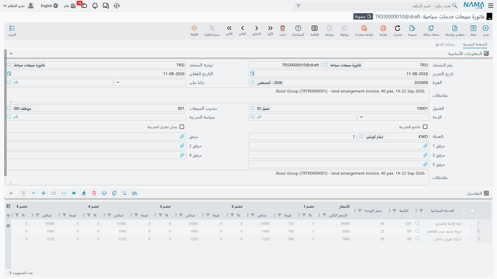
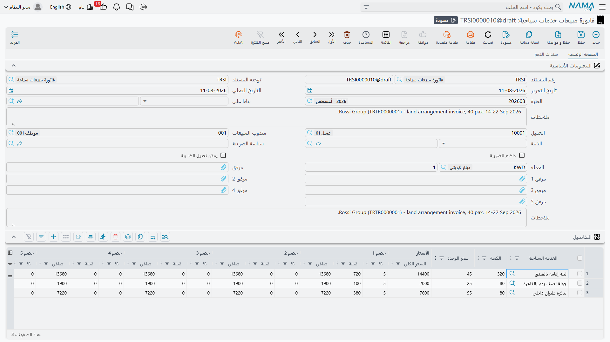
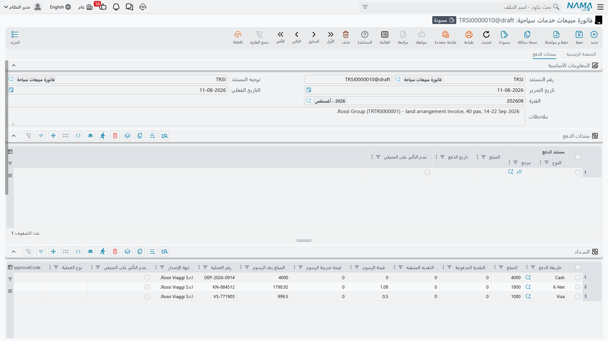

# البيع للعميل

شركة السياحة تبيع ليالي فندقية ومقاعد طيران وانتقالات وتذاكر دخول وساعات إرشاد. لا شيء من هذا
موضوع على رف، ولا شيء منه له مخزن، ولا يمكن جرده في نهاية الشهر. ومع ذلك فلكل بند منه سعر وخصم
وضريبة وعميل لا بد أن تُصدر له فاتورة وأن تُتابَع منه النقود — وهذا بالضبط ما تفعله الفاتورة.

هذا التوتر هو سبب امتلاك وحدة السفر والرحلات مستنداتِ بيعٍ خاصة بها بدل استخدام فاتورة المبيعات
العادية، وهو أول ما ينبغي فهمه قبل فتح أيٍّ منها.

## لماذا لوحدة السفر فاتورة مبيعات خاصة بها

افتح فاتورة مبيعات عادية في نما، وسيطلب منك السطر صنفًا ومخزنًا ووحدة قياس وكمية، لأن هذا السطر
لا بد أن يُخرج بضاعة من مخزن وأن يحمل تكلفة الصنف معه. أما سطر السفر فليس عنده شيء من ذلك ليعطيه.

السطر في **فاتورة مبيعات خدمات سياحية** يذكر **خدمة سياحية** — «جولة يوم كامل في الأقصر»،
«انتقال من المطار بسيارة خاصة»، «٥ ليالٍ نصف إقامة في غرفة مزدوجة» — وهذا كل ما فيه. لا مخزن
يُصرف منه، ولا وحدة قياس، ولا رصيد كمية يقل، ولا تكلفة صنف تُحمَّل. لا يتحرك شيء في المخازن
إطلاقًا عند اعتماد فاتورة مبيعات خدمات سياحية.

::: info كل ما عدا ذلك هو المحرك المعتاد
النقود ومستويات الخصم والضرائب وطرق الدفع وخطط الأقساط والبنود التعاقدية والمحددات ودفاتر
المستندات والفوترة الإلكترونية كلها تأتي من نفس الآلية المشتركة التي يستخدمها باقي نما. فإن كنت
تعرف فاتورة مبيعات سلاسل الإمداد فستشعر بالألفة مع هذه الشاشة فور فتحها — جدول التفاصيل وحده هو
ما يبدو مختلفًا، وهو مختلف لسبب واحد فقط: إنه يبيع خدمة لا شيئًا ماديًا.
:::

المستندات الثلاثة تقع تحت **السفر والرحلات > المستندات**:

- **أمر بيع خدمات سياحية** — الحجز الذي وافق عليه العميل.
- **فاتورة مبيعات خدمات سياحية** — المطالبة المالية، وهي المستند الذي يُحصِّل النقود.
- **مردود مبيعات خدمات سياحية** — الإرجاع، ويُحرَّر مقابل فاتورة واحدة بعينها.

## أمر بيع خدمات سياحية (Travel Service Sales Order)

الأمر هو المكان الذي تسجل فيه ما التزم به العميل قبل إصدار الفاتورة: الخدمات المتفق عليها،
والأسعار المتفق عليها، والخصم الذي جرى التفاوض عليه، وخطة الأقساط الموعودة، والبنود التعاقدية التي
ستُطبع في العقد.

رأس المستند مختصر: **رقم المستند** (الدفتر والكود)، و**توجيه المستند**، و**تاريخ التحرير**،
و**التاريخ الفعلي**، و**الفترة**، و**العميل**، و**مندوب المبيعات**، و**العملة** مع **المعدل**
(وتأتي افتراضيًا بعملة العمل ومعدل ١). وتحتها تجد **المحددات** المعتادة — الشركة والمجموعة
التحليلية والفرع والقطاع والإدارة — وستة حقول مرفقات لاستمارة الحجز الموقعة وصور جوازات السفر وأي
شيء آخر يستحق أن يُحفظ مع الملف.

جدول **التفاصيل** هو نفسه الموصوف تحت الفاتورة أدناه، ناقصًا عمودَي العملة على مستوى السطر: سطر
أمر البيع يُسعَّر بعملة المستند نفسها. كما أن الأمر ليس فيه جدول طرق الدفع — فالنقود المحصلة على
الكاونتر مكانها الفاتورة — لكنه يحمل جدول الأقساط وجدول البنود القياسية، فيمكن الاتفاق على خطة
السداد وعلى بنود العقد وقت الأمر ثم نقلها إلى الفاتورة.

::: warning الأمر يأخذ توجيه مستند، وهذا التوجيه توجيه مالي
هذه هي النقطة التي تفوت الكثيرين. أمر بيع الخدمات السياحية ليس مذكرة داخلية — فهو يحمل
**توجيه مستند** تمامًا كالفاتورة، وعند اعتماده تُنشأ آثاره وتُعالَج بنفس الطريقة التي تُعالَج بها
آثار الفاتورة. فإن كان ذلك التوجيه يحمل جوانب حسابات مدينة ودائنة، فسيؤثر الأمر على الأستاذ العام.

لذلك اضبط توجيه الأمر بقصد وعمد. أعطِ الأمر **توجيهًا خاصًا به** بدل توجيهه إلى توجيه الفاتورة،
واترك جوانب الحسابات في ذلك التوجيه فارغة إن أردت أن يظل الأمر مستندًا تجاريًا بحتًا وأن تنفرد
الفاتورة بإثبات الإيراد. راجع [توجيهات المستندات](./travel-document-terms) لمعرفة كيفية ضبط
الجوانب.
:::

وحين تستعد للفوترة، افتح **فاتورة مبيعات خدمات سياحية** جديدة واختر الأمر في حقل **بناءا على**.
ينسخ النظام نموذج الدفع وكتلة المبالغ من الرأس، وينسخ سطرًا بسطر الخدمة السياحية والكمية والأسعار
والخصومات — فتُفوتِر ما حُجز دون إعادة إدخاله.

## فاتورة مبيعات خدمات سياحية (Travel Service Sales Invoice)

هذا هو المستند الرئيسي في جانب البيع: يُسعِّر الخدمات، ويحسب الخصومات والضرائب، ويستلم ما يدفعه
العميل على الكاونتر، ويتابع ما بقي في ذمته، ويُثبت المديونية عليه.

### رأس المستند

إلى جانب رقم المستند وتوجيه المستند وتاريخ التحرير والتاريخ الفعلي والفترة، يطلب الرأس:

- **العميل** — الجهة التي تُصدَر لها الفاتورة، وهي التي تُجعل مدينة.
- **مندوب المبيعات** — الموظف المنسوبة إليه عملية البيع.
- **بناءا على** — الأمر (أو أي مستند آخر) الذي بُنيت عليه الفاتورة.
- **العملة** و**المعدل** — العملة التي تُسعَّر بها الفاتورة وتُعالَج آثارها بها.
- **ملاحظات** وحقول المرفقات الستة.
- مجموعة **المحددات**: الشركة، المجموعة التحليلية، الفرع، القطاع، الإدارة.

أما الإعداد الضريبي للمستند — أي سياسة ضريبة تنطبق، وهل المستند خاضع للضريبة أصلًا — فيأتي من
**توجيه المستند**، ومن ثم فتغيير التوجيه تغيير للمعاملة الضريبية. وهذا، مع جوانب الحسابات التي
يحملها التوجيه، هو ما يجعل اختيار التوجيه الصحيح أخطر قرار في رأس المستند.

### جدول التفاصيل — ما الذي يُباع

كل سطر يجيب عن سؤال واحد: *أي خدمة، بأي كمية، بأي سعر، ناقص ماذا، زائد أي ضريبة*.

| العمود | ما يوضع فيه |
|---|---|
| **الخدمة السياحية** (Tour Service) | ملف الخدمة السياحية التي تُباع. |
| **الكمية** (Quantity) | كم — أفراد، ليالٍ، غرف، انتقالات. مطلوبة في كل سطر. |
| **سعر الوحدة** / **السعر الكلي** | سعر الوحدة، وقيمة السطر قبل الخصم. |
| **خصم ١ … خصم ٨** (Discount 1..8) | ثمانية مستويات مستقلة، لكل منها **%** و**قيمة** و**الصافي** المتبقي بعدها. وتُطبَّق بالتتابع، فيعمل الخصم ٢ على ما تركه الخصم ١. |
| **ضريبة مبيعات**، **ضريبة مبيعات ٢**، **ضريبة ٣**، **ضريبة ٤** | أربعة مستويات ضريبية، لكل منها نسبته وقيمته. والنسب تأتي من سياسة الضريبة التي تحملها الخدمة السياحية. |
| **الصافي** (Net value) | قيمة السطر النهائية. |
| **العملة** و**المعدل** | للسطر المسعَّر بعملة غير عملة المستند. |
| **ذمة السطر** (Line Subsidiary) | الجهة التي يُنسب إليها هذا السطر تحديدًا حين تختلف عن جهة الرأس. |
| **ملاحظات** | نص حر — رقم الرحلة، نوع الغرفة، أي شيء يجب أن يراه العميل في المطالبة. |

مثال عملي. منظم رحلات يحجز لمجموعة من ٤٠ فردًا من القاهرة لخمس ليالٍ. سطر واحد يحمل الخدمة
السياحية *«باقة القاهرة ٥ ليالٍ»*، الكمية **٤٠**، سعر الوحدة **١٨٥٠** — أي إجمالي **٧٤٠٠٠**. وخصم
المجموعة المتفق عليه ٥٪ يوضع في الخصم ١ فيخصم **٣٧٠٠** ويترك **٧٠٣٠٠**. ثم تضيف ضريبة القيمة
المضافة ١٤٪ مبلغ **٩٨٤٢**، فيصبح صافي السطر **٨٠١٤٢**.

وأسفل الجدول تجمع كتلة المبالغ ما أنتجته السطور: **الإجمالي**، و**صافي بعد الخصم ١..٤**،
و**التخفيض** على مستوى الرأس، و**ضريبة ٣** و**ضريبة الفاتورة ٤** المطبقتين على الفاتورة كلها،
و**الصافي**، ثم جانب التحصيل — **المدفوع نقدا** و**إجمالي المدفوع** و**المتبقي**. ومجموعة
**الإجماليات** تعيد عرض نفس الأرقام موزعة على كل مستوى خصم وكل مستوى ضريبة، وهي ما تقرؤه حين
يطلب منك العميل تبرير رقم بعينه.

والمتبقي ببساطة هو الصافي ناقص كل ما تم تحصيله: النقدية المستلمة على الكاونتر، وسطور طرق الدفع،
وأي سندات قبض مرتبطة بالفاتورة.

### ماذا يحدث عند الحفظ

اعتماد الفاتورة لا يتوقف ليكتب قيود الأستاذ. المستند يُنشئ آثاره على هيئة **طلب أعمال** يُعالَج في
الخلفية، فيكون الحفظ فوريًا والعمل قابلًا لإعادة المحاولة. ويمكنك متابعة **حالة المعالجة**، وإعادة
المعالجة إن كان في الإعداد خطأ، من شاشة **طلبات الأعمال**.

وما يحتويه ذلك الطلب، لفاتورة الأربعين فردًا:

1. **يُجعل العميل مدينًا** بما بقي في ذمته — الصافي ناقص النقدية المستلمة، وناقص سطور طرق الدفع،
   وناقص ما وُسم بأنه لا يؤثر على المتبقي.
2. **يُجعل الإيراد دائنًا** بسعر السطر قبل أي خصم.
3. **لكل مستوى ضريبي جانباه الخاصان** — ضريبة المبيعات ١ و٢، وضريبتا الفاتورة — ويُثبَّت كلٌّ على
   حدة حتى يمكن مطابقة حسابات الضرائب مع الإقرارات التي تقدمها.
4. **لكل مستوى خصم جانباه الخاصان** — تخفيض الفاتورة والخصومات من ١ إلى ٨ — فيقع كل خصم في حسابه
   الخاص بدل أن يقضم الإيراد بصمت.
5. **النقدية المستلمة على الكاونتر** تُجعل مدينة في الجانب النقدي.
6. **كل سطر طريقة دفع** يُجعل مدينًا في الحساب الذي تحمله طريقة الدفع — حساب تسوية البطاقات، أو
   الشيكات تحت التحصيل، أو الخزينة — إلى جانب رسوم البنك وضريبة تلك الرسوم حيث تفرضها الطريقة.
7. **سندات القبض المرتبطة بالفاتورة** تُعالَج وفق قواعد تأثير سندات الدفع في التوجيه.

وكل حساب من هذه الحسابات يأتي من **توجيه المستند**. والتوجيه الذي لم تُضبط فيه الجوانب المدينة
والدائنة يُنتج طلبًا خاليًا، فلا تُثبت الفاتورة شيئًا على الإطلاق — وهو أمر قد تريده أحيانًا، ولا
تريده أبدًا بالخطأ. وراجع مجددًا [توجيهات المستندات](./travel-document-terms).

وإذا صححت فاتورة معتمدة وأعدت اعتمادها، فسيُحدَّث نفس القيد بدل إنشاء قيد ثانٍ.

## تحصيل النقود

ثلاثة من جداول الفاتورة تتعلق بالسداد لا بما بيع، ولها صفحة خاصة —
[الدفعات والأقساط وشروط التعاقد](./travel-payments-and-terms) — لأنها تعمل بنفس الطريقة في جانب
الشراء أيضًا. وباختصار:

**السداد** يسجل كيف دفع العميل *الآن*، بسطر لكل طريقة: نقدًا أو ببطاقة أو بشيك. ويحمل كل سطر
المبلغ، والنقدية المدفوعة والباقي المُعاد، ورسوم البنك وضريبتها، ورقم العملية وجهة الإصدار، ثم —
للبطاقة المقروءة على جهاز متصل — بيانات العملية التي يردها الجهاز نفسه. وهذا الجدول موجود على
الفاتورة والمردود، لا على الأمر.

**الدفعات** هي خطة الأقساط: كود القسط ووصفه، والنسبة أو القيمة المستحقة، وتاريخ الدفع، وما سُدد
مقابله وما بقي منه. ونموذج الدفع في الرأس مع إجراء **إنشاء الدفعات** يبني لك الجدول كاملًا انطلاقًا
من دفعة مقدمة وعدد أقساط وفترة. ولا بد أن تتطابق الخطة مع ما بقي على الفاتورة قبل أن يقبل المستند
الاعتماد.

**البنود القياسية** هي البنود التعاقدية المرفقة بالبيع — سياسة الإلغاء، ومسؤولية التأشيرات، وموعد
سداد الباقي — لكل منها تاريخ نهاية عمل البند المخطط، وتاريخ التحقق حين يكون البند مما يجب الوفاء
به. وهذه السطور نص تعاقدي؛ لا تُثبت شيئًا محاسبيًا.

وإلى جانبها يعرض جدول **سندات الدفع** سندات القبض المحررة على هذه الفاتورة. وأنت لا تكتب فيه:
فحين يُعتمد سند قبض على الفاتورة يظهر سطره هنا، وإن عُدِّل السند أو أُلغي تبعه السطر.

## مردود مبيعات خدمات سياحية (Travel Service Sales Return)

المردود يعكس جزءًا من فاتورة مبيعات سياحية بعينها أو كلها — نقصت المجموعة من ٤٠ إلى ٣٢، أو أُلغي
يوم الأقصر الاختياري، أو ألغى العميل داخل مدة الإلغاء المجاني.

وهو يشبه الفاتورة: نفس الرأس، ونفس جدول التفاصيل، ونفس جداول السداد والأقساط والبنود القياسية.
ويميزه أمران.

**لا بد أن يُحرَّر من فاتورة.** حقل **بناءا على** إلزامي في المردود، ولا يقبل إلا
**فاتورة مبيعات خدمات سياحية**. فلا وجود لمردود مبيعات سياحية قائم بذاته. اختر الفاتورة فتُنسخ لك
الخدمات والكميات والأسعار؛ ثم احذف السطور غير المرتجعة وخفّض الكميات في السطور المرتجعة.

**وكل ما ترتجعه يُراجَع على ما باعته تلك الفاتورة فعلًا** — وعلى ما سبق ارتجاعه في مردودات سابقة من
نفس الفاتورة. فقبل أن يقبل المردود الاعتماد يتحقق النظام من أن:

- كل خدمة وسعر وحدة في المردود موجودان فعلًا كسطر في الفاتورة المصدر؛
- إجمالي الكمية المرتجعة عبر *جميع* المردودات على تلك الفاتورة لا يتجاوز الكمية التي باعتها
  الفاتورة — فثمانية مقاعد مرتجعة اليوم مع أربعة مرتجعة الأسبوع الماضي لا يمكن أن تزيد على
  الأربعين التي فُوترت؛
- سعر الوحدة الذي تردّه ليس أعلى من سعر الوحدة الذي حصّلته الفاتورة؛
- ولا تزيد أي نسبة خصم في المردود على نسبة الخصم التي منحتها الفاتورة.

وإن أخفق أي من ذلك، أخبرك المردود بالخدمة والأرقام المتعارضة ورفض الاعتماد حتى تصححها.

وحين يُعتمد تنعكس آثاره تمامًا مقابل الفاتورة: يُجعل العميل دائنًا بدل أن يكون مدينًا، ويُجعل
الإيراد مدينًا، وتنقلب جوانب الضرائب والخصومات والنقدية. وكما في الفاتورة، تأتي الحسابات من توجيه
المستند الخاص بالمردود.

## الضرائب والفوترة الإلكترونية

تشارك فواتير المبيعات السياحية في الفوترة الإلكترونية لدى مصلحة الضرائب على قدم المساواة مع أي
فاتورة أخرى في نما. فالفاتورة تحمل حقول مصلحة الضرائب التي يحتاجها التكامل، وكل ملف خدمة سياحية
يحمل كود مصلحة الضرائب الخاص به حتى يمكن تعريف الخدمة في المستند المرسل.

والإجراءات المعتادة موجودة على الشاشة: إجراء يتأكد من صحة المستند بالنسبة للضرائب قبل إرساله،
وإجراءات تعرض الفاتورة المرسلة في موقع الفاتورة الإلكترونية بصفة المستخدم المُصدر أو بصفة زائر. أما
المصلحة التي تتعامل معها وبيانات الاعتماد والشهادات التي خلفها فتُضبط مرة واحدة للتركيب كله، ثم
تنطبق على فواتير السفر دون أي إعداد خاص بالوحدة.

## أين يقع جانب البيع من جانب التشغيل

من المفيد أن يكون توزيع الأدوار واضحًا. **الرحلة السياحية** هي ملف التشغيل: من المسافر، وإلى أين،
ومتى، وفي أي فنادق، ومع أي مرشد، وعلى أي حافلة. وهي لا تحمل **أسعارًا ولا أي مبالغ على الإطلاق** —
راجع [الرحلات السياحية](./tours). فلا شيء في الرحلة يُطالب أحدًا بمال.

سعر العميل يُثبت هنا، في جانب البيع، بفوترة **الخدمات السياحية** التي اشتراها. ولذلك فإيقاع العمل
في الشركة هو: تبني الرحلة لتشغيل البرنامج، وتحرر أمر البيع وفاتورة المبيعات لتحصيل قيمته، مختارًا
الخدمات السياحية التي تصف ما يدفع العميل مقابله. والنصفان يعملان جنبًا إلى جنب بيد الفريق نفسه،
وفاتورة المبيعات هي المكان الوحيد الذي تظهر فيه نقود العميل.
