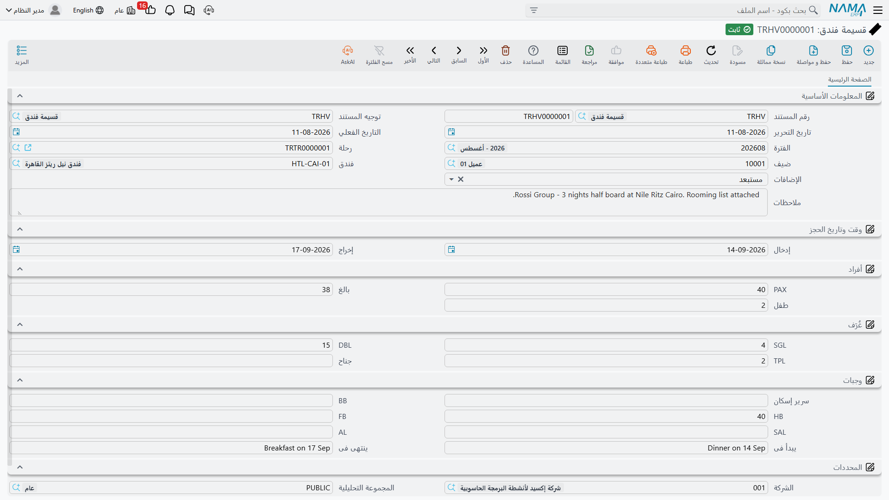
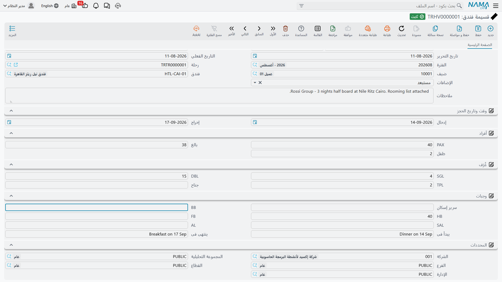
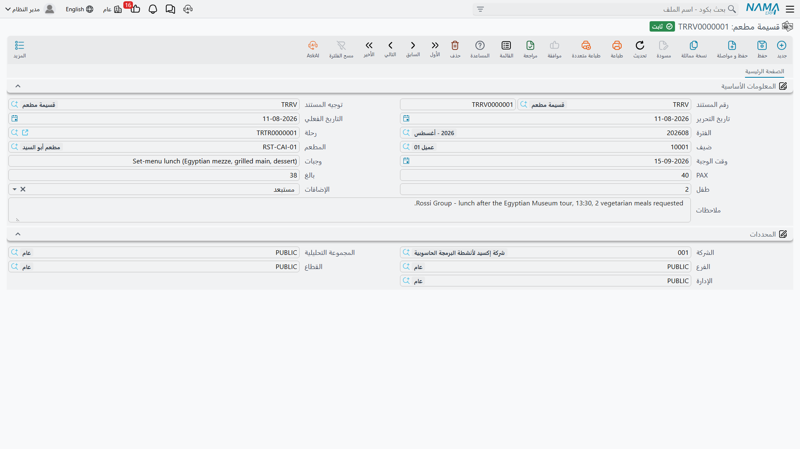

# قسائم الفنادق والمطاعم

قبل أن تعرف شركات السياحة أنظمة إدارة الموارد بزمن طويل، كانت الشركة تؤكد الحجز بورقة تُسمى
**القسيمة**: ورقة تُسلَّم للفندق — أو للمطعم — تقول: «هؤلاء الأشخاص قادمون في هذه التواريخ، وهذا ما
حجزناه لهم، وهذا ما نتحمّل ثمنه». نسخة مع المجموعة، ونسخة يحتفظ بها الفندق، وإذا دار نقاش عند
مكتب الاستقبال حول ما إذا كان العشاء مشمولاً أم لا، فالقسيمة هي التي تحسم الأمر.

قسيمة الفندق وقسيمة المطعم في نما هما هذه الورقة نفسها، لكن محفوظة داخل النظام بدلاً من الدُرج. بمجرد
تسجيل الحجز يستطيع الفريق كله أن يرى ما وُعد به ولمن: مكتب التشغيل، والموظف الذي يردّ على الفندق حين
يتصل، والمحاسب الذي يراجع فاتورة المورد في آخر الشهر — كلهم ينظرون إلى السجل نفسه.

كلا المستندين موجود تحت **السفر والرحلات ← المستندات**، وكلاهما يتصرف كأي مستند عادي في نما: له دفتر
وكود، وتوجيه المستند، وتاريخ تحرير وتاريخ فعلي، وفترة مالية، والمحددات المعتادة (الشركة، الفرع،
القطاع، الإدارة، المجموعة التحليلية)، ودورة الحياة المعتادة من مسودة إلى ترحيل. أي أن القسيمة تُرقَّم
وتمرّ على الاعتماد وتُراجَع وتُؤرشَف مثل أي فاتورة — لكنها ببساطة لا تحمل أي مبالغ.

## قسيمة فندق (Hotel Voucher)

افتح **السفر والرحلات ← المستندات ← قسيمة فندق**. الشاشة صفحة واحدة، وتُقرأ من أعلى لأسفل تماماً مثل
الورقة التي حلّت محلها.

### لمن الحجز، وأين

المجموعة الأولى تجيب عن سؤال «مَن وأين»:

| الحقل | ما يوضع فيه |
|---|---|
| رحلة (Tour) | [الرحلة السياحية](./tours) التي تخصّها هذه الإقامة، حتى يمكن الوصول للقسيمة من الرحلة التي تخدمها |
| ضيف (Guest) | الجهة التي سُجّل الحجز باسمها — عملياً العميل أو شركة السياحة التي بيعت لها الرحلة |
| فندق (Hotel) | [الفندق](./travel-master-files) الذي تُسلَّم إليه القسيمة |
| ملاحظات (Description) | أي شيء يحتاج الفندق أن يعرفه بالكلمات |

::: info حقل الضيف يحمل الجهة التي حجزت معك
عند إنشاء القسيمة من داخل رحلة سياحية ينقل نما **وكيل الرحلة** — شركة السياحة أو العميل الذي تخصّه
الرحلة — إلى حقل «ضيف». وهذا مقصود: القسيمة التزام بين شركتك وبين الفندق، والطرف المذكور فيها هو
الطرف الذي سُجّل الحجز لحسابه، لا قائمة بأسماء المسافرين. أما أسماء الأفراد، حين يطلب الفندق كشف
توزيع الغرف، فمكانها حقل الملاحظات أو مستند مرفق.
:::

### تواريخ الإقامة

**إدخال (Check In)** و**إخراج (Check Out)** هما التاريخان اللذان يهمّان الفندق فعلاً. لا يوجد حقل
«عدد الليالي» في القسيمة — عدد الليالي مكانه سطر الإقامة في الرحلة السياحية، والقسيمة تكتفي بذكر
طرفَي الإقامة.

### كم شخصاً قادم

**PAX** هو إجمالي عدد الأفراد، ويوزّعه حقلا **بالغ (Adult)** و**طفل (Child)**. الفنادق تسعّر الأطفال
وتُسكنهم بشكل مختلف، فالتفصيل مهم حتى وإن لم يظهر أي سعر هنا.

### كيف توزَّع الغرف

أربعة أعداد، وكل واحد منها **عدد غرف** لا عدد أشخاص:

| الحقل | المعنى |
|---|---|
| SGL | غرف مفردة — شخص واحد في الغرفة |
| DBL | غرف مزدوجة — شخصان يتشاركان الغرفة |
| TPL | غرف ثلاثية — ثلاثة أشخاص يتشاركون الغرفة |
| جناح (Suite) | الأجنحة |

فمجموعة من 40 فرداً قادمة من القاهرة وتقيم خمس ليالٍ قد تُسجَّل هكذا: **8 SGL + 10 DBL + 4 TPL** —
ثمانية مسافرين كلٌّ بمفرده، وعشرون في غرف مزدوجة، واثنا عشر في غرف ثلاثية، ومجموعهم 40 وهو ما يظهر
في حقل PAX.

### أي نظام وجبات ينطبق

تختصر صناعة السياحة أنظمة الوجبات بحروف، وكل عقد فندقي في العالم يستخدم الحروف نفسها. ومعظم من هم
خارج قسم التشغيل لم يرَوها مشروحة من قبل، فإليك معناها:

| الحقل | الاسم المتداول | ما يحصل عليه الضيف فعلاً |
|---|---|---|
| سرير (Bed) | غرفة فقط / سرير فقط | الغرفة ولا شيء غيرها — كل وجبة تُدفع على حدة |
| BB | مبيت وإفطار | الغرفة مع الإفطار |
| HB | نصف إقامة | الإفطار مع وجبة رئيسية أخرى، غالباً العشاء |
| FB | إقامة كاملة | الإفطار والغداء والعشاء |
| SAL | شامل جزئي | كل الوجبات مع المشروبات الخفيفة وأساسيات ما بين الوجبات |
| AL | شامل كامل | كل ما يغطيه برنامج الفندق الشامل، والمشروبات ضمنه |

كل حقل من هذه الحقول **عدد** وليس علامة اختيار، لأن القسيمة الواحدة كثيراً ما تغطي مجموعة مختلطة:
جزء من الأفراد على نصف إقامة، والباقي على مبيت وإفطار. أدخل الأعداد التي تنطبق واترك الباقي فارغاً.

ويُختم القسم بحقلين نصيّين حرّين. **يبدأ فى (Starting With)** و**ينتهى فى (Ending With)** يخبران
الفندق بأي وجبة تبدأ الإقامة وبأيها تنتهي — «تبدأ بالعشاء وتنتهي بالإفطار» هي الصيغة الكلاسيكية،
وهي التفصيلة التي تحدّد ما إذا كان المطبخ سينتظر المجموعة مساء وصولها أم لا.

## قسيمة مطعم (Restaurant Voucher)

**السفر والرحلات ← المستندات ← قسيمة مطعم** هي الفكرة نفسها مختصرة في وجبة واحدة بدل إقامة كاملة.
نفس رأس المستند، ونفس المحددات، ونفس دورة الحياة من مسودة إلى ترحيل.

| الحقل | ما يوضع فيه |
|---|---|
| رحلة (Tour) | [الرحلة السياحية](./tours) التي تخصّها الوجبة |
| ضيف (Guest) | الجهة التي سُجّل الحجز لحسابها، كما في قسيمة الفندق |
| المطعم (Restaurant) | [المطعم](./travel-master-files) الذي تُسلَّم إليه القسيمة |
| وقت الوجبة (Meal Date) | اليوم الذي تُنتظر فيه المجموعة |
| وجبات (Meals) | نص حرّ يصف ما سيُقدَّم — «قائمة غداء محددة»، «عشاء مفتوح مع خيار نباتي لأربعة أفراد» |
| PAX / بالغ / طفل | عدد الأفراد وتوزيعه، تماماً كما في قسيمة الفندق |
| ملاحظات (Description) | أي شيء آخر ينبغي أن يعرفه المطعم |

ولنكمل مثال المجموعة نفسها: الأربعون مسافراً محجوز لهم غداء في مطعم مطلّ على النيل في اليوم الثالث،
فيكون «وقت الوجبة» هو ذلك اليوم، وPAX يساوي 40 — منهم 34 بالغاً و6 أطفال — ويكتب في حقل «وجبات»:
«قائمة غداء محددة من ثلاثة أطباق».

## الإضافات: متضمنة أم مستبعدة

تحمل القسيمتان حقلاً صغيراً ذا أثر عملي كبير: **الإضافات (Extras)**، وله اختياران فقط: **متضمن
(Included)** و**مستبعد (Excluded)**.

هذا هو الجواب عن السؤال الذي سيطرحه الضيف عند الكاونتر — الميني بار، والمشروبات مع العشاء، والأطباق
الجانبية، وكل ما هو خارج البرنامج المحجوز. إذا اخترت **متضمن** فأنت تطلب من الفندق أو المطعم أن يقيّد
هذه الأصناف على حساب شركتك. وإذا اخترت **مستبعد** فالضيف يسدّدها بنفسه قبل مغادرته. والوحدة لا تحدّد
ما هي الأصناف التي تُعدّ إضافات؛ ذلك متروك لما ينصّ عليه اتفاقك التجاري مع ذلك المورد. أما ما تفعله
القسيمة فهو تثبيت الجواب كتابةً، حتى لا يضطر أحد للاتصال بالمكتب ليعرف.

## كيف تُنشأ القسائم

هناك طريقان، والثاني هو ما يستخدمه موظفو التشغيل عادةً.

1. **مستقلة من القائمة.** **السفر والرحلات ← المستندات ← قسيمة فندق** (أو قسيمة مطعم)، ثم تُدخل كل
   البيانات يدوياً. استخدم هذا الطريق حين لا تكون هناك رحلة سياحية بعد خلف الحجز، أو حين تسجّل حجزاً
   بأثر رجعي.

2. **مباشرةً من الرحلة السياحية.** افتح [الرحلة السياحية](./tours) وانظر إلى جدول الإقامة: كل سطر فيه
   عمود **قسيمة فندق**، والضغط على **+** فيه يُنشئ القسيمة في مكانها وقد امتلأت من السطر الذي كنت
   واقفاً عليه — الفندق، وتاريخا الدخول والخروج، وعدد الأفراد، وأعداد الغرف المفردة والمزدوجة
   والثلاثية، والضيف مأخوذاً من وكيل الرحلة. وجدول الخدمات فيه العمود المقابل **قسيمة مطعم**، وهو
   ينقل المطعم وتاريخ الوجبة وعدد الأفراد والضيف.

   أما ما لا يعرفه سطر الرحلة — البالغون والأطفال، والأجنحة، وأعداد أنظمة الوجبات، و«يبدأ فى»
   و«ينتهى فى»، واختيار الإضافات — فيُترك لك لتكمله. وبمجرد حفظ القسيمة يشير سطر الرحلة إليها، فيستطيع
   أي شخص يفتح الرحلة أن ينتقل مباشرةً إلى قسيمة الحجز الخاصة بتلك المرحلة.

::: tip ابدأ بالرحلة السياحية
لأن الطريق الثاني ينسخ بيانات الحجز من سطر الرحلة، فمن الأسرع كثيراً أن تبني جدولَي الإقامة والخدمات
في الرحلة أولاً ثم تُنشئ القسائم منهما، بدل كتابة كل قسيمة من الصفر.
:::

## القسيمة لا تسجّل أي مبالغ

هذه أهم نقطة في موضوع القسائم على الإطلاق، وهي تفاجئ من يتوقع أن مستند الحجز يحمل تكلفة.

**لا يوجد سعر ولا مبلغ ولا عملة ولا ضريبة في أي مكان في أي من القسيمتين**، ولا يترتب على أيٍّ منهما
أي أثر محاسبي — فترحيل القسيمة لا يحرّك شيئاً في الحسابات، وإلغاؤها أو حذفها لا يترتب عليه أي أثر
مالي إطلاقاً. القسيمة سجلّ حجز وورقة تسليم، وهذه وظيفتها كاملة.

أما المال الخاص بالحجز نفسه فيسلك طريقاً منفصلاً تماماً. ففي الرحلة السياحية يحوّل زر **إنشاء أوامر
شراء خدمات سياحية (Create Tourism Service Purchase Orders)** سطور الإقامة والخدمات إلى **أوامر شراء
خدمات سياحية** — أمر لكل فندق أو مطعم أو مرشد سياحي أو مورد — وهذه الأوامر هي التي تحمل الأسعار. ثم
يتحول كل أمر إلى **فاتورة مشتريات خدمات سياحية** حين يطالبك المورد بقيمته، وهذه الفاتورة هي ما يصل
إلى الحسابات وإلى حساب المورد. وجانب التكلفة كله مشروح في
[الشراء من الموردين](./travel-purchase-cycle).

::: info مستندان وجمهوران
تخيّلها حجزاً واحداً يُروى مرتين. القسيمة مكتوبة **للفندق**: من القادم، ومتى، وفي أي غرف، وعلى أي
نظام وجبات. أما أمر الشراء والفاتورة فمكتوبان **للمحاسب**: كم تكلّف هذه الإقامة ومن يدين لمن. ولا
يغني أحدهما عن الآخر، ولا يُشتق أحدهما من الآخر — فأنت تسجّل الحجز في القسيمة، وتسجّل التكلفة عبر
دورة الشراء.
:::
