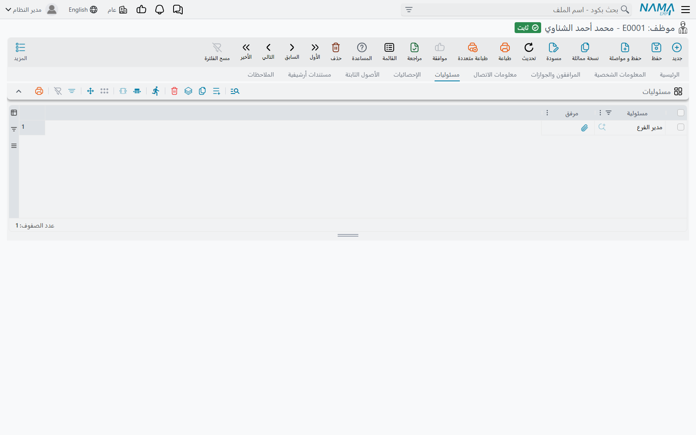
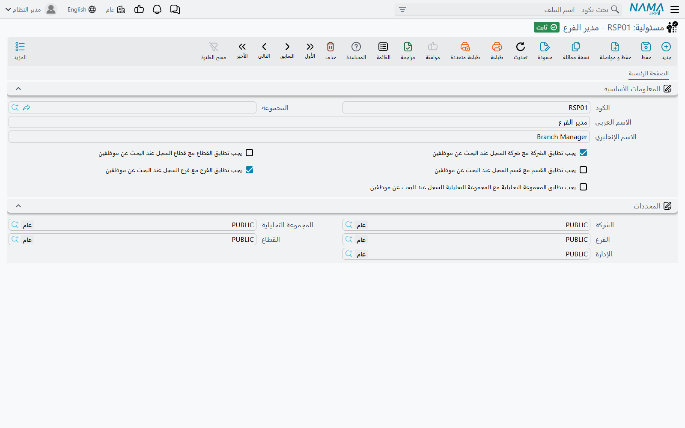
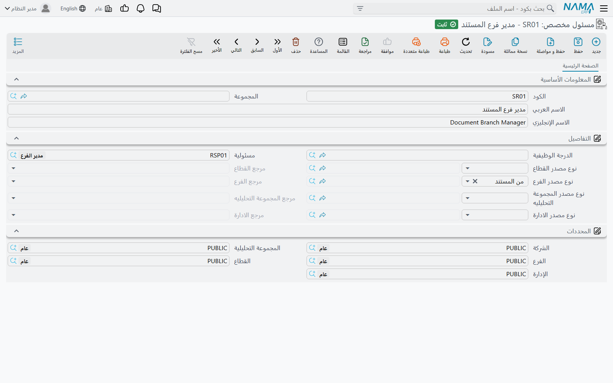
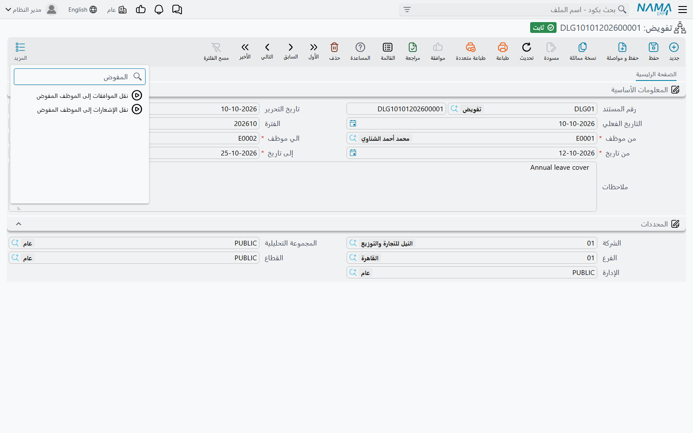

# المسئوليات والمسئول المخصص والتفويض

خطوة موافقة تُسند إلى موظف بعينه تتعطل يوم يترك هذا الموظف العمل أو يتغير منصبه أو يخرج في إجازة. أما الخطوة التي تُسند إلى *دور* فتستمر في العمل. ثلاث شاشات تحت **إدارة النظام ← الصلاحيات** تتيح لك توجيه الموافقات والتنبيهات إلى أدوار بدلاً من أشخاص، وتسليم عمل شخص ما إلى من ينوب عنه لفترة:

- **مسئولية** (Responsibility) — دور له اسم («مراقب ائتمان»، «مشرف مخازن») تمنحه للموظفين.
- **مسئول مخصص** (Special Responsible) — قاعدة بحث: «الموظف في *هذه* المجموعة، بهذه الدرجة الوظيفية أو المسئولية، في *نفس فرع المستند*».
- **تفويض** (Delegation) — مستند مؤرخ يقول: «أثناء غياب س يقوم ص بعمله».

أما تعريف الموافقة نفسه — الخطوات والقرارات والموظف الاحتياطي — فمشروح في [دليل نظام الموافقات](/ar/platform/approvals/approvals-system)؛ وهذه الصفحة تشرح الشاشات الثلاث التي تغذيه.

## المسئولية: دور تمنحه للموظفين

سجل **المسئولية** في الأساس اسم. ما يعطيه معناه هو قائمة الموظفين الذين يحملونه: افتح **الموظف**، واذهب إلى صفحة **مسئوليات** وأضف سطراً لكل مسئولية (ويمكن أن يحمل كل سطر **مرفق** — خطاب التكليف الموقّع مثلاً).

ويمكن أن توزّع الدرجات الوظيفية المسئوليات نيابة عنك. لشاشة **درجة وظيفية** جدول **مسئوليات** خاص بها؛ وعند اختيار الدرجة الوظيفية في الموظف يُملأ جدول **مسئوليات** الموظف بمسئوليات الدرجة. السطر المعلَّم عليه **عدم نسخ المسئولية للموظف** يبقى في الدرجة ولا يُنسخ — استخدمه لمسئولية لا ينبغي أن ينالها إلا بعض شاغلي الدرجة.

وحيثما أمكن اختيار مستلم أو معتمِد من قائمة تشمل **مسئولية**، فاختيارها يعني «كل موظف يحملها حالياً»:

- في خطوة **تعريف موافقه** يكون فيها **نوع المسئول** = **موظف أو مجموعة**، اختر المسئولية بوصفها الجهة المسئولة. تذهب الخطوة إلى كل حامليها، ويحدد إعداد الخطوة **يتطلب موافقة الجميع** هل تكفي موافقة أحدهم.
- في جدول **المستهدفين** في **تعريف تنبيهات**، سطر المسئولية يرسل التنبيه إلى كل حامليها — انظر [تعريفات التنبيهات](/ar/platform/notifications/notifications-system).

ولأن القائمة تُقرأ لحظة إنشاء الخطوة أو التنبيه، فإضافة المسئولية إلى موظف جديد هي كل ما يلزم لإدخاله؛ لا أحد يحتاج إلى تعديل تعريف الموافقة.

### حصرها في الفرع الصحيح

الشركة ذات الفروع الثلاثة لديها عادةً ثلاثة مراقبي ائتمان، ولا ينبغي أن تنتظر فاتورة الرياض مراقبَ جدة. الخيارات الخمسة في شاشة المسئولية تعالج ذلك:

| الخيار | أثره |
|---|---|
| **يجب تطابق القطاع مع قطاع السجل عند البحث عن موظفين** | حاملوها الذين يطابق قطاعهم قطاع السجل فقط |
| **يجب تطابق الشركة مع شركة السجل عند البحث عن موظفين** | حاملوها في شركة السجل فقط |
| **يجب تطابق الفرع مع فرع السجل عند البحث عن موظفين** | حاملوها في فرع السجل فقط |
| **يجب تطابق القسم مع قسم السجل عند البحث عن موظفين** | حاملوها في قسم السجل فقط |
| **يجب تطابق المجموعة التحليلية مع المجموعة التحليلية للسجل عند البحث عن موظفين** | حاملوها في المجموعة التحليلية للسجل فقط |

المحددات المقارَنة هي محددات سجل **الموظف** ومحددات السجل المطلوب اعتماده. وإلى جانب تساوي القيمتين، يُعد تطابقاً أمران: أن يكون المحدد **فارغاً** في أحد الطرفين (الموظف بلا فرع يغطي كل الفروع)، وأن يكون أحدهما محدداً مركباً يحتوي الآخر. ولتعريف الموافقة وتعريف التنبيهات الخيارات الخمسة نفسها، وتُطبق المجموعتان معاً.

::: tip عندما تفقد الخطوة معتمِدها فجأة
إذا استُبعد كل الحاملين، تذهب الخطوة إلى **الموظف الاحتياطي** في التعريف. الخطوة التي تنتهي دائماً عند الموظف الاحتياطي تعني غالباً أن سجلات الموظفين الحاملين للمسئولية تحمل فرعاً أو قسماً خاطئاً — أو لا تحمل شيئاً — لا أن المسئولية نفسها خاطئة.
:::

## المسئول المخصص: إيجاد المعتمِد من المستند

**المسئول المخصص** بحث محفوظ في الموظفين. فبدلاً من قائمة ثابتة، يصف الموظف الذي تريده، وجزء من هذا الوصف يؤخذ من المستند المطلوب اعتماده. فكّر فيه على أنه «مدير الفرع الذي تتبعه هذه الفاتورة، أياً كان».

وهو يضيّق الموظفين بأي تركيبة من:

- **مجموعة موظفين** — مجموعة موظفين (لا تُعرض إلا مجموعات الموظفين).
- **الدرجة الوظيفية** — درجة وظيفية.
- **مسئولية** — مسئولية يحملها الموظف.
- **القطاع** و**الفرع** و**الإدارة** و**المجموعة التحليلية** — لكل منها *مصدر* خاص، مشروح أدناه.

كل معيار تملؤه يجب أن يتحقق. وتؤخذ الشركة دائماً من المستند: يجب أن يكون الموظف في شركة المستند، أو بلا شركة.

### من أين يؤخذ كل محدد

لكل من المحددات الأربعة حقل مصدر (**نوع مصدر القطاع**، **نوع مصدر الفرع**، **نوع مصدر الادارة**، **نوع مصدر المجموعة التحليليه**) فيه ثلاثة اختيارات مفيدة:

| المصدر | الإنجليزية | يؤخذ المحدد من |
|---|---|---|
| **من المستند** | Direct | المستند المطلوب اعتماده |
| **من مرجع** | Reference | سجل يشير إليه المستند — يُختار في حقل نوع المرجع المقابل (مثل **مرجع القطاع**) |
| **محدد** | Specific | قيمة ثابتة تختارها في المسئول المخصص نفسه |

ونوع المرجع يعرض أربعة سجلات:

| نوع المرجع | يُقرأ من |
|---|---|
| **موظف** | الموظف المرتبط بالمستخدم الذي عدّل المستند آخر مرة — «فرع من أنشأه» |
| **عميل** | عميل المستند — في مستندات المبيعات |
| **مخزن** | مخزن السطر — في مستندات المخازن والمشتريات والمبيعات |
| **صنف** | صنف السطر — في مستندات المخازن والمشتريات والمبيعات |

المخزن والصنف يُقرآن **لكل سطر**. فعندما تُطلب الموافقة على أسطر بعينها، يحصل كل سطر على المعتمِدين المطابقين لمخزنه أو صنفه؛ وعندما يُعتمد المستند كله دفعة واحدة، يُستخدم السطر الأول.

اترك المصدر فارغاً فلا يضيّق ذلك المحدد البحث. ويحدث الشيء نفسه حين لا يعطي المصدر قيمة — مرجع إلى العميل في مستند بلا عميل مثلاً. والتطابق في المحددات الأربعة تطابق تام: إذا كان المحدد مستخدماً في التضييق، فالموظف الذي يكون محدده فارغاً لا يتأهل.

وتحافظ الشاشة على اتساق الحقول: حقل نوع المرجع لا يُعدَّل إلا عندما يكون المصدر «من مرجع»، والمحدد الثابت لا يُعدَّل إلا عندما يكون المصدر «محدد». والحفظ مع «محدد» بلا قيمة، أو «من مرجع» بلا نوع مرجع، يُرفض برسالة «الحقل مطلوب» المعتادة على الحقل الفارغ.

### أين تستخدمه

- بوصفه الجهة المسئولة في خطوة **تعريف موافقه** — **نوع المسئول** = **موظف أو مجموعة**، ثم اختر المسئول المخصص. إذا لم يطابق أحد، تذهب الخطوة إلى **الموظف الاحتياطي** في التعريف.
- بوصفه **البدلاء الآخرين** في التعريف — موظفون يجوز لهم التصرف في *أي* خطوة إلى جانب المعتمِدين المعتادين؛ انظر قسم المعتمِدين البدلاء في [دليل نظام الموافقات](/ar/platform/approvals/approvals-system).

#### مثال عملي: مدير فرع الفاتورة

1. أنشئ مسئولية **مدير فرع** وأضفها إلى سجل موظف كل مدير فرع. تأكد أن فرع كل منهم مملوء.
2. أنشئ مسئولاً مخصصاً **مدير فرع الفاتورة**: **مسئولية** = مدير فرع، و**نوع مصدر الفرع** = من المستند.
3. في تعريف الموافقة لفاتورة المبيعات، اجعل **نوع المسئول** في إحدى الخطوات **موظف أو مجموعة** والجهة المسئولة *مدير فرع الفاتورة*.

الآن تنتظر فاتورة الرياض مدير فرع الرياض، وفاتورة جدة مدير فرع جدة — بتعريف موافقة واحد.

## التفويض: تغطية غياب شخص ما

حين يخرج مدير المشتريات في إجازة أسبوعين، تظل أوامر الشراء بحاجة إلى اعتماد. مستند **تفويض** (إدارة النظام ← الصلاحيات ← تفويض) يعالج ذلك دون لمس أي تعريف موافقة:

| الحقل | معناه |
|---|---|
| **من موظف** | الغائب — المفوِّض |
| **الي موظف** | من ينوب عنه — المفوَّض |
| **من تاريخ / إلى تاريخ** | الفترة التي يكون فيها التفويض سارياً |

الحقول الأربعة إلزامية. بعد حفظ المستند، وطالما كان **تاريخ اليوم** داخل الفترة، يتغير ثلاثة أشياء:

1. **طلبات الموافقة الجديدة تصل إلى الاثنين.** كلما أُسندت خطوة موافقة إلى المفوِّض، يُضاف المفوَّض مرشحاً إضافياً. يستطيع أيهما التصرف؛ ولا يفقد المفوِّض شيئاً.
2. **التصعيد يذهب إلى النائب.** حين يصعّد معتمِدٌ إلى المفوِّض — **تصعيد إلى المدير الأعلي** أو **تصعيد إلى المشرف المباشر** أو **تصعيد الي موظف بعينه** — تذهب الحالة إلى المفوَّض بدلاً منه، ما لم يكن المفوَّض هو نفسه من يصعّد.
3. **التنبيهات تتبعه.** تعرض قائمة تنبيهات المفوَّض تنبيهات المفوِّض أيضاً، وتُنسخ إليه التنبيهات الجديدة. التفاصيل، وطريقة إيقاف ذلك للرسائل الحساسة، في قسم التفويض من [تعريفات التنبيهات](/ar/platform/notifications/notifications-system).

يعمل المفوَّض بحسابه هو: الموافقات التي يعطيها تُسجل باسمه. لذا يحتاج إلى مستخدم مرتبط بسجل موظفه، كأي معتمِد.

### ما كان ينتظر من قبل

التفويض الذي يُنشأ في أول يوم من الإجازة لا يلتقط إلا ما يُنشأ *بعده*. زرّان في شاشة التفويض يعالجان المتأخرات؛ وكلاهما يعمل على المستند المفتوح أو على الأسطر المحددة في قائمة التفويضات:

- **نقل الموافقات إلى الموظف المفوض** — في كل حالة موافقة ما زالت جارية يكون المفوِّض أحد مرشحيها الحاليين، ويقع تاريخ طلبها داخل فترة التفويض، **يُستبدل** المفوِّض بالمفوَّض.
- **نقل الإشعارات إلى الموظف المفوض** — ينقل تنبيهات المفوِّض غير المقروءة الواقعة في الفترة إلى المفوَّض.

وبخلاف السلوك المستمر أعلاه، كلاهما *نقل*: تخرج العناصر من قائمة المفوِّض.

::: info شيئان يُسميان «تفويضاً»
هذا التفويض يسلّم **العمل** — الموافقات والتنبيهات — ولا يمس صلاحيات أحد. إذا احتاج النائب أيضاً إلى فتح شاشات لا يراها عادةً، فامنحه صلاحيات المفوِّض للفترة نفسها عبر [الصلاحيات الإضافية المؤقتة (التفويض)](/ar/platform/security/security-delegation). وكثيراً ما يُستخدمان معاً.
:::
