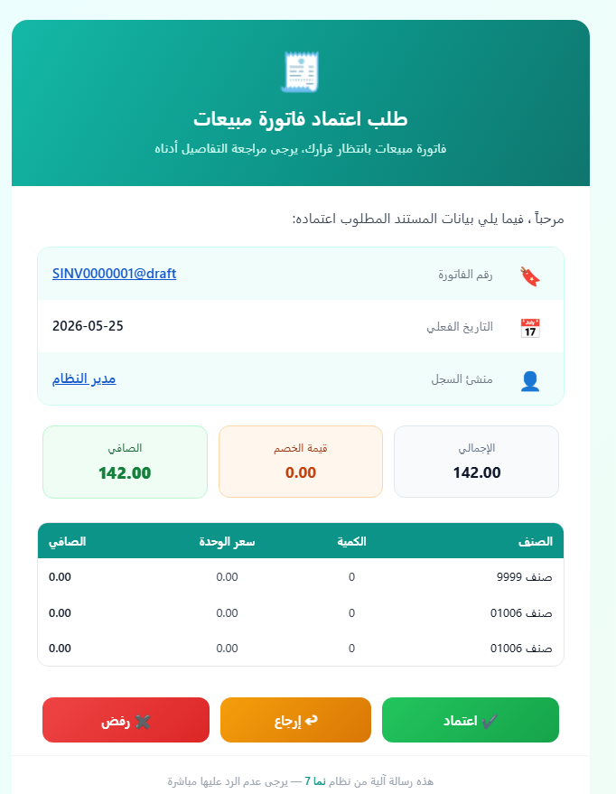

# نماذج بريد إلكتروني جاهزة لطلبات الموافقة (Sample Approval Email Templates)

عندما يدخل مستند في دورة موافقة، يستطيع نظام NAMA إرسال بريد إلكتروني إلى المسؤول يطلب منه **الاعتماد** أو **الرفض** أو **الإرجاع**. جسم هذا البريد هو مجرد قالب [Tempo](../../admin/tempo.md) معرَّف على قاعدة الموافقة، مما يتيح لك تصميمه بالشكل الذي تريده، بسيطاً كان أو احترافياً.

تجمع هذه الصفحة قوالب جاهزة للاستخدام يمكنك نسخها مباشرة في حقل جسم البريد الإلكتروني لقاعدة الموافقة. نبدأ بـ**قالب عام** يصلح لأي نوع من المستندات، وسنُضيف إلى هذه الصفحة قوالب مخصصة لمستندات بعينها (فواتير المبيعات، وأوامر البيع، وغيرها) مع مرور الوقت.

::: tip كيفية استخدام القالب
انسخ كتلة HTML، والصقها في حقل **جسم البريد الإلكتروني** في قاعدة الموافقة، وعدّل أسماء الحقول (`code`، و`valueDate`، و`firstAuthor`، …) إذا كان مستندك يستخدم أسماء مختلفة. تعتمد أزرار الإجراءات الثلاثة على عناصر Tempo: `{approvelink}` و`{rejectlink}` و`{returnlink}` — راجع [إضافة روابط إجراءات الموافقة](../../admin/tempo.md#2-Df-rwbT-jrt-lmwfq).
:::

::: warning ملاحظة حول التنسيق
عملاء البريد الإلكتروني صارمون للغاية في تعاملهم مع CSS. يعتمد هذا القالب على **أنماط مضمّنة** وتخطيط **قائم على الجداول** عمداً — وهو الطريقة الأكثر موثوقية للحصول على نتائج متسقة عبر Gmail وOutlook وعملاء الهاتف المحمول. لجعل كل زر فقاعة ملوّنة قابلة للنقر بالكامل، نستخدم خيار `plain=true` على روابط الإجراءات (مثل `{approvelink(plain=true)}`), الذي يُخرج **الرابط فقط** حتى نتمكن من تغليفه بوسم `<a>` منسَّق خاص بنا مع النص والأيقونة.
:::

---

## قالب الموافقة العام (بالعربية)

بطاقة ملوّنة بتخطيط من اليمين إلى اليسار، يعرض رأسها نوع المستند بالعربية، ويسرد جسمها رقم المستند والتاريخ الفعلي وتاريخ ووقت الإنشاء ومنشئ السجل — يعقبها ثلاثة أزرار إجراء واضحة وقابلة للنقر بالكامل. يمكن النقر على الرقم والمؤلف للانتقال مباشرة إلى المستند وسجل المنشئ.

يستخدم القالب هذه الحقول المتوفرة في أي مستند:

| الحقل | تعبير Tempo | التسمية العربية |
|-------|------------------|--------------|
| نوع المستند (في الرأس) | `{entityType.$arabic}` | — |
| الرقم (رابط للمستند) | `{titledlink($this)}{code}{endlink}` | رقم المستند |
| التاريخ الفعلي | `{valueDate}` | التاريخ الفعلي |
| تاريخ ووقت الإنشاء | `{$creationDate}` | تاريخ ووقت الانشاء |
| منشئ السجل (رابط) | `{titledlink(firstAuthor)}{firstAuthor.name1}{endlink}` | منشئ السجل |
| الملحوظة (تظهر فقط إن وُجدت) | `{if(remarks)}…{remarks}…{endif}` | ملحوظة |

::: tip سطر موضوع ذو معنى
يبدأ القالب بسطر `subject:` حتى يصل البريد بموضوع وصفي — مثل *طلب اعتماد فاتورة مبيعات - SI-0012 - منشئ السجل: أحمد* — بدلاً من موضوع عام. **يجب** أن يكون هذا أول سطر في الجسم (قبل `<div>`)؛ راجع [تعيين موضوع البريد الإلكتروني](../../admin/tempo.md#1-taayyn-mwDwaa-lbryd-llktrwny).
:::

::: details كود HTML

```html
subject:طلب اعتماد {entityType.$arabic} - {code} - منشئ السجل: {firstAuthor.name1}
<div dir="rtl" style="margin:0;padding:24px;background:#eef2ff;background:linear-gradient(135deg,#eef2ff 0%,#fdf2f8 100%);font-family:'Segoe UI',Tahoma,Arial,sans-serif;">
  <table role="presentation" align="center" width="600" cellpadding="0" cellspacing="0" style="max-width:600px;width:100%;margin:0 auto;background:#ffffff;border-radius:18px;overflow:hidden;box-shadow:0 10px 30px rgba(79,70,229,0.18);">

    <!-- Header -->
    <tr>
      <td style="padding:32px 28px;background:#6d28d9;background:linear-gradient(120deg,#7c3aed 0%,#4f46e5 55%,#2563eb 100%);text-align:center;">
        <div style="font-size:40px;line-height:1;">📝</div>
        <div style="margin-top:10px;font-size:22px;font-weight:700;color:#ffffff;">طلب اعتماد {entityType.$arabic}</div>
        <div style="margin-top:6px;font-size:14px;color:#e0e7ff;">يوجد مستند بانتظار قرارك، يرجى مراجعة التفاصيل أدناه</div>
      </td>
    </tr>

    <!-- Greeting -->
    <tr>
      <td style="padding:24px 28px 4px 28px;color:#374151;font-size:15px;">
        مرحباً <strong style="color:#4f46e5;">{$notificationTarget.name1}</strong>، فيما يلي بيانات المستند المطلوب اعتماده:
      </td>
    </tr>

    <!-- Info card -->
    <tr>
      <td style="padding:16px 28px 8px 28px;">
        <table role="presentation" width="100%" cellpadding="0" cellspacing="0" style="border:1px solid #ede9fe;border-radius:14px;overflow:hidden;">

          <tr style="background:#faf5ff;">
            <td width="46" style="padding:14px;text-align:center;font-size:20px;">🔖</td>
            <td style="padding:14px 4px;color:#6b7280;font-size:13px;">رقم المستند</td>
            <td style="padding:14px 16px;text-align:left;color:#111827;font-size:15px;font-weight:600;">{titledlink($this)}{code}{endlink}</td>
          </tr>

          <tr style="border-top:1px solid #f3f4f6;">
            <td width="46" style="padding:14px;text-align:center;font-size:20px;">📅</td>
            <td style="padding:14px 4px;color:#6b7280;font-size:13px;">التاريخ الفعلي</td>
            <td style="padding:14px 16px;text-align:left;color:#111827;font-size:15px;font-weight:600;">{formatDate(valueDate, "yyyy-MM-dd")}</td>
          </tr>

          <tr style="background:#faf5ff;border-top:1px solid #f3f4f6;">
            <td width="46" style="padding:14px;text-align:center;font-size:20px;">🕓</td>
            <td style="padding:14px 4px;color:#6b7280;font-size:13px;">تاريخ ووقت الانشاء</td>
            <td style="padding:14px 16px;text-align:left;color:#111827;font-size:15px;font-weight:600;">{formatDate($creationDate, "yyyy-MM-dd HH:mm:ss")}</td>
          </tr>

          <tr style="border-top:1px solid #f3f4f6;">
            <td width="46" style="padding:14px;text-align:center;font-size:20px;">👤</td>
            <td style="padding:14px 4px;color:#6b7280;font-size:13px;">منشئ السجل</td>
            <td style="padding:14px 16px;text-align:left;color:#111827;font-size:15px;font-weight:600;">{titledlink(firstAuthor)}{firstAuthor.name1}{endlink}</td>
          </tr>

          {if(remarks)}
          <tr style="background:#faf5ff;border-top:1px solid #f3f4f6;">
            <td width="46" style="padding:14px;text-align:center;font-size:20px;">📝</td>
            <td style="padding:14px 4px;color:#6b7280;font-size:13px;">ملحوظة</td>
            <td style="padding:14px 16px;text-align:left;color:#111827;font-size:15px;font-weight:600;">{remarks}</td>
          </tr>
          {endif}

        </table>
      </td>
    </tr>

    <!-- Action buttons (each whole pill is a clickable approval link) -->
    <tr>
      <td style="padding:24px 28px 8px 28px;">
        <table role="presentation" width="100%" cellpadding="0" cellspacing="0">
          <tr>
            <td style="padding:6px;" align="center">
              <a href="{approvelink(plain=true)}" style="display:block;padding:14px 10px;background:#16a34a;background:linear-gradient(135deg,#22c55e,#16a34a);color:#ffffff;text-decoration:none;font-size:15px;font-weight:700;border-radius:12px;box-shadow:0 4px 12px rgba(22,163,74,0.35);">✔ اعتماد</a>
            </td>
            <td style="padding:6px;" align="center">
              <a href="{returnlink(plain=true)}" style="display:block;padding:14px 10px;background:#d97706;background:linear-gradient(135deg,#f59e0b,#d97706);color:#ffffff;text-decoration:none;font-size:15px;font-weight:700;border-radius:12px;box-shadow:0 4px 12px rgba(217,119,6,0.35);">↩ إرجاع</a>
            </td>
            <td style="padding:6px;" align="center">
              <a href="{rejectlink(plain=true)}" style="display:block;padding:14px 10px;background:#dc2626;background:linear-gradient(135deg,#ef4444,#dc2626);color:#ffffff;text-decoration:none;font-size:15px;font-weight:700;border-radius:12px;box-shadow:0 4px 12px rgba(220,38,38,0.35);">✖ رفض</a>
            </td>
          </tr>
        </table>
      </td>
    </tr>

    <!-- Footer -->
    <tr>
      <td style="padding:18px 28px 26px 28px;text-align:center;color:#9ca3af;font-size:12px;border-top:1px solid #f3f4f6;">
        هذه رسالة آلية من نظام <a href="https://{translate("appUrl")}" style="color:#6d28d9;text-decoration:none;font-weight:600;">{translate("applicationName")}</a> — يرجى عدم الرد عليها مباشرة
      </td>
    </tr>

  </table>
</div>
```
:::

هذا هو شكل البريد الإلكتروني بعد عرضه في صندوق الوارد:


::: tip حول الأزرار
يغلّف كل زر رابط إجراء تُنتجه العناصر `{approvelink(plain=true)}` و`{returnlink(plain=true)}` و`{rejectlink(plain=true)}`. لأن `plain=true` يُخرج الرابط فقط، فإن **الفقاعة الملوّنة بأكملها قابلة للنقر** وأنت من يتحكم في نصها وأيقونتها. إذا فضّلت العرض الافتراضي لنظام NAMA، احذف `plain=true` واستخدم `{approvelink}` أو `{returnlink}` أو `{rejectlink}` مباشرة، فهي تُنشئ نص الرابط بنفسها.

يعرض الرأس نوع المستند بالعربية عبر `{entityType.$arabic}`. في القوالب المخصصة لمستند بعينه، يمكنك استبداله باسم ثابت (مثل *فاتورة مبيعات*، أو *أمر بيع*) — وهو بالضبط ما ستفعله الأقسام القادمة.
:::

::: tip تذييل يعكس هوية الشركة
يستخدم التذييل `{translate("applicationName")}` و`{translate("appUrl")}` بدلاً من اسم منتج ورابط مكتوبَين بشكل ثابت. تُحلَّل هذه المفاتيح وفق هوية التثبيت الجاري تشغيله — فالقالب نفسه يعرض *Nama ERP* / `namasoft.com`، أو *Capital Solutions ERP*، أو *Exceed ERP* / `exceed-erp.com`، وهكذا دون أي تعديل. راجع [مفاتيح الهوية: اسم التطبيق والرابط](../../admin/tempo.md#mftyH-laalm-ltjry-sm-ltTbyq-waanwnh).
:::

---

## قالب مستندات المبيعات والمخزون (بالعربية)

بينما يصلح القالب العام أعلاه لأي مستند، فإن فاتورة المبيعات تحمل معلومات تستحق العرض في البريد الإلكتروني نفسه — *كم* يتم اعتماده و*ماذا* يحتوي. يبني هذا القالب على البطاقة العامة ويضيف إليها شيئين مخصصَين لهذه المستندات: **ملخص مالي** (الإجمالي وقيمة الخصم والصافي) و**جدول مفصَّل** للبنود (الصنف والكمية وسعر الوحدة والصافي لكل بند).

وعلى الرغم من أنه كُتب هنا بفاتورة مبيعات في الاعتبار، **فإن القالب نفسه بالضبط يعمل دون تعديل لمجموعة مستندات المبيعات والمخزون بأكملها** — أوامر البيع والمرتجعات وفواتير الشراء وأوامر الشراء وعروض الأسعار وغيرها. كلها تشترك في حقول الرأس `money.*` وبنية بنود `details` ذاتها، ويتكيّف عنوان الرأس تلقائياً عبر `{entityType.$arabic}`. لذا يمكنك نسخ هذه الكتلة على أي من قواعد موافقة تلك المستندات دون أي تعديل.

يستخدم القالب هذه الحقول المؤكّدة على كيان `SalesInvoice` (والمشتركة بين مستندات عائلته):

| الحقل | تعبير Tempo | التسمية العربية |
|-------|------------------|--------------|
| الإجمالي | `{money.total}` | الإجمالي |
| قيمة الخصم في الرأس | `{money.headerDiscount.value}` | قيمة الخصم |
| الصافي | `{money.netValue}` | الصافي |
| صنف البند (داخل الحلقة) | `{#details.item.item.name1}` | الصنف |
| كمية البند (داخل الحلقة) | `{#details.quantity.quantity.primeQty.value}` | الكمية |
| سعر وحدة البند (داخل الحلقة) | `{#details.price.unitPrice}` | سعر الوحدة |
| صافي البند (داخل الحلقة) | `{#details.price.netValue}` | الصافي |

::: tip لماذا `#` و`loop` لحقول البنود
تُقرأ حقول الرأس المالية (`{money.total}`, …) مباشرة من المستند. أما حقول **البنود** فتقع داخل مجموعة `details`، لذا يجب أن تظهر داخل كتلة `{loop(details)}…{endloop}`، وتُسبَق بـ`#` (مثل `{#details.price.netValue}`) حتى يُحلّها Tempo بالنسبة إلى *الصف الحالي* من الحلقة. راجع [التكرار على البيانات المتكررة](../../admin/tempo.md#ltkrr-aal-bynt-mtkrr-mthl-tfSyl-lmstnd).
:::

::: tip تنسيق القيم المالية
تُغلَّف المبالغ بـ`{formatNumber(…, "###,##0.00")}` لتُعرض كأرقام مجمَّعة بمنزلتين عشريتين (مثل *12,500.00*) بدلاً من أرقام خام. راجع [تنسيق الأرقام](../../admin/tempo.md#tnsyq-lrqm).
:::

::: details كود HTML
```html
subject:طلب اعتماد {entityType.$arabic} - {code} - الصافي: {formatNumber(money.netValue, "###,##0.00")}
<div dir="rtl" style="margin:0;padding:24px;background:#ecfeff;background:linear-gradient(135deg,#ecfeff 0%,#f0fdf4 100%);font-family:'Segoe UI',Tahoma,Arial,sans-serif;">
  <table role="presentation" align="center" width="640" cellpadding="0" cellspacing="0" style="max-width:640px;width:100%;margin:0 auto;background:#ffffff;border-radius:18px;overflow:hidden;box-shadow:0 10px 30px rgba(13,148,136,0.18);">

    <!-- Header -->
    <tr>
      <td style="padding:32px 28px;background:#0d9488;background:linear-gradient(120deg,#14b8a6 0%,#0d9488 55%,#0f766e 100%);text-align:center;">
        <div style="font-size:40px;line-height:1;">🧾</div>
        <div style="margin-top:10px;font-size:22px;font-weight:700;color:#ffffff;">طلب اعتماد {entityType.$arabic}</div>
        <div style="margin-top:6px;font-size:14px;color:#ccfbf1;">{entityType.$arabic} بانتظار قرارك، يرجى مراجعة التفاصيل أدناه</div>
      </td>
    </tr>

    <!-- Greeting -->
    <tr>
      <td style="padding:24px 28px 4px 28px;color:#374151;font-size:15px;">
        مرحباً <strong style="color:#0d9488;">{$notificationTarget.name1}</strong>، فيما يلي بيانات المستند المطلوب اعتماده:
      </td>
    </tr>

    <!-- Info card -->
    <tr>
      <td style="padding:16px 28px 8px 28px;">
        <table role="presentation" width="100%" cellpadding="0" cellspacing="0" style="border:1px solid #ccfbf1;border-radius:14px;overflow:hidden;">

          <tr style="background:#f0fdfa;">
            <td width="46" style="padding:14px;text-align:center;font-size:20px;">🔖</td>
            <td style="padding:14px 4px;color:#6b7280;font-size:13px;">رقم الفاتورة</td>
            <td style="padding:14px 16px;text-align:left;color:#111827;font-size:15px;font-weight:600;">{titledlink($this)}{code}{endlink}</td>
          </tr>

          <tr style="border-top:1px solid #f3f4f6;">
            <td width="46" style="padding:14px;text-align:center;font-size:20px;">📅</td>
            <td style="padding:14px 4px;color:#6b7280;font-size:13px;">التاريخ الفعلي</td>
            <td style="padding:14px 16px;text-align:left;color:#111827;font-size:15px;font-weight:600;">{formatDate(valueDate, "yyyy-MM-dd")}</td>
          </tr>

          <tr style="background:#f0fdfa;border-top:1px solid #f3f4f6;">
            <td width="46" style="padding:14px;text-align:center;font-size:20px;">👤</td>
            <td style="padding:14px 4px;color:#6b7280;font-size:13px;">منشئ السجل</td>
            <td style="padding:14px 16px;text-align:left;color:#111827;font-size:15px;font-weight:600;">{titledlink(firstAuthor)}{firstAuthor.name1}{endlink}</td>
          </tr>

        </table>
      </td>
    </tr>

    <!-- Money summary -->
    <tr>
      <td style="padding:8px 28px;">
        <table role="presentation" width="100%" cellpadding="0" cellspacing="0">
          <tr>
            <td width="33%" style="padding:6px;" align="center">
              <div style="padding:14px 8px;background:#f8fafc;border:1px solid #e2e8f0;border-radius:12px;">
                <div style="color:#64748b;font-size:12px;">الإجمالي</div>
                <div style="margin-top:6px;color:#0f172a;font-size:17px;font-weight:700;">{formatNumber(money.total, "###,##0.00")}</div>
              </div>
            </td>
            <td width="33%" style="padding:6px;" align="center">
              <div style="padding:14px 8px;background:#fff7ed;border:1px solid #fed7aa;border-radius:12px;">
                <div style="color:#9a3412;font-size:12px;">قيمة الخصم</div>
                <div style="margin-top:6px;color:#c2410c;font-size:17px;font-weight:700;">{formatNumber(money.headerDiscount.value, "###,##0.00")}</div>
              </div>
            </td>
            <td width="33%" style="padding:6px;" align="center">
              <div style="padding:14px 8px;background:#f0fdf4;border:1px solid #bbf7d0;border-radius:12px;">
                <div style="color:#166534;font-size:12px;">الصافي</div>
                <div style="margin-top:6px;color:#15803d;font-size:18px;font-weight:800;">{formatNumber(money.netValue, "###,##0.00")}</div>
              </div>
            </td>
          </tr>
        </table>
      </td>
    </tr>

    <!-- Items table -->
    <tr>
      <td style="padding:12px 28px 8px 28px;">
        <table role="presentation" width="100%" cellpadding="0" cellspacing="0" style="border:1px solid #e5e7eb;border-radius:12px;overflow:hidden;font-size:13px;">
          <tr style="background:#0d9488;color:#ffffff;">
            <td style="padding:10px 12px;font-weight:700;">الصنف</td>
            <td style="padding:10px 12px;font-weight:700;text-align:center;">الكمية</td>
            <td style="padding:10px 12px;font-weight:700;text-align:center;">سعر الوحدة</td>
            <td style="padding:10px 12px;font-weight:700;text-align:left;">الصافي</td>
          </tr>
          {loop(details)}
          <tr style="border-top:1px solid #f3f4f6;">
            <td style="padding:10px 12px;color:#111827;">{#details.item.item.name1}</td>
            <td style="padding:10px 12px;color:#374151;text-align:center;">{formatNumber(#details.quantity.quantity.primeQty.value, "###,##0.##")}</td>
            <td style="padding:10px 12px;color:#374151;text-align:center;">{formatNumber(#details.price.unitPrice, "###,##0.00")}</td>
            <td style="padding:10px 12px;color:#111827;font-weight:600;text-align:left;">{formatNumber(#details.price.netValue, "###,##0.00")}</td>
          </tr>
          {endloop}
        </table>
      </td>
    </tr>

    <!-- Action buttons (each whole pill is a clickable approval link) -->
    <tr>
      <td style="padding:20px 28px 8px 28px;">
        <table role="presentation" width="100%" cellpadding="0" cellspacing="0">
          <tr>
            <td style="padding:6px;" align="center">
              <a href="{approvelink(plain=true)}" style="display:block;padding:14px 10px;background:#16a34a;background:linear-gradient(135deg,#22c55e,#16a34a);color:#ffffff;text-decoration:none;font-size:15px;font-weight:700;border-radius:12px;box-shadow:0 4px 12px rgba(22,163,74,0.35);">✔ اعتماد</a>
            </td>
            <td style="padding:6px;" align="center">
              <a href="{returnlink(plain=true)}" style="display:block;padding:14px 10px;background:#d97706;background:linear-gradient(135deg,#f59e0b,#d97706);color:#ffffff;text-decoration:none;font-size:15px;font-weight:700;border-radius:12px;box-shadow:0 4px 12px rgba(217,119,6,0.35);">↩ إرجاع</a>
            </td>
            <td style="padding:6px;" align="center">
              <a href="{rejectlink(plain=true)}" style="display:block;padding:14px 10px;background:#dc2626;background:linear-gradient(135deg,#ef4444,#dc2626);color:#ffffff;text-decoration:none;font-size:15px;font-weight:700;border-radius:12px;box-shadow:0 4px 12px rgba(220,38,38,0.35);">✖ رفض</a>
            </td>
          </tr>
        </table>
      </td>
    </tr>

    <!-- Footer -->
    <tr>
      <td style="padding:18px 28px 26px 28px;text-align:center;color:#9ca3af;font-size:12px;border-top:1px solid #f3f4f6;">
        هذه رسالة آلية من نظام <a href="https://{translate("appUrl")}" style="color:#0d9488;text-decoration:none;font-weight:600;">{translate("applicationName")}</a> — يرجى عدم الرد عليها مباشرة
      </td>
    </tr>

  </table>
</div>
```
:::

هذا هو شكل البريد الإلكتروني بعد عرضه في صندوق الوارد:



::: tip عرض كود الصنف بدلاً من اسمه
يعرض الجدول صنف كل بند باسمه العربي عبر `{#details.item.item.name1}` (استخدم `name2` للاسم الإنجليزي). إذا كنت تفضّل **الكود**، استبدله بـ`{#details.item.item.code}`؛ ولعرض الاثنين معاً، ادمجهما: `{#details.item.item.code} — {#details.item.item.name1}`.
:::

---

*سيتم إضافة المزيد من القوالب لأنواع مستندات محددة (أوامر البيع والشراء، وسندات الاستلام، …) أدناه مع توسيع هذه الصفحة.*
