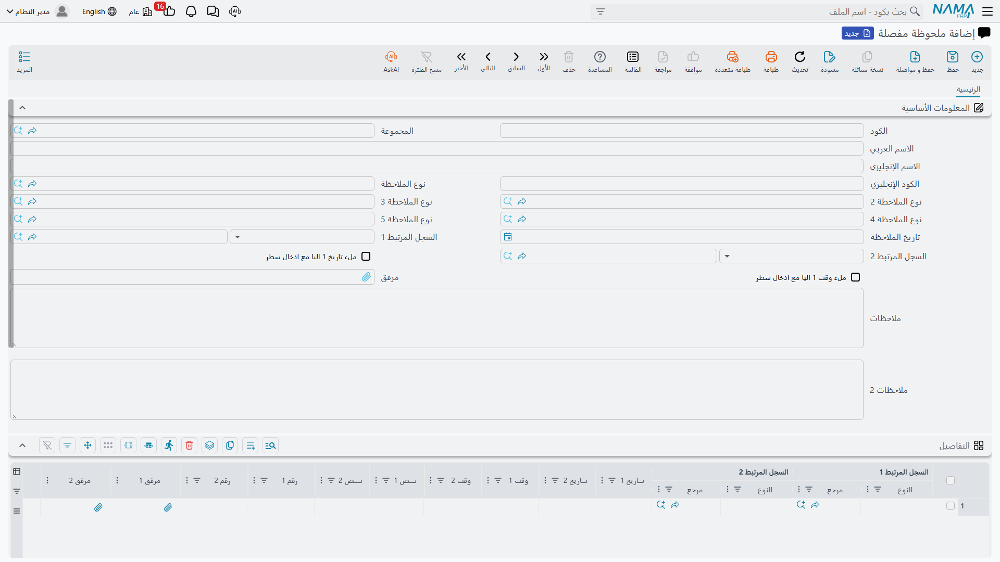

# المرفقات (Attachments)

الأوراق تتبع مستندات العمل أينما ذهبت. فاتورة شراء تصل ملفَّ PDF في بريد أحدهم. إذن تسليم يعود من
العميل وعليه توقيع مخربش. ملف موظف يحتاج صورة من الهوية. وكل ذلك يجب أن ينتهي في مكان يخطر ببال من
سينظر إلى السجل بعد ستة أشهر أن يبحث فيه — أي على السجل نفسه، لا في مجلد مشترك يحمل اسم مشروع العام
الماضي.

و**المرفق** في نما ملفٌّ مخزَّن في حقل على سجل. هذه هي الفكرة كلها، وهذا هو الشيء الوحيد الجدير بالفهم
قبل أي شيء آخر: المرفقات ليست كيسًا معلَّقًا بالسجل تظل تُسقط فيه الملفات. بل هي **حقول** — خانات
مسماة معدودة — وكل واحدة منها تحمل ملفًا واحدًا بالضبط.

::: info أين تجدها
حيثما ظهر مشبك الورق في الشاشة. فأغلب شاشات المستندات والملفات الرئيسية تحمل حقول مرفقات باسم
**مرفق 1** و**مرفق 2** وهكذا، عادةً في مجموعة المعلومات الأساسية أو في تبويب خاص بها؛ ويمكن للجداول أن
تحمل عمود **مرفق** فيكون لكل سطر ملفه.
:::

والشاشة أعلاه تُظهر الأمرين معًا: حقل **مرفق** في الرأس، وعمودَي **مرفق 1** و**مرفق 2** في جدول
التفاصيل، ولكل خلية مشبك ورقها.

## حقل واحد، ملف واحد

الشاشة التي تعرض خمسة حقول مرفقات تستطيع حمل خمسة ملفات، والملف السادس لا مكان له حتى تُفرغ واحدًا من
الخمسة أو تُعدَّل الشاشة لإظهار خانات أكثر. وتختلف أنواع السجلات في عدد ما تعرضه — بعضها يحمل **مرفق**
واحدًا، وكثير منها ثلاثة أو خمسة، وبعضها يصل إلى عشرة.

وهذا تصميم مقصود وله نتيجة تستحق التخطيط لها: **قرّر لماذا كل خانة**. ففي فاتورة الشراء، «مرفق 1 =
أصل فاتورة المورد، مرفق 2 = إثبات التسليم، مرفق 3 = بريد الاعتماد» عرفٌ يستطيع الناس اتّباعه والبحث
به. وإن تُرك الأمر بلا قرار، انتهت المستندات الثلاثة نفسها في خانات مختلفة في كل سجل، وصارت الحقول بلا
فائدة إلا النظر بالعين.

وإن كان السجل يحتاج فعلًا إلى عدد مفتوح من الملفات — عقد بأربعين ملحقًا، أو عقار بحافظة صكوك — فذلك ما
وُجدت له [إدارة المستندات](/ar/platform/dms/)، والنظامان يتعايشان بلا مشكلة.

::: tip يمكن إعادة تسمية حقول المرفقات
تسمية الحقل ليست ثابتة عند «مرفق 1». وإعادة تسمية الخانات بما تحمله فعلًا من أرخص المكاسب في سهولة
الاستعمال؛ انظر
[مظهر الحقول](/ar/platform/fields-and-entities-settings/fields-settings-field-appearance).
:::

## إرفاق ملف

أداة المرفقات صغيرة وتفعل أكثر مما توحي به.

**انقر مشبك الورق** فيُفتح منتقي الملفات. اختر ملفًا فيُرفع فورًا — وسترى اسم الملف يظهر شارةً بجوار
المشبك.

**اسحب ملفًا وأفلته على الحقل** فيُلتقط بالطريقة نفسها، وهو عادةً أسرع حين يكون الملف موجودًا أصلًا في
برنامج البريد أو في مجلد بجوار المتصفح.

**انقر المشبك مع Alt أو Ctrl** لتمسح ضوئيًا بدل الرفع، إن كان ماسح ضوئي مهيَّأً لذلك الحقل. أما الحقول
المهيّأة بالعكس — حيث المسح هو الحالة المعتادة — فأيقونتها ماسح ضوئي والنقر مع Alt يعطيك منتقي الملفات.
والطريقان متاحان دائمًا؛ والإعداد لا يقرر إلا أيهما على بعد نقرة واحدة.

أما الحقول المهيّأة حقولَ **توقيع** فتُظهر قلمًا، ونقره يفتح لوحة يوقّع عليها العميل على الشاشة. وإعداد
الماسح والتوقيع كلاهما في
[مظهر الحقول](/ar/platform/fields-and-entities-settings/fields-settings-field-appearance)، أما برنامج
المسح المستعمل فيُضبط في
[المرفقات والتخزين](/ar/platform/global-config/global-config-attachments).

::: warning الرفع ليس حفظًا
يُرفع الملف لحظة اختياره، لكنه لا يصير على السجل حتى **تحفظ السجل**. أغلق الشاشة دون حفظ ويذهب المرفق
مع كل ما لم تحفظه. وهذا يوقع الناس لأن اسم الملف يظهر فورًا فيبدو وكأنه اعتُمد.
:::

## الفتح والاستبدال والإزالة

بمجرد أن يحمل الحقل ملفًا، تحمل الشارة اسم الملف.

- **انقر الشارة** لتنزيل الملف أو فتحه.
- **مرّر المؤشر فوقها** ثانيةً واحدة فيعرض المرفق الصوري معاينة دون تنزيل، وهو ما يجعل تصفح الأوراق
  الممسوحة عمليًا.
- **انقر × على الشارة** لفصل الملف. وكما في الإرفاق، تسري الإزالة عند حفظ السجل.

ولاستبدال ملف، أزل القديم وأرفق الجديد. فلا استبدال في المكان — وهذا جدير بالمعرفة، لأن
[سجل التعديل](/ar/platform/audit-trail) يسجّل أن الحقل تغيّر، لكن الملف السابق نفسه لا يُحفظ نسخةً
منفصلة تستطيع استرجاعها من السجل.

## المرفقات على سطور التفاصيل

المرفقات ليست ميزة رأس فقط. فعمود الجدول من نوع المرفق يعطي **كل سطر ملفه الخاص** — وهو النموذج
الطبيعي حين تكون السطور هي الأشياء التي تُثبَت.

والحالات الكلاسيكية هي التي يغطي فيها مستند واحد أصنافًا مستقلة كثيرة: مستند مصروفات نثرية كل سطر فيه
مصروف مختلف بإيصاله؛ ومستند توزيع أرباح كل سطر فيه يحمل حسابه المؤيِّد؛ ومستند شراء لكل صنف في سطوره
شهادته.

وتتصرف الأداة داخل الخلية تمامًا كما تتصرف في الرأس — نقر للرفع، ونقر مع Alt للمسح، ونقر الشارة للفتح،
و× للإزالة. وتنطبق القاعدة نفسها في الحفظ: ملف السطر لا يُخزَّن حتى يُحفظ المستند.

## أين تُخزَّن الملفات

افتراضيًا تذهب بايتات الملف **إلى قاعدة البيانات**، وهو ما يبقي النسخ الاحتياطية مكتفية بذاتها:
استرجع قاعدة البيانات فيعود معها كل مرفق.

ويكفّ هذا عن كونه مريحًا بعد بضع سنوات من المسح الضوئي. والبديل — تفعيل **تخزين المرفقات خارجيًا** — ينقل البايتات إلى مجلد على القرص ولا يترك في قاعدة البيانات إلا مؤشرًا. فتبقى قاعدة
البيانات صغيرة؛ والثمن أن مجلد المرفقات صار جزءًا من نسختك الاحتياطية ولا بد أن يُسترجع مع قاعدة
البيانات، وإلا ظهر كل مرفق في النظام مفقودًا. والخياران، مع إعدادات مشاركة الشبكة والمعاينات والصور
المصغّرة، موصوفة في [المرفقات والتخزين](/ar/platform/global-config/global-config-attachments).

ويستطيع نما أيضًا تحويل ملفات أوفيس والصور إلى PDF للمعاينة والطباعة، باستعمال أدوات خارجية تُضبط في
الشاشة نفسها. وحين تتوقف المعاينات عن العمل بعد نقل الخادم، فالمشكلة هناك في الغالب.

## معرفة ما هو مُرفَق وأين

المرفقات تنتشر، وبعد سنتين سيسأل أحدهم كم من قاعدة البيانات أوراق ممسوحة، أو أي المستندات ينقصه ملفه
المؤيِّد.

والخيار العام **إنشاء جدول معلومات المرفقات** يجيب عن ذلك. فمع تفعيله يحتفظ نما بجدول جانبي يصف كل مرفق
في النظام — السجل الذي ينتمي إليه، و**الحقل** الذي يجلس فيه، و**رقم السطر** حين يكون على سطر تفاصيل،
ومتى أُنشئ، والملف نفسه — ويُظهره في القوائم فتستطيع سرده وفلترته والتقرير عنه كأي بيانات أخرى.

وتفصيل رقم السطر هو ما يجعله نافعًا فعلًا: فبدونه تستطيع أن تعرف أن للمستند مرفقات، لكن لا تعرف أيًّا
من سطوره الأربعين ينقصه إيصال.

## إدخال الملفات وإخراجها بالجملة

هناك [مساران للكيانات](/ar/platform/entity-flows/introduction-to-entity-flows) يتوليان المرفقات
بالحجم الكبير، حين لا يكون نقر مشبك الورق ألف مرة خيارًا.

- **[تصدير المرفقات](/entity-flows/core/EAExportAttachments)** يسحب الملفات المرفقة من مجموعة سجلات
  ويكتبها ملفات — وهي الأداة التي تلجأ إليها حين تسلّم مراجعًا كل ما يؤيّد فترة.
- **[تنزيل الروابط إلى مرفقات](/entity-flows/core/EADownloadURLsIntoAttachments)** يسير في الاتجاه
  الآخر: يأخذ رابطًا محفوظًا على السجل ويجلب الملف الذي خلفه إلى حقل مرفق، وهكذا تصل المرفقات من
  واجهة متجر إلكتروني أو من بوابة مورد لا تعطيك إلا رابطًا.

## المرفقات والصلاحيات

أمران يستحقان التحقق عن قصد لا الافتراض.

حقول المرفقات حقول عادية، فتنطبق عليها **صلاحيات مستوى الحقل**: فالدور الذي يجب ألا يرى خطاب راتب
ممسوحًا يمكن إخفاء الحقل عنه عبر
[تأمين الحقول والصفحات وشاشات القوائم](/ar/platform/security/field-page-listview-security).

والخيار العام **السماح بتحميل المرفقات دون توثيق** هو الذي يستحق الحذر. فهو يجعل روابط المرفقات
تعمل بلا جلسة، وهو ما تحتاجه بعض العارضات الخارجية وبوابات العملاء — لكنه يعني أيضًا أن كل من يملك
الرابط يستطيع جلب الملف. فعِّله فقط حين تكون قد قرّرت أن ذلك مقبول لكل مرفق في النظام، لأنه ليس إعدادًا
على مستوى الحقل.
