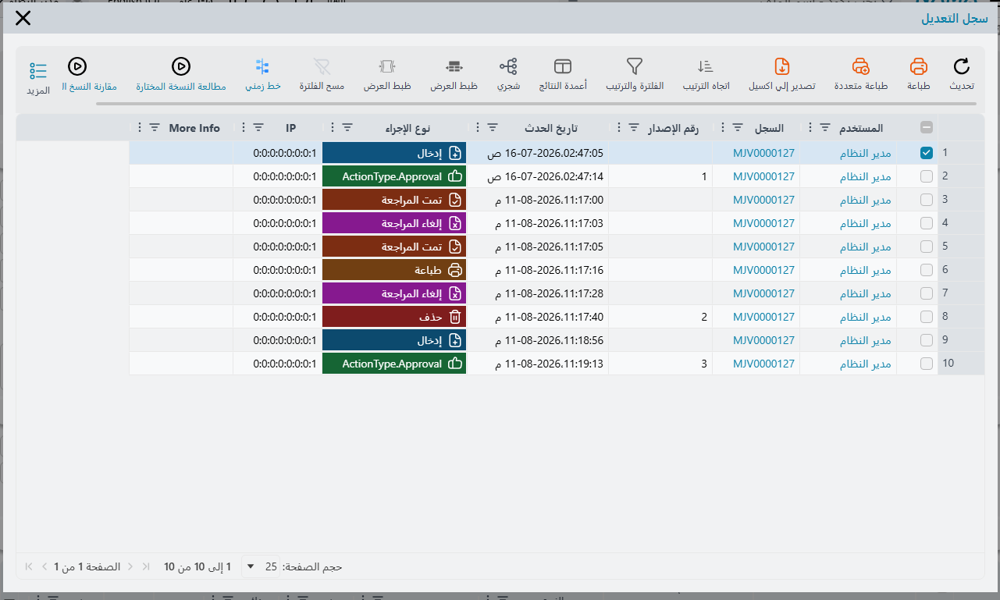
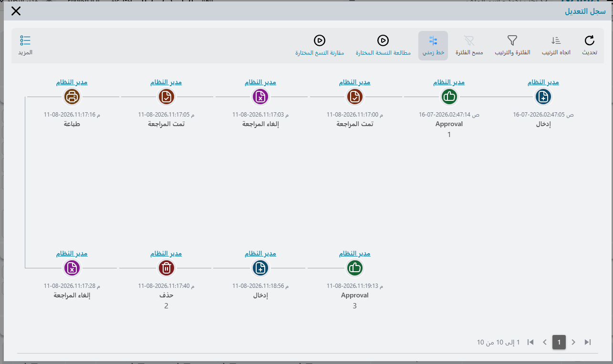

# سجل التعديل وتاريخ النسخ (Audit Trail and Version History)

عاجلًا أو آجلًا يسأل أحدهم السؤال الذي يجب على كل نظام تخطيط موارد أن يجيب عنه: *من غيّر هذا، وماذا
كان يقول قبل التغيير؟* حدُّ ائتمان عميل صار فجأة ضعف ما كان. فاتورة اعتُمدت الأسبوع الماضي صار
إجماليها مختلفًا. صرف مخزني يتذكر الجميع إنشاءه اختفى من القائمة.

ويجيب نما عن هذا السؤال دون أن يحتاج أحد إلى تفعيل شيء. ففي كل مرة يُحفظ فيها سجل، يحتفظ النظام
بـ**نسخة** منه — صورة كاملة مضغوطة للسجل كما كان — ويكتب سطرًا في **سجل التعديل** الخاص بالسجل يبيّن
من حفظه، ومتى، ومن أي جهاز، وما نوع التغيير. وسجل التعديل ليس ميزة خاصة بالفواتير أو بالعملاء؛ بل هو
موجود على كل سجل في النظام، بما في ذلك السجلات التي بنيتها بنفسك.

::: info أين تجده
افتح أي سجل واستعمل قائمة **المزيد**: **سجل التعديل** يعرض التاريخ نسخةً نسخة، و**سجل التعديل
التفصيلي** يعرض تغيّرات الحقول للحقول التي اخترت تتبّعها تفصيلًا.
:::

## قراءة سجل التعديل

نافذة سجل التعديل قائمة، سطر لكل إجراء مسجَّل، الأقدم في الأعلى. وهي تحمل الحقائق التي تحتاجها
لإعادة بناء ما حدث.

| العمود | ما يخبرك به |
|---|---|
| المستخدم (User) | من قام بالإجراء. |
| السجل (Record) | السجل الذي جرى عليه الإجراء. |
| رقم الإصدار (Version Number) | النسخة التي أنتجها الإجراء، حيث أنتج واحدة. |
| تاريخ الحدث (Action Date) | متى حدث، بدقة الثانية. |
| نوع الإجراء (Action Type) | نوع الإجراء — انظر القائمة أدناه. |
| IP | الجهاز الذي صدر عنه الإجراء. |
| More Info | سياق إضافي، إن وُجد. |

وليس كل سطر يحمل رقم إصدار. فالإجراءات التي تخزّن نسخة من السجل — تلك التي تستطيع لاحقًا مطالعتها أو
العودة إليها — تحصل على رقم؛ أما الإجراءات التي تكتفي بتسجيل أن شيئًا حدث، كالطباعة أو المراجعة،
فتترك العمود فارغًا. ولهذا تقفز الأرقام في العمود بدل أن تتوالى ١ و٢ و٣ نزولًا.

وكل عمود هو أيضًا حقل فلترة وعمود ترتيب، فتستطيع على سجل ذي تاريخ طويل أن تضيّق على مستخدم واحد أو
يوم واحد أو نوع إجراء واحد. و**اتجاه الترتيب** في شريط أدوات النافذة يقلب الترتيب حين تريد الأحدث
أولًا، و**تصدير إلى اكسيل** يُخرج السجل كاملًا لمراجع.

ويمكن قراءة القائمة نفسها في صورة **خط زمني** بدل الجدول — وزر **خط زمني** في شريط الأدوات يبدّل بين
العرضين. فيصير كل حدث بطاقةً عنوانها المستخدم، وفيها أيقونة ملوَّنة بحسب نوع الإجراء، والتاريخ، ورقم
الإصدار تحته، وهو أيسر في التصفح حين تروي لأحدهم قصة مستند.

### أنواع الإجراءات المسجَّلة

الحفظ ليس إلا واحدًا مما يستحق التسجيل، وعمود **نوع الإجراء** يميّز بينها.

- **إدخال** و**تعديل** و**حذف** — أُنشئ السجل أو غُيِّر أو أُزيل.
- **إضافة مسودة** — حُفظ السجل كمسودة بدل اعتماده. وهناك نوع منفصل لعمليات حفظ المسودة التلقائية التي
  تطلقها [حقول الحفظ التلقائي في الدفتر](/ar/platform/document-books).
- **الاعتماد** — تم الحفظ ضمن قرار اعتماد لا كتعديل مباشر. ويكتبه الجدول `ActionType.Approval`
  ويكتبه الخط الزمني `Approval`؛ وهما الإجراء نفسه. وتُسجَّل خطوات الاعتماد المنفردة أيضًا —
  الموافقة والرفض والإرجاع والتصعيد.
- **مراجَع** و**غير مراجَع** — انظر [المراجعة وإلغاء المراجعة](/ar/platform/revise-and-unrevise).
- **ملغي** و**غير ملغى**.
- **اعتماد تصدير** — جرى تصدير السجل.
- **طباعة** و**عرض تقرير** و**تصدير تقرير** — طُبع السجل أو شُغِّل تقرير عليه.
- **تسجيل دخول** و**تسجيل خروج** — أحداث الجلسة، وتظهر على سجل المستخدم نفسه لا على مستند.
- **Run Util** — شُغِّلت أداة إدارية على السجل. وإعادة معالجة السجل وأرشفته يظهران هنا.

و**More Info** هو المكان الذي يضيف فيه النظام الحقائق الصغيرة التي لا عمود لها. فحين يصل السجل عبر
استيراد، يذكر السجل نوع الاستيراد الذي جلبه. وحين يُنشأ السجل بإجراء «نسخة مماثلة»، يذكر السجل السجلَ
الذي نُسخ عنه — وهو غالبًا أسرع طريقة لتفسير سبب التشابه المريب بين مستندين.

## مطالعة السجل كما كان

سطر سجل التعديل ليس مجرد ملاحظة بأن شيئًا تغيّر؛ فالنسخة التي خلفه صورة كاملة من السجل. اختر سطرًا
واحدًا واستعمل **مطالعة النسخة المختارة** لفتح السجل تمامًا كما كان عند تلك النسخة — كل حقل وكل سطر
جدول كما كان في تلك اللحظة. والإجراء يريد سطرًا واحدًا بالضبط؛ فإن اخترت سطرين طلب منك تضييق الاختيار.

وهذه مطالعة فقط. أنت تنظر إلى التاريخ لا تعدّله.

## مقارنة نسختين

مطالعة نسخة قديمة تجيب عن سؤال «ماذا كان يقول؟». أما المقارنة فتجيب عن السؤال الأنفع: «ما الذي تغيّر
فعلًا؟».

وهناك طريقان.

**مقارنة النسخ المختارة** تعمل من داخل نافذة سجل التعديل: اختر **سطرين** بالضبط وسيعرض النظام ما تغيّر
بينهما. فإن اخترت سطرًا واحدًا أو ثلاثة سيطلب منك اثنين.

و**مقارنة نسختين** تسألك مباشرة. ولها سؤالان — **النسخة الأولي** و**النسخة الثانية** — وتعرض كل تغيّر
حقلٍ متتبَّع بينهما، وهي الأداة التي تلجأ إليها حين يقول أحدهم «كان سليمًا في النسخة ٣ وصار خاطئًا
بحلول النسخة ٩».

وتعتمد المقارنتان على التدقيق التفصيلي للحقول الموصوف تاليًا، فالحقل غير المتتبَّع تفصيلًا لن يظهر في
المقارنة حتى وإن كانت صور النسخ نفسها كاملة.

## التدقيق التفصيلي للحقول

تاريخ النسخ يخبرك بأن النسخة ٧ تختلف عن النسخة ٦. أما **التدقيق التفصيلي للحقول** فيخبرك *أي حقل*
تغيّر، ومن أي قيمة إلى أي قيمة — وهو السجل الذي يريده الناس فعلًا حين يتعلق الأمر بالمال.

وهو **اختياري لكل حقل** عن قصد. فأنت تسمّي الحقول الجديرة بالمراقبة — حد ائتمان، أو سعر بيع، أو نسبة
خصم — في جدول **حقول التدقيق**، الموصوف في
[سلوك السجل](/ar/platform/fields-and-entities-settings/fields-settings-record-behaviour). أما الحقول
التي لم تسمِّها فتبقى ملتقطة داخل صورة النسخة، لكنها لا تحصل على سطر خاص بها في السجل التفصيلي.

وبمجرد تتبّع حقل، يُنتج كل تغيير فيه سطرًا في **سجل التعديل التفصيلي**:

| العمود | ما يحمله |
|---|---|
| الحقل (Field) | الحقل الذي تغيّر. |
| القيمة القديمة / القيمة الجديدة | ما قبل وما بعد، كنص. |
| الرقم القديم / الرقم الجديد | ما قبل وما بعد حين يكون الحقل رقميًا. |
| المرجع القديم / المرجع الجديد | ما قبل وما بعد حين يشير الحقل إلى سجل آخر. |
| التاريخ القديم / التاريخ الجديد | ما قبل وما بعد حين يكون الحقل تاريخًا. |
| رقم الإصدار | النسخة التي حدث فيها التغيير. |
| تاريخ الحدث | متى حدث. |
| سطر جديد / سطر محذوف | يميّز التغييرات التي هي إضافة سطر جدول أو حذفه لا تعديل سطر قائم. |

وهذا الزوج الأخير مهم في المستندات. فالتدقيق التفصيلي يتتبع سطور الجداول كما يتتبع حقول الرأس، فالسطر
المضاف إلى جدول تفاصيل الفاتورة أو المحذوف منه يُسجَّل بوصفه كذلك، لا يُدمَج بصمت في تغيير رأس.

::: warning أبقِ قائمة الحقول المدقَّقة قصيرة
يكتب التدقيق التفصيلي سطورًا مع كل حفظ. وحفنة من الحقول المهمة تجاريًا لا تكلّف شيئًا تقريبًا؛ أما مئة
حقل مدقَّق على نوع مستند مزدحم فتُنتج سجلًا لن يقرأه أحد وجدولًا ينمو أسرع من المستندات نفسها.
:::

## إرجاع السجل إلى نسخة سابقة

لأن النسخ صور كاملة، يستطيع نما أن يعيد السجل إلى ما كان عليه. وإجراءا الإرجاع كلاهما في قائمة
**المزيد** في **شاشة القائمة**، وكلاهما يعمل على الأسطر التي اخترتها — فالخطأ الذي أصاب عشرين سجلًا
يمكن التراجع عنه دفعة واحدة.

**العوده للنسخه السابقة** تسأل سؤالًا واحدًا، **عدد مرات الرجوع**، وقيمته الافتراضية ١. أجب بـ ١ ليعود
السجل إلى ما كان عليه قبل نسخة واحدة، وبـ ٣ ليعود ثلاث نسخ.

و**العودة لنسخة في وقت محدد** تطلب **الوقت والتاريخ** وما إذا كنت تريد **آخر نسخة قبل التاريخ المحدد**
أم **أول نسخة بعد التاريخ المحدد**. وهذه هي التي تستعملها حين تعرف *متى* ساءت الأمور دون أن تعرف رقم
النسخة — «أعد هذه المستندات إلى ما كانت عليه قبل استيراد الأمس».

::: warning الإرجاع حفظ جديد لا تراجع
الإرجاع يأخذ النسخة القديمة ويحفظها بوصفها السجل الحالي. ومعنى ذلك أنه ينشئ نسخة **جديدة** أعلى
التاريخ — فلا شيء يُمحى، ويُظهر سجل التعديل الإرجاع بوصفه إجراء تعديل آخر. ويعني أيضًا أن الإرجاع يمر
بـ**كل عمليات التحقق المعتادة** لذلك السجل. فإن كانت النسخة القديمة تشير إلى دفتر صار غير نشط، أو إلى
فترة صارت مقفلة، فسيفشل الإرجاع تمامًا كما يفشل التعديل اليدوي.
:::

## تشغيل تتبع النسخ وإيقافه

تتبع النسخ مفعَّل جاهزًا. والخيار العام **تفعيل تتبع نسخ السجلات** في
[تبويب الاعتمادات](/ar/platform/global-config/global-config-approvals) هو ما يتحكم فيه، وهو مفعّل
افتراضيًا.

وتستطيع أنواع الكيانات المنفردة تجاوز الإعداد العام عبر إعداداتها الخاصة، وهكذا تُبقي التاريخ الكامل
على المستندات المالية بينما تعفي نوع سجل كثير الحركة قليل القيمة من تكلفة التخزين.

::: danger إيقافه يكلّفك السجل لا النسخ فحسب
تُكتب صورة النسخة وسطر سجل التعديل معًا. فإيقاف تتبع النسخ لكيان يفقدك القدرة على معرفة من غيّر
سجلاته، لا مجرد القدرة على استعادتها. ففكّر مرتين قبل فعل ذلك بأي شيء له أثر محاسبي أو مخزني.
:::

وتُخزَّن الصور مضغوطة، فتكلفة النسخة الواحدة أصغر مما يوحي به حجم السجل — لكنها على سجل يُعدَّل عشرات
المرات يوميًا تتراكم رغم ذلك، وهذا هو السبب الصادق لوجود التجاوز على مستوى الكيان.

## التحكم فيمن يرى السجل

إجراءات سجل التعديل إجراءات عادية، فهي تتبع القواعد المعتادة الموصوفة في
[ملفات الصلاحيات](/ar/platform/security/security-profiles): الإجراءات مسموحة ما لم يعطّلها سطر في
الملف. ولحجب السجل عن دور ما، أضف سطر تأمين إجراء للنوع يعطّل **سجل التعديل** و**سجل التعديل
التفصيلي** — ويعطّل معهما إجراءي الإرجاع إن كان الدور لا ينبغي أن يستطيع إعادة السجلات إلى الوراء.

ويستحق إجراءا الإرجاع انتباهًا خاصًا. فهما يعيدان كتابة سجلات حيّة بالجملة من شاشة قائمة، وخلافًا
للتعديل العادي لا يلزمان المستخدم بأن ينظر إلى ما يغيّره.
