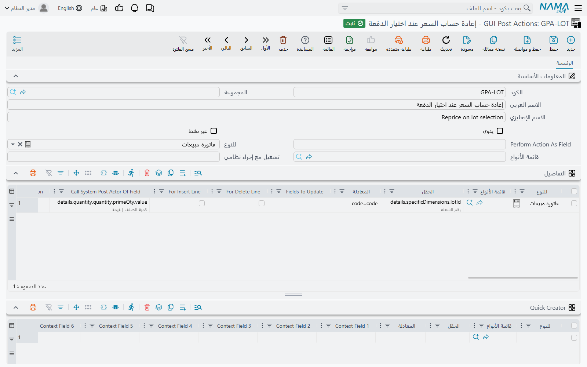

# الإجراءات بعد الإدخال (GUI Post Actions)

كل شاشة في نما تتفاعل أصلًا والمستخدم يكتب: اختر العميل فتمتلئ شروط الدفع، وغيّر الكمية فيُعاد حساب السعر. هذا التفاعل يحدث على الشاشة لحظة تغيّر الحقل، قبل أي حفظ بكثير. وشاشة **GUI Post Actions** تتيح لك إضافة تفاعلات خاصة بك على أي حقل في أي شاشة — نسخ قيمة من حقل إلى آخر، أو حساب عمود في الجدول من بقية أعمدة السطر نفسه، أو جعل حقل يشغّل التفاعل المدمج في النظام لحقل آخر.

استخدمها حين يقول العميل *«عندما أختار كذا، يجب أن تفعل الشاشة كذا فورًا»*. أما إن كان التغيير مطلوبًا عند الحفظ فقط، فالأداة المناسبة هي [مسار الكيان](/ar/platform/entity-flows/)؛ فالإجراء بعد الإدخال يخص ما يراه المستخدم وهو ما زال يحرر السجل.

الشاشة في *الأساسيات ← الإعدادات ← GUI Post Actions*. ويمكن للسجل الواحد أن يحمل أي عدد من السطور، ولذلك يشيع جمع كل الإجراءات الخاصة بشاشة واحدة، أو بطلب عميل واحد، في سجل واحد.

## كيف يعمل الإجراء

1. يغيّر المستخدم حقلًا — يكتب فيه، أو يختار مرجعًا، أو يغادر خانة في جدول.
2. يعمل تفاعل النظام الخاص بهذا الحقل أولًا، تمامًا كما لو لم يكن هناك إجراء منك.
3. ثم يعمل سطرك الخاص بهذا الحقل: ترسل الشاشة حقول السجل اللازمة إلى الخادم، وتُحسب **المعادلة** عليها، وتُكتب الحقول التي غيّرتها على الشاشة.
4. وإن كان السطر يسمّي تفاعل حقل آخر أو إجراء شاشة يُستدعى، فهذا يعمل في الأخير.

لا شيء من ذلك يحفظ السجل. يرى المستخدم القيم الجديدة على الشاشة ثم يحفظ كالمعتاد — أو يتجاهل التغييرات.

يرى المستخدمون الإجراء الجديد أو المعدَّل في المرة التالية التي يسجلون فيها الدخول.

## الشاشة

### الرأس

| الحقل | ما يفعله |
|---|---|
| **للنوع** (For Type) | الشاشة التي تنطبق عليها السطور، مثل *فاتورة مبيعات*. يُنسخ إلى كل السطور عند الحفظ. |
| **قائمة الأنواع** (Entity List) | [قائمة أنواع](/ar/platform/automation-and-rules/entity-type-lists.md) بدلًا من نوع واحد، فتخدم السطور نفسها عائلة من الشاشات. وتُنسخ كذلك إلى كل السطور. |
| **يدوي** (Manual) | يجعل السجل زرًا بدلًا من تفاعل مع حقل — انظر قسم «الإجراءات اليدوية» أدناه. |
| **Perform Action As Field** | مطلوب للإجراء اليدوي. اكتب أي قيمة؛ فعند الحفظ تُستبدل باسم داخلي للزر. |
| **تشغيل مع إجراء نظامي** (Run With System Action) | يشغّل السطور بعد نجاح أحد إجراءات الشاشة القياسية — انظر أدناه. وملؤه يعلّم **يدوي** تلقائيًا. |
| **غير نشط** (Inactive) | يوقف السجل كله. وحفظه غير نشط يعلّم كل سطوره غير نشطة كذلك. |

::: warning إعادة تنشيط السجل لا تعيد تنشيط سطوره
تعليم **غير نشط** في الرأس يوقف كل السطور أيضًا. وإلغاء التعليم لاحقًا لا يعيدها — ألغِ **غير نشط** على كل سطر تريد تشغيله من جديد، وإلا بقي السجل صامتًا.
:::

اترك **للنوع** و**قائمة الأنواع** فارغين في الرأس إن كانت السطور لشاشات مختلفة؛ فيحمل كل سطر نوعه.

### جدول التفاصيل

كل سطر تفاعل واحد.

| العمود | ما يفعله |
|---|---|
| **للنوع** / **قائمة الأنواع** | الشاشة أو الشاشات التي يعمل عليها السطر. والسطر الخالي منهما ينطبق على الحقل في كل شاشة تحتويه. |
| **الحقل** (On Field) | الحقل الذي يشغّل تغيّرُه السطرَ، بمعرّفه — `customer` أو `details.specificDimensions.lotId` أو `lines.n1`. ويمكن لعدة حقول مفصولة بفواصل أن تشترك في السطر. مطلوب. |
| **المعادلة** (Expression) | ما يجب فعله، مكتوبًا كخريطة حقول: `الهدف=المصدر` في كل سطر، وهي اللغة نفسها التي تستخدمها مسارات الكيان (انظر [Field Maps](/entity-flows/core/ai-generated-field-maps-documentation.md)). مطلوب. |
| **Fields To Update** | الحقول التي تعيد الشاشة قراءتها بعد التنفيذ. يُترك فارغًا في الغالب — انظر المثال الثالث. |
| **For Insert Line** / **For Delete Line** | يشغّلان السطر عند إضافة سطر إلى جدول أو حذفه منه بدلًا من تغيّر حقل. ويجب حينها أن يكون **الحقل** هو الجدول نفسه (`details`) لا أحد أعمدته. |
| **Call System Post Actor Of Field** | بعد المعادلة، يشغّل تفاعل النظام المدمج لحقل آخر، كأن المستخدم غيّره للتو. |
| **Call GUI Action** | بعد المعادلة، يشغّل أحد إجراءات الشاشة بمعرّفه. |
| **Context Field 1 … 30** | الحقول التي يجب أن ترسلها الشاشة حتى تُحسب المعادلة. تُملأ نيابة عنك — انظر التلميح في المثال الثاني. |
| **المعايير** (Criteria) | [تعريف معايير](/ar/platform/automation-and-rules/criteria-definitions.md): لا يعمل السطر إلا إذا طابقه السجل. |
| **معيار عدم التفيذ** (Reversed Criteria Definition) | العكس: يُتخطّى السطر إذا طابقه السجل. |
| **تطبيق عند التوافق مع الاستعلام** / **منع التطبيق عند التوافق مع الاستعلام** | الشرطان نفساهما مكتوبين كاستعلام SQL على السجل بدلًا من معايير محفوظة. |
| **ملاحظات** (Description) | ملاحظتك عن الغرض من السطر. |
| **غير نشط** | يوقف هذا السطر وحده. |

### جدول Suggestion Providers

مزوّد الاقتراحات يعرض قائمة منسدلة بقيم مقترحة والمستخدم يكتب في حقل نصي — مثلًا الأوصاف التي استُخدمت في سجلات سابقة. املأ **للنوع** (أو **قائمة الأنواع**) و**الحقل** و**Suggestion Query** يعيد القيم. ويجب أن يحتوي الاستعلام على `top` و`distinct` والعنصر النائب `$csg` الذي يمثّل ما كتبه المستخدم حتى الآن. ويُستبدل `@entity@` باسم نوع الكيان للشاشة قبل تنفيذ الاستعلام. مثال:

```sql
select distinct top 15 name1 from @entity@ where name1 like '%' + {$csg} + '%'
```

يُعرض 25 اقتراحًا على الأكثر.

## الإجراءات اليدوية: أزرار وإجراءات لاحقة

علّم **يدوي** فلا تعود السطور تنتظر تغيّر حقل، بل:

- **كزر.** املأ **Perform Action As Field** واحفظ، ثم أضف السجل إلى الشاشة كزر عبر [معدِّل الشاشة](/ar/platform/screen-modifier/screen-modifier-action-buttons.md) — فعموده **GUI Post Actions** لا يقبل إلا السجلات اليدوية. والضغط على الزر يشغّل السطور على السجل كما هو على الشاشة.
- **بعد إجراء قياسي.** املأ **تشغيل مع إجراء نظامي** بمعرّف أحد إجراءات الشاشة القياسية. فكلما انتهى هذا الإجراء بنجاح عملت السطور على النتيجة، دون حاجة إلى معدِّل شاشة.

وفي الحالتين يُملأ **الحقل** في السطور نيابة عنك عند الحفظ، فاتركه للنظام.

## أمثلة عملية

ينتهي كل مثال بكتلة *JSON للاستيراد المباشر*. ولتحميلها افتح سجل GUI Post Actions جديدًا والصقها كما هو مشروح في [الاستيراد إلى السجل المفتوح أمامك](/ar/platform/import-export/importing-records.md#lstyrd-l-lsjl-lmftwH-mmk).

### إعادة حساب السعر عند اختيار الشحنة

في فاتورة المبيعات يجب أن يتبع السعرُ الشحنة: فإن كان للشحنة سعر خاص في قائمة الأسعار، أو كانت مشمولة في عرض يتضمن خصمًا، فاختيارها يجب أن يحدّث السعر فورًا. والنظام يعيد حساب السعر بشكل صحيح أصلًا عند تعديل الكمية — لكن هذا يعني أن على المستخدم إعادة كتابة الكمية بعد اختيار الشحنة.

يكفي سطر واحد على عمود الشحنة. **الحقل** فيه هو الشحنة، و**Call System Post Actor Of Field** يسمّي الكمية، فيشغّل اختيارُ الشحنة تفاعلَ النظام الخاص بالكمية — ومعه إعادة حساب السعر — دون أن يلمس أحد الكمية. أما المعادلة `code=code` فلا تغيّر شيئًا؛ وهي موجودة فقط لأن **المعادلة** حقل مطلوب.

::: details JSON للاستيراد المباشر
```json
{
  "lines": [
    {
      "forType": "SalesInvoice",
      "fieldID": "details.specificDimensions.lotId",
      "expression": "code=code",
      "callPostActorOfField": "details.quantity.quantity.primeQty.value"
    }
  ]
}
```
:::



### حساب عمود في الجدول من أعمدة أخرى في السطر نفسه

يكتب المستخدم كمية في `n1` وسعرًا في `n2` على سطر سند قيد، والمطلوب أن يظهر في `n3` حاصل `n1 × n2` فورًا — قبل حفظ المستند، وعلى السطر الذي يحرره هو دون بقية السطور.

أضف سطرًا لكل حقل يُفترض أن يُشغّل الحساب. ضع في **الحقل** الحقل الذي يكتب فيه المستخدم (`lines.n1`)، واكتب الحساب في **المعادلة** مع تسمية الهدف ببادئة **الجدول** نفسه:

```ini
lines.n3=sql(select isnull(try_cast({lines.n1} as decimal(20,6)), 0)
                  * isnull(try_cast({lines.n2} as decimal(20,6)), 0))
```

ثلاثة أشياء تُنجح هذه المعادلة أو تُفشلها:

- **سمِّ الهدف ببادئة الجدول** (`lines.n3` أو `details.n3`) لا باسم الحقل وحده. و`$line.n3` يعمل أيضًا — فداخل إجراء على حقل في جدول يعني `$line` السطر الذي يحرره المستخدم — لكن بادئة الجدول هي الصيغة التي تعمل كذلك في كل أنواع خرائط الحقول الأخرى. راجع [Field Maps — Line Selection](/entity-flows/core/ai-generated-field-maps-documentation#Line-Selection).
- **احمِ كل عنصر نائب قد يكون فارغًا.** الخانة التي لم يملأها المستخدم بعد تصل كـ `NULL`، وSQL Server يعامل الـ `NULL` غير المحدَّد النوع كنص: بدون غلاف `isnull(try_cast(…))` يفشل الإجراء برسالة `Operand data type nvarchar is invalid for multiply operator` أول مرة تكون فيها إحدى الخانتين فارغة — وهو حال السطر أثناء كتابته في أغلب الوقت.
- **غطِّ كل مُشغِّل.** الإجراء لا يعمل إلا للحقل المذكور في **الحقل**، فالحساب الذي يجب أن يتبع الطرفين يحتاج سطرًا لـ `lines.n1` وآخر لـ `lines.n2` — أو سطرًا واحدًا قيمة **الحقل** فيه `lines.n1,lines.n2`.

::: tip حقول السياق تملأ نفسها
أعمدة **Context Field 1 … 30** تحدد ما يجب أن ترسله الشاشة إلى الخادم حتى تُحسب المعادلة. لا تملؤها بيدك — فهي تُستنتج من المعادلة والحقل وشروط السطر فور كتابتها، فإن بدت خاطئة فصحّح المعادلة ودعها تُكتب من جديد.
:::

::: details JSON للاستيراد المباشر
```json
{
  "lines": [
    {
      "forType": "JournalEntry",
      "fieldID": "lines.n1",
      "expression": "lines.n3=sql(select isnull(try_cast({lines.n1} as decimal(20,6)), 0) * isnull(try_cast({lines.n2} as decimal(20,6)), 0))"
    },
    {
      "forType": "JournalEntry",
      "fieldID": "lines.n2",
      "expression": "lines.n3=sql(select isnull(try_cast({lines.n1} as decimal(20,6)), 0) * isnull(try_cast({lines.n2} as decimal(20,6)), 0))"
    }
  ]
}
```
:::

### ما فائدة عمود Fields To Update؟

بعد تنفيذ المعادلة تُبلَّغ الشاشة بالحقول التي تعيد قراءتها من النتيجة. وإن تُرك **Fields To Update** فارغًا حُسب نيابة عنك: كل حقل على **يسار** علامة `=` في المعادلة يُحدَّث، وهو المطلوب في أغلب الحالات.

املأه حين تغيّر المعادلة حقلًا ليس على يسار `=` — قيمة تُضبط بطريق غير مباشر عبر `switchTarget`، أو `runCommand` يعيد حساب المستند، أو حقل يعتمد عليه حساب حقل آخر. فكل ما لا يُذكر هنا يبقى على الشاشة بقيمته القديمة حتى يُحفظ السجل ويُفتح من جديد، وإن كان الخادم قد غيّره فعلًا.

اكتب الحقول كما تسميها المعادلة تمامًا، مفصولة بفواصل أو بأسطر:

```ini
lines.n3, lines.n4
```

## رسائل قد تظهر لك

لا توجد ترجمة عربية لأي من هذه الرسائل؛ فهي تظهر بالإنجليزية على الشاشات العربية أيضًا.

| الرسالة | السبب | ما العمل |
|---|---|---|
| *You selected With Insert (Or Delete) Line, so the field {0} cannot be used because it is not a detail field.* | في السطر علامة **For Insert Line** أو **For Delete Line**، لكن **الحقل** فيه حقل من الرأس. | ضع في **الحقل** معرّف الجدول نفسه (`details` أو `lines`). |
| *You selected With Insert (Or Delete) Line, so the field {0} is a column name, please select a detail field not a column (most probably you mean the field {1})* | العلامتان نفسهما، لكن **الحقل** يسمّي عمودًا في الجدول بدلًا من الجدول. | استخدم الحقل الذي تقترحه الرسالة مكان `{1}`. |
| *Suggestion query MUST contain top and distinct keywords, in addition to $csg parameter to mitigate performance problems, an example:* (يليها استعلام مثال) | **Suggestion Query** ينقصه `top` أو `distinct` أو العنصر النائب `$csg`. | أضف الثلاثة، كما في المثال أعلاه. |
| *GUI Post Actions {0} must be manual* | تظهر من معدِّل الشاشة حين يسمّي عموده **GUI Post Actions** سجلًا غير يدوي. | علّم **يدوي** على الإجراء، أو اختر إجراءً يدويًا. |

## انظر أيضًا

- [Field Maps](/entity-flows/core/ai-generated-field-maps-documentation.md) — لغة المعادلات
- [إضافة أزرار إلى الشاشة](/ar/platform/screen-modifier/screen-modifier-action-buttons.md) — وضع الإجراء اليدوي كزر
- [قوائم الأنواع](/ar/platform/automation-and-rules/entity-type-lists.md) و[تعريفات المعايير](/ar/platform/automation-and-rules/criteria-definitions.md)
