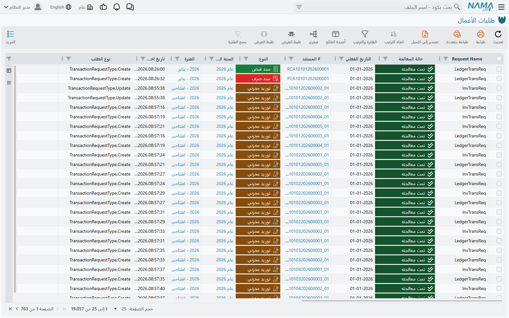
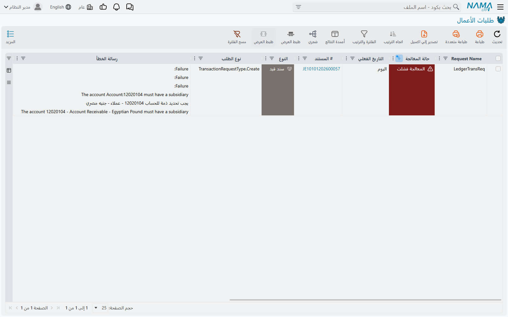

# طلبات الأعمال (Business Requests)

حين تحفظ فاتورة، لا يُكتب القيد المحاسبي الخاص بها وأنت تنتظر. يأخذ نما عملية الحفظ، ويعيد إليك
الشاشة، ثم يُنشئ **طلب أعمال** (Business Request) — وهو تعليمة صغيرة يوجّهها النظام إلى نفسه يقول
فيها: «هذا المستند يحتاج أثره المحاسبي». وبعد لحظة يلتقط عاملٌ في الخلفية هذه التعليمة ويكتب القيد.

الغاية من هذا الترتيب أن يبقى الحفظ فوريًا مهما كانت آثاره ثقيلة، وأن يكون الأثر الذي يتعثّر قابلًا
للفحص ولإعادة التشغيل دون المساس بالمستند. وثمن ذلك أن المستند قد يكون محفوظًا وصحيحًا بينما آثاره
غائبة — وحين يحدث ذلك، فهذه هي الشاشة التي تخبرك بالسبب.

::: info أين تجدها
**الأساسي ← إدارة النظام ← الإعدادات ← طلبات الأعمال.** أمّا المدخل المجاور، **طلبات الأعمال
المحفوظة**، فهو جزء من الآلية نفسها ويأتي شرحه أدناه.
:::

## النوعان اللذان ستراهما فعلًا

كل مستند له آثار يُنشئ أحد هذين أو كليهما:

- **طلب محاسبي** يكتب قيد المستند في دفتر الأستاذ،
- و**طلب مخزني** يُحرّك الكميات والتكاليف في المخازن.

فاتورة المبيعات تُنشئ الاثنين عادةً. القيد اليومي يُنشئ الأول فقط. والتحويل المخزني يُنشئ الثاني فقط.

ليس هناك نوع ثالث. عمود **Request Name** يخبرك بنوع السطر، وعمود **Reqyest Type** — وهكذا يظهر
مكتوبًا على الشاشة، فابحث عنه بهيئته هذه — يقول ما إذا كان الطلب قد نشأ عن إنشاء المستند أو تعديله
أو حذفه. وحذف مستند مُرحَّل يُنشئ طلبًا أيضًا: فالآثار لا بد أن تُفَكّ، وهذا الفكّ قد يفشل تمامًا كما
كان يمكن أن يفشل الأصل.

## قراءة حالة المعالجة

هذا هو العمود الذي يتعلّق به كل ما عداه.

| الحالة | معناها |
|---|---|
| **بانتظار المعالجة** | أُنشئ ولم يُلتقط بعد. أمر طبيعي لبضع ثوانٍ. |
| **إعادة المعالجة** | في الطابور لمحاولة أخرى بناءً على طلب أحدهم. |
| **جاري المعالجة** | قيد التنفيذ الآن. ولا يمكث في هذه الحالة مدةً تُذكر إلا احتساب تكلفة المخزون. |
| **تمت معالجته** | انتهى. الأثر موجود. |
| **المعالجة فشلت** | فهم النظام العمل ورفضه — فترة مقفلة، أو حساب ناقص، أو قاعدة قالت لا. |
| **المعالجة فشلت بواسطة Exception** | تعطّل العمل على نحوٍ غير متوقّع. وغالبًا ما يكون ثغرة في الإعداد لا قاعدة عمل. |

والفرق بين الأخيرتين مهم عند الفرز. فـ**المعالجة فشلت** تذكر سببها بنفسها في عمود **رسالة الخطأ**،
وهي قابلة للإصلاح على يد المُطبِّق: افتح الفترة، أو عيّن الحساب الناقص، أو صحّح التوجيه. أمّا
**المعالجة فشلت بواسطة Exception** فغالبًا ما تكون خللًا بنيويًا، والتفصيل الذي تحتاجه في عمود
**Error Desciption** — وهكذا يظهر مكتوبًا على الشاشة أيضًا — إذ يحمل النص التقني الكامل بدل الملخّص
المكوَّن من سطر واحد.

::: warning لا شيء يعيد محاولة طلب فاشل من تلقاء نفسه
لا يوجد عدّاد محاولات، ولا حدّ أقصى، ولا تباعد بين المحاولات، ولا استسلام في النهاية. فالعامل لا
يبحث إلا عن الطلبات المنتظِرة أو تلك التي طُلبت إعادة معالجتها صراحةً، ومن ثَمّ فإن الطلب في اللحظة
التي يصل فيها إلى **المعالجة فشلت** يكفّ عن أن يكون شأن أحد سواك. سيبقى هناك، دون تغيير، ما بقيت
قاعدة البيانات.

هذه أهم حقيقة مفردة عن هذه الشاشة. فالنظام الهادئ ليس دليلًا على أن شيئًا لم يفشل — هو فقط دليل على
أن أحدًا لا يسأل. فلتر على حالة المعالجة وانظر.
:::

## العثور على ما تعثّر

فلتر **حالة المعالجة** على قيمتي الفشل ورتّب حسب **التاريخ الفعلي**. هذا هو الفرز كلّه.

وما يعود
إليك سطرٌ لكل أثر معطوب، يحمل كلٌّ منها رقم المستند ونوعه والسنة المالية والفترة ونصّ الخطأ.

وثمة عمودان يستحقّان الانتباه لأنهما يجيبان عن سؤال «متى تعطّل هذا، وهل لمسه أحد بعدها»: **تاريخ اخر
تحديث للمستند** هو موعد آخر تغيير طرأ على المستند نفسه، و**التاريخ الفعلي** هو التاريخ الذي ينتمي
إليه الأثر. والطلب الذي جرى تحديث مستنده بعد الفشل يعني عادةً أن أحدهم عالج السبب بالفعل ثم لم يُعِد
تشغيل الطلب قط.

أمّا عمود **العملية** فيسمّي العملية التي أنشأت الطلب، وبه تُفرّق بين أثرٍ أنشأه مستخدم يحفظ مستندًا
وآخر أنشأته مهمة مجدولة أو أداة جماعية.

::: tip يمكنك الوصول إلى السطور نفسها من أحد المحددات
لكل شركة وقطاع وفرع وإدارة ومجموعة تحليلية تبويب **الجداول النظامية**، وثلاث من القوائم فيه هي
الطلبات المحاسبية والطلبات المخزنية وحالاتها، مُضيَّقة سلفًا على ذلك المحدد. وهو طريق أسرع حين تعلم
أن المشكلة محصورة في شركة واحدة.
:::

## الشيئان اللذان يمكنك فعلهما

اختر السطور وافتح قائمة **المزيد**. فيها إجراءان يخصّان هذه الشاشة — وما عداهما هو المدخلات العامة
الموجودة في كل قائمة — والمهارة كلّها في الاختيار بينهما.

### إعادة المعالجة

**إعادة المعالجة** تُعيد الطلب إلى الطابور. لا تغيّر شيئًا في المستند ولا شيئًا في الطلب سوى حالته،
ويلتقطه العامل خلال ثانية تقريبًا.

وهذا ما تريده حين يكون الطلب قد فشل لسبب عولج منذ ذلك الحين وكان المستند نفسه سليمًا دائمًا — كانت
الفترة مقفلة وصارت مفتوحة، أو كان الحساب ناقصًا فصار موجودًا، أو كان سعر الصرف غائبًا فأُدخل. ويُعاد
تشغيل الطلب كما أُنشئ أول مرة تمامًا.

### إعادة الحفظ

**إعادة الحفظ** أثقل. فهي ترجع إلى المستند المصدر وتُرحّله من جديد من الصفر، فيُطرح الطلب القائم
ويُنشأ طلب جديد من محتوى المستند الحالي.

استخدمها حين يكون المستند قد تغيّر بعد إنشاء الطلب، أو حين تشكّ في أن الطلب نفسه بُني خطأً لا أنه
نُفِّذ في لحظة سيئة فحسب. ولأنها تُرحّل مستندات حقيقية، فإنها تُشغّل كل قاعدة وكل تحقّق على المستند،
وقد تفشل لأسباب لا صلة لها بالمشكلة الأصلية.

::: warning إعادة الحفظ تحتاج صلاحية تعديل السجلات المُرحَّلة
إعادة المعالجة متاحة لكل من يرى قائمة المزيد هنا. أمّا إعادة الحفظ فتحتاج فوق ذلك حقّ تعديل السجلات
بعد ترحيلها، وفي التركيبات التي يُمنع فيها هذا الحق يغيب الزر ببساطة. فإذا نظر شخصان إلى الشاشة
نفسها ولم يرَ إعادة الحفظ إلا أحدهما، فهذا هو السبب.
:::

::: tip جرّب إعادة المعالجة أولًا
إعادة المعالجة هي الأداة الأصغر والأأمن، ومتى عولج السبب الجذري فعلًا كانت كافية عادةً. أمّا إعادة
الحفظ فهي الجواب حين تُجرَّب إعادة المعالجة فيفشل الطلب بالطريقة نفسها، وهو ما يدلّك على أن الطلب
ذاته — لا توقيته — هو المشكلة.
:::

## طلبات الأعمال المحفوظة

تعرض الشاشة المجاورة المعلومات نفسها عن الطلبات في مرحلة أبكر. فحين يُرحَّل المستند يُدوَّن الطلب
كاملًا أولًا، ولا يتحوّل إلى الطلب الحيّ الذي تراه في الشاشة الرئيسية إلا حين يلتقطه العامل — وعندها
تُزال النسخة المدوَّنة.

ولذلك فإن **هذه الشاشة فارغة أو تكاد** في أي نظام سليم. والسطور التي تظهر وتختفي خلال ثوانٍ هي
الآلية وهي تعمل. أمّا السطور التي تمكث وتتراكم فتعني أن العامل لا يعمل أصلًا، وتلك مشكلة مختلفة
وأخطر من أي فشل مفرد: إنها مشكلة على مستوى الخادم لا على مستوى المستند.

ولا توجد إجراءات على هذه الشاشة. هي للنظر إليها.

## متى يجري العمل فعلًا

لكل نوع من الطلبات عاملُه الخاص، وكل عامل يعمل وحده وبطلب واحد في كل مرة. وإن تُرك وشأنه استيقظ على
مؤقّت؛ غير أن كل عملية حفظ تنبّهه، فتُلتقط الطلبات في النظام المزدحم خلال ثانية أو نحوها من إنشائها،
ولا يهمّ المؤقّت إلا في النظام الهادئ.

::: info لا تجري أي معالجة في الدقائق الأولى بعد إعادة التشغيل
يتريّث العاملون عمدًا عدة دقائق بعد بدء الخادم، حتى لا يُصدَم النظام المُعاد تشغيله بطابور متراكم
وهو ما يزال في طور التسخين. فتراكم سطور **بانتظار المعالجة** بُعيد إعادة التشغيل أمر متوقّع ويزول
من تلقاء نفسه.
:::

وثمة حالة واحدة تستحق أن تُعرَف لأنها تبدو فشلًا وليست كذلك. فالطلب المحاسبي الذي يتعذّر كتابته لأن
الفترة التي ينتمي إليها فوقها قيد إقفال يبقى عند **بانتظار المعالجة** — ولا يُوسَم فاشلًا أبدًا،
لأن شيئًا لم يُخطئ؛ العمل فقط لا يمكن أداؤه بعد. والطلبات التي انتظرت أطول بكثير مما تفسّره إعادة
تشغيل هي هذه الحالة غالبًا.

## اطّلع أيضًا على

- [المهام المعلقة](/ar/platform/background-processing/pending-tasks) — طابور الرسائل الصادرة، وهو
  طابور مختلف بشاشة مشابهة
- [متابعة التقارير](/ar/platform/background-processing/report-monitoring) — مراقبة تشغيل التقارير
- [التحكم في الفترات المالية](/ar/platform/fiscal-period-control-guide) — قاعدة الفترة المقفلة التي
  تقف خلف نصيب كبير من الطلبات المحاسبية الفاشلة
