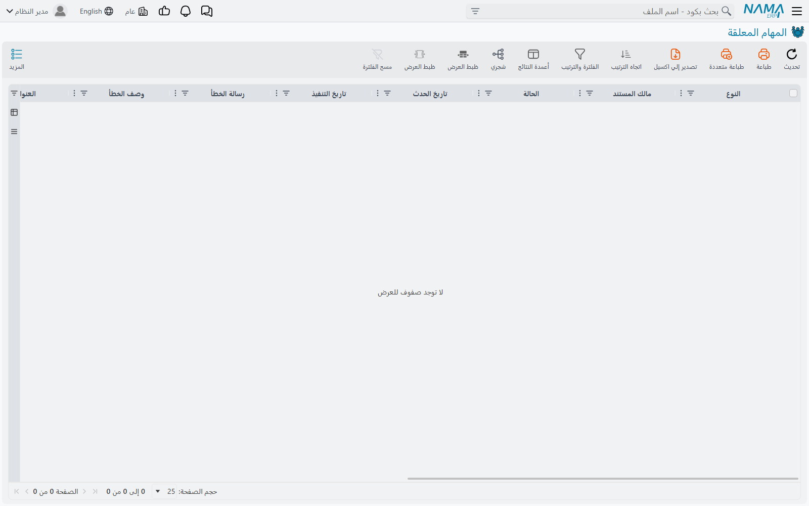

# المهام المعلقة (Pending Tasks)

رغم عمومية الاسم، هذه الشاشة شيء واحد محدّد: **صندوق الصادر**. فكل رسالة يبعث بها نما إلى العالم
الخارجي — بريد إلكتروني، ورسالة نصية، وواتساب، وإشعارات دفع إلى تطبيق الهاتف — تُوضَع هنا في الطابور
أولًا، ثم يرسلها عاملٌ في الخلفية بعد لحظة.

وهذا يجعلها أول ما يُنظر فيه كلما قال أحدهم إن رسالة لم تصل. فالسؤال الذي تجيب عنه الشاشة ليس «هل
حاول النظام» بل «إلى أي مدى وصل، وماذا قال الطرف الآخر».

::: info أين تجدها
**الأساسي ← إدارة النظام ← الإعدادات ← المهام المعلقة.**
:::

## ما الذي يضع الأشياء هنا

كل ما يُخطر أحدًا تقريبًا. طلبات الموافقة المنتظِرة لدى مدير، وتعريفات الإشعارات التي تنطلق على
مستند، والتقارير المجدولة التي تُرسَل بالبريد على مؤقّت، وإعادة تعيين كلمات المرور، والرسائل
المرسَلة من سكربت أو من مسار كيان، وتحذيرات الـ Replication. تصل كلها هنا سطورًا وتغادر رسائلَ
مُرسَلة.

ويفصل بينها عمود **النوع**، ومما يجدر معرفته أن إحدى قيمه تتصرّف على نحو مختلف عن البقية: فالمهمة من
نوع **Create Notification** ليست رسالة صادرة أصلًا ولا تُرسَل إلى أي جهة. ولا يُرسَل فعليًا سوى البريد
والرسائل النصية والواتساب وإشعارات الدفع.

ويشير عمود **المالك** إلى ما أنشأ الرسالة، وتوفّر الشاشة فلترًا سريعًا على أنواع المالكين — وهو أسرع
طريقة لفصل حركة الموافقات، مثلًا، عن حركة التقارير المجدولة.

## قراءة السطر

الأعمدة التي تهمّ حين يتعثّر شيء هي **الحالة** و**Trials** و**رسالة الخطأ**، وللرسائل النصية عمود
**SMS Response** — وهو ردّ بوابة الرسائل نفسها، وغالبًا ما يكون أدقّ بكثير من أي شيء يستطيع نما قوله
من عنده.

| الحالة | معناها |
|---|---|
| **Initial** | في الطابور ولم تُجرَّب بعد. |
| **Retry** | جُرِّبت وفشلت وتنتظر محاولة أخرى. |
| **Executed** | أُرسلت. |
| **Blocked** | استُسلم لها. ولن يعيد أحد محاولتها. |
| **PostPoned** | مُؤجَّلة لأن الوقت الحالي خارج النافذة المسموح بالإرسال فيها. |

و**PostPoned** هي الحالة التي تبدو معطوبة أكثر من غيرها وليست كذلك. فالرسالة التي لها نافذة إرسال
تُترك جانبًا حتى تُفتح النافذة، والطابور يعود إلى الرسائل المتروكة على فترات لا باستمرار — فقد تمكث
الرسالة المؤجَّلة بضع دقائق بعد فتح نافذتها قبل أن تتحرّك. وهذا طبيعي.

::: warning Trials ليس عدد المحاولات
يبدو عمود **Trials** عدّادًا للمحاولات وليس كذلك. هو كلفة تراكمية، ولأنواع الفشل المختلفة كلفٌ
مختلفة: الرسالة المرفوضة لسبب يتعلق بقواعد العمل تضيف خمسة، والتي تتعطّل على نحو غير متوقّع تضيف
عشرة. وحين يتجاوز المجموع السقف المحدَّد في الإعدادات العامة — **Max Retray Number For Pending
Tasks**، وهكذا يظهر مكتوبًا، تحت الإشعارات والمراسلات ← إعدادات الإرسال — تصير المهمة **Blocked**.

وبالسقف الافتراضي يعني ذلك نحو خمسين محاولة للرسالة التي يتكرّر رفضها، ونحو خمس وعشرين للتي يتكرّر
تعطّلها. فالمهمة التي تُظهر Trials بقيمة ٤٠ لم تُجرَّب أربعين مرة، والقفزة بمقدار عشرة بين نظرتين هي
فشلٌ واحد لا عشرة.
:::

## ما يمكنك فعله

ثلاثة إجراءات في قائمة **المزيد**، وهي أقلّ تشابهًا مما توحي به أسماؤها.

**إعادة تنفيذ المهام المختارة** تُعيد السطور المؤشَّرة إلى الطابور *وتُصفّر كلفتها*. وهذا التصفير هو
الجزء المهم: فهو السبيل الوحيد لإحياء مهمة **Blocked**. ومتى عولجت المشكلة الأصلية — عاد خادم البريد
متاحًا، أو صُحِّحت بيانات الدخول، أو أُصلح رقم الهاتف — فهذا هو الإجراء الذي يُحرّك الطابور المتراكم.

**حذف المهام المختارة** يزيل السطور المؤشَّرة. لا يسأل شيئًا ولا يتحقّق من شيء، فقد تُحذف رسالة لم
تُرسَل بعد مع الرسائل التي أُرسلت.

::: warning حذف المهام المنفذة يتجاهل الفلتر والاختيار
الإجراء الثالث لا يحذف السطور المنفَّذة التي تنظر إليها. بل يحذف **كل** سطر في قاعدة البيانات حالته
Executed، مهما كان المعروض على الشاشة ومهما أشّرت أنت.

وهذا هو المطلوب عادةً — فهو أداة صيانة، والرسائل المرسَلة هي الشيء الآمن إزالته. لكنه ليس «رتّب هذا
العرض»، وفي نظام لم يُنظَّف قط سيزيل أكثر بكثير من الصفحة التي أمامك.
:::

ولا تُزال الرسائل المرسَلة تلقائيًا، فتتراكم الشاشة. وتنظيف المهام المنفَّذة على فترات، أو ترك أدوات
الأرشفة تأخذها، صيانةٌ اعتيادية.

::: info يمكن إخفاء قائمة المزيد كلها
تقع الإجراءات الثلاثة خلف صلاحية واحدة تغطّي قائمة المزيد على هذه الشاشة. والمستخدم الذي لا يملكها
يرى الطابور جيدًا ولا يستطيع أن يفعل به شيئًا — وهي طريقة معقولة لمنح فريق الدعم رؤيةً دون القدرة على
حذف طابور.
:::

## حين لا يُرسَل شيء البتّة

إذا كان الطابور يمتلئ ولا يغادره شيء، فالسبب غالبًا ليس على هذه الشاشة.

هناك إعدادان يقرّران ما إذا كان هذا الخادم مسموحًا له بالإرسال أصلًا. فتحت الإعدادات العامة ←
**الإشعارات والمراسلات** ← **إعدادات الإرسال**، الخيار الذي يسمّي الخوادم المسموح لها بإرسال البريد
والرسائل النصية هو صمّام أمان مقصود: ففي التركيبات التي فيها نسخة اختبارية من قاعدة البيانات الحيّة
يمنع النسخةَ من مراسلة عملاء حقيقيين. والخادم الذي لا يرد معرّفه في تلك القائمة سيُكدّس الرسائل إلى
الأبد ولن يُرسل منها شيئًا.

والأمر نفسه ينطبق على نظام يعمل في وضع التطوير، فهو لا يرسل شيئًا ما لم يُؤمَر بذلك صراحةً.

::: tip اضبط إشعارًا عند الفشل
تحت إعدادات الإرسال أيضًا حقلٌ يسمّي إشعارًا ينطلق عند فشل مهمة. وتوجيهه إلى شخص سيقرؤه فعلًا يحوّل
هذه الشاشة من شيء عليك أن تتذكّر فحصه إلى شيء يخبرك متى يحتاج الفحص.
:::

## اطّلع أيضًا على

- [طلبات الأعمال](/ar/platform/background-processing/business-requests) — طابور الآثار المحاسبية
  والمخزنية للمستند
- [الإشعارات](/ar/platform/notifications/) — ما يُنشئ معظم هذه الرسائل ابتداءً
- [المهام المجدولة](/ar/platform/scheduled-tasks) — مجدول المهام، بما فيه التقارير المُرسَلة بالبريد
