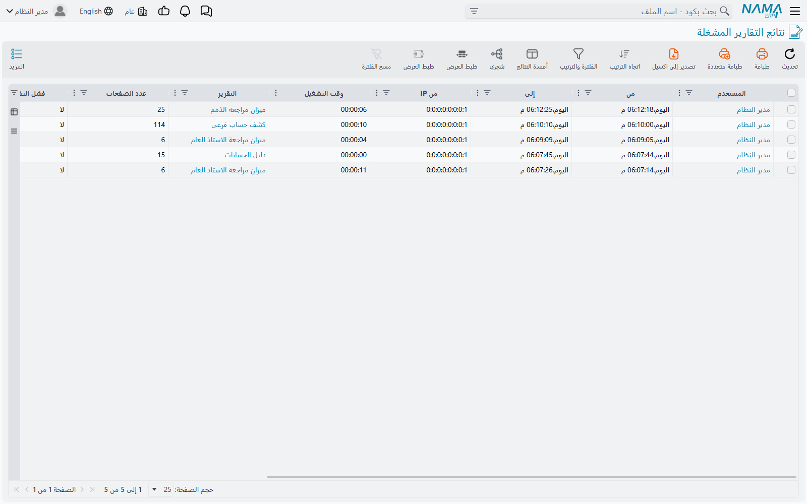
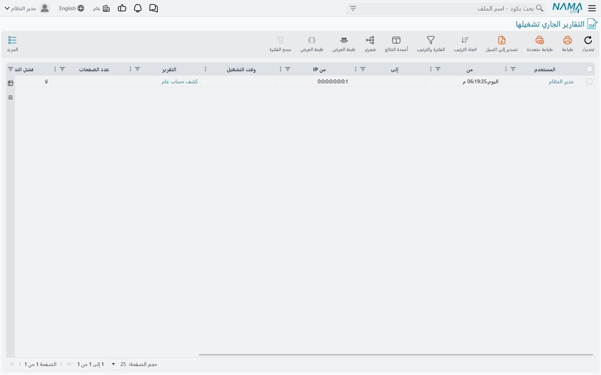

# متابعة التقارير (Reports Monitoring)

التقرير الذي يستغرق ثلاثين ثانية والتقرير المعلَّق يبدوان من الخارج سواء — مؤشّر دوّار، ومستخدم يسأل
هل يواصل الانتظار. وهاتان الشاشتان هما ما تفرّق به بينهما، وما تُنهي به تشغيلًا لن ينتهي أبدًا.

::: info أين تجدهما
**الأساسي ← التقارير ← متابعة التقارير**، وفيها مدخلان: **التقارير الجاري تشغيلها** و**نتائج التقارير
المشغلة**.
:::

## الشاشتان، وفيمَ تختلفان

تبدوان متطابقتين لأنهما كذلك، مبنيّتان من القائمة نفسها بالأعمدة نفسها والفلاتر نفسها والإجراءات
نفسها. والفرق الوحيد فيما تعرضه كل منهما:

- **التقارير الجاري تشغيلها** لا تعرض إلا ما هو قيد التشغيل الآن.
- **نتائج التقارير المشغلة** تعرض تلك *وما انتهى أيضًا*.

فالأولى تجيب عن «بماذا ينشغل الخادم الآن»، والثانية عن «ما الذي شُغِّل مؤخرًا». وإذا ظهر تشغيلٌ في
الثانية دون الأولى فقد انتهى.

ويخبرك كل سطر بأي تقرير، ومن بدأه، ومتى، وكم مضى عليه، وكم استغرق حين ينتهي.

::: warning هاتان الشاشتان لا تتذكّران إلا اليومين الأخيرين وتنسيان كل شيء عند إعادة التشغيل
القائمة التي خلفهما محفوظة في الذاكرة لا مخزَّنة، وتُقلَّم على مؤقّت: فما مضى عليه نحو يومين يُسقَط،
ويختفي كل شيء عند إعادة تشغيل الخادم.

وهذا يجعلهما مرقابًا حيًّا لا تاريخًا. أمّا سؤال «ما الذي شغّله هذا المستخدم الشهر الماضي» فجوابه في
سجل التقارير الموصوف أدناه، وهو شيء آخر يُحفظ في مكان آخر.
:::

## إنهاء تشغيل لن ينتهي

يحمل كل سطر رابط **إيقاف التقرير**. واتّباعه يطلب من قاعدة البيانات إيقاف الاستعلام الذي ينتظره
التقرير؛ وتؤكّد ذلك صفحةٌ صغيرة تُغلق نفسها بعد ثوانٍ.

وهذا مقاطعة حقيقية لا رجاءً مهذّبًا — يتوقّف التشغيل، ويرى المستخدم فشله، ولا يبقى شيء نصف مكتوب،
لأن التقرير لا يفعل شيئًا سوى القراءة. والسبب المعتاد للجوء إليه تقريرٌ شغّله أحدهم على مدى تواريخ
أوسع بكثير مما قصد، فشغل قاعدة البيانات عن الجميع.

::: tip التشغيل المُوقَف أو الفاشل يختفي ولا يمكث
تحتفظ القائمة بما اكتمل وتُسقط ما فشل أو أُوقف عند التقليم التالي. فالتقرير الذي تعطّل لا يُرى هنا
إلا لبرهة، والتقليم يجري كل دقيقتين تقريبًا.

فإن احتجت رؤية الخطأ الذي واجهه المستخدم، فالتقطه وهو على الشاشة، أو اطلب منه إعادة التشغيل — إذ
ليس ثمة موضع آخر يُدوَّن فيه.
:::

## سجل التقارير

بمعزل عن العرض الحيّ، يستطيع نما تسجيل كل تشغيل مكتمل في قاعدة البيانات، حيث يبقى حتى يزيله أحد.
وهذا السجل هو ما يجيب عن أسئلة الماضي: أي التقارير بطيء، ومن يشغّل ماذا، وكم مرة يُعاد طبع نموذج.

وهو مُطفأ حتى تشغّله، من الإعدادات العامة ← **التقارير والطباعة** ← **تسجيل تشغيل التقارير** ←
**تسجيل أداء التقارير في قاعدة البيانات**. ويبدأ التسجيل فور الحفظ.

::: info تبويب سجل التقرير يحتاج إعادة توليد الشاشات قبل أن يظهر
يبدأ السجل نفسه بالامتلاء بمجرد تفعيل الخيار، لكن التبويب الذي يعرضه جزء من تصميم شاشة تعريف
التقرير، والتصميمات تُبنى مرة وتُخزَّن. فإلى أن يُعاد توليد الشاشات تُكتَب السطور ولا يوجد مكان
لمطالعتها.

فإذا فعّلت الخيار ولم يظهر التبويب، فهذه هي الخطوة الناقصة — لا دليلًا على أن شيئًا لا يُسجَّل.
:::

ويسجّل كل قيد التقريرَ والمستخدمَ وعنوان المصدر والمدخلات التي شُغِّل بها ومتى بدأ وكم استغرق وصيغة
المخرجات — وللنموذج المطبوع من مستند: أي سجل طُبع له وكم مرة.

### ما الذي يُسجَّل وما لا يُسجَّل

ثلاثة مفاتيح في مجموعة **تسجيل تشغيل التقارير** نفسها، وهي تعمل مستقلًّا بعضها عن بعض لا كمفتاح رئيس
وتابعَين:

| النشاط | يُسجَّل حين |
|---|---|
| تشغيل تقرير من قائمة التقارير | يكون **تسجيل أداء التقارير في قاعدة البيانات** مفعّلًا |
| تصدير نتيجة إلى PDF أو Excel أو Word | يكون مفتاح التصدير الخاص به مفعّلًا |
| طباعة نموذج من مستند | يكون مفتاح النماذج الخاص به مفعّلًا |

ويُكتب التصدير قيدًا ثانيًا إلى جانب التشغيل الذي جاء منه، فتصدير النتيجة نفسها ثلاث مرات يعطيك
التشغيل وثلاثة قيود تصدير.

ولهذا نتيجتان تستحقّان المعرفة. فلأن المفاتيح مستقلّة، تفعيل الأول وحده يعطيك تشغيل التقارير
التفاعلي ولا شيء غيره — لا تصديرًا ولا نماذج مطبوعة. ولأن طباعة نموذج لا تُعدّ تشغيل تقرير، فإن
النماذج المطبوعة لا تظهر على شاشتَي المتابعة البتّة؛ إنما تظهر في السجل وحده.

::: warning التقارير المجدولة والمُرسَلة بالبريد لا تُسجَّل
التقرير الذي يرسله مجدول المهام لا يكتب قيدًا في السجل مهما قالت هذه المفاتيح. فالمجدول يحتفظ بسجل
تنفيذ خاص به — انظر [المهام المجدولة](/ar/platform/scheduled-tasks) — وهو موضع التحقّق من خروج تقرير
البارحة.
:::

ويسجّل السجل ما اكتمل من تشغيل. أمّا التشغيل الفاشل فلا يُكتب، وهذا هو النصف الآخر من سبب قلّة ما
يخلّفه التقرير المعطوب وراءه: فهو مرئيّ على شاشتَي المتابعة ما دام يعمل، وبعد فشله لا يبقى ما
يُبحث عنه.

## اطّلع أيضًا على

- [التقارير](/ar/platform/reports/) — بناء التقارير وتشغيلها
- [المهام المجدولة](/ar/platform/scheduled-tasks) — التقارير المُرسَلة والمطبوعة على مؤقّت، بسجل
  تنفيذ خاص بها
- [طلبات الأعمال](/ar/platform/background-processing/business-requests) — طابور الآثار المحاسبية
  والمخزنية للمستند
