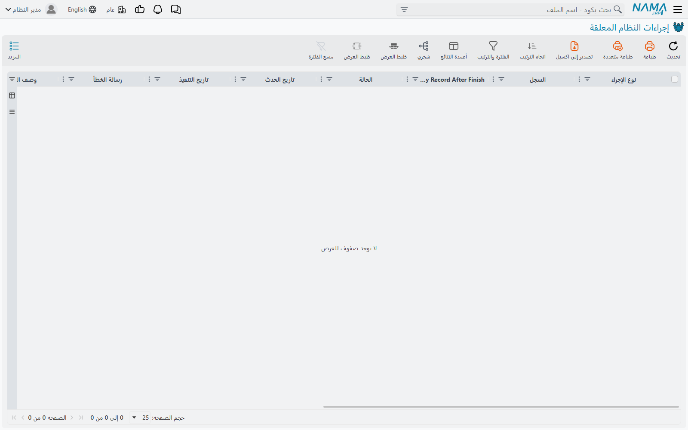

# إجراءات النظام (System Actions)

شاشتان متجاورتان في القائمة باسمين يكادان يتطابقان، ولا علاقة لإحداهما بالأخرى. **إجراءات النظام
المعلقة** طابورُ عملٍ ما زال على النظام أن يؤدّيه. و**إجراءات النظام الآلية** سجلٌّ لشيء أدّاه النظام
بالفعل. الأولى قائمة مهام، والثانية دفتر يوميات.

::: info أين تجدهما
**الأساسي ← إدارة النظام ← الإعدادات**، بعد المهام المعلقة مباشرةً — **إجراءات النظام المعلقة** أولًا،
ثم **إجراءات النظام الآلية**.
:::

## إجراءات النظام المعلقة

بعض العمليات أبطأ من أن يُنتظر لها، وبعضها لا يمكن تنفيذه لحظةَ طلبه لأن شيئًا آخر ينبغي أن يحدث
أولًا. فتُدوَّن هذه هنا وتُنفَّذ في الخلفية بعد لحظة.

وسترى حفنةً من الأنواع لا أكثر:

| نوع الإجراء | ما هو |
|---|---|
| **Regen Salary Document** / **Regen Salary Sheet** | إعادة بناء مستند رواتب أو مسيّر رواتب بعد تغيّر شيء يعتمد عليه. |
| **Create Contracting Cost Entries** | تحويل عمالة مستند الرواتب إلى قيود تكلفة على أعمال المقاولات. |
| **Send HTTP Request** | مناداة نظام خارجي — يُنشئه مسار كيان أو تكامل. |
| **Send Impl File** | نسخ سجل إعدادات إلى خادم النسخ الاحتياطي للتطبيق. |

يشير عمود **Target Record** إلى ما يدور حوله الإجراء، ويسمّي **Requester** من تسبّب فيه، ويحمل
**Extra Info** و**Request Response** التفصيل — وللمناداة الخارجية يكون نصّ الاستجابة هو ردّ الطرف
الآخر.

::: tip الشاشة السليمة شاشة فارغة
الإجراء الذي ينجح يُحذف، لا يُوسَم منتهيًا. فهذه الشاشة في أي نظام عامل فارغةٌ في معظم الوقت،
والسطور التي عليها إمّا قيد التنفيذ الآن وإمّا عالقة.

وثمة استثناء واحد: يمكن وسم الإجراء ليبقى بعد نجاحه، وتلك السطور تمكث عند **Executed** عن قصد.
:::

وتُنفَّذ الإجراءات واحدًا تلو الآخر على مستوى النظام كلّه، لا اثنان معًا — ولهذا قد يستغرق تفريغ
الطابور بعض الوقت وإن كان كل بند سريعًا.

::: warning الإجراء الفاشل طريق مسدود
لا توجد أزرار على هذه الشاشة. لا إعادة محاولة، ولا إعادة معالجة، ولا حذف. والعامل لا يلتقط إلا
الإجراءات المنتظِرة أو التي وُضعت في حالة إعادة المحاولة — وهي حالة لا يُعيد إليها شيءٌ إجراءً فاشلًا.

فالإجراء الذي يفشل قد انتهى أمره. يبقى على الشاشة بنصّ خطئه، ولن يعمل مرة أخرى من تلقاء نفسه، وليس
ثمة سبيل مدعوم لمطالبته بذلك. ولا بد من إطلاق العمل من مصدره من جديد: أعِد حفظ مستند الرواتب، أو
أعِد تشغيل مسار الكيان، أو كرّر ما طلبه أيًّا كان.
:::

ولأن السطور الفاشلة لا تُنظَّف أبدًا، فإن هذه الشاشة تستحق نظرةً عابرة بين الحين والآخر حتى لو لم
يشتكِ أحد. فالقائمة المتنامية ببطء من حالات الفشل هي في الحقيقة تراكمٌ لعملٍ لم يحدث قط.

## إجراءات النظام الآلية

هذه سجلٌّ لكاتبٍ واحد. فحين يُصلح النظام تكاليف المخزون وكمياته التي حادت عن الاتساق، يدوّن أنه فعل
ذلك — وهذا وحده ما يظهر هنا.

ولذلك يحمل كل سطر **Action Name** نفسه، وهو `UpdateCurrentNetCostAndCurrentNetQty`، الاسم الداخلي
لذلك الإصلاح. والمتغيّر هو **Action Description**، الذي يسرد الحركات المخزنية المحدَّدة التي صُحِّحت،
و**Submission Date** الذي يخبرك متى. أمّا عمود **Target Record** فيبقى فارغًا دائمًا.

وليس على هذه الشاشة ما يُفعَل، ولا شيء يقرؤها. هي تجيب عن سؤال واحد وتجيبه جيدًا: *هل صحّح النظام
تكاليف المخزون في صمت، ومتى، ولأي حركات؟* وحين يتحرّك تقييم مخزون ولا يستطيع أحد تفسيره، فهذا هو
السؤال الذي تريد جوابه.

## اطّلع أيضًا على

- [طلبات الأعمال](/ar/platform/background-processing/business-requests) — طابور الآثار المحاسبية
  والمخزنية للمستند
- [المهام المعلقة](/ar/platform/background-processing/pending-tasks) — طابور الرسائل الصادرة
- [مسارات الكيانات](/ar/platform/entity-flows/) — أحد ما يُنشئ المناداة الخارجية
