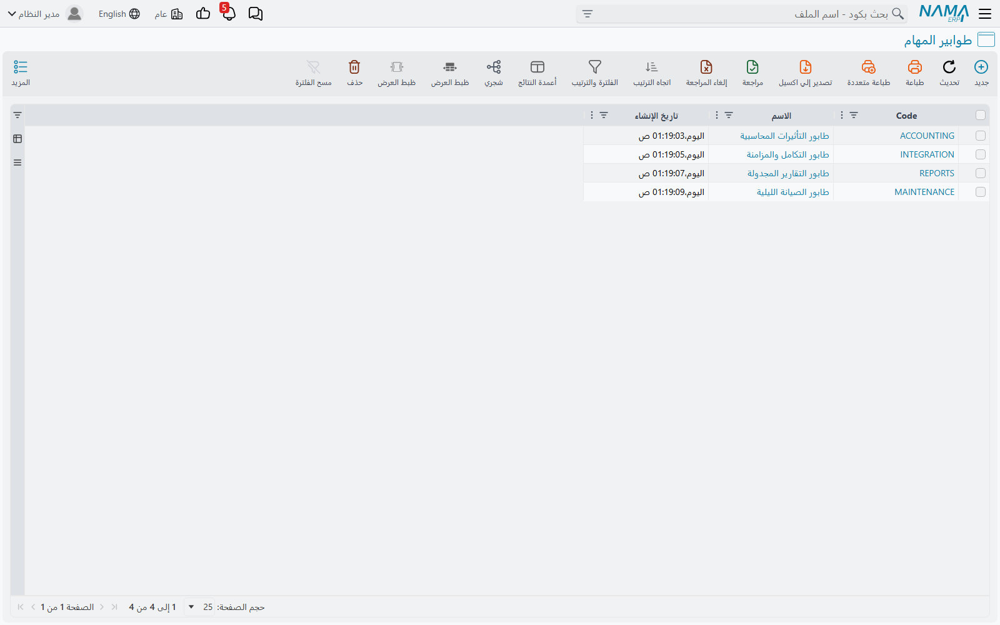
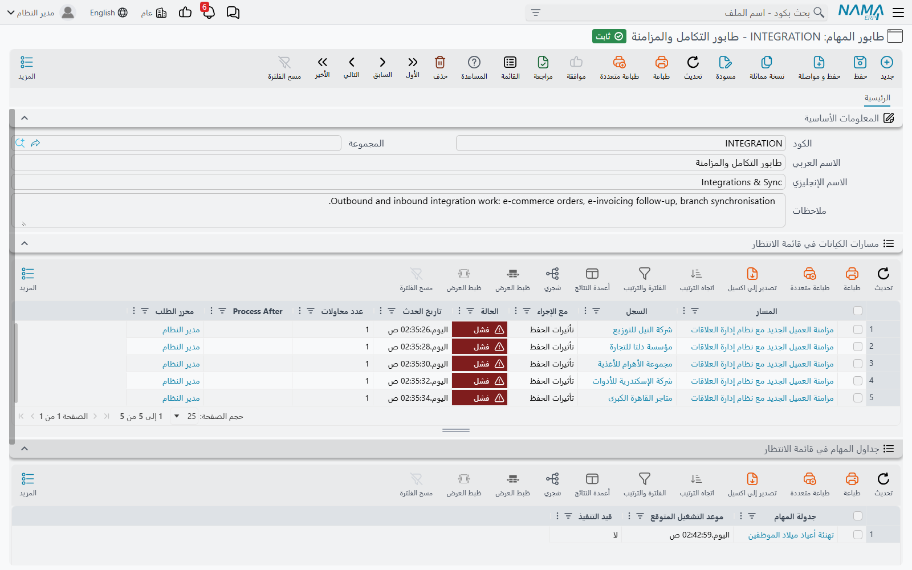
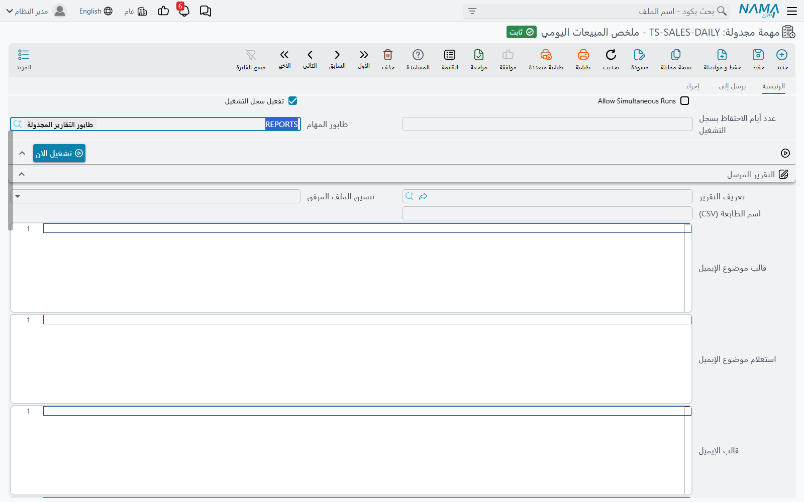
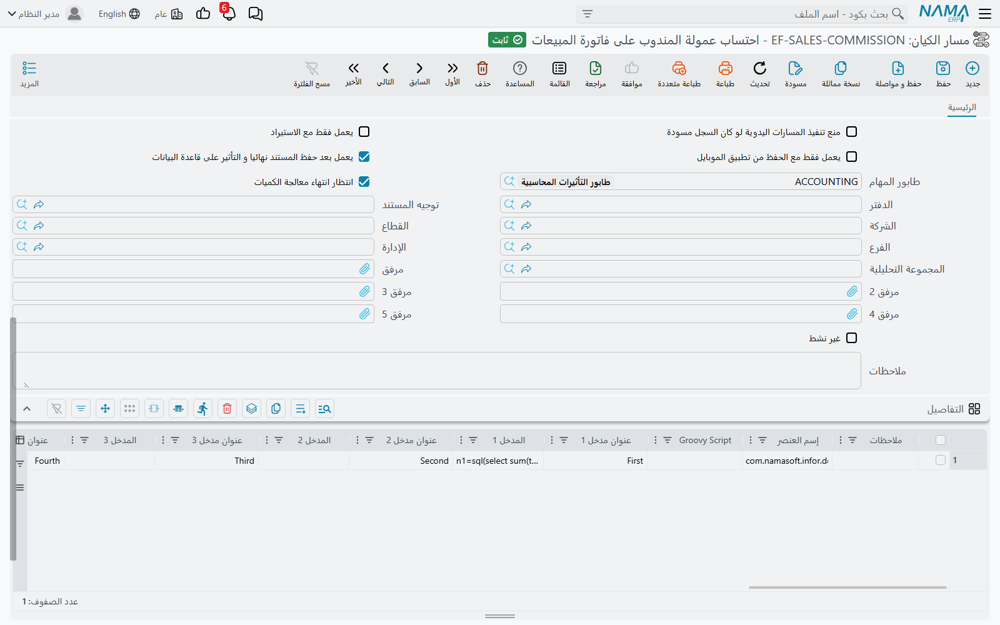
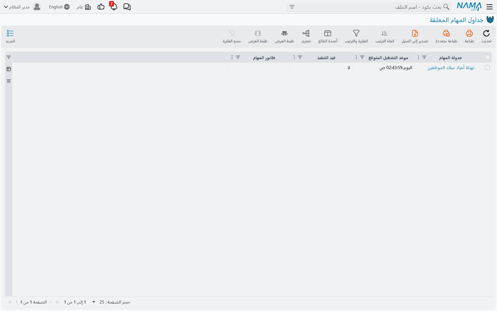

# طوابير المهام (Task Queues)

يقوم نظام نما دائمًا بتنفيذ الأعمال الثقيلة خلفك بدلًا من أن تنتظرها أنت. التقرير المجدول يخرج في
السابعة صباحًا دون أن يكون أحد على الشاشة، ومسار الكيان الذي يحسب عمولة المندوب على الفاتورة يعمل بعد
حفظ الفاتورة بلحظة، لا أثناء الحفظ.

المشكلة — حتى الآن — أن كل هذا كان يسير في صف واحد. خيط واحد يشغّل كل المهام المجدولة، الواحدة تلو
الأخرى. وعامل واحد يلتقط كل مسارات الكيان المؤجلة، الواحد تلو الآخر. هذا آمن بالتأكيد، فلا يمكن
لمهمتين أن تتصادما إذا كانت واحدة فقط تتحرك في كل لحظة، لكنه يعني أن تقريرًا ليليًا يستغرق أربعين
دقيقة يعطّل مزامنة الطلبات التي كان من المفترض أن تعمل كل خمس دقائق، وأن مسار تكلفة ثقيلًا على أمر
صرف مخزني يجعل كل مسارات الكيان الأخرى في النظام تنتظر دورها.

**طابور المهام (Task Queue)** يقسّم هذا الصف الواحد إلى المسارات التي تحتاجها. هو مسار له اسم، ولا شيء
تقريبًا غير ذلك: كود واسم ووصف. الذي يمنحه معناه هو ما توجّهه إليه. جدولتا مهام على طابورين مختلفين
تعملان فعلًا في نفس الوقت، ومساران للكيان على طابورين مختلفين يعالجهما عاملان مختلفان. أما داخل
الطابور الواحد فيظل العمل يسير واحدًا تلو الآخر وبالترتيب، تمامًا كما كان.

::: info أين تجده
**الأساسيات ← الإعدادات ← طابور المهام.**
:::

## لا يتغير شيء حتى تطلب ذلك

هذه هي النقطة المطمئنة. كل جدولة مهام وكل مسار كيان لا تلمسه يبقى حقل **طابور المهام** فيه فارغًا، وكل
ما طابوره فارغ يبقى يتشارك مسارًا واحدًا مدمجًا في النظام — نفس الصف الواحد الذي كان يعمل فيه دائمًا.
والتركيب الذي لا يُنشئ أي طابور مهام يعمل تمامًا كما كان يعمل من قبل.

لذلك فالسؤال ليس أبدًا «هل أفعّل هذه الخاصية؟»، بل «أي مهمتين تعطّل إحداهما الأخرى؟». تُنشئ طابورًا
للإجابة، وتترك كل ما عداه في مكانه.

## إنشاء طابور

المطلوب تعبئته قليل جدًا، لأن الطابور نفسه لا يملك سلوكًا خاصًا به.

| الحقل | ماذا تضع فيه |
|---|---|
| **الكود (code)** | معرّف قصير وثابت — `INTEGRATION` أو `REPORTS` أو `MAINTENANCE`. ستختار الطوابير بالكود في كل مكان في النظام. |
| **الاسم (name1 / name2)** | الغرض من المسار بكلمات واضحة: *طابور التكامل والمزامنة*، *طابور الصيانة الليلية*. |
| **الوصف (remarks)** | يستحق أن تكتبه. بعد ستة أشهر سيكون السؤال «لماذا أُنشئ هذا الطابور؟»، وهذا الحقل هو المكان الوحيد الذي يحمل الإجابة. |

أسفل المعلومات الأساسية يوجد جدولان مطويان — **مسارات الكيانات في قائمة الانتظار** و**جداول المهام في
قائمة الانتظار**. هما كل قصة المتابعة لهذا الطابور، وسنتناولهما بعد قليل.

## وضع المهام المجدولة على طابور

افتح جدولة المهام واضبط حقل **طابور المهام** فيها. هذا هو الإعداد كله.

القاعدة التي تنتج عن ذلك بسيطة، ويستحق أن تُقال صراحة لأن كل ما بعدها يعتمد عليها:

> الجدولات الموضوعة على طوابير **مختلفة** يمكن أن تعمل في نفس الوقت. والجدولات الموضوعة على **نفس**
> الطابور لا تفعل ذلك أبدًا — كل واحدة تنتظر انتهاء التي قبلها.

خذ مجموعة واقعية من ثماني مهام مجدولة. ثلاث منها ترسل تقارير بالبريد في الصباح الباكر، واثنتان
استعلامات صيانة ثقيلة تعمل في الثانية صباحًا، واثنتان تسحبان بيانات من نظام خارجي كل عشر أو خمس عشرة
دقيقة، وواحدة تهنئ الموظفين في أعياد ميلادهم. لو تُركت كلها في مسار واحد، فإن مهمة الصيانة التي تتجاوز
وقتها في الثانية صباحًا تؤخّر التقرير المستحق في السادسة والنصف، وتنتظر مزامنة العشر دقائق خلفهما
معًا. أما بتوزيعها على ثلاثة طوابير — *طابور التقارير المجدولة* و*طابور الصيانة الليلية* و*طابور
التكامل والمزامنة* — فتبتعد التقارير والصيانة والمزامنة عن طريق بعضها، وتظل التقارير الثلاثة تسير في
صف مرتب فيما بينها، وهو ما كنت تريده أصلًا.

أما تهنئة أعياد الميلاد فتُركت بلا طابور، وتعمل في المسار الافتراضي. ليس كل شيء يحتاج إلى طابور.

::: warning الطابور وعد بالتوازي، وليس وعدًا بالأمان
قبل الطوابير لم يكن بإمكان مهمتين مجدولتين أن تتداخلا، فكانت المهام التي تلمس نفس السجلات آمنة
بالصدفة. وإذا وضعتهما على طابورين مختلفين فسوف تعملان فعلًا في نفس الوقت. فإذا كانت مهمتان تكتبان في
نفس البيانات، فأبقهما على **نفس** الطابور — فهذه هي الوظيفة الأخرى للطابور، ولا تقل فائدة عن التقسيم.
:::

## وضع مسارات الكيانات على طابور

مسارات الكيانات تحتاج خطوة تمهيدية واحدة، لأن المسار لا يصل إلى طابور أصلًا إلا إذا كان مؤجَّلًا.

معظم مسارات الكيانات تعمل ضمن الحفظ: تحفظ العميل، فيعمل المسار، ثم ينتهي الحفظ. لكن يمكن تعليم المسار
بخيار **يعمل بعد حفظ المستند نهائيا و التأثير على قاعدة البيانات**، وهذا يغيّره تمامًا. فيُحفظ المستند
ويُعتمد، وتُرفع تأثيراته المحاسبية والمخزنية، وتستعيد أنت الشاشة — وعندها فقط، وبشكل منفصل، يُلتقط
المسار ويُشغَّل. ولا يُسمح لأي شيء في المسار أن يبطّئ الحفظ أو يفشله.

هذه المسارات المؤجلة هي التي تصطف في الطوابير، وهي التي يستحق ضبط حقل **طابور المهام** فيها.

تنطبق هنا نفس قاعدة الجدولات: المسارات على طوابير مختلفة يعالجها عاملون مختلفون وتعمل في نفس الوقت،
والمسارات على طابور واحد تُعالَج واحدًا تلو الآخر بترتيب رفعها. أما المسار الذي يُترك بلا طابور
فيتولاه العامل الافتراضي مع بقية المسارات غير المخصصة.

وهناك ثلاثة حقول أخرى في المسار يستحق ضبطها في نفس الوقت، لأنها لا تعني شيئًا إلا حين يعمل المسار في
الخلفية دون أن يراقبه أحد:

| الحقل | ماذا يفعل |
|---|---|
| **Max Retry Count** | كم مرة يُعاد تشغيل التشغيل الفاشل قبل أن يستسلم النظام ويتركه فاشلًا. إذا تُرك فارغًا فالفشل نهائي من المحاولة الأولى. |
| **Retry Every Seconds** | كم ينتظر النظام قبل كل إعادة محاولة. مفيد حين يعتمد المسار على شيء خارج نما يكون غير متاح لفترة قصيرة. |
| **انتظار انتهاء معالجة الكميات** | يحجز المسار ما دامت هناك أعمال مخزنية لم تُعالَج بعد. اضبطه حين يقرأ المسار كميات المخزون أو التكاليف، وإلا فقد يقرأ أرقامًا على وشك أن تتغير. |

## قاعدتان تُبعدان الطوابير عن المتاعب

تشغيل العمل بالتوازي يثير قلقًا بديهيًا: مساران يمدّان يدهما إلى نفس السجل في نفس اللحظة. هناك قاعدتان
تعالجان ذلك، ولا تحتاج أي منهما إلى إعداد.

**سجل واحد في كل مرة، عبر جميع الطوابير.** إذا كان مسار على طابور يعمل الآن على سجل، ووصل مسار على
طابور آخر إلى نفس السجل، فإن الثاني لا ينتظر ولا يفشل. بل يتنحّى — يُؤجَّل ثانيتين ويعود إلى طابوره،
ويكمل المسار الذي كان فيه إلى المدخل التالي. وبعد لحظة يأتي دوره من جديد فيجد السجل حرًا فيعمل. وفي
جدول **مسارات الكيانات في قائمة الانتظار** يظهر ذلك كمدخل قيمة **Process After** فيه بعد ثوانٍ قليلة
من الآن؛ فإذا صادفت واحدًا فهو يفعل بالضبط ما ينبغي.

**الترتيب محفوظ داخل الطابور.** ولأن الطابور يعمل عليه عامل واحد، تُعالَج مدخلاته بترتيب رفعها. فإذا
كان لا بد أن يسبق المسار «أ» المسار «ب»، فوضعهما على نفس الطابور هو الضمان الذي تبحث عنه.

## متابعة عمل الطابور

جدولان على شاشة الطابور نفسه، وقائمة واحدة للنظام كله.

**مسارات الكيانات في قائمة الانتظار** — على شاشة الطابور — تعرض مدخلات المسارات المنتظرة في هذا
الطابور، ولكل منها **الحالة** و**تاريخ التقديم** و**عدد المحاولات** و**Process After**، إضافة إلى
السجل الذي ستعمل عليه. والجدول الفارغ هو الحالة السليمة: معناه أن العامل يلاحق العمل أولًا بأول.
والصفوف التي تبقى فيه وعدد محاولاتها يتصاعد هي التي تستحق النظر. ومن قائمة **المزيد** في هذا الجدول
يمكن حذف المدخلات المختارة نهائيًا، وهي الطريقة للتخلي عن عمل لن ينجح أبدًا.

**جداول المهام في قائمة الانتظار** — على شاشة الطابور أيضًا — تعرض الجدولات المخصصة لهذا الطابور مع
**موعد التشغيل المتوقع** لكل منها وما إذا كانت **قيد التنفيذ** الآن. وهي أسرع طريقة للتأكد من أن
الطابور يفعل ما أنشأته من أجله.

**جداول المهام المعلقة** — في **الأساسيات ← الإدارة ← الإعدادات ← جداول المهام المعلقة** — هي نفس
المعلومات لكل الطوابير دفعة واحدة، مع عمود **طابور المهام** لترى كيف توزّع العمل. وهي الشاشة التي
تفتحها حين يسأل أحدهم لماذا لم تعمل مهمة ما: فإن لم تكن في هذه القائمة فهي غير مجدولة أصلًا، والسبب في
المهمة نفسها — إما موقوفة، أو غير معتمدة، أو مقصورة على موقع آخر.

::: tip موعد التشغيل المتوقع وقيد التنفيذ حقلان حيّان
هذان الحقلان غير مخزّنين على جدولة المهام، بل يُقرآن من المجدوِل العامل في لحظة فتحك للشاشة. ولهذا
يظهران فارغين على خادم لا يشغّل المهام المجدولة أصلًا، ولهذا أيضًا لا يتوفران كأعمدة في قائمة المهمة
نفسها.
:::

## متى يظهر العامل ومتى يختفي

أنت لا تشغّل الطابور ولا توقفه، ولا يوجد فيه مفتاح «مفعّل». النظام يستنتج المسارات التي يحتاجها ويبقي
هذه المجموعة محدَّثة:

- **المسار الافتراضي موجود دائمًا**، لكل ما ليس له طابور.
- الطابور يحصل على عامل خاص به حين يشير إليه مسار كيان مؤجل، **أو** حين تبقى فيه مدخلات لم تُعالج من
  قبل. أما الطابور الذي لا يشير إليه شيء فلا يحصل على عامل، ولا يكلّف شيئًا.
- حفظ طابور مهام أو مسار كيان أو جدولة مهام يجعل النظام يعيد قراءة الصورة ويعيد تسجيل المسارات.
  والطابور الجديد يحصل على مساره الخاص بمجرد أن تشير إليه جدولة مهام، فلست بحاجة إلى إعادة تشغيل
  الخادم لإضافة طابور.

ونتيجة واحدة تستحق المعرفة: إفراغ الطابور من مساراته لا يترك العمل الموجود فيه بلا راعٍ، إذ يحتفظ
الطابور بعامله حتى يختفي آخر مدخل غير معالَج.

## كم طابورًا ينبغي أن أُنشئ؟

أقل مما قد تتصور. السؤال الصحيح ليس «كم حجم العمل؟» بل «ما الذي يجب ألا يُسمح له بتعطيل ماذا؟». وكل
إجابة تعني طابورًا واحدًا. وفي الواقع العملي تنتهي معظم التركيبات إلى عدد قليل:

- طابور لـ**التكامل**، لأنه يعمل كثيرًا ولا يصح تعطيله؛
- طابور لـ**التقارير**، لأنها بطيئة ولا يهم أن تكون بطيئة؛
- طابور لـ**الصيانة**، لأنها تعمل خارج ساعات العمل ويمكن أن تأخذ ما تشاء من الوقت؛
- وكل ما عدا ذلك يُترك في المسار الافتراضي.

وإنشاء طابور لكل مهمة ليس تحسينًا. فكل طابور هو عامل مستقل، وثلاثون مسارًا لا تفعل شيئًا هي ثلاثون
خيطًا لا تفعل شيئًا — بينما المشكلة الحقيقية، وهي تنازع مهمتين على نفس الصفوف، تزداد سوءًا لا تحسنًا.

## موضوعات ذات صلة

- [المهام المجدولة](/ar/platform/scheduled-tasks) — كل ما عدا ذلك عن جدولة المهام: الأنواع، والكرون،
  والمستقبلون، وسجل التشغيل.
- [مقدمة عن مسارات الكيانات](/ar/platform/entity-flows/introduction-to-entity-flows) — ما هو المسار،
  ونقاط التنفيذ التي يمكن ربطه بها.
- [طلبات الأعمال](/ar/platform/background-processing/business-requests) — الطابور المنفصل الذي يحمل
  التأثيرات المحاسبية والمخزنية للمستند.
