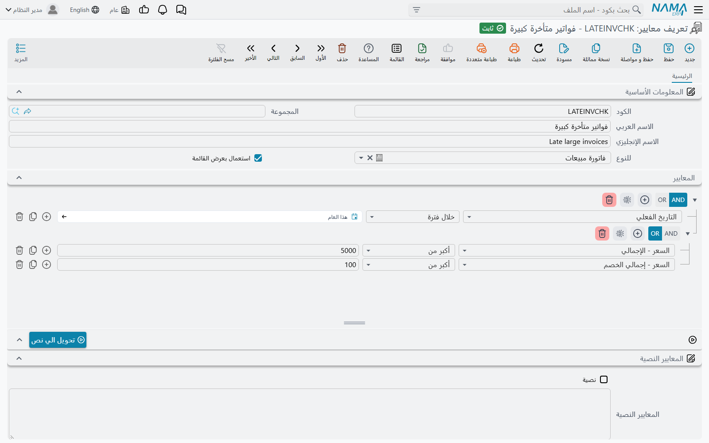
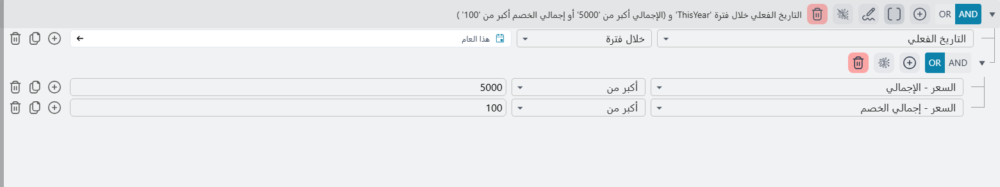
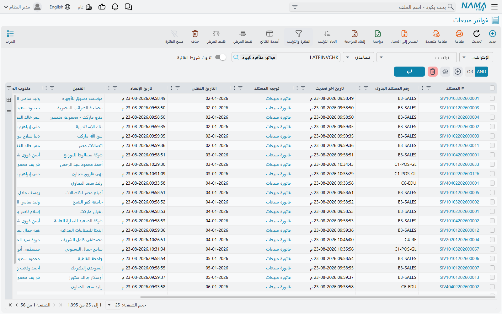

# تعريف المعايير (Criteria Definition)

صفحات كثيرة في هذا الموقع تقول لك «اختر معايير»: الموافقة التي لا تعمل إلا على البيع الآجل، وحقل
المرجع الذي يجب أن يعرض الأصناف غير الخدمية وحدها، والحقل الذي يصبح مطلوباً في فرع واحد فقط، ومسار
الكيان الذي ينبغي أن يعمل على الأوامر المتأخرة دون غيرها. وكلها تعني الشاشة نفسها — **إدارة النظام ←
تخصيص شكل النظام ← تعريف معايير** — وتعني بها الشيء نفسه: فلتر محفوظ بكود واسم، يستطيع بقية النظام أن
يشير إليه باسمه.

وأفضل ما تنظر به إليه أنه بحث محفوظ تستعيره الإعدادات الأخرى. فأنت تكتب مرة واحدة، في موضع واحد، ما
معنى «أمر متأخر»، فتتفق عليه الموافقة والتنبيه والحقل المطلوب وفلتر حقل المرجع جميعاً، ويوم يتغير هذا
التعريف تتغير معه كلها.

ثم يُستعمل السجل نفسه على وجهين، بحسب من استعاره. فأكثر الإعدادات تستعمله **اختباراً**: هذا سجل يُحفظ،
فهل يطابق؟ وأما القوائم وحقول المرجع فتستعمله **فلتراً**: أعرض لي السجلات المطابقة. وأنت تبنيه في
الحالتين بالطريقة نفسها.

## الشاشة

لسجل المعايير كود واسم كأي ملف رئيسي، ثم أربعة أمور هي المهمة.

| الحقل | ما يفعله |
|---|---|
| **للنوع** | الشاشة التي كُتب الفلتر عليها — فاتورة مبيعات، موظف، صنف. واملأه **أولاً**، فبنّاء الشروط يقرأ قائمة حقول هذا النوع، وما دام «للنوع» فارغاً فليس لديه ما يعرضه ويبقى خالياً. |
| **المعايير** | الشروط نفسها، بالبنّاء الموصوف أدناه. |
| **استعمال بعرض القائمة** | يعرض هذه المعايير فلتراً جاهزاً في شاشة قائمة ذلك النوع، وفي نافذة البحث لأي حقل يختار منه. |
| **نصية** و**المعايير النصية** | الشروط نفسها مكتوبةً نصاً بدلاً من تركيبها في البنّاء. |

### بناء الشروط

كل شرط سطر واحد، يُقرأ على ثلاثة أجزاء: **حقل**، و**معامل مقارنة**، و**قيمة**.

و**الحقل** يُختار من قائمة قابلة للبحث فيها كل ما يخزّنه النوع — حقول الرأس وأعمدة الجداول سواء — فقد
يكون الشرط «العميل هو النيل للتجارة» كما قد يكون «أحد سطور الفاتورة يحمل الصنف 1001». والحقل الذي لا
ترجمة له في النظام لا يظهر في القائمة أصلاً.

و**معامل المقارنة** المعروض يتبع نوع الحقل: يساوي ولا يساوي، أكبر وأصغر، يبدأ بـ، يحتوي، و**In**
و**Not In** لمطابقة قائمة من القيم المقبولة، و**Within Period** و**Outside Period** للتواريخ. ومعاملا
الفترة لا يأخذان تاريخاً واحداً بل فترة: إما اسماً جاهزاً مثل *هذا الشهر* أو *آخر 7 أيام*، وإما مدى
صريحاً من تاريخ إلى تاريخ. وقائمة المعاملات كاملةً، وما يفعله كل منها بالنصوص والأرقام والتواريخ، في
[معايير من المحلل النصي](/ar/platform/text-criteria-guide).

و**القيمة** تُدخل بأداة الحقل نفسها: منتقي تاريخ للتاريخ، ومنتقي السجلات لحقل المرجع، وقائمة متعددة
القيم لـ In و Not In.

والأزرار الثلاثة على طرف كل سطر تضيف سطراً (**F7**)، وتنسخ السطر الحالي (**F8**)، وتحذفه
(**Ctrl+Delete**). أما الأزرار على الشريط الرمادي فوق الشروط فتعمل على المجموعة كلها: **إضافة فلتر**
يبدأ شرطاً جديداً، و**حذف الفلاتر** يفرّغ البنّاء، و**تفعيل الوضع المتقدم** يُظهر زرين آخرين
موصوفين بعده.

::: tip أسرع طريق لإنشاء معايير
افلتر شاشة القائمة بيدك حتى تعرض السجلات التي تقصدها بالضبط، ثم اختر **إنشاء تعريف معايير بالمدخلات**
من قائمة **المزيد**. فيُفتح سجل معايير جديد في نافذة منبثقة يحمل ذلك الفلتر، ومضبوطاً على «للنوع»
الصحيح، وعليه علامة الاستعمال في عرض القائمة — ولا يبقى إلا الكود والاسم والحفظ. وإن لم يكن على
القائمة فلتر أجاب *«يرجي تحديد معايير»* ولم يفعل شيئاً. انظر
[الأزرار في كل شاشة](/ar/platform/screen-buttons).
:::

### «و» و«أو» والأقواس

الشروط تُجمع في مجموعات، و**اختيار AND أو OR يخص المجموعة لا السطر**: فزرّا **AND** و**OR** على
شريط المجموعة يسريان على كل شرط بداخلها، فهي إما كلها AND وإما كلها OR. (الزران لا يُترجمان، فهما
يظهران بالإنجليزية في الواجهة العربية.) والمنطق المختلط يُعبَّر عنه بوضع مجموعة داخل مجموعة.

والمجموعات الفرعية مخفية حتى تطلبها: اضغط **تفعيل الوضع المتقدم** على الشريط فيظهر زران آخران:
**إضافة مجموعة فرعية** يُنشئ مجموعة لها AND/OR خاص بها داخل المجموعة الحالية، و**عرض الوصف** يكتب
المعايير كلها بالكلمات بجوار الشريط — وهو أسرع طريق للتأكد أن المعايير تقول ما قصدته.

والمعايير في الصورة تُقرأ: «التاريخ الفعلي خلال فترة ThisYear **و** (الإجمالي أكبر من 5000 **أو**
إجمالي الخصم أكبر من 100)» — شرط لا بد أن تحققه كل فاتورة، وبديلان يكفي أحدهما.

### الشرط على عمود في جدول

الشرط الموضوع على عمود في جدول يتحقق إذا حققه **أي سطر واحد** — فالسجل كله يطابق إذا طابق سطر واحد منه.

وشرطان من هذا النوع موصولان بـ**«و»** أشدُّ مما يبدوان: فلا بد أن يحققهما **السطر نفسه**. فـ*الصنف 1001
و الكمية أكبر من 10* يطابق مستنداً فيه سطر للصنف 1001 بكمية 12، ولا يطابق مستنداً فيه سطر للصنف 1001
وسطر آخر بكمية 12 من صنف غيره. أما الموصولان بـ**«أو»** فيتوسعان كما يُتوقع: يكفي سطر يجيب أحد الشرطين.

والسطور التي طابقت لا تُهدر. فهي التي تتيح رفع الموافقة على سطور بعينها من المستند لا على المستند كله،
وهي التي يعمل عليها خيار *السطور يجب أن تطابق* في [الحقول المطلوبة](/ar/platform/required-fields).

## قيم تتبع المستخدم

القيمة لا يلزم أن تكون ثابتة. فاكتب في القيمة أحد هذه الرموز يُحسب من جديد في كل مرة تُقيَّم فيها
المعايير، على الجلسة التي استدعتها:

| الرمز | ما يؤول إليه |
|---|---|
| `{loginUserId}` و`{loginUserCode}` و`{loginUserName1}` و`{loginUserName2}` | المستخدم الداخل |
| `{loginEmployeeId}` | الموظف المرتبط بذلك المستخدم |
| `{loginLegalEntityId}` و`{loginBranchId}` و`{loginSectorId}` و`{loginDepartmentId}` و`{loginAnalysisSetId}` | المحددات التي دخل بها المستخدم — ولكل منها كذلك صورة `…Code` و`…Name1` و`…Name2` |
| `{loginLanguage}` | لغة الجلسة |

فـ*المنشئ يساوي `{loginUserId}`* معايير تعني «الخاصة بي» لمن تُقيَّم له، و*الفرع يساوي
`{loginBranchId}`* تعني «هذا الفرع» بلا تسميته. وللتواريخ رموزها الخاصة — `$today()` و`$monthStart()`
و`$todayMinusDays(30)` وغيرها — وهي مذكورة بتمامها في
[معايير من المحلل النصي](/ar/platform/text-criteria-guide).

## اختبار المعايير قبل الاعتماد عليها

ضع علامة **استعمال بعرض القائمة** واحفظ، ثم افتح شاشة قائمة النوع الذي كُتبت المعايير عليه. فخانة
**معايير إضافية** في شريط الفلترة تعرض كل معايير محفوظة لذلك النوع تحمل العلامة، واختيار واحدة يفلتر
القائمة بها. والذي يعود هو بالضبط ما تطابقه المعايير، وهذا أرخص طريق لتكتشف أن شرطاً يقارن بقيمة خطأ
أو أن قوساً يجمع على غير ما أردت.

والخانة نفسها موجودة في نافذة البحث خلف حقل المرجع، فيمكن تجربة المعايير من هناك أيضاً.

::: warning شرطان لا بد منهما حتى تُعرض المعايير
خانة «معايير إضافية» لا تعرض إلا المعايير التي **للنوع** فيها هو نوع الشاشة التي أنت فيها، **و**عليها
علامة **استعمال بعرض القائمة**. والمعايير التي لا تظهر فيها هي في الغالب مكتوبة على نوع آخر، أو لم
تُوضع عليها العلامة أبداً.
:::

## الصورة النصية

اضغط **تحويل الي نص** فتُكتب الشروط التي بنيتها نصاً في **المعايير النصية**، وتوضع لك علامة **نصية**.
والصورة النصية شرط في كل سطر — `field,operator,value,AND` — وهي ما تتوقعه التكاملات وقوالب Tempo
ومدخلات التقارير، فهذا الزر هو الطريق المعتاد لإنتاجها. وصيغتها موصوفة في
[معايير من المحلل النصي](/ar/platform/text-criteria-guide).

::: warning ما دامت علامة «نصية» موضوعة فالنص هو السجل
الحفظ وعلامة **نصية** موضوعة يعيد قراءة الشروط **من النص**: فما يقوله النص يحل محل ما يعرضه البنّاء.
وهذا ما يجعل التحرير الحر ممكناً، وهو نفسه ما يجعل نصاً قديماً يمحو في صمت عملاً متأنياً في البنّاء.
فارفع علامة **نصية** لترجع إلى البناء في الجدول.
:::

## أين تُستعمل المعايير المحفوظة

في كل شاشة من هذه حقل ينتظر سجل معايير. والقائمة غير جامعة — فالنمط يتكرر في كل الموديولات — لكنها
تغطي ما يُسأل عنه الدعم:

| الشاشة | الحقل الذي يأخذ المعايير |
|---|---|
| [الموافقات](/ar/platform/approvals/approvals-system) | معايير التعريف نفسه، و**معايير الخطوة** في كل خطوة، ومعايير المسؤول عن الخطوة |
| [التنبيهات](/ar/platform/notifications/notifications-system) | معايير التعريف — أي السجلات تُطلق التنبيه |
| [مسارات الكيان](/ar/platform/entity-flows/) | **المعايير** و**معيار عدم التفيذ** — شغّل المسار إذا طابق السجل فقط، أو إذا لم يطابق فقط |
| [الحقول المطلوبة](/ar/platform/required-fields) | عمود **عندما** في القواعد المبنية على المعايير |
| [التحقق المبني على المعايير](/ar/platform/criteria-based-validation) | شطرا القاعدة **عندما** و**يجب أن**، إن لم تشأ كتابة استعلام |
| [فلترة الحقل بالمعايير](/ar/platform/field-filter-with-criteria) | الشرط الذي يجب أن تحققه السجلات المعروضة |
| [إعدادات الحقول والشاشات](/ar/platform/fields-and-entities-settings/) | عمود **المعايير** في أكثر جداولها — الترقيم الآلي، والتحقق من المُدخل، وحقول المرجع |
| [الفلاتر السريعة](/ar/platform/list-views/quick-filters) | **المعايير المستعملة للبحث عن قيم الفلترة السريعة**، لفلترة أي القيم تصير أزراراً |
| [تعديل الشاشة](/ar/platform/screen-modifier/) | **المعايير الافتراضية للقائمة** و**المعايير الافتراضية للاختيار** — الفلتر الذي تُفتح به الشاشة |
| [المهام المجدولة](/ar/platform/scheduled-tasks) | **معايير** — السجلات التي تعمل المهمة عليها |
| [التقارير والنماذج المطبوعة](/ar/platform/reports/) | معايير النموذج التي تقرر أي نموذج مطبوع يأخذه المستند |
| [مستندات الرواتب](/ar/modules/hr/payroll/salary-documents) | معايير الموظفين التي تقرر من يُجمَّع في المسير |

## ما لا تتحقق منه الشاشة

الشروط لا يُتحقق منها عند الحفظ. فالسطر الذي تُرك نصف ممتلئ، والقوس الذي لم يُغلق، والقيمة التي لا
تصلح للحقل — كل ذلك يُحفظ بلا اعتراض، وعَرَضُه الوحيد معايير لا تطابق شيئاً أو تطابق كل شيء. فإذا
أساءت معايير التصرف، فاقرأ سطورها سطراً سطراً قبل أن تبحث في أي موضع آخر، واستعمل **استعمال بعرض
القائمة** لترى ما تعيده حقاً.

## انظر أيضاً

- [معايير من المحلل النصي](/ar/platform/text-criteria-guide) — قائمة المعاملات، والصيغة النصية، ورموز التواريخ
- [قوائم الأنواع](/ar/platform/entity-type-lists) — اللبنة المرافقة: قائمة شاشات واحدة باسم، يُطبق عليها الإعداد
- [التحقق المبني على المعايير](/ar/platform/criteria-based-validation) — للقواعد التي لا يعبّر عنها فلتر ولا بد فيها من استعلام
