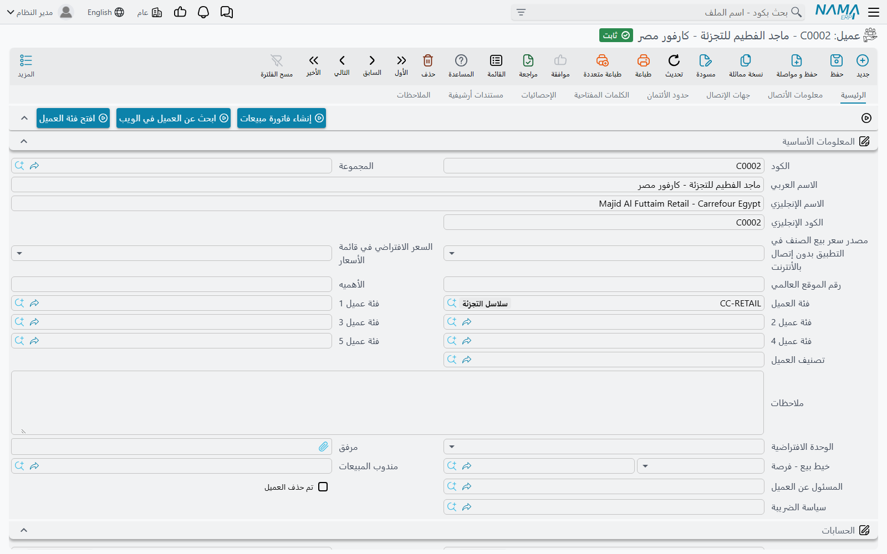
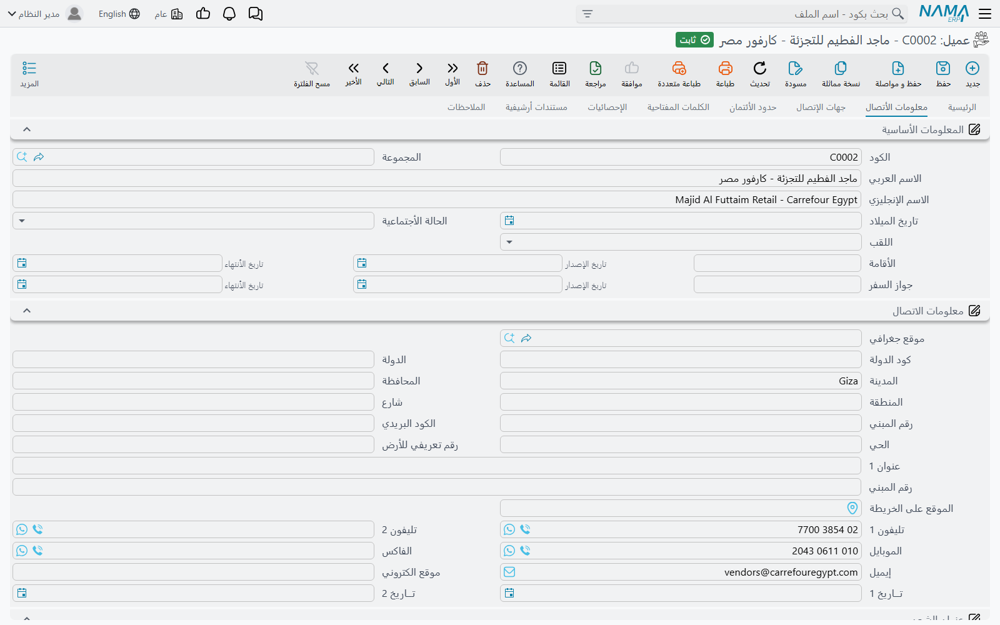
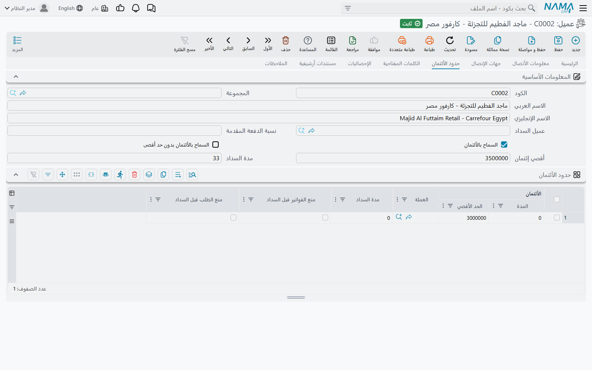
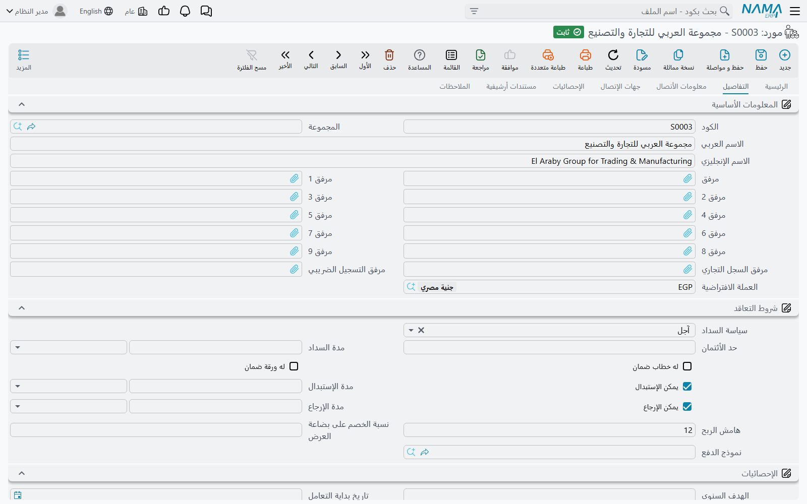
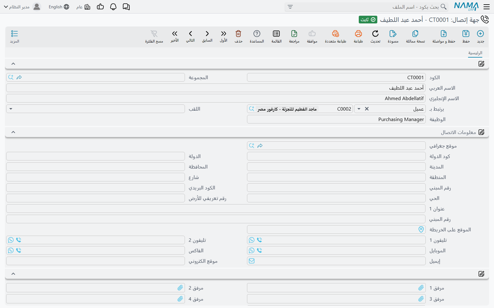
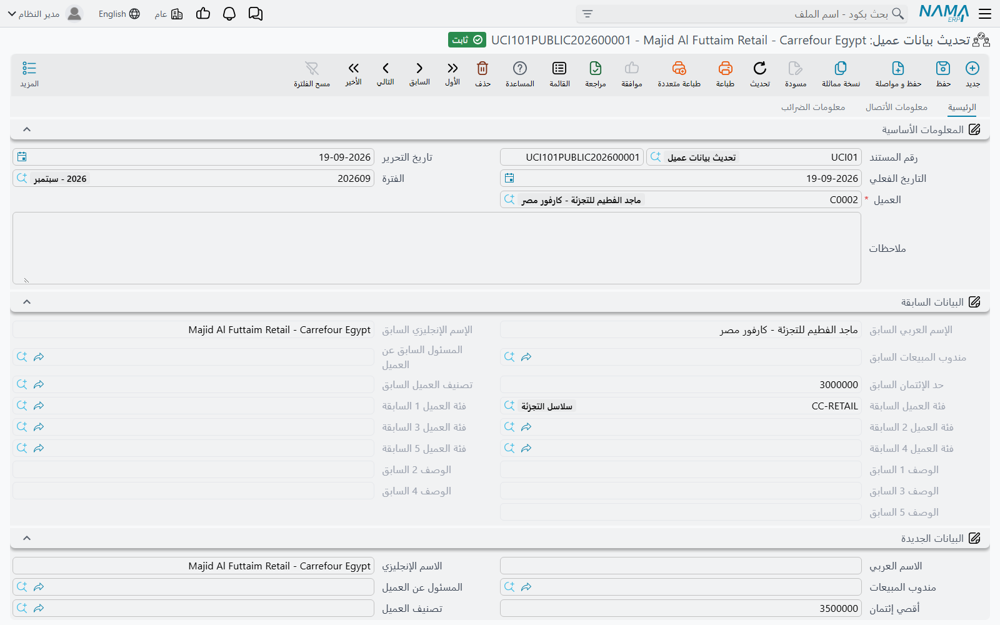

# العملاء والموردون وجهات الصلة

كل مستند في النظام تقريبًا يشير إلى جهة ما: فاتورة المبيعات تشير إلى عميل، وأمر الشراء إلى مورد،
وعملية الشحن إلى خط ملاحى، وسند الصرف إلى الجهة التي يُدفع لها. وهذه الجهات محفوظة في مجموعة صغيرة من
الملفات، ولأن كل مستند يورّث إعداداتها — الحساب الذي يقع عليه القيد، وقائمة الأسعار التي يُسعّر منها،
وسياسة الضريبة التي يحسب بها — فإن خطأً واحدًا في ملف عميل يتكرر بهدوء في ألف فاتورة.

هذه الصفحة عن تلك المجموعة: **عميل** (Customer) و**مورد** (Supplier) و**جهة إتصال** (Contact)
و**جهة ذات صلة** (ThirdParty)، ومستند **تحديث بيانات عميل** الذي يعدّل العميل بعد إنشائه، والطلبات
التي يرفعها العميل من البوابة.

## ملف العميل

تجده من **المبيعات ← الملفات ← عميل**، وهو معروض كذلك في قوائم الأساسيات ومركز الخدمة والمشاريع
والسيارات — الشاشة ذاتها والسجلات ذاتها في كل مرة، موضوعة حيث يتوقعها كل فريق، فلا يهم من أي قائمة
تفتحها.

وكأي ملف رئيسي للعميل **الكود** و**الاسم العربي** و**الاسم الإنجليزي** و**المجموعة** التي تحدد طريقة
تكوين الكود. وما بعد ذلك موزّع على ثماني صفحات: ست خاصة به، ومعهما صفحتا
[مستندات أرشيفية](/ar/platform/dms/) و[الملاحظات](/ar/platform/remarks-and-agenda) اللتان يحملهما كل
ملف رئيسي.

### الرئيسية

مجموعة **المعلومات الأساسية** هي هوية العميل وتصنيفه: **الكود الإنجليزي**، و**رقم الموقع العالمي**
(GLN) الذي تستعمله الفاتورة الإلكترونية، و**الأهميه**، و**فئة العميل** و**فئة عميل ١–٥**،
و**تصنيف العميل**، و**الوحدة الافتراضية**، و**مندوب المبيعات** و**المسئول عن العميل**،
و**سياسة الضريبة**، وحقل **ملاحظات** حر، و**خط بيع - فرصة** الذي وُلد منه هذا العميل إن كان قادمًا
من إدارة علاقات العملاء.
والفئات والتصنيف مجموعات تعرّفها أنت، وقيمتها أن قوائم الأسعار والعروض والتقارير والمعايير تُكتب
عليها بدلًا من كتابتها على كل عميل بعينه.

وتحتها مجموعة **الحسابات**، وهي التي تربط العميل بدفتر الأستاذ: حساب رئيسي وحتى عشرين حسابًا إضافيًا،
أو حزمة حسابات. وإذا كان العميل تُسدَّد فواتيره عن طريق جهة أخرى فاترك هذه الحسابات فارغة واملأ
**عميل السداد** في صفحة حدود الأئتمان — والنظام يرفض حفظ الاثنين معًا.

ومجموعة **خدمات البوابه** تفتح بوابة العملاء لهذا العميل: **مستخدم للبوابه**، و**الصلاحيات** التي
يحصل عليها، ورقم الدخول وكلمة السر الخاصة بالبوابة.

وفي الصفحة أزرار فوق الحقول وتحتها: **إنشاء فاتورة مبيعات** يبدأ فاتورة لهذا العميل، و**ابحث عن
العميل في الويب** يبحث عن اسمه، و**افتح فئة العميل** ينتقل إلى سجل الفئة، و**إنشاء محدد موقع** ينشئ
محدد موقع للتسليم، و**تحويل إلى مالك عقاري** ينشئ سجل مالك في العقارات من البيانات نفسها.

### معلومات الأتصال

كل ما تتصل به أو ترسل إليه: **تاريخ الميلاد** والحالة الاجتماعية و**الصفة**، ووثيقتا الإقامة وجواز
السفر بتاريخي الإصدار والانتهاء، ثم بيانات الاتصال نفسها (**هاتف ١** و**هاتف ٢** و**المحمول**
و**فاكس** و**البريد الإلكتروني** و**الموقع**)، وعنوانان كاملان:
**عنوان الشحن** و**عنوان الدفع**، ولكلٍ منهما علامة «نفس العنوان» حتى لا تكتب العنوان مرتين إن كانا
واحدًا.

ومجموعة **معلومات الضرائب** هي ما تقرؤه وحدات الفاتورة الإلكترونية: السجل التجاري، والرقم الضريبي،
والرقم القومي للسجل، ورقم الملف، ونوع الشركة، ورقم الهوية ونوعها لدى هيئة الزكاة والضريبة، وزوجا
المأمورية وطبيعة التعامل. ومجموعة **بيانات البنك** تحتها تحمل الحساب الذي يسدد منه العميل: البنك
والفرع والدولة وكود السويفت والآيبان.

و**جدول جهات الاتصال** في الأسفل هو الطريق السريع لتسجيل الأشخاص الذين تتعامل معهم فعلًا: الكود
والاسم والوظيفة والمحمول والهاتف والفاكس والبريد والعنوان ونقطة التحميل. واملأ **مجموعة تكويد جهات
الاتصال المنشأة** وضع علامة **إنشاء جهة اتصال لكل سطر**، فيحوّل حفظ العميل كل سطر منها إلى سجل
جهة إتصال مستقل — وهو ما تعرضه صفحة **جهات الإتصال** بعد ذلك.

### جهات الإتصال

ليست جدولًا بل قائمة حيّة بسجلات جهات الاتصال المرتبطة بهذا العميل، ومنها ما وَرِثه عن العميل المرتقب
الذي أُنشئ منه. وجهات الاتصال التي أنشأتها علامة **إنشاء جهة اتصال لكل سطر** تظهر هنا بعد الحفظ.

### حدود الأئتمان

لها قسم خاص أدناه، فهي أكثر أجزاء الشاشة التي يُساء فهمها.

### الكلمات المفتاحية

الكلمات المفتاحية مصطلحات بحث حرة تجعل العميل قابلًا للعثور عليه بغير اسمه: اسم تجاري، أو اسم قديم، أو
اسم دارج لفرع. اختر **كلمات مفتاحية** (قالبًا) لتوريث مجموعة منها، أو اكتب السطور في الجدول مباشرة،
لكل سطر صيغته العربية والإنجليزية ووزن نسبي يرتّب قوة المطابقة.

### الإحصائيات

قوائم للقراءة فقط بما جرى لهذا الملف: مستندات تحديث المندوب التي نقلته بين المندوبين، ومستندات تحديث
بيانات عميل التي عدّلته، وطلبات التعديل المرفوعة من البوابة، ومستندات نقاط المكافآت إن كانت مستعملة.

## حدود الأئتمان — ما يفعله النظام وما لا يفعله

صفحة **حدود الأئتمان** هي التي تكتب فيها قدر الائتمان المسموح للعميل ومدته. وحقول الرأس تنطبق على
العميل كله:

| الحقل | معناه |
|---|---|
| **عميل السداد** | عميل آخر يسدد فواتير هذا العميل. وملؤه يمنع ملء حسابات صفحة الرئيسية. |
| **نسبة الدفعة المقدمة** | الحصة التي يُتوقع أن يدفعها العميل مقدمًا من الطلب. |
| **السماح بالأئتمان** / **السماح بالأئتمان بدون حد أقصى** | هل الائتمان مسموح أصلًا، وهل هو بلا سقف. |
| **أقصي إئتمان** | سقف الائتمان. |
| **مدة السداد** | الأيام الممنوحة للعميل للسداد. |

وتحتها **جدول حدود الأئتمان** يتيح سقفًا مختلفًا لكل تركيبة من المحددات ولكل عملة، ولكل سطر **المدة**
و**الحد الأقصى** و**العملة** و**مدة السداد** وعلامتا **منع الفواتير قبل السداد** و**منع الطلب قبل
السداد**. وأعمدة المحددات التي يعرضها الجدول اختيار في الإعدادات العامة، موصوف في
[محددات جدول الائتمان](/ar/platform/global-config/global-config-accounting) — والجدول افتراضيًا لا
يعرض أيًّا منها، فأنت تضع سقفًا واحدًا للشركة كلها.

وأمران يحدثان عند الحفظ ويفاجئان المستخدمين:

- إذا ملأت **أقصي إئتمان** وتركت الجدول فارغًا، أنشأ النظام لك سطرًا واحدًا في الجدول على شركة العميل
  نفسها بالقيمة التي كتبتها. فالسقف الذي كتبته في الرأس يظهر سطرًا في الجدول عند فتح الملف بعد ذلك.
- وإذا كانت **مدة السداد** في الرأس غير صفرية، فهي تكتب نفسها فوق مدة السداد في كل سطر من سطور الجدول
  كانت له مدة بالفعل. فمدة السداد على مستوى السطر لا تصمد إلا إذا تركت حقل الرأس فارغًا.

::: warning هذه الأرقام وحدها لا تمنع أي مستند
وهذا هو المهم. حقول الائتمان مسجّلة، وتظهر في التقارير، ومتاحة لكل إعداد آخر في النظام — لكن **لا
يوجد تحقق جاهز يقرؤها عند حفظ فاتورة أو طلب**. و**منع الفواتير قبل السداد** و**منع الطلب قبل السداد**
تعلّمان السطر بأنه ممنوع، ولا يرفضان شيئًا بنفسهما. فالعميل المتجاوز سقفه بمئتي ألف ما زال يمكن أن
تُحرَّر له فاتورة.

ومنع الفاتورة قاعدة تضيفها أنت، وأداتها
[التحقق بناءً على المعايير](/ar/platform/criteria-based-validation#mnaa-byaa-ytjwz-Hd-ytmn-laamyl)،
حيث يوجد الاستعلام الجاهز. تضبطه مرة واحدة فيسري الرفض على الواجهة والتطبيق والاستيراد سواء.

والسقف الائتماني الوحيد الذي يفرضه المنتج من تلقاء نفسه يقع في مكان آخر تمامًا: في **إعداد التسهيلات
الائتمانية**، فحدّه الخاص — وحدود الموردين في جدوله — يُقاس عليها مجموع التسهيلات المفتوحة، ويرفض
التسهيل الائتماني الترحيل متى تجاوز المتبقي تلك الحدود. وذلك الفحص لا يقرأ ملف عميل ولا ملف مورد.
:::

## ملف المورد

**المشتريات ← الملفات ← مورد**. وشكله قريب من العميل بقصد — الهوية والحسابات والاتصال والضرائب والبنك
كما هي — فلا يستحق الذكر إلا ما يختلف.

صفحة **الرئيسية** تضيف **فئة المورد**، وأربعة أزواج من الوصف والمعلومات الإضافية، و**مندوب مشتريات**،
ورقم الموقع العالمي. وللمورد سبع صفحات وليس فيها صفحة لحدود الائتمان، لأن الائتمان مع المورد شرط
تعاقد لا سقف.

وصفحة **التفاصيل** هي المثيرة للاهتمام. فمجموعة **شروط التعاقد** فيها هي الاتفاق التجاري المبرم مع هذا
المورد: **سياسة السداد** — *نقدي* أو *آجل* أو *بضاعة تحت التصريف* — و**مدة السداد**، و**له خطاب ضمان**
و**له ورقة ضمان**، وهل البضاعة **يمكن الإستبدال** و**يمكن الإرجاع** وفي أي **مدة الإستبدال** أو
**مدة الإرجاع**، و**هامش الربح**، و**نسبة الخصم على بضاعة العرض**، و**نموذج الدفع**. وكل مدة زوج من
رقم ووحدته، فتقال «٣٠ يومًا» و«شهر واحد» سواء. وتحتها **الإحصائيات** تحفظ **الهدف السنوى**
و**تاريخ بداية التعامل** وتواريخ آخر أمر شراء وآخر فاتورة وآخر مرتجع؛ و**نطاق أعمال مقدم الخدمة**
يعلّم المورد بأنه **خط ملاحى** أو مخلّص جمركي أو شركة نقل بري أو مورّد مولدات أو شركة بريد سريع — وهي
العلامات التي تُرشّح عليها وحدة الشحن.

وصفحة **معلومات الأتصال** تعيد مجموعات الاتصال والضرائب والبنك نفسها، وتضيف خانات مرفقات للسجل
التجاري والبطاقة الضريبية، وجدول **معلومات إضافية** بأعمدة وصف وأرقام وتواريخ ومراجع حرة لما تحتاج
حفظه.

## جهات الاتصال

**الأساسيات ← الملفات ← جهة إتصال** هو دفتر العناوين الذي يقف خلف هذا كله. وجهة الاتصال شخص واحد: كود
واسم و**الصفة** و**الوظيفة** وبيانات اتصال كاملة وخمس مرفقات — و**يرتبط بـ**، وهو الحقل الذي يهم.
فحقل «يرتبط بـ» من شقّين: تختار أولًا *نوع* الجهة (عميل، مورد، جهة ذات صلة، عميل مرتقب…) ثم السجل
نفسه، فالملف الواحد يضم مسؤول مشتريات عميل، ومندوب بيع مورد، ومحامي جهة ذات صلة.

ونادرًا ما تُنشئ جهات الاتصال من هنا. والطريق المعتاد هو جدول جهات الاتصال في ملف العميل أو المورد مع
علامة **إنشاء جهة اتصال لكل سطر**، فهو ينتج هذه السجلات نفسها ويعلّم كل واحد منها بأنه منشأ آليًا.

## جهات الصلة

**الأساسيات ← الملفات ← جهة ذات صلة** لِلجهات التي ليست عميلًا ولا موردًا ومع ذلك تحتاج أن تظهر في
المستندات وعلى الحسابات: محامي بنك، أو جهة حكومية، أو مالك عقار، أو مخلّص جمركي لا تشتري منه. والشاشة
صغيرة — هوية و**نوع جهة الصلة** وخمس مرفقات وبيانات الاتصال وحساب ذمة وخمسة حسابات إضافية وبيانات
البنك، وصفحة **جهات الإتصال** وصفحة **معلومات الضرائب**. وهي موجودة لتحمل مثل هذه الجهة حسابًا وملفًا
ضريبيًّا دون أن تتظاهر بأنها عميل.

## تعديل العميل بعد إنشائه: تحديث بيانات عميل

**الأساسيات ← المستندات ← تحديث بيانات عميل** يعدّل بيانات عميل واحد بمستند لا بتحرير الملف، فيصبح
التعديل مؤرّخًا ومرقّمًا ومنسوبًا إلى صاحبه وقابلًا للمراجعة والتقرير كأي مستند آخر.

تختار **العميل**، ثم تملأ في مجموعة **البيانات الجديدة** ما تريد تغييره فقط. ومجموعة **البيانات
السابقة** المقابلة لها ليست من عملك — فالنظام يقرأ قيم العميل الحالية فيها عند معالجة المستند، فينتهي
المستند حاملًا صورة «قبل وبعد» لما غيّره بالضبط.

وهو مستند، فيحمل كذلك **كود المستند** (دفتره) وتاريخ الإصدار و**التاريخ الفعلي** وفترة مالية — فلا
يُحفظ قبل أن يكون له دفتر وشركة، تمامًا كالفاتورة.

ويصل المستند إلى الأسماء والمندوب و**المسئول عن العميل** وأقصى الائتمان والتصنيف والفئات الخمس، والأوصاف الخمسة،
وتاريخ الميلاد والنوع والحالة الاجتماعية والكود البديل ورقم الموقع العالمي، وإلى بيانات الاتصال كلها
والعنوانين ومعلومات الضرائب ووثيقتي الجواز والإقامة — موزّعة على صفحات **الرئيسية** و**معلومات
الأتصال** و**معلومات الضرائب**، وكل صفحة تعرض **البيانات السابقة** ثم **البيانات الجديدة**. والجانب
السابق يظهر باهتًا على الشاشة: يملؤه النظام لا أنت.

وثلاثة أمور تستحق أن تعرفها قبل الاعتماد عليه:

- **الحقل الفارغ معناه «اتركه كما هو» لا «افرغه».** فلا يُكتب على العميل إلا ما كان غير فارغ في
  البيانات الجديدة، فالمستند لا يصلح لتفريغ قيمة. ولتفريغ حقل حرّر ملف العميل.
- العميل يُحدَّث عند **حفظ** المستند لا وأنت تكتب، ثم يظهر المستند في صفحة **الإحصائيات** بملف
  العميل.
- والتحديث يسري على قاعدة البيانات هذه فقط — ولا يُدفع عبر الـ replication، فعلى التركيبات الموزّعة
  تبقى المواقع الأخرى على القيم القديمة حتى يسافر ملف العميل نفسه.

## الطلبات المرفوعة من البوابة

العميل الذي يستعمل البوابة لا يحرّر ملفه بنفسه، بل يرفع **طلب تعديل بيانات عميل** الذي تجده تحت
**المبيعات ← المستندات**، وشكله شكل شاشة العميل تمامًا لأنه يحمل نسخة مقترحة منها. وفي الشاشة زرّان
يحددان ما يحدث:

- **تحديث بيانات العميل** ينسخ القيم المطلوبة على العميل القائم ويضع علامة **تم التحديث**.
- **إنشاء عميل** ينشئ عميلًا جديدًا من الطلب — مسودةً إن كان **توجيه** الطلب يقول ذلك — ويربط
  الاثنين.

وما يُسمح للطلب بتعديله ليس متروكًا للعميل. فـ**توجيه** الطلب يحمل جدول **الحقول المسموح تحديثها**:
اكتب فيه أرقام الحقول فلا يُنسخ على العميل غيرها، بصرف النظر عما يحمله الطلب. واترك الجدول فارغًا
فتُنسخ كل الحقول المملوءة. وكما في مستند تحديث بيانات عميل، لا تكتب القيمة الفارغة نفسها فوق قيمة
مملوءة.

وللموردين والمقاولين مثله (**طلب تعديل بيانات مورد** و**طلب تعديل بيانات مقاول**)، والطلبات المعلّقة
لملفٍ ما معروضة في صفحة **الإحصائيات** به.

والشاشة الشقيقة **طلب إضافة مستخدم** هي طريقة طلب مستخدم جديد بدلًا من إنشائه مباشرة، وهي موصوفة في
[طلبات المستخدمين الذاتية](/ar/platform/security/users-and-login#Tlbt-Df-lmstkhdmyn).

## رسائل قد تظهر لك

| الرسالة | لماذا | ما تفعله |
|---|---|---|
| *Paying Customer cannot be the same customer* | حقل **عميل السداد** يشير إلى العميل نفسه الذي تحرّره. | اتركه فارغًا أو اجعله يشير إلى عميل آخر. |
| *Accounts must be empty because you selected a paying customer* | عميل السداد هو من يسدد، فحسابات هذا العميل يجب أن تبقى فارغة. | افرغ الحسابات في صفحة الرئيسية، أو افرغ **عميل السداد**. |
| *Can not use legal entity {0} in line {1} of credit limits. It must be {1}* | سطر في حدود الأئتمان يسمّي شركة لا ينتمي إليها العميل. | استعمل شركة العميل نفسها في السطر، أو اترك شركة السطر فارغة. |
| «هناك سطر متكرر» | سطران في حدود الأئتمان يصفان التركيبة ذاتها من الشركة والفرع والإدارة والقطاع ومجموعة التحليل والعملة. | ادمجهما؛ فالتركيبة لا تظهر إلا مرة واحدة. |
| *Credit period can't be less than 0* | فترة ائتمان أو مدة سداد سالبة. | اكتب صفرًا أو عددًا موجبًا من الأيام. |
| «يجب أن يكون رقم هاتف» | الإعدادات العامة مضبوطة على استعمال رقم الهاتف كودًا للعميل، والكود الذي كتبته لا يطابق النمط المتوقع. | اكتب رقم المحمول كودًا، أو أوقف ذلك الإعداد. |
| «هذا العميل المرتقب له عميل» | العميل المرتقب في حقل «عميل مرتقب» أنتج عميلًا آخر بالفعل. | افتح ذلك العميل المرتقب لتجد العميل الذي أنشأه بدلًا من إنشاء عميل ثانٍ. |

وثلاث من هذه الرسائل فقط لها ترجمة عربية، وما عداها يظهر بالإنجليزية ولو كانت الشاشة عربية، ولذلك فإن
الصيغة الإنجليزية هي التي يُبحث بها.

## اقرأ أيضًا

- [التحقق بناءً على المعايير](/ar/platform/criteria-based-validation) — قاعدة حد الائتمان، وأي قاعدة
  أخرى عن من يجوز أن تُحرَّر له فاتورة.
- [الأسعار والعروض والكوبونات](/ar/modules/supplychain/pricing-offers-and-coupons) — كيف تتحول الفئات
  والتصنيفات في هذه الملفات إلى أسعار.
- [الحسابات](/ar/modules/accounting/accounts) — ما تفعله حسابات الذمة على جهةٍ ما في دفتر الأستاذ.
- [دورة المبيعات](/ar/modules/supplychain/sales-journey) — موضع ملف العميل من دورة المبيعات.
- [المستخدمون والدخول](/ar/platform/security/users-and-login) — مستخدمو البوابة وطلب إضافة مستخدم.
