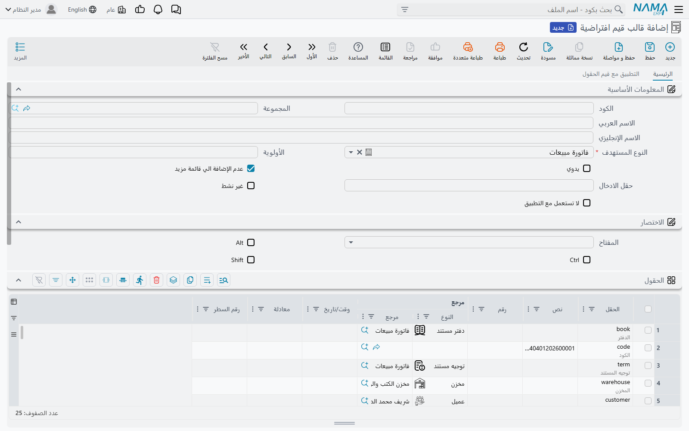
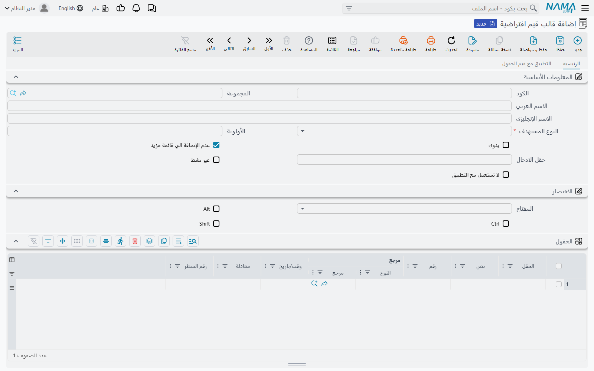
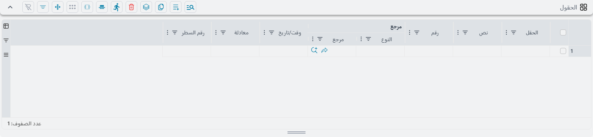
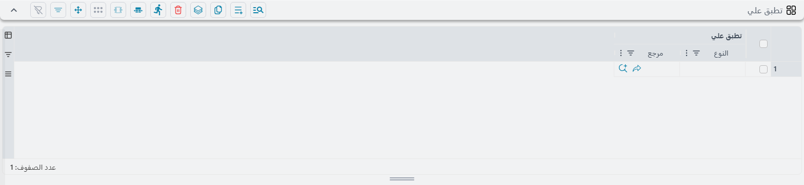
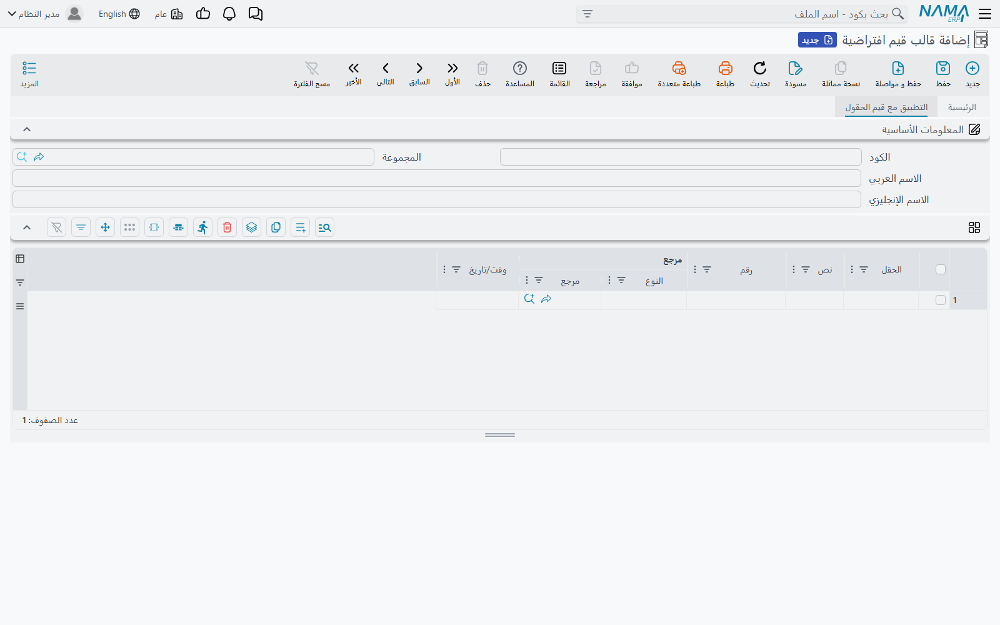

# قوالب القيم الافتراضية

معظم الإدخال تكرار. الفرع نفسه، والمخزن نفسه، وطريقة السداد نفسها، والعملة نفسها، والسطور الثلاثة
نفسها في فاتورة خدمات نمطية — تُكتب من جديد في كل مستند، وبيد الشخص نفسه، طوال اليوم. و**قالب القيم
الافتراضية** هو ما يوقف هذه الكتابة المتكررة: فهو قائمة محفوظة بالحقول والقيم التي ينبغي أن تبدأ
بها، والنظام يملؤها لحظة فتح سجل جديد.

والقوالب تعمل على **كل** كيان في النظام — المستندات والملفات الرئيسية على السواء — ويمكن أن يكون
للكيان الواحد منها ما شئت: قالب لكل فرع، أو لكل نوع عميل، أو لكل مستخدم.

## أسرع طريقة لإنشاء قالب

لست مضطرًا إلى بناء القالب حقلًا حقلًا. فإن كان لديك سجل يبدو بالشكل الذي تريد أن تبدأ به السجلات
الجديدة، فافتحه واستعمل **مزيد ← تعيين كقالب**:

يقرأ النظام السجل المفتوح أمامك ويعطيك **قالبًا جديدًا غير محفوظ** ممتلئًا بالفعل:

ويحتوي على سطر لكل **حقل في الشاشة له قيمة**، مع ضبط النوع المستهدف على الكيان الذي كنت تنظر إليه،
وسطر واحد في جدول «تطبق علي» يحمل اسمك. وتُستثنى أربعة حقول دائمًا — تاريخ القيمة وتاريخ الإصدار
والسنة المالية والفترة المالية — لأن نقلها إلى سجل جديد ليس مطلوبًا في أي حال.

::: tip هذّب القالب قبل الحفظ
أمر تعيين كقالب شره عن قصد: فهو ينسخ كل ما يجده، بما في ذلك الحقول التي صادف أن كانت ممتلئة في ذلك
السجل بعينه. فالقالب المبني على فاتورة حقيقية سيحمل عميل تلك الفاتورة وملاحظاتها وأرقامها المرجعية،
وستبدأ كل فاتورة جديدة بها.

احذف السطور التي لا تريدها، وأبقِ الحفنة التي هي نمطية فعلًا، ثم احفظ. فهذا أسرع كثيرًا من البدء
بقالب فارغ، لكنه نقطة بداية لا منتج نهائي.
:::

وإن كان في نظامك حقول لا ينبغي **أبدًا** أن تُنقل إلى قالب — مرجع داخلي أو توقيع أو رقم مسلسل — فيمكن
استبعادها مركزيًا فيتخطاها أمر تعيين كقالب في كل مكان. والقائمة هي **الحقول المستبعدة من القوالب** في
الإعدادات العامة، في تبويب **المستندات والدفاتر** ضمن مجموعة **سلوك المستندات والمسودات**، بمعدل حقل
في كل سطر.

## مِمَّ يتكون القالب

كل قالب يسمي نوع كيان واحدًا — أي الشاشة التي يملؤها — وهو الحقل الوحيد الواجب ملؤه إلى جانب الكود.
وبقية حقول الرأس تتحكم في **متى** يُستعمل القالب، وهي مشروحة فيما يلي.

أما القيم نفسها فتوجد في جدول **الحقول**:

كل سطر يسمي حقلًا في عمود **الحقل**، ويضع قيمته في العمود المناسب لنوع ذلك الحقل — **نص** أو **رقم**
أو **مرجع** أو **وقت/تاريخ**. ولست أنت من يختار أي عمود ينطبق؛ فالنظام ينظر إلى الحقل الذي سميته
ويقرأ العمود المطابق له. أما حقول الاختيار (صح/خطأ) فتُضبط من عمود النص بكتابة `true` أو `false`.

وعمود **مرجع** هو في الحقيقة عمودان متجاوران: نوع السجل أولًا ثم السجل نفسه. فتختار نوع الكيان،
ويتيح لك العمود الثاني بعدها الاختيار من سجلات ذلك النوع.

وقائمة الحقول المعروضة في عمود **الحقل** تعرف الكيان الذي اخترته، فأنت تختار من حقول تلك الشاشة
الحقيقية لا تكتب مسارات من الذاكرة. والحقول المتداخلة تُكتب بنقطة بينها، وتُنشأ الأجزاء الوسيطة
تلقائيًا عند الحاجة.

::: warning الحقل المحذوف أو المعاد تسميته لا يفشل في صمت
إن لم يعد الحقل المسمى في القالب موجودًا — لأن الشاشة أُعيد تصميمها أو تغير الكيان — فإن القالب يُطبَّق
رغم ذلك، لكن ذلك السطر وحده يُبلَّغ عنه بفشل يذكر اسم الحقل ورقم السطر ويطلب منك تحديث القالب. وبقية
السطور تُطبَّق كالمعتاد. فإن أبلغ المستخدمون عن قالب «يعمل نصف عمل» فهذا أول ما ينبغي فحصه.
:::

### ملء سطور التفاصيل لا الرأس فقط

ترك **رقم السطر** فارغًا يضبط الحقل في رأس السجل. وملؤه يضبط الحقل في سطور التفاصيل بدلًا من ذلك،
وهو يقبل ثلاث صيغ:

| رقم السطر | ما الذي يملؤه |
|---|---|
| `3` | السطر الثالث |
| `2,4,6` | السطور الثاني والرابع والسادس |
| `1:5` | السطور من الأول إلى الخامس |

والعد يبدأ من **1** لا من 0. وإن لم يكن السجل يحتوي على هذا العدد من السطور بعد فإنها تُنشأ — فيمكن
للقالب أن يبني فاتورة نمطية من ثلاثة سطور من العدم، بضبط الصنف والكمية والمخزن لكل سطر عبر ثلاثة
سطور في القالب.

### قيم تُحسب بدل أن تُكتب

عمود **معادلة** يأخذ حسابًا بدلًا من قيمة ثابتة، ويُقيَّم على السجل الجاري إنشاؤه. وهو الوسيلة لضبط
قيمة تعتمد على شيء آخر في السجل نفسه لا على ثابت — ولأنه يُنفَّذ بعد تطبيق القيم الثابتة في الجدول
فبإمكانه أن يبني عليها.

وصندوق **Fields Map** أسفل الجداول يؤدي العمل نفسه بالجملة، بصيغة `الهدف=المصدر` في كل سطر. وكلاهما
يستعمل لغة المعادلات نفسها المستعملة في مسارات الكيانات، فما يمكنك كتابته في أحدهما يمكنك كتابته في
الآخر.

## على من يُطبَّق القالب

جدول **تطبق علي** يحدد لمن يعود القالب. كل سطر يسمي **مستخدمًا** أو **ملف أمان** أو **مجموعة**،
ويُعرض القالب على كل من ينطبق عليه أي سطر منها.

و**ترك الجدول فارغًا يعني الجميع** — وهذه هي الحالة الافتراضية، ويستحق الانتباه، لأن جدول «تطبق علي»
الفارغ في قالب تلقائي يؤثر على النظام كله.

وهناك قيد ثانٍ مستقل يأتي من **محددات** القالب نفسه — الشركة والفرع والقطاع والإدارة والمجموعة
التحليلية. فالقالب الموسوم بشركة معينة لا يُعرض إلا على المستخدمين الداخلين على تلك الشركة، وهي
الطريقة المعتادة لإعطاء كل شركة في المجموعة قيمها الافتراضية الخاصة. وتغيير الشركة عند تسجيل الدخول
يغيّر القوالب التي تحصل عليها.

## متى يُستعمل القالب

قد يكون أكثر من قالب مرشحًا للسجل الجديد نفسه، لذا فالترتيب مهم. والنظام يأخذ **أول** ما ينطبق مما
يلي:

1. **قالب اخترته صراحة** — من قائمة مزيد، أو باختصار لوحة المفاتيح، أو من عنصر قائمة مثبَّت عليه قالب.
2. **القالب المسمى في دفتر المستند أو توجيهه**، أو في مجموعة الملف الرئيسي. فالدفاتر والتوجيهات
   والمجموعات يحمل كل منها حقل **القالب** الخاص به، وهو يتقدم على القالب التلقائي للمستخدم.
3. **قالبك التلقائي** لذلك النوع من الكيانات.

### ما الذي يجعل القالب تلقائيًا

يكون القالب تلقائيًا حين يُترك حقل **يدوي** بلا تأشير. فعند كل سجل جديد من ذلك النوع يأخذ النظام
القوالب التلقائية التي تستحقها، ويرتبها حسب **الأولوية**، ثم يطبق أولها.

::: warning يُطبَّق قالب تلقائي واحد فقط، والرقم الأصغر هو الفائز
الأولوية تُرتَّب **تصاعديًا** — فالأولوية 1 تُختار قبل الأولوية 10. وبمجرد اختيار قالب لا يُطبَّق فوقه
أي قالب تلقائي آخر؛ وتُهمل البقية دون أي رسالة. ووجود قالبين تلقائيين لنوع الكيان نفسه بالأولوية
نفسها ليس خطأ، لكنه يعني ببساطة أن أحدهما لن يعمل أبدًا في صمت.

فإن «توقف قالب عن العمل» فابحث عن قالب آخر برقم أولوية أصغر قبل أن تفحص القالب نفسه.
:::

وإذا أشّرت على **يدوي** فلن يُطبَّق القالب من تلقاء نفسه أبدًا — ولن يُستعمل إلا حين يطلبه أحد بالاسم.

### الوصول إلى القالب عند الطلب

القالب الذي تريد اختياره عمدًا يُوصل إليه بثلاث طرق:

**من قائمة مزيد** في شاشة الكيان نفسه. فكل قوالب ذلك النوع تُعرض أسفل أمر «تعيين كقالب» باسم كل
منها، واختيار أحدها يبدأ سجلًا جديدًا منه.

::: warning القوالب الجديدة مخفية من قائمة مزيد حتى تزيل تأشيرة أحد الحقول
حقل **عدم الإضافة الي قائمة مزيد** يبدأ **مؤشَّرًا** في كل قالب جديد. هذه هي القيمة الافتراضية
المرفقة بالنظام، ومعناها أن القالب الذي أنشأته للتو **لن** يظهر في قائمة مزيد حتى تعود وتزيل
التأشيرة عنه. وهذا هو السبب الأشيع لاختفاء قالب جديد على ما يبدو.
:::

**باختصار لوحة المفاتيح.** مجموعة **الاختصار** تضبط مفتاحًا ينشئ سجلًا جديدًا من هذا القالب من أي
موضع في تلك الشاشة. وإن كان المفتاح حرفًا أبجديًا فلا بد من ضمه إلى **Ctrl** أو **Alt** — وإلا فلن
يُحفظ السجل، وسيخبرك النظام بذلك.

**من وصلة في القائمة.** يمكن تثبيت قالب على وصلة في شجرة القوائم، بحيث يبدأ فتح تلك الوصلة من هذا
القالب دائمًا. وهكذا تعرض بعض المنشآت «فاتورة خدمات جديدة» و«فاتورة بضاعة جديدة» كوصلتين منفصلتين
تفتحان الشاشة نفسها — انظر [كيف تُبنى القائمة](/ar/platform/menus/menu-structure).

## تطبيق القالب في منتصف الإدخال

القوالب ليست خطوة افتتاحية فحسب. فهناك أمران يطبّقان قالبًا على سجل بدأته بالفعل.

**اختيار دفتر أو توجيه أو مجموعة.** فإن كان ما اخترته يحمل قالبًا طُبِّق في الحال — وهذا ما يجعل
المستند يعيد تشكيل نفسه حين تختار دفترًا مختلفًا.

**أخذ حقل لقيمة بعينها.** التبويب الثاني، **التطبيق مع قيم الحقول**، هو قائمة بأزواج من حقل وقيمة.
فحين يُضبط الحقل المسمى في الكيان المسمى على تلك القيمة، يُطبَّق هذا القالب:

كل سطر يحتاج إلى حقل وإلى قيمة واحدة على الأقل للمقارنة بها — نص أو رقم أو تاريخ أو مرجع. وهذا ما
يحقق «اختيار نوع العميل هذا يملأ هذه الحقول الستة».

وفي الحالتين **يُحتفظ بما كتبته بالفعل**. فيُعاد بناء السجل بالقالب مطبَّقًا وقيمك منقولة إليه، فلا
يكلفك تشغيل قالب في منتصف المستند ما أنجزته أعلاه.

::: info القوالب لا تُطبَّق إلا على سجل لم يُحفظ بعد
القالب جزء من **إنشاء** السجل. ففتح سجل محفوظ واختيار قالب لا يعيد ملأه، وتعديل قالب لا يرجع بأثره
على السجلات التي أُنشئت منه سابقًا. أما السجلات الواردة عبر استيراد السجلات فتتخطى القوالب تمامًا —
فالاستيراد يملأ الحقول الموجودة في الملف لا غير.
:::

## بقية حقول الرأس

| الحقل | ماذا يفعل |
|---|---|
| الأولوية | أي قالب تلقائي يفوز — الرقم الأصغر أولًا |
| يدوي | لا يُطبَّق تلقائيًا أبدًا، بل عند الطلب فقط |
| عدم الإضافة الي قائمة مزيد | يُبقي القالب خارج قائمة مزيد في الشاشة — و**يبدأ مؤشَّرًا** |
| حقل الادخال | الحقل الذي يقف عنده المؤشر بعد إنشاء السجل |
| غير نشط | يُخرج القالب من الاستعمال التلقائي ومن قائمة مزيد |
| لا تستعمل مع التطبيق | يتخطى هذا القالب حين يُنشأ السجل من تطبيق الموبايل |

وحقل **حقل الادخال** أمر صغير يوفر وقتًا كبيرًا. فإن ملأ القالب الحقول الستة الأولى في الشاشة فسيظل
المؤشر واقفًا في أولها، وعلى المستخدم أن يتخطاها جميعًا. وتسمية الحقل السابع هنا يضع المؤشر تمامًا
حيث تبدأ الكتابة فعلًا.

## أين تجدها

قوالب القيم الافتراضية موجودة في **الأساسيات ← إدارة النظام ← تخصيص شكل النظام ← قوالب قيم افتراضية**،
إلى جانب معدّل الشاشات و[القوائم](/ar/platform/menus/) وبقية الأدوات التي تغيّر شكل الشاشات وسلوكها.

ولأن كل قالب يسمي الكيان الذي يستهدفه، فإن تلك القائمة الواحدة تضم قوالب النظام كله. وترتيبها حسب
النوع المستهدف هو أسرع طريقة لمعرفة ما لدى شاشة بعينها من قوالب.

راجع أيضًا [الأزرار في كل شاشة](/ar/platform/screen-buttons) لقائمة مزيد نفسها، و
[دفاتر المستندات](/ar/platform/document-books) لإعدادات الدفتر والتوجيه التي قد تحمل قالبًا خاصًا بها.
