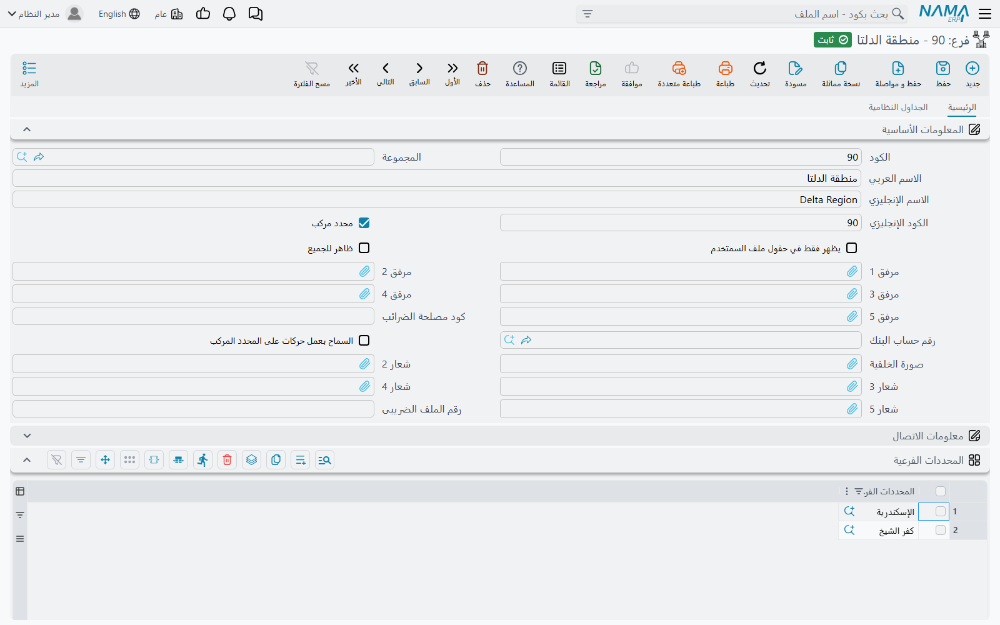
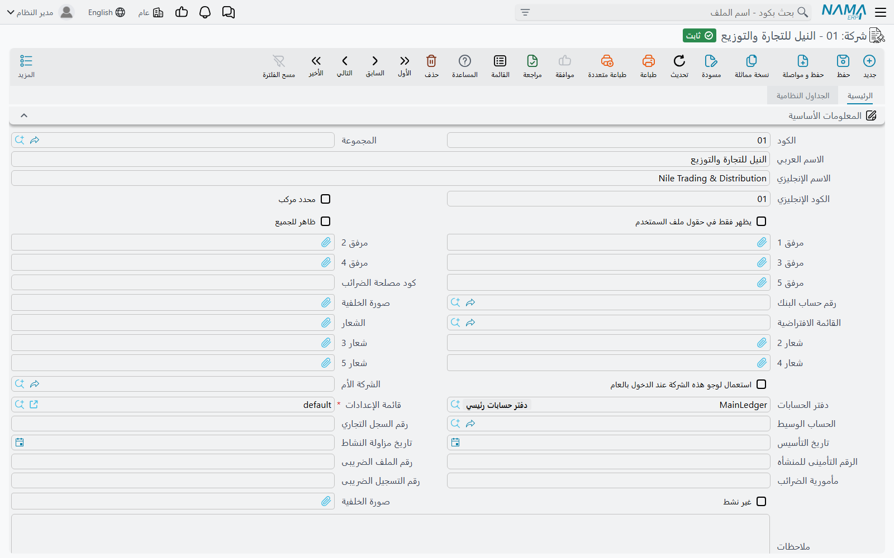
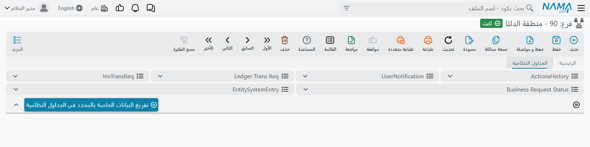

# المحددات والمحددات المركبة

أي سؤال عن رقم في نما يحمل نصفًا ثانيًا ثابتًا: مبيعات — *أي شركة؟* رواتب — *أي فرع؟* استهلاك — *على أي مركز تكلفة؟* **المحددات** هي الحقول الخمسة التي تحمل هذه الإجابة على كل سجل تقريبًا في النظام: **الشركة** (Legal Entity) و**القطاع** (Sector) و**الفرع** (Branch) و**الإدارة** (Department) و**المجموعة التحليلية** (Analysis Set).

وهي ليست ميزة محاسبية. الحقول الخمسة نفسها موجودة على الصنف والموظف والمخزن وفاتورة المبيعات وأمر شغل الصيانة والمستخدم، ولهذا يستحق فهمها مرة واحدة بدل خمس مرات. ثلاثة أشياء تعمل عليها:

- **من يرى السجل.** المستخدم الذي يعمل داخل الإسكندرية يرى سجلات الإسكندرية لا سجلات القاهرة.
- **كيف تتجمع الأرقام.** كل تقرير يجمع «حسب الفرع» أو «حسب مركز التكلفة» إنما يقرأ هذه الحقول.
- **كيف تُقرأ أكواد الحسابات.** شجرة حسابات تضع رقم الفرع داخل كود الحساب تُفكّ إلى محدداتها من هنا.

تشرح هذه الصفحة الملفات الرئيسية الخمسة نفسها — أين تجدها، وماذا تملأ فيها، والمحددات المركبة التي تجعل سجلًا واحدًا ينوب عن عدة سجلات. أما المفاتيح التي تقرر أي محددات تستعملها منظومتك وكم يتشدد النظام في فحصها فانظر [المحددات في الإعدادات العامة](/ar/platform/global-config/global-config-dimensions)، وأما ما تفعله المحددات داخل دفتر الحسابات — حسابات تقيّدها، وقواعد توزيع تفرّق قيمة واحدة على كثير منها — فانظر [المحددات ومراكز التكلفة والتوزيع](/ar/modules/accounting/support/accounting-dimensions-and-distribution)، وأما من يرى ماذا في النهاية فانظر [تأمين السجلات](/ar/platform/security/record-level-security).

## الخمسة، ولماذا كل واحد منها

تأتي كخمسة ملفات رئيسية منفصلة تحت `الأساسيات ← المحددات`، لكل منها بند في القائمة:

| المحدد | القائمة | ما يحمله عادة |
|---|---|---|
| **شركة** (Legal Entity) | `الأساسيات ← المحددات ← شركة` | الشركة. في قاعدة بيانات متعددة الشركات هي التي تفصل دفاتر عن دفاتر — لكل شركة دفتر حسابات خاص بها. وهي المحدد الوحيد الذي لا يمكن إيقافه. |
| **قطاع** (Sector) | `الأساسيات ← المحددات ← قطاع` | أوسع تقسيم داخلي — نشاط، أو منطقة، أو مجموعة فروع. |
| **فرع** (Branch) | `الأساسيات ← المحددات ← فرع` | الموقع الفعلي: معرض، أو موقع، أو مدينة مخزن. |
| **إدارة** (Department) | `الأساسيات ← المحددات ← إدارة` | الوحدة الإدارية: المالية، المبيعات، الصيانة. |
| **مجموعة تحليلية** (Analysis Set) | `الأساسيات ← المحددات ← مجموعة تحليلية` | المحدد الحر. وهو المكان المعتاد لـ**مركز التكلفة** أو كود المشروع، لأن النظام لا يفرض له معنى. |

ولا شيء يفرض هذه القراءة. القطاع والفرع والإدارة قوائم عادية تملؤها بنفسك، والاحتواء الذي يفترضه النظام بينها (قطاع يضم فروعًا، وفرع يضم إدارات) ليس إلا **الترتيب** الافتراضي في الإعدادات العامة، ويمكنك تغييره.

## «عام» (PUBLIC): المحدد الذي يعني «كلها»

لكل نوع من المحددات سجل واحد ينشئه النظام لنفسه، كوده **PUBLIC** واسمه العربي «عام». وستراه قيمةً لأي محدد تتركه فارغًا — فهو سجل حقيقي لا خانة فارغة، ولذلك يظهر في البحث وعلى الشاشات.

ومعنى «عام» أنه *غير مقيّد على هذا المحور*. سجل محفوظ بـ `الفرع = عام` لا ينتمي إلى فرع بعينه، والمستخدم الذي تعمل جلسته بـ `الفرع = عام` غير مقيّد بفرع. ودليل الأصناف المشترك بين المجموعة كلها هو المثال الكلاسيكي: اترك محدداته «عام» ليستعمله الجميع.

::: warning السجل العام ليس بالضرورة سجلًا ظاهرًا
الشركة هي الاستثناء الذي يجدر معرفته. السجل بلا شركة سجل عام، لكنه يظل مخفيًا عن المستخدمين العاملين داخل شركة بعينها إلى أن يُفعَّل **إظهار المستندات العامة للجميع** في [الإعدادات العامة](/ar/platform/global-config/global-config-dimensions). وسؤال «لماذا لا يرى هذا الصنف؟» سببه هذا الإعداد في أغلب الأحيان.
:::

## شاشة المحدد

الخمسة تتشارك شاشة واحدة. افتح `الأساسيات ← المحددات ← فرع` واضغط **جديد**:

كتلة التعريف هي المعتادة في أي ملف رئيسي — **الكود** و**المجموعة** ([مجموعة الملفات](/ar/platform/master-groups) التي ترتّبه في الشجرة) و**الاسم العربي** و**الاسم الإنجليزي** و**الكود الإنجليزي**. ثم تأتي الحقول الخاصة بالمحددات:

- **محدد مركب** (Composite dimension) — هذا السجل ينوب عن عدة سجلات أخرى، و[القسم التالي](#lmHddt-lmrkb-sjl-wHd-ynwb-aan-aad-sjlt) مخصص لما يعنيه ذلك.
- **يظهر فقط في حقول ملف السمتخدم** (Show Only In User Fields) — يختفي المحدد من كل بحث في النظام *إلا* حقول شاشة المستخدم. وهكذا تصنع قيمة لا وجود لها إلا لوصف نطاق مستخدم، ولا يمكن كتابتها على مستند بالخطأ.
- **ظاهر للجميع** (Visible to every one) — يتصرف السجل كأنه «عام» عند *العرض*: مهما كان صاحب المحدد، يستطيع الجميع رؤية السجلات التي تحمله. استعمله للإدارة العامة أو المخزن المشترك الذي يُسمح لكل الفروع بالاطلاع عليه.
- **مرفق 1–5** و**كود مصلحة الضرائب** و**رقم حساب البنك** وصورة خلفية وحتى خمسة شعارات — بيانات وصفية. والشعارات مهمة في نماذج الطباعة، حيث يمكن للنموذج أن يطبع شعار الفرع أو الشركة صاحبة المستند.
- **معلومات الاتصال** — عنوان كامل وهواتف وبريد وموقع. وعنوان الفرع بيان حقيقي: نماذج الطباعة والفاتورة الإلكترونية تقرؤه.
- **المحددات** — محددات المحدد نفسه، ما عدا نوعه هو. الفرع يتبع شركة وقطاعًا، والإدارة تتبع فرعًا. وهذا ما يجعل المحددات هرمًا لا خمس قوائم منفصلة.

::: info لا يُصنَّف المحدد تحت نوعه نفسه
مجموعة **المحددات** في شاشة الفرع تعرض الشركة والمجموعة التحليلية والقطاع والإدارة — لا الفرع. ومحاولة إعطاء فرعٍ فرعًا تُرفض برسالة «لا يمكن تحديد {0} لـ{0} آخر»، و`{0}` هو نوع المحدد.
:::

### إضافات على أنواع بعينها

**الشركة** تحمل أكثر بكثير من الأربعة الباقين، لأنها الشركة:

- **الشركة الأم** تبني هيكل مجموعة من الشركات.
- **دفتر الحسابات** هو مجموعة الدفاتر التي تُرحَّل إليها هذه الشركة، و**قائمة الإعدادات** هي قائمة الإعدادات التي تتبعها — فشركتان في قاعدة بيانات واحدة يمكن أن تختلفا في الدفاتر وفي الإعدادات.
- **الحساب الوسيط** هو الحساب المستعمل حين تعبر الحركة من شركة إلى أخرى.
- **رقم السجل التجاري** و**تاريخ التأسيس** و**تاريخ مزاولة النشاط** و**الرقم التأميني للمنشأه** و**رقم الملف الضريبى** و**مأمورية الضرائب** و**رقم التسجيل الضريبى** هي البيانات النظامية التي تُطبع على المستندات وتُرسل لمصلحة الضرائب.
- **القائمة الافتراضية** تعطي الشركة قائمتها الخاصة، و**استعمال لوجو هذه الشركة عند الدخول بالعام** يقرر شعار مَن يظهر للمستخدم الداخل على «عام».
- **الشاشات الغير مستعملة** و**المميزات الغير مستعملة** تخفيان الشاشات والمميزات التي لا تستعملها هذه الشركة.
- ويبقى **عدد المستخدمين** و**غير نشط**. وفي المنظومات المستضافة على سحابة نما يظهر أيضًا تبويب **التراخيص**.

والبقية قصيرة: **الفرع** يضيف **رقم الملف الضريبى** الخاص به والشعارات، و**القطاع** يضيف الشعارات، و**المجموعة التحليلية** تضيف **المجموعه التحليليه البديله للتكاليف** وتاريخ اعتبارها — أي المجموعة التحليلية التي ينبغي للتكلفة أن تستعملها بدلًا من هذه ابتداءً من ذلك التاريخ — و**الإدارة** لا تضيف شيئًا.

## المحددات المركبة: سجل واحد ينوب عن عدة سجلات

مديرة إقليمية مسؤولة عن الإسكندرية وكفر الشيخ. لا أحد الفرعين إجابة صحيحة عن «في أي فرع تعمل»، واختراع فرع اسمه *منطقة الدلتا* بجوار الفروع الحقيقية يفسد كل تقرير فروع. و**المحدد المركب** هو الحل: سجل من النوع نفسه، مؤشَّر عليه **محدد مركب**، يسرد جدول **المحددات الفرعية** فيه الفروع الحقيقية التي يغطيها.

ولذلك لكل نوع محدد بندان في القائمة — `فرع` و`فروع مركبة` — وهما الشاشة نفسها على الجدول نفسه، يفصل بينهما ذلك التأشير. قوائم العرض العادية تعرض السجلات العادية فقط، وبند *المركبة* يعرض المركبة فقط. أما البحث من الشاشات الأخرى فيعرض النوعين، ولهذا يستحق **يظهر فقط في حقول ملف السمتخدم** التأشير على محدد مركب لا تريده مكتوبًا على مستند أبدًا.

ويحكم الجدول ثلاث قواعد:

- المركب **يجب** أن يسرد محددًا فرعيًا واحدًا على الأقل، وغير المركب يجب ألا يسرد شيئًا.
- المحددات الفرعية يجب أن تكون سجلات **عادية**. والمركب داخل المركب مرفوض — البنية مستوى واحد بالضبط.
- جدول **المحددات الأعلي** على المحدد العادي هو الصورة المعكوسة، وهو يملأ نفسه. أضف الإسكندرية إلى *منطقة الدلتا* فتظهر *منطقة الدلتا* بين محددات الإسكندرية الأعلى عند الحفظ؛ لا شيء يُكتب هناك يدويًا.

والمكسب ثلاثة أشياء:

**نطاق للمستخدم.** أعطِ سجل المستخدم أو سياق الدخول المحدد المركب فينفتح نطاقه على كل فرع بداخله. هذا هو الاستعمال الأساسي، وهو سبب وجود المركبات أصلًا. انظر [تأمين السجلات](/ar/platform/security/record-level-security) لكيفية تحول محددات الجلسة إلى السجلات التي تراها.

**تقارير على مستوى المجموعة.** مدخل تقرير تُجيبه بمحدد مركب يغطي المحدد نفسه *وكل ما تحته*. وإعداد **تعديل الشركة المختارة** وأخواتها الأربع على تعريف التقرير يقررون هل تبقى إجابة المستخدم أصلًا — و*حين لا يكون عامًا* هو الإعداد الذي يتيح لمدير المحدد المركب أن يجمع تقريره على أعضائه دون غيرهم؛ انظر [التقارير](/ar/platform/reports/reports-guide). و[اختيار نموذج الطباعة](/ar/platform/reports/printed-form-selection) أكثر تسامحًا: النموذج المضبوط على محدد مركب يطابق أي سجل يقع محدده بداخله.

**وأحيانًا، قيمة على مستند.** المحدد المركب افتراضًا لا يصلح للحركات إطلاقًا — أي مستند أو مخزن يحمله يُرفض عند الحفظ. والتأشير على **السماح بعمل حركات على المحدد المركب** في المحدد المركب يرفع هذا المنع، ثم يتجمد التأشير: فبمجرد أن تشير إليه المستندات لا يمكنك إعادته محددًا عاديًا.

::: warning الشركة المركبة لا تحمل حركات أبدًا
تأشير **السماح بعمل حركات على المحدد المركب** موجود على القطاع والفرع والإدارة والمجموعة التحليلية فقط — شاشة الشركة لا تحمل هذا الحقل، والنظام يفرض الإجابة *لا* في كل مرة يُحفظ فيها السجل. فالشركة المركبة تجميع للتقارير والتأمين، لا شركة تُرحَّل إليها.
:::

## تبويب الجداول النظامية

كل شاشة محدد تحمل تبويبًا ثانيًا اسمه **الجداول النظامية**، فيه ست قوائم مفلترة على هذا المحدد: سجل حركاته، وإشعارات مستخدميه، وطلبات القيود المحاسبية والمخزنية الخاصة به، وحالات طلبات الأعمال، وقيود النظام. (وعناوينها غير مترجمة في اللغتين — تقرأ `ActionsHistory` و`UserNotification` و`Ledger Trans Req` وغيرها بأي لغة عملت.)

وفي أسفله زر **تفريغ البيانات الخاصة بالمحدد في الجداول النظامية**. يسأل أي الجداول الخمسة تريد تفريغه ويطلب تأشير تأكيد قبل التنفيذ، وهو يحذف فعلًا — فهو أداة تنظيف لشركة أُنشئت بالخطأ أو فرع تجريبي امتلأ بطلبات فاشلة، لا جزء من العمل اليومي لأحد.

## حين يرفض المحدد التغيير

رفضان يفاجئان الناس، وكلاهما لسبب واحد: المحدد تشير إليه آلاف السجلات، وتغييره يعيد ترتيبها كلها في صمت.

الأول **محددات المحدد نفسه**. فبمجرد أن تشير الملفات الرئيسية إلى فرع، تتجمد شركته وقطاعه وإدارته. و**السماح بتعديل محددات المحددات** في [الإعدادات العامة](/ar/platform/global-config/global-config-dimensions) يفتح القفل، وهو معدّ لإعادة هيكلة مقصودة — وتوقّع مراجعة ما تحرك بعدها.

والثاني **تأشير المركب نفسه**. فبمجرد أن تشير إليه المستندات لا يمكن تحويله من عادي إلى مركب ولا العكس، إلا إذا كان **السماح بعمل حركات على المحدد المركب** مفعّلًا.

وليس لأي من الرفضين ترجمة عربية، فيظهران بالإنجليزية على شاشة عربية. وهذا سلوك المنتج لا خلل في منظومتك.

## رسائل قد تظهر لك

| الرسالة | لماذا | ماذا تفعل |
|---|---|---|
| «لا يمكن تحديد {0} لـ{0} آخر» | أُعطي المحدد قيمة من نوعه هو — فرع مصنّف تحت فرع آخر، و`{0}` هو النوع. | اترك الحقل فارغًا؛ فالمحدد يُصنَّف تحت الأنواع الأربعة *الأخرى* فقط. |
| «لا يمكن السماح بمحددات مركبة داخل محدد مركب» | سطر في **المحددات الفرعية** يشير إلى محدد مركب آخر. | استبدله بالمحددات الحقيقية. المركبات لا تتداخل. |
| «لا يمكن استعمال المحدد المركب من النوع {1} للسجل {0}» | حُفظ مستند أو مخزن يحمل محددًا مركبًا. | استعمل أحد المحددات الحقيقية، أو أشِّر على **السماح بعمل حركات على المحدد المركب** في المحدد المركب إن كان معدًّا فعلًا للحركات. |
| *Cannot change dimension if other Documents are referenced From this dimension.* (بلا ترجمة عربية) | غُيّر تأشير **محدد مركب** على محدد تستعمله مستندات بالفعل. | اترك التأشير كما هو، أو أنشئ محددًا جديدًا للغرض الجديد. |
| *Cannot change dimensions of dimension if other Master Files are referenced From this dimension.* (بلا ترجمة عربية) | غُيّرت شركة المحدد أو قطاعه أو فرعه أو إدارته بعد أن بدأت الملفات الرئيسية تشير إليه. | فعّل **السماح بتعديل محددات المحددات** إن كانت إعادة الهيكلة مقصودة، وراجع السجلات المتأثرة بعدها. |
| «برجاء اختيار جدول واحد على الأقل لتفريغه» | أُكّد زر التفريغ دون تأشير أي من الجداول الخمسة. | أشِّر على الجداول المراد تفريغها ثم أكّد من جديد. |
