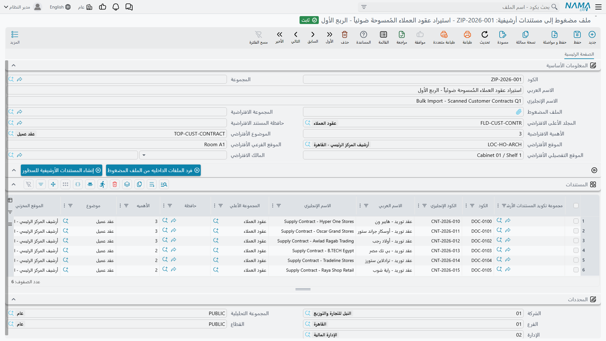

# تحميل أرشيف من ملف مضغوط

تسجيل المستندات واحدًا واحدًا مناسب للأوراق الجديدة القليلة، لكنه ميؤوس منه مع ألف ملف ممسوح يسلّمها
لك العميل في بداية التطبيق.

ولهذا التحميل الأول وُجدت شاشة **ملف مضغوط إلى مستندات أرشيفية**. ترفع ملفًا مضغوطًا واحدًا، فيفرده
النظام في جدول تجهيز — سطر لكل ملف بداخله — ثم تكمل التكويد، ويحوّل زر ثانٍ كل سطر إلى مستند أرشيفي
حقيقي بالملف مرفقًا به.

## خطوتان اثنتان

في الشاشة زرّان اثنان لا غير، ويعملان بالترتيب.

### الخطوة الأولى — فرد الملفات الداخليه من الملف المضغوط

أرفق الملف المضغوط في حقل **الملف المضغوط**، ثم احفظ، ثم اضغط الزر. يمرّ النظام على الملف المضغوط
وينشئ سطرًا في الجدول لكل ملف بداخله متخطيًا المجلدات. ويأتي كل سطر والملف مرفق به في «النسخة
الحالية».

::: warning الزر يمسح الجدول أولًا
الضغط على هذا الزر مرة أخرى يمحو كل السطور ويبدأ من جديد، ويُفقد ما كتبته من تكويد. ففُرَّ الملفات
مرة واحدة ثم اكتب.
:::

وفي الناتج ملحظان:

- **يُضبط الاسم العربي على المسار الكامل داخل الملف المضغوط** لا على اسم الملف. فملف محفوظ باسم
  `contracts/2026/acme.pdf` ينتج سطرًا بهذا الاسم حرفيًا. فاحسب حساب استبداله.
- **يُترك الكود فارغًا**، فيعتمد كل مستند مُنشأ على التكويد الآلي ما لم تكتب الأكواد بنفسك.

### الخطوة الثانية — إنشاء المستندات الأرشيفية للسطور

بعد ملء الجدول احفظ ثم اضغط هذا الزر. ينشئ النظام لكل سطر مستندًا أرشيفيًا، ويرفق به الملف، ويكتب
المستند الجديد في عمود **الملف المنشئ** في السطر لتراه.

والخطوة آمنة عند التكرار: فالسطر الذي أنتج مستندًا من قبل **يعدّل المستند نفسه** بدل إنشاء نسخة
مكرّرة.

::: warning فشل سطر واحد يوقف التشغيل
إن فشل سطر توقّفت العملية عنده. فالسطور التي قبله تكون قد أُنشئت، والتي بعده لم تُمس، والرسالة لا
تحدد أي سطر كان السبب. عالج المشكلة واضغط الزر ثانية — ولن تتكرر السطور التي نجحت.
:::

## ماذا يُنقل فعلًا وماذا لا يُنقل

اقرأ هذا الجزء مرتين، فالشاشة تعرض أكثر بكثير مما تنفّذ.

**هذه الأعمدة وحدها هي التي تصل إلى المستند المُنشأ:**

| العمود | التسمية الإنجليزية |
|---|---|
| الكود | Code |
| الاسم العربي / الاسم الإنجليزي | Name1 / Name2 |
| الأهميه | Importance |
| الموقع الفرعي | Sub Location |
| الموقع التفصيلي | Detailed Location |
| تاريخ التجديد | Renewal Date |
| تاريخ الانتهاء | Expiration Date |
| النسخة الحالية *(الملف)* | Current Version |

::: danger المجلد والموضوع والمالك والأرشيف تُهمَل بصمت
يعرض الجدول أيضًا أعمدة **مجموعة تكويد المستندات الأرشيفية** و**الكود الإنجليزي** و**المجلد**
و**حافظة** و**موضوع** و**أرشيف** و**مالك المستند** قابلة للتحرير — ولا يُنسخ أي منها إلى المستند
المُنشأ، ولا شيء ينبّهك. فتحصل على مستندات غير محفوظة في مجلد ولا مصنَّفة تحت موضوع ولا مملوكة لأحد.

والأسوأ أن **مجموعة القيم الافتراضية** كلها في رأس الشاشة — المجموعة الافتراضية والمجلد الأعلى
الافتراضي وحافظة المستند الافتراضية والأهمية الافتراضية والموضوع الافتراضي والموقع الافتراضي والموقع
الفرعي الافتراضي والموقع التفصيلي الافتراضي والمالك الافتراضي — لا يقرؤها شيء البتة. فملؤها لا يغيّر
شيئًا في أي مكان.

فلا تضيّع وقتك في تكويد تلك الأعمدة، واعتزم ضبط الحفظ بعد الاستيراد.
:::

## طريقة عمل ناجعة اليوم

بناءً على ما سبق، فالسبيل الموثوق لتحميل أرشيف بالجملة أن تدع أداة الملف المضغوط تفعل ما تفعله
حقًّا — إنشاء مستندات بملفاتها مرفقة — وأن تضبط الحفظ في جولة ثانية:

1. **جمّع ملفاتك بحسب وجهتها قبل الضغط.** ملف مضغوط لكل تركيبة مجلد وموضوع: عقود العمل في واحد،
   والتراخيص في آخر. وهذا ما يجعل الجولة الثانية عملية جماعية لا عملية لكل مستند.
2. **افرد وأنشئ** بالزرين، مع ملء الأعمدة التي تُنقل فقط: الأسماء والأهمية والمواضع والتواريخ.
3. **اضبط الحفظ بالجملة بعد ذلك.** صدّر المستندات المُنشأة حديثًا إلى جدول بيانات، واملأ المجلد
   والموضوع والأرشيف والمالك على امتداد العمود، ثم استوردها. انظر
   [استيراد السجلات](/ar/platform/import-export/importing-records.md).

::: tip أو تجاوز هذه الشاشة كليًّا
إن كانت صورك الممسوحة مسمّاة بشيء يعرفه النظام — كود موظف أو رقم عقد — فإن
[استيراد سجلات](/ar/platform/import-export/importing-records.md) مباشرًا للمستندات الأرشيفية يمنحك
تحكمًا كاملًا في كل حقل في جولة واحدة، بلا خطوة ثانية ولا أعمدة مهمَلة. وتكون شاشة الملف المضغوط
أنفع حين لا تملك سوى الملفات وأسماؤها لا تعني شيئًا.
:::

## حدود عملية

- **أبقِ الملفات المضغوطة معتدلة الحجم.** يُحتفظ بكل ملف في الذاكرة أثناء فرده، فقد يستنفد ملف مضغوط
  ضخم موارد الخادم. قسّم التحميل الكبير دفعات بحجم بضع مئات من الميجابايت بدل رفع ملف واحد هائل.
- **لا فلترة لامتدادات الملفات ولا فحص للتكرار.** كل ما في الملف المضغوط يصير مستندًا، بما في ذلك
  ملفات المعاينات وملفات النظام العابرة. فنظّف الملف قبل رفعه.
- **حجم الملف المفرد** محكوم بحد الرفع المعتاد وهو 20 ميجابايت للملف.
- **حذف سجل الاستيراد لا يحذف الملفات التي يحملها.** فيبقى الملف المضغوط وكل نسخة مستخرجة في
  التخزين، وحين تكون المرفقات مخزَّنة خارج قاعدة البيانات تبقى على القرص — وهو ما يجدر معرفته قبل
  استخدام هذه الشاشة مرارًا في تجارب.
