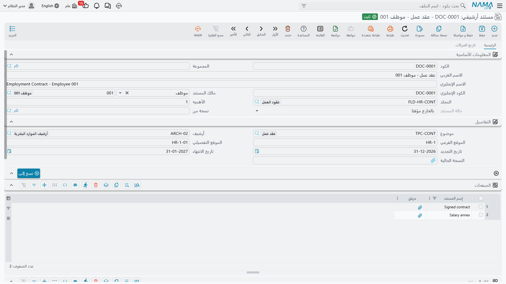
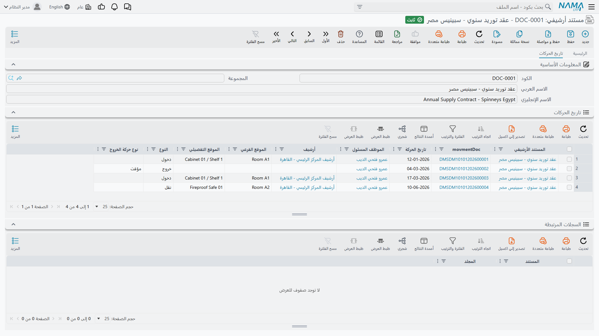
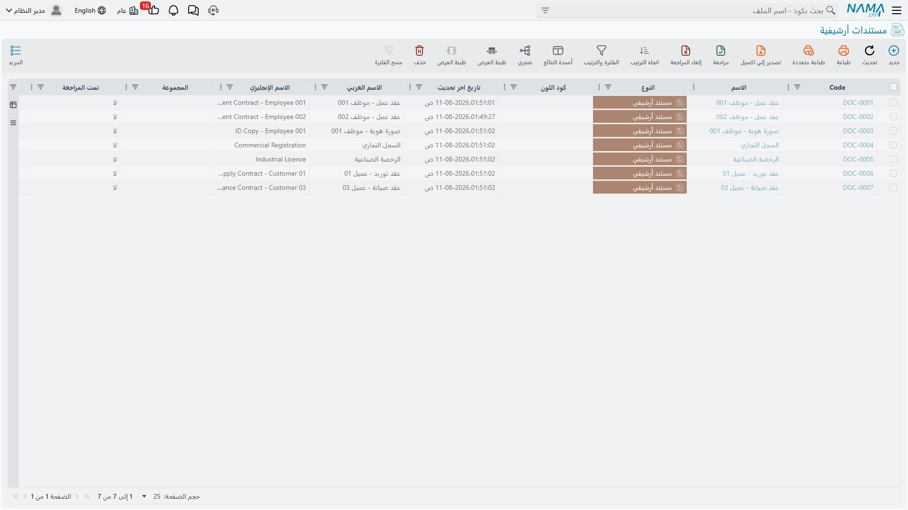

# المستندات الأرشيفية

المستند الأرشيفي هو السجل الذي وُجد كل ما سبق لخدمته. فالسجل الواحد يصف مستندًا محفوظًا واحدًا: ما
هو، ولمن يخصّ، وفي أي مجلد حُفظ، وعلى أي رفّ توجد الورقة، وأي صور ممسوحة مرفقة به.

## تسجيل مستند

أسرع طريقة أن تختار المجلد أولًا وتدع النظام يكمل عنك.

1. **افتح مستندًا أرشيفيًا جديدًا** وأعطه كودًا واسمين. وإن كان التطبيق يستخدم التكويد الآلي فسيُملأ
   الكود تلقائيًا.
2. **اختر المجلد.** لا تُعرض إلا المجلدات التي تقبل عناصر. وبمجرد اختيارك مجلدًا تنزل قيمه
   الافتراضية على السجل — الموضوع والأرشيف والموقع الفرعي والموقع التفصيلي معًا.
3. **عدّل الموضع المادي** إن كان هذا المستند بعينه في مكان غير رفّ المجلد المعتاد. ويعرض حقلا
   الموقع الفرعي والتفصيلي اقتراحات مأخوذة من كشف مواقع الأرشيف.
4. **حدّد مالك المستند** إن كانت الورقة تخصّ جهة ما — موظفًا أو عميلًا أو موردًا أو طرفًا ثالثًا أو
   أصلًا ثابتًا.
5. **أرفق الصورة الممسوحة** في «النسخة الحالية»، وأضف صفحات أخرى في الجدول أدناه إن كان المستند
   أكثر من ملف.
6. **احفظ.** يدخل المستند حالة **مبدئي**.

### الحقول

| الحقل | التسمية الإنجليزية | ملاحظات |
|---|---|---|
| **الكود** / **الكود الإنجليزي** | Code / English Code | هوية الملف الأساسي المعتادة. |
| **الاسم العربي** / **الاسم الإنجليزي** | Name1 / Name2 | الاسم بالعربية والاسم بالإنجليزية على الترتيب. |
| **مالك المستند** | Document Owner | لمن تخصّ الورقة. مقصور على **عميل** و**موظف** و**مورد** و**طرف ثالث** و**أصل ثابت**. وتبدأ السجلات الجديدة بنوع «عميل» فغيّره إن لم يكن مقصودًا. |
| **المجلد** | Folder | مكان الحفظ، وهو ما يقود القيم الافتراضية المذكورة أعلاه. |
| **الأهميه** | Importance | رقم يمكن الفلترة والترتيب به، ولا يترتب عليه شيء تلقائيًا. |
| **حالة المستند** | Document State | يملؤها النظام وهي دائمًا غير قابلة للتعديل. انظر أدناه. |
| **نسخة من** | Copy Of | يشير إلى الأصل حين يكون السجل ناتجًا عن زر «نسخ إلى». |
| **موضوع** | Topic | التصنيف الموضوعي. |
| **أرشيف** | Location | الأرشيف الذي يحوي الورقة. |
| **الموقع الفرعي** / **الموقع التفصيلي** | Sub Location / Detailed Location | الرفّ والموقع، نصًّا حرًّا مع اقتراحات. |
| **تاريخ التجديد** | Renewal Date | موعد تجديد المستند. |
| **تاريخ الانتهاء** | Expiration Date | موعد انتهاء صلاحيته. |
| **النسخة الحالية** | Current Version | الملف المرفق الرئيسي، أي صورة المستند نفسه. |

::: warning لا شيء يراقب التواريخ
يُسجَّل تاريخا التجديد والانتهاء ولا شيء غير ذلك. فلا تنبيه ولا إشعار ولا فحص مجدول في إدارة
المستندات كلها. وللتنبيه على التراخيص المنتهية ابنِ
[مهمة مجدولة](/ar/platform/scheduled-tasks.md) على قائمة مستندات مفلترة، أو احتفظ
[بفلتر سريع](/ar/platform/list-views/quick-filters.md) يطّلع عليه الناس فعلًا.
:::

## الصفحات والملاك

يقع تحت رأس الشاشة جدولان، وكلاهما اختياري.

**الصفحات** يضم الملفات الإضافية التي يتألف منها المستند — الملاحق والأوراق الممسوحة الزائدة
والتعديل الموقّع. وكل سطر اسم ومرفق. أما الصورة الرئيسية فمكانها «النسخة الحالية» لا هنا.

**ملاك المستند** لأوراق تخصّ أكثر من جهة في آن واحد — عقد مشترك أو شهادة مشتركة. ويسمّي كل سطر
مالكًا ويتيح لك تدوين صلته بالمستند. وأنواع الملاك المسموح بها هي الخمسة نفسها المذكورة في رأس
الشاشة.

::: tip حقلا المالك كلاهما محسوب في البحث
عند استعراض أرشيف عميل من شاشته يطابق النظام **مالك المستند** في الرأس *أو* أي سطر في جدول **ملاك
المستند**. فملء أحدهما كافٍ ليصبح المستند قابلًا للوصول من سجل المالك.
:::

## حالات المستند

يكتب النظام الحالة ولا تُكتب يدويًا أبدًا. يبدأ المستند الجديد عند **مبدئي**، وبعدها لا يغيّرها إلا
[سند حركة](/ar/platform/dms/dms-movements.md) مرحَّل.

| الحالة | التسمية الإنجليزية | معناها |
|---|---|---|
| **مبدئي** | Initial | مسجَّل ولم يتحرك قط. |
| **بالداخل** | Inside | موجود في الأرشيف بحسب آخر حركة. |
| **بالخارج مؤقتا** | Temporary Out | خرج ومتوقَّع عودته. |
| **بالخارج بشكل نهائي** | Final Out | خرج نهائيًا. |
| **تم التخلص منه** | Disposed | أُتلف أو مُزّق. |

::: warning الحالة لا تمنع شيئًا
هي وصف لا قيد. فالمستند **الذي تم التخلص منه** لا يزال قابلًا للتعديل والإخراج مجددًا والحذف،
والمستند الذي هو **بالخارج مؤقتا** يمكن إخراجه مرة ثانية دون اعتراض. فإن أردت حالة موثوقة فلا بد
أن يأتي هذا الانضباط من إجراءات العمل لا من النظام.
:::

## أخذ نسخة من مستند

زر **نسخ إلى** ينشئ نسخة من السجل — بالأسماء والموضوع والتفاصيل المادية نفسها — ويفرّغ المجلد كي
تحفظ النسخة بقرار منك، ويربط السجل الجديد بالأصل عبر حقل «نسخة من».

استخدمه للصورة المعتمدة الثانية من صك، أو حين يلزم حفظ الاتفاقية نفسها تحت عنوانين. ويجب حفظ السجل
قبل أن يعمل الزر، ولا يمكن أخذ نسخة من نسخة — فإن حاولت رفض النظام برسالة *«لا يمكن عمل صورة من هذا
المستند لانه نسخه من مستند آخر»*.

وتُعرض كل نسخة أُخذت بهذه الطريقة في لوحة «السجلات المرتبطة» في الأصل.

## صفحة تاريخ الحركات

تعرض الصفحة الثانية للمستند أين كان.

وتضم لوحتين، و**كلتاهما مطويّة عند الفتح** — انقر عنوان أي منهما لبسطها:

- **تاريخ الحركات** — سطر لكل حركة مرّ بها المستند، يعرض التاريخ ونوع الحركة والموظف المسئول وموضع
  المستند في الأرشيف وقتها.
- **السجلات المرتبطة** — النسخ المأخوذة من هذا المستند بزر «نسخ إلى».

::: warning التاريخ يسجّل من أين جاء المستند لا إلى أين ذهب
يخزّن كل سطر الموضع الذي كان المستند فيه **قبل** الحركة، مع نوع الحركة وتاريخها. وهذا يعني في حركة
النقل أن السطر يعرض رفّ المصدر، ولا تظهر الوجهة إلا بفتح سند الحركة نفسه.
:::

## البحث عن المستندات

هناك أربع طرق عملية، واختيارك بينها يتوقف على ما تعرفه:

**من قائمة المستندات** — شاشة القائمة المعتادة بفلترتها واختيار أعمدتها. وزر **الشجرة** في شريط
الأدوات يعرض شجرة المجلدات بجوار القائمة، فتنقر مجلدًا لترى كل ما حُفظ تحته بما في ذلك المجلدات
الفرعية.

**من المجلد** — تعرض صفحة المستندات في أي مجلد محتوياته مع فلاتر الموضوع والموضع.

**من الموضوع** — تعرض شاشة الموضوع كل مستند مصنَّف تحته.

**من سجل المالك** — افتح عميلًا أو موردًا أو موظفًا واستخدم **أرشيف المستندات** في قائمة «المزيد»،
أو أضف صفحة مستندات أرشيفية دائمة إلى تلك الشاشات. وكلاهما مشروح في
[الإعدادات والتكامل](/ar/platform/dms/dms-configuration.md).

::: tip لا بحث داخل الملفات
كل الطرق أعلاه تبحث في *السجل* — الأكواد والأسماء والمجلدات والمواضيع والملاك — ولا ينظر أي منها
داخل الصور المرفقة. فما ستريد البحث به لاحقًا يجب أن يُكتب في حقل الآن، وهذه أقوى حجة على ملء
المواضيع والأسماء بعناية وقت التسجيل.
:::

## حقول إضافية لبياناتك الخاصة

يحمل المستند الأرشيفي مجموعة كبيرة على غير المعتاد من الحقول الاحتياطية — عشرة تواريخ إضافية،
وخمسة عشر رقمًا، وخمسة وعشرون حقلًا نصيًّا، وعشرة حقول مرجع، وخمسة أوقات، وعشرة اختيارات.

ووجودها مقصود، لأن كل منشأة تحفظ شيئًا بخصائص لا يمكن لأحد توقّعها: رقم قطعة الأرض في صك، أو القانون
الحاكم لعقد، أو الجهة المُصدِرة لشهادة. سمِّها تسمية مناسبة من
[إعدادات الحقول والكيانات](/ar/platform/fields-and-entities-settings/fields-settings-field-appearance.md)
وضعها على الشاشة عبر
[معدّل الشاشات](/ar/platform/screen-modifier/screen-modifier-edit-screen.md)، دون حاجة إلى أي
تخصيص برمجي.
