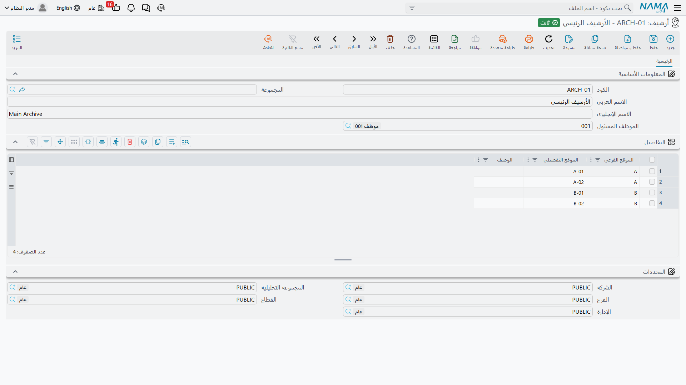
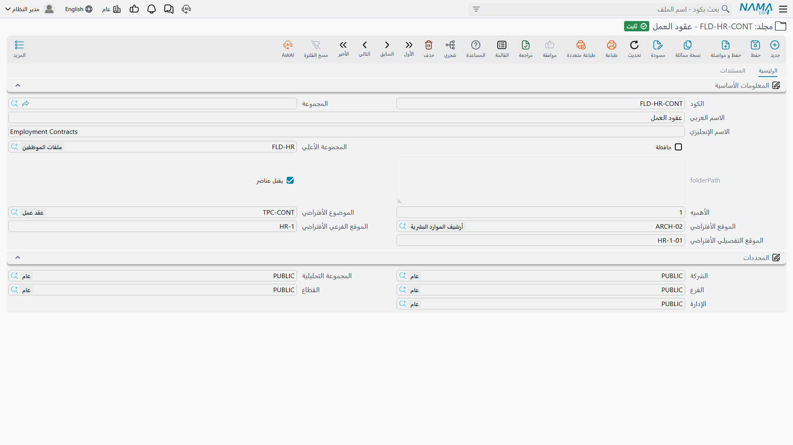
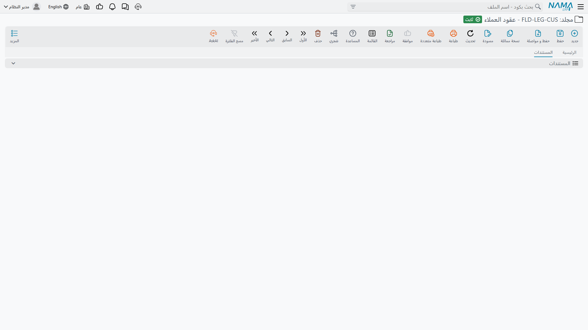
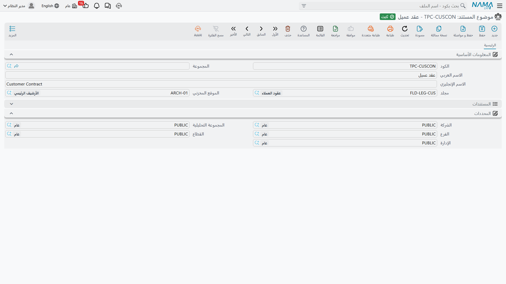

# الأرشيفات والمجلدات والمواضيع

ثلاثة ملفات أساسية تصف أين توجد الأوراق وما موضوعها. تبنيها مرة واحدة عند التطبيق، وإن أحسنت
بناءها فستملأ شاشة المستند نفسها بنفسها لمن يستخدمها يوميًا.

وهي تجيب عن ثلاثة أسئلة مختلفة، ويحسن التفريق بينها:

- **الأرشيف (DMS Location)** — *أين توجد الورقة ماديًا؟* غرفة أو خزنة أو مجموعة دواليب.
- **المجلد (DMS Folder)** — *كيف تُحفظ منطقيًا؟* شجرة أشبه بمجلدات الحاسب.
- **موضوع المستند (DMS Topic)** — *ما نوع هذا المستند؟* تصنيف موضوعي.

يشير المستند إلى الثلاثة معًا وهي مستقلة بعضها عن بعض؛ فقد يقع عقدان في المجلد نفسه وفي أرشيفين
مختلفين، وقد يقع مستندان في الأرشيف نفسه ضمن مجلدين مختلفين تمامًا.

## الأرشيفات — أرشيف / DMS Location

ابدأ من هنا، لأن المجلدات والمواضيع تشير إلى الأرشيفات.

الأرشيف مكان تخزين مادي له موظف مسئول. وبداخله جدول **التفاصيل** الذي يمثل كشفًا بالمواقع التي
يضمها — الرفوف والأدراج والصناديق التي يمكن أن يستقر فيها المستند فعلًا.

| الحقل | التسمية الإنجليزية | الغرض منه |
|---|---|---|
| **الكود** و**الاسم العربي** و**الاسم الإنجليزي** | Code / Name1 / Name2 | هوية الملف الأساسي المعتادة. |
| **الموظف المسئول** | Responsible Employee | المسئول عن هذا الأرشيف. يُسجَّل للعلم فقط ولا يمنح صلاحية ولا يقيّدها. |
| **الموقع الفرعي** *(جدول)* | Sub Location | الموقع العام — غرفة أو ممر أو دولاب. |
| **الموقع التفصيلي** *(جدول)* | Detailed Location | الموقع الدقيق — رفّ أو درج أو صندوق. |
| **الوصف** *(جدول)* | Description | ملاحظة حرة عن هذا الموقع. |

وفائدة هذا الجدول تظهر في شاشة المستند. فحقلا الموقع الفرعي والموقع التفصيلي في المستند **نصّ حر**
لا قائمة اختيار — لكن بمجرد اختيارك أرشيفًا تُعرض عليك القيم المسجَّلة هنا كاقتراحات أثناء الكتابة.
وتسجيل الرفوف مرة واحدة هو ما يمنع خمسة أشخاص من ابتكار خمس صيغ لاسم الدولاب نفسه.

::: tip اجعل أسماء المواقع محايدة لغويًا
هذه الحقول نصّ عادي **غير مترجم**، فتظهر القيمة نفسها في الواجهة العربية والإنجليزية. لذا فرموز
قصيرة مثل `A` أو `B-01` أو `HR-2` أنسب من الكلمات.
:::

## المجلدات — مجلد / DMS Folder

المجلدات شجرة تمامًا كمجلدات الحاسب: لكل مجلد أب محتمل، ويمكن أن تتعمق الشجرة كما تشاء.

| الحقل | التسمية الإنجليزية | ماذا يفعل |
|---|---|---|
| **المجموعة الأعلي** | Parent | المجلد الذي يعلو هذا المجلد. ولا تعرض قائمة الاختيار إلا المجلدات التي **لا** تقبل عناصر. |
| **يقبل عناصر** | Accepts Elements | الخيار الذي يحدد وظيفة المجلد. انظر أدناه، فأثره أكبر مما يبدو. |
| **حافظة** | Aclaseir Folder | يجعل المجلد حافظة بدل أن يكون مجلدًا عاديًا. ويمكن حفظ المستند في حافظة *بالإضافة* إلى مجلده العادي. |
| **الأهميه** | Importance | أولوية رقمية. تُسجَّل فقط ولا يترتب عليها شيء. |
| **الموضوع الأفتراضي** | Default Topic | يُنسخ إلى أي مستند يُحفظ هنا. |
| **الموقع الأفتراضي** | Default Location | يُنسخ إلى أي مستند يُحفظ هنا. |
| **الموقع الفرعي الأفتراضي** | Default Sub Location | يُنسخ إلى أي مستند يُحفظ هنا. |
| **الموقع التفصيلي الأفتراضي** | Default Detailed Location | يُنسخ إلى أي مستند يُحفظ هنا. |

### «يقبل عناصر» — الخيار الذي يُربك الجميع

المجلد إما **حاوية** لمجلدات أخرى وإما **مكان حفظ** للمستندات، ولا يجمع بين الأمرين. وخيار «يقبل
عناصر» هو ما تحدد به ذلك:

- **مُعلَّم** — يمكن حفظ المستندات فيه، ويظهر في قائمة اختيار المجلد بشاشة المستند، ولن يظهر في
  قائمة اختيار المجلد الأعلى لمجلد آخر.
- **غير مُعلَّم** — المجلد فرع في الشجرة، يصلح أن يكون أبًا، ولا يمكن حفظ أي مستند فيه مباشرة.

::: warning المجلدات الجديدة تأتي مُعلَّمة ولا شيء يغيّر ذلك تلقائيًا
يُنشأ كل مجلد وخيار «يقبل عناصر» مُعلَّم فيه سلفًا، وإضافة مجلد ابن **لا** تزيل العلامة. لذا عند
بناء الشجرة من الأعلى إلى الأسفل عليك إزالة العلامة بنفسك عن كل مجلد فرعي قبل أن يصلح أن يكون أبًا.

فإذا أنشأت مجلدًا للتو ورفض الظهور في قائمة المجلد الأعلى لمجلد آخر، فهذا هو السبب.
:::

### القيم الافتراضية تنزل مرتين

حقول «الافتراضي» الأربعة تسهيل يوفّر كتابة كثيرة، وهي تنتقل في اتجاهين:

1. **من المجلد الأب إلى المجلد الابن.** اختر مجلدًا أعلى فتُنسخ قيمه الافتراضية الأربع إلى المجلد
   الذي تنشئه، وعدّلها بعد ذلك إن اختلف الابن.
2. **من المجلد إلى المستند.** احفظ مستندًا في مجلد فتُكتب على المستند قيم الموضوع والأرشيف والموقع
   الفرعي والموقع التفصيلي الافتراضية.

::: tip النقل الثاني يحتاج «الموضوع الأفتراضي»
لا يحدث النسخ من المجلد إلى المستند إلا إذا كان المجلد يحمل **موضوعًا افتراضيًا**. أما المجلد الذي
له أرشيف افتراضي بلا موضوع افتراضي فلا ينسخ *شيئًا* — ولا حتى الأرشيف. فإذا بدا أن القيم الافتراضية
لا تعمل، فافحص الموضوع أولًا.
:::

### الوصول إلى المستندات من الشجرة

صفحة المجلد الثانية **المستندات** تعرض كل ما حُفظ في ذلك المجلد، بما في ذلك ما حُفظ فيه بوصفه حافظة.
ويمكنك تضييق القائمة بالموضوع والأرشيف والموقع الفرعي والموقع التفصيلي دون مغادرة الشاشة.

## المواضيع — موضوع المستند / DMS Topic

الموضوع هو مادة المستند: «عقد عمل» أو «ترخيص» أو «إثبات هوية». وهو جواب سؤال *ما نوع هذا الشيء*،
في مقابل سؤال *أين يُحفظ*.

| الحقل | التسمية الإنجليزية | ماذا يفعل |
|---|---|---|
| **مجلد** | DMS Folder | يقصر الموضوع على مجلد بعينه. |
| **الموقع المخزني** | Location | يقصر الموضوع على أرشيف بعينه. |

كلاهما اختياري، وكلاهما يُستخدم **فلترًا**: فعند اختيار الموضوع في المستند تضيق القائمة على
المواضيع التي يطابق مجلدها مجلد المستند ويطابق أرشيفها أرشيف المستند.

::: warning اجعل نطاق الموضوع متسقًا مع القيم الافتراضية للمجلد
لأن القيم الافتراضية للمجلد تضبط موضوع المستند **وأرشيفه** في آن واحد، يمكن أن تُعِدّ مجلدًا يكون
موضوعه الافتراضي مرفوضًا من فلتر قائمة المواضيع نفسها — كأن يُنسخ موضوع مقصور على الأرشيف الرئيسي
إلى مستند أرشيفه الافتراضي أرشيف الموارد البشرية. تُكتب القيمة فعلًا، لكن من يفتح القائمة بعد ذلك
لن يجدها.

وأبسط طريقة لتجنب ذلك أن تقصر كل موضوع على الأرشيف نفسه الذي يشير إليه مجلده.
:::

وتحمل شاشة الموضوع كذلك قائمة مدمجة بكل مستند مصنَّف تحته، وهي غالبًا أسرع طريقة للإجابة عن سؤال
«كم عقد عمل لدينا؟».
