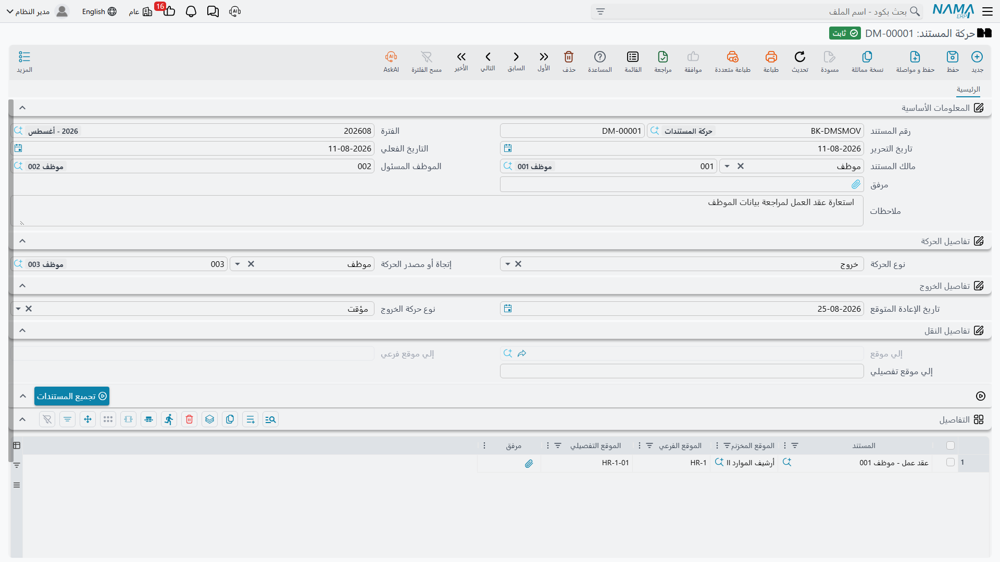
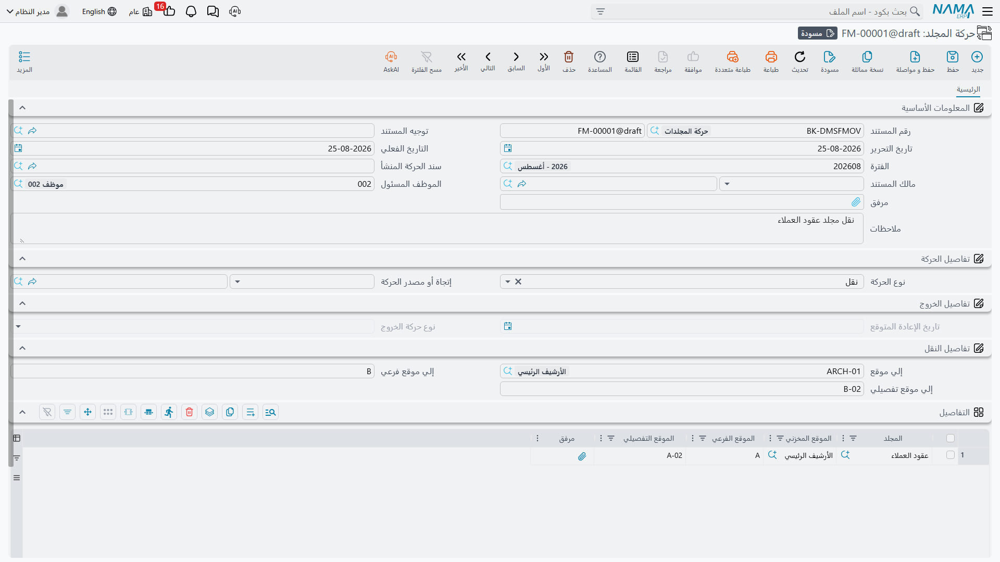

# إخراج المستندات وإعادتها

الورق يغادر الأرشيف. يستعير أحدهم أصل العقد لجلسة محكمة، ويأخذ المراجع ملف التراخيص أسبوعًا،
ويُسلَّم صك نهائيًا عند بيع عقار. وسندات الحركة هي وسيلتك لتسجيل ذلك.

الحركة **مستند** لا ملف أساسي، فهي تتصرف كالفاتورة: تحتاج دفترًا، ولها تاريخ إصدار وتاريخ فعلي،
ويمكن حفظها مسودة، وتسري أثرها عند الترحيل.

::: tip أنشئ دفترًا قبل أن تبدأ
لا يوجد دفتر لحركة المستند جاهزًا. وإلى أن ينشئ أحدهم
[دفتر مستندات](/ar/platform/global-config/global-config-documents.md) نوعه «حركة المستند» لن
يستطيع أحد تسجيل أي حركة. وهذا هو السبب المعتاد في ظهور الشاشة وكأنها معطّلة على تركيب جديد.
:::

## تسجيل حركة مستند

يصف رأس السند الحركة في مجملها:

| الحقل | التسمية الإنجليزية | الغرض منه |
|---|---|---|
| **الكود** | Document Code | الدفتر ورقم السند. |
| **تاريخ الإصدار** / **التاريخ الفعلي** | Issue Date / Value Date | التاريخ الفعلي هو ما ينزل على سطور التاريخ، ويجب أن يقع في فترة مالية مفتوحة. |
| **نوع الحركة** | Movement Type | نوع الحركة، وهو ما يقود الشاشة كلها كما يلي. |
| **مالك المستند** | Document Owner | مقصور على **عميل** أو **موظف**. وملؤه يضيّق قائمة اختيار المستندات على أوراق ذلك المالك. |
| **إتجاة أو مصدر الحركة** | Movment Destenition Or Source | الجهة التي تذهب إليها الورقة أو تأتي منها: **عميل** أو **موظف** أو **طرف ثالث**. |
| **الموظف المسئول** | Responsible Employee | من أذن بالحركة أو نفّذها. يُنسخ على كل سطر في التاريخ. |
| **مرفق** | Attachment | مكان لإيصال التسليم الموقّع. |

### أنواع الحركة الأربعة

| النوع | التسمية الإنجليزية | متى تستخدمه | الحالة الناتجة |
|---|---|---|---|
| **دخول** | DMS In | عودة الورقة إلى الأرشيف | بالداخل |
| **خروج** | DMS Out | مغادرة الورقة الأرشيف | حسب نوع الخروج أدناه |
| **نقل** | DMS Transfer | نقل الورقة إلى رفّ آخر | بالداخل |
| **فقد** | Lost | تعذّر العثور على المستند | *انظر التحذير أدناه* |

واختيار **خروج** يفعّل مجموعة **تفاصيل الخروج** ويختار لك مسبقًا نوع خروج «مؤقت»:

| نوع الخروج | التسمية الإنجليزية | معناه | الحالة الناتجة |
|---|---|---|---|
| **مؤقت** | Temporary | مستعار ومتوقَّع عودته في تاريخ الإعادة المتوقع | بالخارج مؤقتا |
| **نهائي** | Final | خرج نهائيًا | بالخارج بشكل نهائي |
| **تخلص** | Disposal | أُتلف أو مُزّق | تم التخلص منه |
| **فقد** | Lost | ضاع | *انظر التحذير أدناه* |

أما اختيار **نقل** فيفعّل مجموعة **تفاصيل النقل** حيث تسمّي الأرشيف والموقع الفرعي والموقع التفصيلي
المقصودة. والمجموعتان متنافيتان: فالتي لا تنطبق تظهر معطّلة كما في الصورة أعلاه.

::: warning لا تستخدم «فقد» — فهي تسجّل المستند موجودًا
كلٌّ من نوع الحركة «فقد» ونوع الخروج «فقد» معطوب. فحركة «فقد» تضع المستند في حالة **بالداخل** التي
تعني أن الورقة في الأرشيف سليمة. وحركة «خروج» بنوع خروج «فقد» تترك الحالة كما كانت.

وإلى أن يُصلح ذلك، سجّل المستند المفقود بوصفه **خروج ← نهائي** واشرح ما جرى في حقل الملاحظات. فذلك
على الأقل يترك حالة لا تدّعي أن الورقة على الرفّ.
:::

### إدراج المستندات

أضف سطرًا لكل مستند في جدول **التفاصيل**. وقائمة اختيار المستند واعية بما تفعل: ففي حركة الدخول لا
تعرض إلا المستندات غير الموجودة بالداخل، وفي النقل لا تعرض إلا المستندات المبدئية أو التي بالداخل،
وإن ملأت مالك المستند في الرأس فلن تعرض إلا أوراق تلك الجهة.

ولأي عدد يتجاوز حفنة سطور استخدم **تجميع المستندات**. يسألك عن مجلد ثم يجلب كل مستند محفوظ فيه —
بما في ذلك ما حُفظ فيه بوصفه حافظة — مع ملء موضع كل سطر الحالي.

::: warning أجب دائمًا عن سؤال المجلد
المجلد اختياري، وتركه فارغًا يحمّل **كل مستند في النظام** إلى الجدول، وهو في أرشيف حقيقي آلاف
السطور. كما أنه يتجاهل حالة المستند، فتُجلب المستندات التي بالخارج أصلًا مع غيرها.
:::

## ماذا يفعل الترحيل فعلًا

عند ترحيل حركة المستند يحدث أمران لكل سطر:

1. يُكتب **سطر تاريخ** على المستند يسجّل نوع الحركة والتاريخ الفعلي والموظف المسئول وموضع المستند في
   الأرشيف.
2. تُحدَّث **حالة** المستند بحسب الجداول أعلاه.

وهذا كل ما يحدث — والنقص هنا مهم:

::: warning حركة النقل لا تنقل المستند
الوجهة التي كتبتها في «تفاصيل النقل» تُخزَّن على السند فقط ولا مكان لها غير ذلك. فحقول الأرشيف
والموقع الفرعي والموقع التفصيلي في المستند نفسه **لا تُحدَّث**، وسطر التاريخ يسجّل الموضع الذي
انتقل المستند *منه*.

فبعد نقل ترخيص من الرف A-01 إلى B-01 يظل المستند مسجَّلًا على A-01، وكذلك تاريخه، ومن يبحث بالرفّ
سيبحث في المكان الخطأ.

**وإلى أن يُصلح ذلك، افتح كل مستند منقول وحدّث حقول موضعه يدويًا.** ولنقل كبير يكون
[استيراد](/ar/platform/import-export/importing-records.md) المواضع الجديدة أسرع من تعديلها واحدًا
واحدًا.
:::

::: warning لا يمكن تصحيح الحركات ولا التراجع عنها
تعديل حركة مرحَّلة لا يعيد كتابة سطور تاريخها ولا يعيد اشتقاق حالة المستند، وإلغاؤها يترك سطور
التاريخ مكانها ويترك المستند عالقًا في الحالة التي أعطته إياها.

فاضبط الحركات من أول مرة. وإن رحّلت حركة خاطئة فالعلاج الوحيد حركة معاكسة تعوّضها — ويبقى سطر
التاريخ الخاطئ على السجل بصفة دائمة.
:::

## حركة المجلد

وُجدت حركة المجلد لتوفّر عليك إدراج المستندات واحدًا واحدًا: تسمّي مجلدًا، ويُفترض أن يوسّعه النظام
عند الترحيل إلى كل مستند تحته وينشئ حركة مستند عادية تقوم بالعمل الفعلي.

::: danger لا يمكن ترحيل حركة المجلد حاليًا
يتطلب السند دفترًا للحركة التي ينشئها، و**هذا الحقل غير موجود على الشاشة**. فلا سبيل إلى ملئه من
الواجهة ولا من الاستيراد. يمكنك إكمال النموذج وحفظه مسودة، لكن الترحيل يفشل دائمًا برسالة
*«لا يمكن ترك دفتر الحركة المنشأ فارغا»*.

استخدم **حركة المستند** مع زر **تجميع المستندات** بدلًا منها — فهي تؤدي العمل نفسه بنقرة إضافية
واحدة وتعمل فعلًا. بل إن «تجميع المستندات» يشمل الحفظ في الحوافظ، وهو ما لا تفعله حركة المجلد.

وإن كان لا بد لك من حركة المجلد، فإن
[معدّل شاشات](/ar/platform/screen-modifier/screen-modifier-edit-screen.md) يضيف حقل دفتر الحركة
المنشأة إلى التخطيط سيفكّ حصار الشاشة. لكن يقبع خلفه عيبان آخران فاختبرها جيدًا قبل الاعتماد عليها:
إدراج أكثر من مجلد في السند الواحد لا يلتقط مستندات المجلد الثاني على نحو موثوق، والمستندات المحفوظة
في حافظة فقط تُتخطّى.
:::

وللإفادة، فالإعداد المقصود هو
[توجيه](/ar/platform/global-config/global-config-documents.md) لحركة المجلد تسمّي صفحة إعداداته
الدفتر النظامي الذي يستقبل حركة المستند المنشأة. وهذا الإعداد في التوجيه يُقرأ صحيحًا؛ الحقل الذي
يمنع الترحيل هو حقل الرأس.
