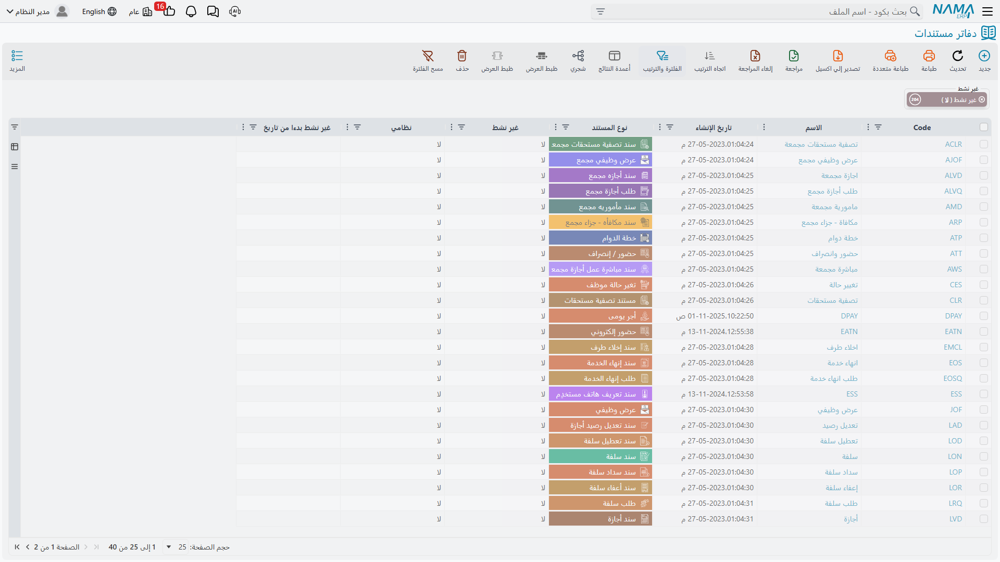
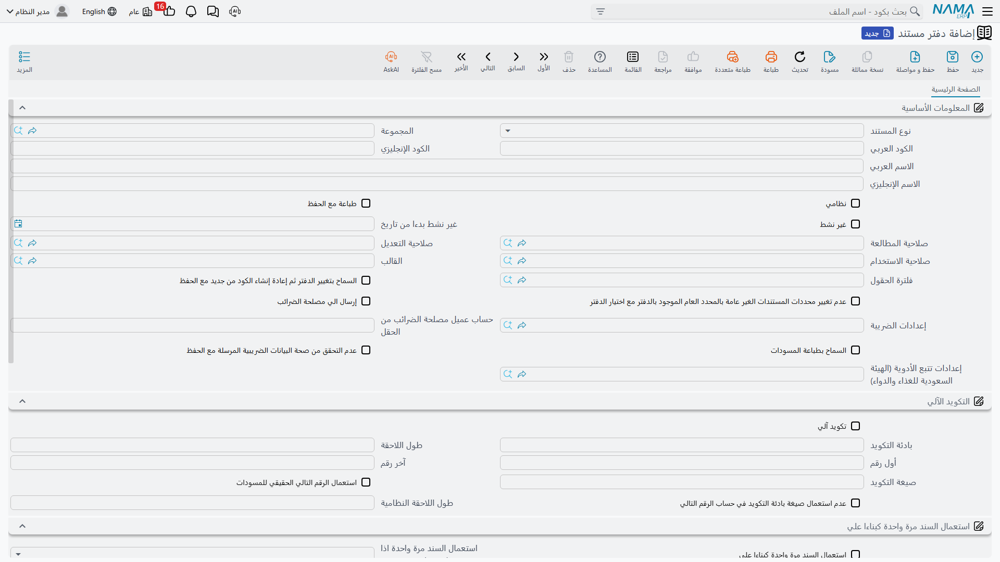

# دفاتر المستندات (Document Books)

كل مستند في نما — كل فاتورة مبيعات، وكل صرف مخزني، وكل سند قبض، وكل قيد يومية — لا بد أن ينتمي إلى
**دفتر مستند**. والدفتر ليس اختياريًا: حاول حفظ مستند بدون دفتر وسيوقفك النظام برسالة «الدفتر مطلوب».

والسبب بسيط. الدفتر هو **سلسلة الترقيم** التي يأخذ منها المستند رقمه. فحين يحفظ المحاسب في الرياض
فاتورة مبيعات فتخرج بالرقم `SI-RYD-002417`، يكون هذا الرقم قد صدر من دفتر اسمه شيء مثل «فواتير مبيعات
الرياض»، وهو الذي يعرف البادئة والرقم المتسلسل الحالي وعدد الخانات التي يُكمَّل إليها. افتح دفترًا ثانيًا
لفرع جدة، وستجري فواتيره على سلسلة مستقلة تمامًا تبدأ من ١ من جديد.

هذه هي وظيفته الأساسية. ومع السنين اكتسب الدفتر وظيفة ثانية: صار مكانًا مناسبًا لتعليق مجموعة من
السلوكيات التي يُراد تطبيقها على *هذا التيار من المستندات دون غيره* — الطباعة تلقائيًا مع الحفظ، والسماح
باستعمال المستند مرة واحدة فقط كمستند مصدر، واختصار القيد المحاسبي، وتعبئة الحقول من قالب. وهذه الإضافات
مشروحة في الأسفل.

::: info أين تجده
**الأساسيات ← الإعدادات ← دفتر مستند**. تعرض القائمة كل الدفاتر في النظام، ويخبرك عمود **نوع المستند**
بما يُرقِّمه كل دفتر.
:::

## دفتر واحد لنوع مستند واحد

أول حقل في الدفتر هو **نوع المستند**، وهو الحقل الذي يحدد كل ما عداه. فدفتر فواتير المبيعات يُرقِّم فواتير
المبيعات ولا شيء غيرها. ضع هذا الدفتر على صرف مخزني وسيفشل الحفظ برسالة: *«دفتر المستند … مخصص لـ
SalesInvoice وأنت تستعمله في StockIssue»*.

وهناك نتيجتان تستحقان المعرفة قبل أن تبدأ إنشاء الدفاتر.

**لا يمكنك تغيير نوع المستند بعد أول حفظ.** يرفض النظام ذلك برسالة «لا يمكن تغيير نوع مستند الدفتر بعد
أول حفظ». فاختر النوع بعناية؛ وإن أخطأت، أنشئ دفترًا جديدًا وأحِل القديم إلى التقاعد.

**الدفاتر للمستندات فقط.** أما الملفات الرئيسية — العملاء والأصناف والموظفون — فتُرفض برسالة «نوع الكيان
… ملف رئيسي». وترقيمها تتولاه **المجموعة** (**الأساسيات ← الإعدادات ← مجموعة**)، وهي توأم الدفتر في
جانب الملفات الرئيسية: تسمّي النوع الذي تُكوِّده في **للنوع**، وتحمل كتلة **التكويد الآلي** نفسها
بحقولها الستة، وتُقفل بالطريقة نفسها — فيتجمّد النوع بعد أول حفظ، ويتجمّد التكويد بمجرد استعمال سجل
معتمد للمجموعة. وكل ما تقوله هذه الصفحة تقريبًا عن بناء الرقم ينطبق هناك دون تغيير.

وتزيد المجموعات أمورًا لا تملكها الدفاتر. فهي تكوّن **شجرة** تعمل كذلك لوحةَ تنقّل في كل قائمة ملف
رئيسي — غير أن المجموعة الأعلى تصنيف ليس إلا، ولا تورّث فروعها شيئًا. وهي تحمل محرّك تكويد ثانيًا:
كتلة صيغة، ومعها جدول من صيغ التكويد حسب المعايير تستطيع بناء الكود والكود الإنجليزي والاسمين — وهذا
المحرّك يغلب في صمت كتلةَ التكويد الآلي التي بجواره.
و[المجموعات](/ar/platform/master-groups) تشرح ذلك كله.

وهناك آلية ثالثة للملفات الرئيسية أيضًا — جدول **التكويد الآلي للملفات** الموصوف في
[التكويد الآلي للملفات الرئيسية](/ar/platform/fields-and-entities-settings/fields-settings-auto-coding)،
وهو يُكوِّد بصيغة دون مجموعة.

كما ينتمي الدفتر إلى **شركة**، وخلافًا لأغلب السجلات لا يجوز تركها *أي*. والاستثناء الوحيد هو الحفنة من
أنواع المستندات العامة فعلًا (التي توجد فوق مستوى أي شركة بعينها)؛ وفيما عدا ذلك يُلزمك النظام باختيار
شركة حقيقية عند الحفظ.

## كيف يُبنى الرقم

مجموعة **التكويد الآلي** هي المكان الذي تُوصَف فيه السلسلة. وستة حقول تقوم بالعمل.

| الحقل | معناه |
|---|---|
| تكويد آلي (Automatic Coding) | عند تفعيله يمنح النظام الرقم؛ وعند إيقافه يكتبه المستخدم بنفسه. |
| بادئة التكويد (Prefix) | النص الثابت الذي يبدأ به كل رقم، مثل `SI-RYD-`. |
| طول اللاحقة (Suffix Length) | عدد خانات الرقم المتسلسل. القيمة `4` تحوِّل ١٧ إلى `0017`. |
| أول رقم (Suffix First Number) | الرقم الذي تبدأ منه السلسلة. |
| آخر رقم (Suffix Maximum) | آخر رقم يُسمح للسلسلة ببلوغه. |
| صيغة التكويد (prefixFormula) | نص بادئة إضافي يُحسب لكل مستند — انظر أدناه. |

ويستحق الأخير كلمة تنبيه: فهو في الشاشة الإنجليزية يظهر باسم حقله الخام **prefixFormula** لا بعنوان
مقروء، أما في العربية فيقرأ **صيغة التكويد**. وهو الحقل نفسه.

فدفتر ببادئة `SI-RYD-` وطول لاحقة `6` وأول رقم `1` ينتج `SI-RYD-000001` ثم `SI-RYD-000002` وهكذا.

ويتحقق النظام من الحساب عند حفظ الدفتر: يجب أن يكون أول رقم أصغر من آخر رقم، وأن يكون طول اللاحقة كافيًا
لاستيعاب آخر رقم (فالحد الأقصى `999999` لا يتسع في طول لاحقة `4`)، وألا يتجاوز طول اللاحقة نفسه ٢٠ خانة.

::: tip البادئة مطلوبة عمليًا
مع تفعيل التكويد الآلي تكون البادئة إلزامية. ومع إيقافه تظل مطلوبة افتراضيًا — والفكرة أن الرقم المكتوب
يدويًا ينبغي أن يكون على الأقل قابلًا للتمييز بأنه من هذا الدفتر. فإن كان لديك دفتر يجب أن تقف أرقامه
وحدها فعلًا، فإن الخيار العام **السماح ببادئة فارغة للدفتر اليدوي** في
[تبويب المستندات](/ar/platform/global-config/global-config-documents) يخفف هذا الشرط.
:::

### جعل السلسلة تبدأ من جديد كل سنة

**صيغة التكويد** هي الحقل الذي يحوِّل السلسلة المسطحة إلى سلسلة لكل سنة أو لكل فرع أو لكل شهر. وهي قالب
صغير يُقيَّم على المستند الجاري حفظه، وما ينتج عنه يُضاف إلى البادئة الثابتة.

اكتب صيغة تُخرج سنة التاريخ الفعلي، وسيبدأ دفتر ببادئة `SI-` في إنتاج `SI-2026-000001`. ومع حلول يناير
تُخرج الصيغة `2027`، وهنا الجزء المهم: **يعود المتسلسل إلى ١ مع البادئة الجديدة**. فالنظام يحتفظ برقم
جارٍ منفصل لكل قيمة مختلفة أنتجتها الصيغة. وهكذا يتحقق التصفير السنوي — لا عبر إعداد «فترة تصفير»، بل
بجعل السنة جزءًا من البادئة.

وإن أردت أن تظهر الصيغة في الرقم دون أن *تُجزِّئ* السلسلة — أي سلسلة واحدة متصلة تُطبع فيها السنة فحسب —
فعِّل **عدم استعمال صيغة بادئة التكويد في حساب الرقم التالي**. عندئذ يواصل الرقم صعوده عبر حدود السنة.

::: warning الصيغة التي لا تُرجع شيئًا تعود إلى سلسلة واحدة مشتركة
إذا أنتجت الصيغة نتيجة فارغة لمستند بعينه، فسيُرقَّم ذلك المستند من سلسلة الدفتر الافتراضية الواحدة بدلًا
من سلسلة خاصة بالبادئة. وصيغة لا تعمل إلا إذا كان الفرع مُعبَّأً — مثلًا — ستخلط تلك المستندات بهدوء في
السلسلة الرئيسية.
:::

## المسودات وأرقامها

المستند المحفوظ كمسودة ليس مستندًا حقيقيًا بعد، وهو افتراضيًا لا يستهلك رقمًا حقيقيًا. يمنحه نما كودًا
مؤقتًا من سلسلة مسودات منفصلة ويضع عليه علامة — فكود المسودة ينتهي بـ `@draft`. وحين تُعتمد المسودة
نهائيًا يُعاد ترقيمها من السلسلة الحقيقية ويُحرَّر الرقم المؤقت.

وهذا يبقي السلسلة النهائية خالية من الفجوات الناتجة عن مسودات مهجورة. والثمن أن رقم المسودة ليس هو الرقم
الذي ستنتهي إليه، وهو ما يربك المستخدمين الذين يدوِّنون رقم المسودة على ورقة.

ومفتاحان يغيّران ذلك. **استعمال الرقم التالي الحقيقي للمسودات** في الدفتر يجعل المسودات تسحب من السلسلة
الحقيقية مباشرة، فيكون الرقم الذي يراه المستخدم على المسودة هو الرقم الذي يحتفظ به المستند. عندئذ تحرق
المسودات المهجورة أرقامًا حقيقية وتترك فجوات. والخيار نفسه موجود عامًّا في
[تبويب المستندات](/ar/platform/global-config/global-config-documents)، ومفتاح الدفتر هو التجاوز الأضيق.

و**السماح بطباعة المسودات** يقرر ما إذا كان يجوز طباعة مستند لا يزال مسودة أصلًا. اتركه مغلقًا ويصبح على
المستخدمين اعتماد المستند قبل أن يسلِّموا أي ورقة للعميل.

## حين تنفد الأرقام

**آخر رقم** حدٌّ حقيقي، ويتعامل النظام مع نهاية السلسلة على خطوتين.

حين يأخذ مستندٌ الرقمَ *المساوي* للحد الأقصى، يُحوَّل الدفتر تلقائيًا إلى **منع الاستعمال** — فيتوقف عن
الظهور في مُحدِّد الدفاتر، ولا يستطيع أحد بدء مستند آخر عليه. أما المستند الذي أخذ آخر رقم فيُحفظ عاديًا.

وإذا تجاوز مستندٌ الحد الأقصى بطريقة ما، يفشل الحفظ صراحةً: *«الحد الأقصى للاحقة السجل … هو …، والسجل …
سيتجاوز هذا الحد»*.

والعلاج في الحالتين واحد: أنشئ الدفتر التالي في السلسلة. ولا يمكنك ببساطة رفع الحد الأقصى على دفتر أصدر
أرقامًا بالفعل، لأن إعدادات التكويد الآلي تُجمَّد بمجرد دخول الدفتر الخدمة — كما يلي.

## ما الذي يُقفَل بعد استعمال الدفتر

يحمي نما تاريخ الدفتر بحزم، لأن تغيير طريقة بناء الأرقام بأثر رجعي يجعل الأرقام القائمة بلا معنى.

- **نوع المستند** — يُجمَّد بعد أول حفظ للدفتر نفسه.
- **تكويد آلي، وبادئة التكويد، وأول رقم، وطول اللاحقة** — تُجمَّد بمجرد استعمال *أي* مستند معتمد للدفتر.
  والرسالة هي «لا يمكن تغيير التكويد الآلي لأن السجل استُعمل في مستندات». والمسودات لا تُقفِله؛ ومستند
  معتمد واحد يكفي.

أما **آخر رقم** و**صيغة التكويد** فليسا ضمن المجموعة المجمَّدة، ويمكن تعديلهما على دفتر قيد الاستعمال.

وهناك مخرج واحد مقصود لرقم مستند بعينه. **السماح بتغيير الدفتر ثم إعادة إنشاء الكود من جديد مع الحفظ**
يتيح للمستخدم نقل مستند محفوظ إلى دفتر *آخر* وإعادة ترقيمه من سلسلة الدفتر الجديد عند الحفظ. وبدونه يظل
الرقم القديم كما هو عند تغيير الدفتر على مستند محفوظ. فعِّله فقط حيث تتوقع فعلًا إعادة توزيع المستندات
بين الدفاتر، لأنه يعني أن رقم المستند قد يتغير بعد أن يكون الناس قد رأوه.

## إحالة الدفتر إلى التقاعد

نادرًا ما تحذف دفترًا — فمستنداته لا تزال تشير إليه. بل تُحيله إلى التقاعد.

**غير نشط** يوقف استعمال الدفتر على المستندات الجديدة. أما المستندات المعتمدة عليه فلا تُمَس، والمستند
الذي اعتُمد قبل وضع العلامة يظل قابلًا للتعديل. واعتماد مستند *جديد* على دفتر غير نشط يفشل برسالة «الدفتر
… لا يمكن استعماله لأنه غير نشط».

و**غير نشط بدءًا من تاريخ** يجعل التقاعد مرتبطًا بالتاريخ، وهو يعمل مقابل **التاريخ الفعلي** للمستند لا
تاريخ اليوم. اضبطه على ١ يناير وستمر المستندات المؤرَّخة بأثر رجعي في ديسمبر، بينما يُرفض كل ما هو مؤرَّخ
من يناير فصاعدًا. وإن أشَّرت «غير نشط» وتركت التاريخ فارغًا، ختم النظام تاريخ اليوم نيابة عنك.

## من يجوز له استعمال الدفتر، وما الذي يعبِّئه مسبقًا

لأن الدفتر يجلس على المستند منذ لحظة إنشائه، فهو مكان طبيعي للتحكم في الصلاحيات والقيم الافتراضية.

**صلاحية المطالعة / صلاحية التعديل / صلاحية الاستخدام** هي حقول الصلاحيات الثلاثة المعتادة. وهي تقرر أي
ملفات الصلاحيات تستطيع رؤية الدفتر، وتعديل سجل الدفتر نفسه، واختياره على مستند. وتقييد **صلاحية
الاستخدام** هو الطريقة المعتادة لمنع فريق جدة من إصدار فواتير من سلسلة الرياض. راجع
[ملفات الصلاحيات](/ar/platform/security/security-profiles) لمعرفة كيفية منح الصلاحيات.

**القالب** يشير إلى قالب قيم افتراضية. وحين يُختار الدفتر على مستند جديد تُطبَّق قيم القالب — فيستطيع
الدفتر أن يحمل معه مجموعة كاملة من القيم الافتراضية المعقولة.

**فلترة الحقول** تُلحق بالدفتر قواعد إظهار وتحقق على مستوى الحقل تُطبَّق على كل مستند يستعمله. وهي الآلية
نفسها الموصوفة في [فلترة الحقول بالمعايير](/ar/platform/field-filter-with-criteria). وهناك قيد واحد:
يجب ألا يكون الفلتر الذي تختاره فلترًا *تلقائيًا* — فتلك تطبّق نفسها عامًّا وتُرفض هنا.

**المحددات.** يحمل الدفتر محدداته الخاصة، واختياره ينسخها إلى المستند حيثما كان محدد المستند فارغًا أو
مضبوطًا على القيمة العامة. وإن فضّلت ألا يستبدل الدفتر أبدًا محددًا ضيّقه المستخدم بالفعل، فأشِّر **عدم
تغيير محددات المستندات الغير عامة بالمحدد العام الموجود بالدفتر مع اختيار الدفتر**.

## السلوك الذي يقرره الدفتر لمستنداته

هذه هي الإضافات — مفاتيح صغيرة تشكّل سلوك مستندات هذا التيار.

**طباعة مع الحفظ** ترسل المستند إلى الطابعة مباشرة عند حفظه. وهذا شائع في نقاط الكاشير ومكاتب التسليم،
حيث لا قيمة لمستند بلا نسخة مطبوعة.

**إختصار القيود** يدمج سطور القيد التي تصيب الحساب نفسه بدل كتابة سطر لكل سطر مستند، وهو ما يبقي قيود
اليومية قابلة للقراءة في المستندات ذات مئات السطور. و**ترتيب سطور القيد (مدين قبل الدائن)** يرتّب القيد
الناتج بحيث يسبق المدين الدائن.

**المراجعة مع الحفظ** تضع علامة المراجعة على المستند لحظة اعتماده، فلا يحتاج إلى خطوة المراجعة المنفصلة
الموصوفة في [المراجعة وإلغاء المراجعة](/ar/platform/revise-and-unrevise).

### استعمال المستند مرة واحدة

مجموعتان من الإعدادات تمنعان استهلاك المستند نفسه مرتين كمستند مصدر — والحالة الكلاسيكية هي إذن تسليم
يجب ألا يُفوتَر على فاتورتين مختلفتين.

**استعمال السند مرة واحدة** تنظر إلى المستندات المُنشأة *من* مستندات هذا الدفتر. فعِّل **استعمال السند
مرة واحدة** وسيُمنع أي مستند من مستندات هذا الدفتر من الاستعمال ثانيةً بمجرد استعماله مصدرًا لمستند آخر.
و**استعمال السند مرة واحدة اذا استعمل في نوع من** يضيّق ذلك إلى نوع هدف واحد، و**استعمال السند مرة واحدة
اذا استعمل في النوع** إلى قائمة مسماة — فيمكن قفل إذن التسليم بمجرد فوترته مع بقائه متاحًا لمستند مرتجع.

**منع مستند بناءً على من الاستعمال مرة أخرى** هي الصورة المعكوسة، وتُضبط على الدفتر *المستهلِك*. فعِّلها
ليُمنع من الاستعمال مجددًا أيُّ مستند تُبنى عليه مستندات هذا الدفتر. و**منع الاستعمال اذا كان نوع السند**
و**منع الاستعمال اذا كان نوع السند واحد من** يضيّقانها بالطريقة نفسها. واترك حقول النوع فارغة لتنطبق
القاعدة على كل أنواع المصادر.

ويمكن ضبط القاعدتين على [توجيه المستند](/ar/modules/supplychain/document-terms/doc-term-general) أيضًا،
وتُقيَّمان معًا — فأيٌّ منهما يكفي لقفل المستند المصدر.

### الحفظ أثناء كتابة المستخدم

يستطيع الدفتر أن يجعل المستند يحفظ نفسه في منتصف الإدخال، وهو ما يجعل العمل السريع على الكاونتر ممكنًا.

**الحقول التي يتم الحفظ آليا بعد إدخالها (CSV)** يأخذ قائمة حقول مفصولة بفواصل؛ ومغادرة أيٍّ منها تُطلق
الحفظ. و**طريقة الحفظ آليا** تقرر نوع الحفظ: *الحفظ كمسودة دائمًا*، أو *الحفظ نهائي دائمًا*، أو *الحفظ
بناءً على حالة السجل*. و**الحقل المحدد بعد الحفظ آليا** يضع المؤشر حيث يحتاجه المستخدم تاليًا، و**السطر
المضاف بعد الحفظ آليا** يضيف سطرًا فارغًا جديدًا إلى جدول ليستمر الإدخال دون اللجوء إلى الفأرة.

والحقول الثلاثة المرافقة لا تعمل إلا مع حقل الإطلاق. فإن عبّأت حقل التركيز أو حقل الجدول وتركت **الحقول
التي يتم الحفظ آليا بعد إدخالها** فارغًا، رفض الدفتر الحفظ وأخبرك بأن حقل الإطلاق ناقص.

### مستندات مصلحة الضرائب

حيث تكون الفوترة الإلكترونية قائمة، يقرر الدفتر ما إذا كانت مستنداته تُبلَّغ.

**إرسال الي مصلحة الضرائب** يفعّل التبليغ لهذا التيار. ولا يمكن ضبطه إلا على نوع مستند قابل للتبليغ فعلًا
— فالنظام يتحقق ويرفض غير ذلك. و**إعدادات الضريبة** تختار إعدادات المكلَّف التي يتم التبليغ تحتها،
و**حساب عميل مصلحة الضرائب من الحقل** يسمّي الحقل الذي يُقرأ منه العميل حين لا يكون للمستند حقل عميل
بديهي، و**عدم التحقق من صحة البيانات الضريبية المرسلة مع الحفظ** يخفف فحوص اكتمال البيانات الضريبية عند
الحفظ. و**إعدادات تتبع الأدوية (الهيئة السعودية للغذاء والدواء)** هي المُعادِل الخاص بتتبع الأدوية
السعودي.

## الدفاتر النظامية

**نظامي** يضع علامة على الدفتر بأنه ملك للنظام لا للمستخدمين. والدفاتر النظامية تُرقِّم مستندات ينشئها
نما داخليًا كأبناء لمستند آخر؛ وتُبنى أكوادها من كود الأب مضافًا إليه متسلسل، و**طول اللاحقة النظامية** —
بحدٍّ أقصى ٣ خانات — يتحكم في عدد خانات ذلك المتسلسل.

ولا يستطيع المستخدم اختيار دفتر نظامي على مستند ينشئه بيده؛ فيُرفض الحفظ برسالة «الدفتر … لا يمكن
استعماله لأنه دفتر نظامي». اترك «نظامي» مغلقًا في كل دفتر تنشئه للمستخدمين.

## الدفاتر وتوجيهات المستندات

الدفاتر و[توجيهات المستندات](/ar/modules/supplychain/document-terms/doc-term-general) سجلات منفصلة
يتعلق كلاهما بالمستند، ومن السهل الخلط بينهما. والتقسيم هو:

- **الدفتر** يقرر *الرقم*، إضافة إلى السلوكيات الصغيرة أعلاه.
- **التوجيه** يقرر كيف *يتصرف* المستند — تسعيره وآثاره المحاسبية وقواعد التوليد والتحقق.

ويستطيع التوجيه تقييد الدفاتر التي يعمل معها. فجدول **الدفاتر المسموح بها** يسرد الدفاتر صراحةً، و**معايير
الدفاتر المسموح بها** تطابقها بقاعدة. عبِّئ أيًّا منهما ويُرفض المزيج غير المتطابق: «توجيه المستند … لا
يمكن استعماله مع الدفتر …». واترك الاثنين فارغين ليعمل التوجيه مع أي دفتر من نوع مستنده.

## حين يعبّئ الدفتر نفسه

اختيار دفتر على كل مستند نقرةٌ يتذمر منها المستخدمون، خصوصًا حين لا يوجد إلا دفتر واحد يمكن اختياره أصلًا.

والخيار العام **استخدام الدفتر الوحيد المعرّف للكيان مع الجديد** في
[تبويب المستندات](/ar/platform/global-config/global-config-documents) يعالج هذه الحالة: فحين يوجد دفتر
واحد بالضبط لنوع المستند الجاري إنشاؤه، يختاره نما تلقائيًا على المستند الجديد — ويطبّق قالبه ومحدداته
في الوقت نفسه. وبمجرد وجود دفتر ثانٍ لذلك النوع يتوقف الاختيار التلقائي ويُسأل المستخدمون من جديد.

والبحث عن ذلك الدفتر الوحيد يحترم افتراضيًا محددات المستخدم الحالية، فيحصل المستخدم في فرع الرياض على
دفتر الرياض. والخيار المرافق **عدم مراعاة المحددات عند البحث عن التوجيه أو الدفتر الوحيد** يوقف ذلك
ويبحث عبر كل المحددات.
