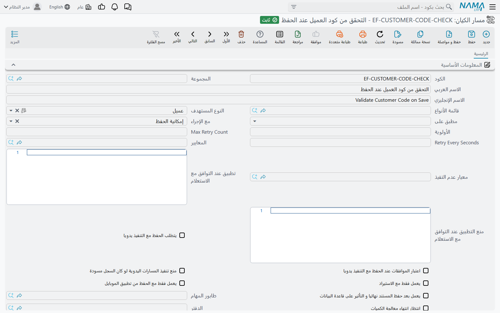

# لماذا لم يعمل مسار الكيان

«أنشأت المسار، وحفظت الفاتورة، ولم يحدث شيء.» هذه أكثر شكوى تصل إلى الدعم عن مسارات الكيان، وفي أغلب الحالات يكون المسار سليمًا: أحد إعداداته هو الذي طلب منه ألا يعمل، أو أن الإجراء الذي قام به المستخدم ليس الإجراء الذي ينتظره المسار.

قبل أن يعمل المسار على سجل، يطرح النظام عليه سلسلة ثابتة من الأسئلة بترتيب ثابت. أي إجابة بـ«لا» تجعله يتخطى المسار بصمت — بلا رسالة ولا أثر يراه المستخدم. تعرض هذه الصفحة تلك الأسئلة بالترتيب الذي يطرحها به النظام، لتفحصها أنت بالترتيب نفسه.

## الخطوة 1 — هل المسار محفوظ، وهل يستهدف هذا السجل؟

**يجب أن يكون المسار قد حُفظ نهائيًا (لا كمسودة فقط).** المسار الذي لم يُحفظ نهائيًا قط لا يُحمَّل أصلًا، مهما كانت إعداداته.

**ويجب أن يشير إلى نوع السجل.** يُعرَض المسار على السجل إذا ظهر نوع السجل في أحد ثلاثة حقول في رأس المسار:

- **النوع المستهدف** — نوع كيان واحد، مثل فاتورة المبيعات.
- **قائمة الأنواع** — قائمة محفوظة بعدة أنواع (انظر [قوائم الأنواع](/ar/platform/automation-and-rules/entity-type-lists)).
- **مطبق على** — كل الشاشات، أو كل الملفات الرئيسية، أو كل المستندات.

يرفض النظام حفظ مسار تكون فيه الحقول الثلاثة فارغة، فالمسار يستهدف شيئًا دائمًا — لكن تأكد أنه يستهدف النوع الذي يحفظه المستخدم فعلًا. المسار المعرَّف على فاتورة المبيعات لا يعمل على مرتجع المبيعات.

::: tip التعديل على المسار يسري فورًا
يحتفظ النظام بقائمة المسارات في الذاكرة، وحفظ أي مسار كيان يمسح هذه القائمة. لا تحتاج إلى إعادة تشغيل الخادم بعد إنشاء مسار أو تعديله؛ فأول حفظ تالٍ للسجل المستهدف يستخدم الإعدادات الجديدة.
:::

## الخطوة 2 — هل السطر ينتظر ما فعله المستخدم؟

لكل سطر في تفاصيل المسار حقل **مع الإجراء**: اللحظة من حياة السجل التي يعمل فيها. السطر على **Post Commit** يعمل عند الحفظ النهائي للسجل؛ ولا يعمل عند **Save Draft** ولا عند **Revise** ولا عند فتح السجل. أما حقل **مع الإجراء** في رأس المسار فهو قيمة افتراضية فقط: السطر المتروك فارغًا يأخذ قيمة الرأس عند حفظ المسار. القائمة الكاملة لهذه اللحظات في [فهم دورة حياة السجل](/ar/platform/entity-flows/introduction-to-entity-flows).

ثلاثة فخاخ توقيت وراء أغلب بلاغات «المسار لم يعمل»:

1. **حفظ سجل لم يتغير لا يرسل شيئًا إلى الخادم.** افتح فاتورة موجودة واضغط حفظ دون أن تغيّر شيئًا، فترد الشاشة: «لا يمكن الحفظ حيث أنه لا توجد أي تغيرات في السجل». لم يحدث حفظ، فلم يعمل أي مسار. غيّر حقلًا ثم احفظ، فتعمل سطور **Post Commit** بشكل طبيعي.
2. **حفظ المسودة ليس حفظًا نهائيًا.** سطور **Post Commit** و**Validate On Save** وبقية مراحل الحفظ تعمل عند الحفظ النهائي فقط. أما حفظ المسودة فيشغّل سطور **Save Draft** ولا شيء غيرها.
3. **السجل الذاهب إلى الموافقة لم يُحفظ نهائيًا بعد.** حين يلتقط تعريفُ موافقة عمليةَ الحفظ، تنتظر سطور **Post Commit** حتى تحفظ الموافقة النهائية السجل — ثم تعمل.

ولإجراءين مفتاح خاص بهما:

- سطور **Record View** لا تعمل إلا إذا كان خيار *Enable Record View Entity Flows* مفعّلًا في الإعدادات العامة؛ بل إن النظام لا يحفظ سطرًا كهذا والخيار مغلق.
- سطور **Manual** لا تعمل إلا حين يضغط أحدهم زر المسار، والزر لا يظهر إلا بعد إضافة المسار إلى الشاشة (تعديل الشاشة ← جدول «الإجراءات والتنويهات»).

## الخطوة 3 — هل يسمح رأس المسار بتشغيله في هذا الموقف؟

هذه الحقول في رأس المسار توقفه قبل النظر في أي سطر من سطوره. افحصها من الأعلى إلى الأسفل:

| الحقل | الاسم الإنجليزي | أثره على المسار |
|---|---|---|
| **غير نشط** | Inactive | يوقف المسار كله. وحفظ المسار وهذا الخيار مفعّل يفعّل **غير نشط** على كل سطوره أيضًا. |
| **تشغيل في** | Run In Sites | خاص بالـ Replication. إذا كان في هذا الجدول سطور، يعمل المسار في المواقع المذكورة فقط؛ وفي غيرها لا يُحمَّل أصلًا. |
| **عدم التشغيل اثناء الريبليكشن** | Do Not Run While Replicating | خاص بالـ Replication. لا يعمل المسار حين يصل السجل من موقع آخر — بل حين يُحفظ محليًا فقط. |
| **يعمل فقط مع الاستيراد** | Run Only With Import | يعمل المسار فقط حين يُحفظ السجل عن طريق الاستيراد. حفظ المستخدم من الشاشة لا يشغّله أبدًا. |
| **يعمل فقط مع الحفظ من تطبيق الموبايل** | Run Only With Mobile App Save | يعمل المسار فقط حين يُحفظ السجل من تطبيق الموبايل. ولا يمكن تفعيله مع **يعمل فقط مع الاستيراد** معًا. |
| **المعايير** | Criteria | يجب أن يطابق السجلُ هذه المعايير، وإلا تُخطّي المسار. انظر [تعريفات المعايير](/ar/platform/automation-and-rules/criteria-definitions). |
| **معيار عدم التفيذ** | Reversed Criteria Definition | العكس: إذا طابق السجلُ هذه المعايير تُخطّي المسار. |
| **الشركة**، **القطاع**، **الفرع**، **الإدارة**، **المجموعة التحليلية** | Legal Entity, Sector, Branch, Department, Analysis set | إذا مُلئت يجب أن تكون قيمة السجل هي نفسها. والقيمة الفارغة في أي من الطرفين — المسار أو السجل — تُعدّ مطابقة. |
| **الدفتر** / **توجيه المستند** | Book / Term | للمستندات فقط. إذا مُلئ يجب أن يستخدم المستند هذا الدفتر أو هذا التوجيه. |
| **تطبيق عند التوافق مع الاستعلام** | Apply When Query | استعلام SQL يُنفَّذ على السجل. يُتخطّى المسار إذا كانت قيمة العمود الأول في الصف الأول **0** أو false. |
| **منع التطبيق عند التوافق مع الاستعلام** | Do Not Apply When Query | العكس: يُتخطّى المسار ما لم تكن القيمة الأولى **0** أو false. |
| **منع تنفيذ المسارات اليدوية لو كان السجل مسودة** | Not Run Entity Flow If Record Is Draft | للسطور اليدوية فقط. الضغط على زر المسار في سجل لم يُحفظ نهائيًا قط يُرفض برسالة (انظر أدناه). |

::: warning كيف يقرأ حقلا الاستعلام النتيجة
القيمة الأولى **0** (أو false) وحدها تُعدّ «لا». الاستعلام الذي **لا يرجع أي صف**، أو يرجع NULL، يُعدّ «نعم». لذلك فإن **تطبيق عند التوافق مع الاستعلام** الذي يستبعد شرطُ `WHERE` فيه كل شيء لا يوقف المسار، و**منع التطبيق عند التوافق مع الاستعلام** الذي لا يجد شيئًا *يوقفه*. اكتب الاستعلامين بحيث يرجعان صفًا واحدًا دائمًا، فيه 1 لـ«نعم» و0 لـ«لا»:

```sql
select case when exists (select 1 from ... where ...) then 1 else 0 end
```
:::



## الخطوة 4 — هل السطر نفسه مفعّل؟

بعد أن يجتاز الرأسُ الفحص، تُفحص سطور المسار واحدًا واحدًا بحسب عمود **الترتيب**. يُتخطّى السطر إذا:

- كان خيار **غير نشط** الخاص به مفعّلًا، أو
- استبعدته **المعايير** أو **معيار عدم التفيذ** أو **تطبيق عند التوافق مع الاستعلام** أو **منع التطبيق عند التوافق مع الاستعلام** الخاصة به — القواعد نفسها التي في الرأس، مطبّقة على هذا السطر وحده.

وقد يوقف سطرٌ ما بعده: إذا فشل سطر مفعّل فيه **إيقاف مع خطأ**، لا تعمل بقية سطور ذلك المسار.

## الخطوة 5 — هل عمل لاحقًا في الخلفية؟

المسار المفعّل فيه **يعمل بعد حفظ المستند نهائيا و التأثير على قاعدة البيانات** لا يعمل أثناء الحفظ إطلاقًا. كل سطر من سطوره يوضع في الانتظار ويُنفَّذ بعد ذلك على **طابور المهام** الخاص بالمسار؛ ومع تفعيل **انتظار انتهاء معالجة الكميات** ينتظر أيضًا انتهاء العمل المخزني للمستند. فإذا كان الطابور مشغولًا، أو فشل التشغيل وينتظر محاولته التالية، فالأثر ببساطة لم يحدث *بعد*.

انظر في جدول **مسارات الكيانات في قائمة الانتظار** في [طابور المهام](/ar/platform/background-processing/task-queues): التشغيل المنتظر صف هناك، بحالته وعدد مرات محاولته وآخر خطأ فيه. وانظر [تشغيل المسار في الخلفية](/ar/platform/entity-flows/introduction-to-entity-flows).

## بأي ترتيب تعمل المسارات؟

حين تنطبق عدة مسارات على اللحظة نفسها، تعمل أولًا المسارات الموجّهة إلى نوع السجل نفسه (عبر **النوع المستهدف** أو **قائمة الأنواع**)، ثم المسارات الموجّهة إلى كل الشاشات، ثم الموجّهة إلى كل المستندات أو كل الملفات الرئيسية. وداخل كل مجموعة تعمل المسارات تصاعديًا بحسب **الأولوية**؛ وداخل المسار تعمل السطور تصاعديًا بحسب **الترتيب**. فإذا اعتمد مسار على حقل يملؤه مسار آخر، فأعطِ المسار الذي يملأ الحقل **أولوية** أقل.

## حين عمل المسار وفشل الحفظ

أحيانًا يكون المسار قد عمل فعلًا — وفشل، فيُرفض الحفظ كله (والاستثناء هو المسار الذي يعمل في الخلفية: فشله لا يمس الحفظ). الرسالة تذكر اسم المسار، فيستطيع المستخدم أن يخبرك أيّه:

> خطأ أثناء تشغيل مسار الكيان {0} للسجل {1} - {2}:-

يتبعها خطأ السطر نفسه. عالج السبب الذي يذكره السطر، أو فعّل **غير نشط** على السطر حتى تتمكن من ذلك.

## رسائل قد تظهر لك

| الرسالة | السبب | ما العمل |
|---|---|---|
| «لا يمكن الحفظ حيث أنه لا توجد أي تغيرات في السجل» | ضُغط حفظ على سجل موجود دون أي تغيير. لم يُحفظ شيء ولم يعمل أي مسار. | غيّر حقلًا واحفظ مجددًا، أو جرّب المسار على سجل جديد. |
| «لا تستطيع تنفيذ مسار الكيان {0} علي السجل {1}» | خيار **منع تنفيذ المسارات اليدوية لو كان السجل مسودة** مفعّل في المسار، والسجل لم يُحفظ نهائيًا قط. | احفظ السجل نهائيًا، ثم اضغط الزر مرة أخرى. |
| «خطأ أثناء تشغيل مسار الكيان {0} للسجل {1} - {2}:-» | فشل سطر من المسار {0} أثناء حفظ {1} في اللحظة {2}؛ ورُفض الحفظ. | اقرأ الخطأ الذي يليها؛ وعالج البيانات أو مدخلات السطر. |
| *Error while executing entity flow {0} - line number {1}* | رفع سطرٌ خطأً خاصًا به. ليس لهذه الرسالة نص عربي، فتظهر بالإنجليزية على الشاشات العربية. | افتح السطر {1} في المسار {0} وراجع مدخلاته. |
| «مسار الكيان {0} جعل المحدد {1} فارغا» | أفرغ المسارُ محددًا (مثل الفرع) كان للسجل قبل تشغيله. | صحّح المسار بحيث يحتفظ بالمحدد أو يضبطه. |
