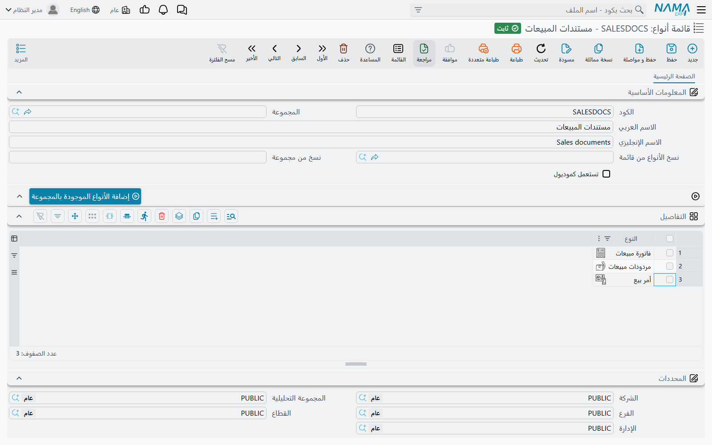

# قوائم الأنواع (Entity Type List)

الإعدادات في نظام نما تُكتب عادةً على شاشة واحدة. فالحقل المطلوب يخص فاتورة المبيعات، وسطر التأمين
يمنح حقوقاً على ملف الموظف، والتحقق يراقب الصرف المخزني. ثم تريد — عاجلاً أو آجلاً — الإعداد نفسه على
*كل مستندات المبيعات*، أو على *الشاشات الاثنتي عشرة التي يستعملها فريق المخازن*، وتكراره اثنتي عشرة
مرة عملٌ ممل وهو أول ما يتفرّق ويختلف.

و**قائمة الأنواع** هي الجواب: قائمة شاشات محفوظة باسم، يشير إليها الإعداد بدلاً من أن يسمّي شاشة
واحدة. وستلقاها في النظام تحت عدة مسميات — **قائمة الأنواع**، و**تطبق ايضا علي**، و**لقوائم أنواع** —
وكلها تأخذ السجل نفسه. فإذا غيّرت محتوى السجل تبعه كل إعداد استعاره.

وتجدها في **إدارة النظام ← تخصيص شكل النظام ← قائمة أنواع**.

## الشاشة

كود، واسم، وجدول بعمود واحد: **النوع**، سطر لكل شاشة. هذا هو السجل كله — وبقية الشاشة موضوعة لتعفيك
من الكتابة بيدك.

| الحقل | ما يفعله |
|---|---|
| **نسخ الأنواع من قائمة** و**نسخ من مجموعة** | قائمة (Menu) وإحدى مجموعاتها. وهما لا يُحفظان جزءاً من القاعدة، بل هما مدخلا الزر التالي. |
| **إضافة الأنواع الموجودة بالمجموعة** | يقرأ مجموعة القائمة تلك — والمجموعات الواقعة تحتها — ويضيف إلى الجدول كل شاشة تفتحها، ويتجاوز ما هو موجود أصلاً. |
| **تستعمل كموديول** | يحوّل القائمة إلى مجموعة فلترة باسم *موديول* في الشاشات الموصوفة أدناه. |

::: tip بناء القائمة من مجموعة في المنيو لا بيدك
زر **إضافة الأنواع الموجودة بالمجموعة** هو طريق بناء قائمة «كل ما في المبيعات ← المستندات» بضغطة
واحدة: اختر المنيو في **نسخ الأنواع من قائمة**، والمجموعة في **نسخ من مجموعة**، ثم اضغط الزر. وإن
تُركت إحدى الخانتين فارغة أجاب *«يرجي اختيار المجموعة و القائمة»*. ويمكنك ضغطه أكثر من مرة بمجموعة
مختلفة في كل مرة، فتتراكم الأنواع في القائمة نفسها.
:::

ولا تُذكر الشاشة نفسها مرتين: فالحفظ بسطر مكرر يجيب *«نوع مكرر»* على السطر المخالف.

::: warning علامة «تستعمل كموديول» تظهر باسم حقلها في الإنجليزية
هذا المربع ليست له ترجمة إنجليزية خاصة به، فالشاشة الإنجليزية تعرض اسم الحقل نفسه — `useAsModule` —
بينما يقرأ في العربية «تستعمل كموديول». وهو آخر حقل في المجموعة العليا، بجوار خانتي النسخ من المنيو.
:::

## ما تفعله علامة «تستعمل كموديول»

بعض شاشات النظام تعرض سجلات من كل نوع في قائمة واحدة: المهام المعلقة، وتاريخ الإصدارات، وصندوق
التنبيهات، وشاشة موافقات الموظف. فقائمة أنواع عليها علامة **تستعمل كموديول** تصير مجموعة فلترة اسمها
**موديول** في تلك الشاشات بالتحديد، بزر لكل قائمة، فيستطيع المستخدم أن يضيّق قائمة مختلطة إلى
«المستندات التي تهم فريقي» بضغطة. واسم القائمة هو اسم الزر.

والأزرار تُبنى من جديد عند حفظ القائمة أو حذفها، فالتغيير يصل إلى الشاشات فوراً. وإن تركت العلامة —
وهو الأصل — فالقائمة ليست إلا هدفاً تشير إليه الإعدادات الأخرى.

## أين تُستعمل القائمة

الاسم يختلف من شاشة إلى شاشة، والمقصود واحد: «طبّق هذا على أكثر من شاشة». وأكثر المواضع التي يلقاها
فيها الدعم:

| الشاشة | الحقل |
|---|---|
| [ملفات التأمين](/ar/platform/security/security-profiles) | **قائمة الأنواع** في سطور الصلاحيات — سطر واحد يمنح الحقوق نفسها على عائلة شاشات |
| [الموافقات](/ar/platform/approvals/approvals-system) | **تطبق ايضا علي** — تعريف موافقة واحد يغطي عدة أنواع مستندات |
| [التنبيهات](/ar/platform/notifications/notifications-system) | **تطبق ايضا علي** كذلك |
| [التحقق المبني على المعايير](/ar/platform/criteria-based-validation) | **تطبق ايضا علي** — تحقق واحد على عائلة كاملة، مع «النوع» أو بدلاً منه |
| [الحقول المطلوبة](/ar/platform/required-fields) | عمود قائمة الأنواع، فتغطي القاعدة الواحدة عدة شاشات |
| [تعديل الشاشة](/ar/platform/screen-modifier/) | **لقوائم أنواع** — تعديل تصميم واحد على مجموعة شاشات |
| [إعدادات الحقول والشاشات](/ar/platform/fields-and-entities-settings/) | عمود قائمة الأنواع في أكثر جداولها — مظهر الحقول، والحقول المعطّلة، والترقيم الآلي وغيرها |
| [عروض القوائم](/ar/platform/list-views/) | **لقوائم أنواع**، فيخدم العرض المحفوظ الواحد عدة شاشات |
| [مسارات الكيان](/ar/platform/entity-flows/) | قائمة الأنواع التي يعمل عليها المسار |

## انظر أيضاً

- [تعريف المعايير](/ar/platform/criteria-definitions) — اللبنة المشتركة الأخرى: فلتر محفوظ، لا مجموعة شاشات محفوظة
- [المنيو](/ar/platform/menus/) — من أين تأتي القوائم والمجموعات التي يقرأها زر «إضافة الأنواع الموجودة بالمجموعة»
