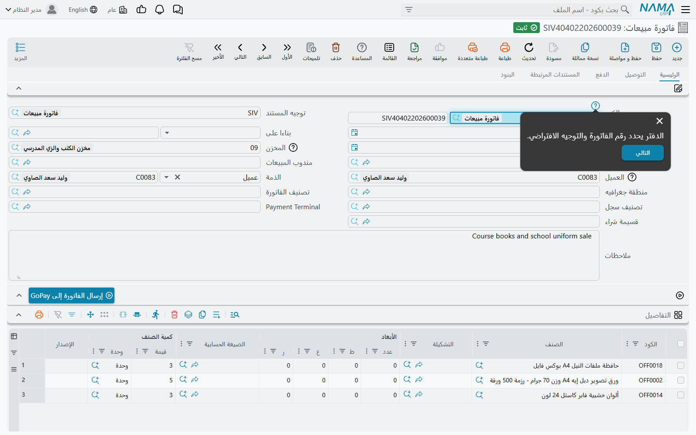
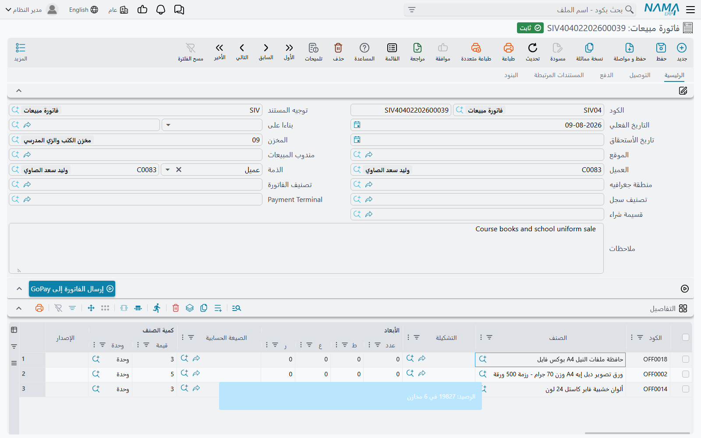
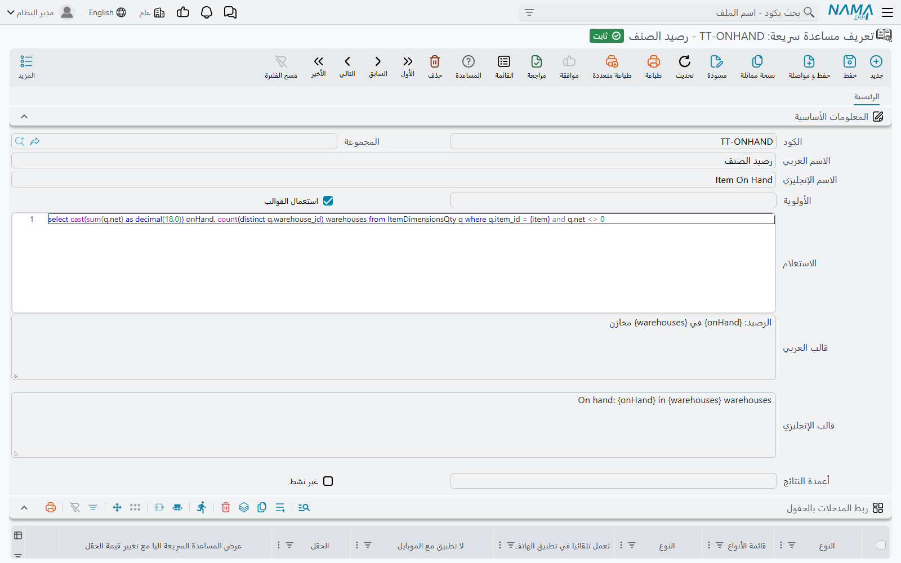

# مساعدة الحقول والمساعدات السريعة

أمين مخزن جديد يحدّق في خانة اسمها **التاكد من السحب على المكشوف بالتاريخ** ولا يدري أيعلّمها أم لا. ومندوب مبيعات
يوشك أن يضيف صنفًا إلى فاتورة ويود أن يعرف كم منه في المخزن قبل أن يعد به العميل. كلاهما يحتاج معلومة
في اللحظة التي يكون فيها المؤشر داخل الحقل، ولكلٍّ منهما شاشة في «نما»:

- **ملف مساعدة** (Entity Help) يحمل *نصًّا ثابتًا*: شرحًا يكتبه فريق التركيب مرة واحدة لحقل أو لرسالة،
  ويقرؤه كل مستخدم.
- **تعريف مساعدة سريعة** (Tooltip Definition) يحمل *إجابة حية*: استعلامًا يُنفَّذ على قاعدة البيانات حين
  يطلبه المستخدم، بقيم الشاشة، ويعرض النتيجة.

## ملف مساعدة — شروح تُكتب مرة واحدة

**إدارة النظام ← أخري ← ملف مساعدة**

في سجل ملف المساعدة جدولان للشروح وجدول ثالث يحدد من يراها.

### مساعدات الحقول

كل سطر يربط مساعدة بحقل واحد:

| العمود | ما تكتبه فيه |
|---|---|
| **للنوع** (For Type) | الشاشة التي فيها الحقل. |
| **لقوائم أنواع** (For Type List) | قائمة شاشات محفوظة، حين يصلح الشرح نفسه للحقل نفسه في عدة شاشات. لا بد للسطر من أحدهما — السطر الخالي منهما لا يظهر في أي شاشة. |
| **الحقل** (On Field) | الحقل. بعد اختيار النوع يقترح العمود حقول تلك الشاشة. |
| **المساعدة عربى** / **المساعدة إنجليزى** | الشرح بكل لغة. إن كُتبت لغة واحدة فقط رآها مستخدمو اللغتين. |
| **نوع المحتوي** (Content Type) | طريقة عرض النص: **نص** أو **HTML** أو **Markdown**. والـ Markdown أسهل طريق للعناوين والخط العريض والقوائم النقطية. |

تبقى المساعدة بعيدة عن الطريق حتى يطلبها المستخدم. في أي شاشة تحرير يضع زر **المساعدة** في شريط الأدوات
— أو **Ctrl + Alt + H** — أيقونة مساعدة صغيرة بجانب كل حقل له شرح، ومنها رؤوس أعمدة الجداول. والضغط على
الأيقونة يفتح النص، مع زرَّي **السابق** و**التالي** اللذين يتنقلان بين بقية الحقول المشروحة في الشاشة
بالترتيب. وبذلك تصبح مجموعة مساعدات الحقول جولة إرشادية في الشاشة لموظف جديد. واضغط **المساعدة** مرة أخرى
لإخفاء الأيقونات.

### مساعدات رسائل الخطأ

الجدول الثاني يربط الشرح *برسالة* لا بحقل، فالمستخدم الذي يلقى رفضًا يضغط **عرض رسائل المساعدة** في لوحة
الرسالة ويقرأ ما كتبه فريقك عنها. والمطابقة على نص الرسالة الإنجليزي حرفيًّا بمعاملاته النائبة — انظر
قسم «أن تكتب شرحك الخاص لرسالة» في [الرسائل وحالات الرفض](/ar/platform/documents-and-records/messages-and-refusals)، فهو يشرح هذا
الجدول بالكامل.

### من يراها — مطبق على

اترك جدول **مطبق على** فارغًا تكن المساعدة للجميع. وأضف أسطرًا — **مستخدم** أو **ملف الصلاحيات** أو
**مجموعة** مستخدمين — فلا يراها إلا من تسمّيهم. بهذا تحتفظ منشأة واحدة بشرح مفصّل للمتدربين دون أن تزحم
الشاشة على الموظفين القدامى: سجلّا ملف مساعدة للحقل نفسه، لكلٍّ منهما جمهوره.

### المساعدة التي تأتي مع «نما»

تحتفظ «نما» بمكتبة مساعدات خاصة بها. ينزّلها مدير النظام بزر **قراءة ملفات المساعدة النظاميه** (في شاشة
ملف المساعدة، وفي قائمة «المزيد» في قائمتها)؛ ويحتاج الخادم إلى اتصال بالإنترنت، ولا يشغّله إلا `admin`
أو مستخدم يُعامل معاملة المدير. وتصل السجلات المنزّلة وعليها علامة **نظامى**، ولذلك أثران:

- لا يمكن تعديلها، ولا يمكن تحويل سجل إلى «نظامى» أو منه يدويًّا. اكتب سجلك الخاص إلى جانبها.
- تسري على الجميع، فلا تقبل أسطر «مطبق على». ومن لا ينبغي أن يراها يُستثنى بخيار **عدم عرض رسائل المساعدة
  النظاميه** في سجل المستخدم أو في ملف الصلاحيات — ولا يمس ذلك مساعداتك الخاصة.

## تعريف مساعدة سريعة — إجابات تُحسب عند الطلب

**إدارة النظام ← تخصيص شكل النظام ← تعريف مساعدة سريعة**

المساعدة السريعة استعلام صغير يُنفَّذ حين يضغط المستخدم **F9** على حقل، ويعرض جوابه في ملاحظة منبثقة.
والمثال المعتاد على حقل الصنف في مستند مبيعات: يختار المندوب الصنف، ويضغط F9، فيقرأ الكمية المتاحة في كل
مخزن دون أن يغادر الفاتورة. ومثال آخر على حقل العميل يعرض الرصيد المفتوح وتاريخ آخر سداد.

أما موضع الملاحظة، وهل تختفي أم تبقى مثبتة، فيُضبط للشركة كلها في
[الإعدادات العامة ← المظهر](/ar/platform/global-config/global-config-appearance).

### بناء مساعدة سريعة

للمساعدة السريعة ثلاثة أجزاء: السؤال، والمكان الذي يُسأل منه، وصياغة الجواب.

**1. الاستعلام.** حقل **الاستعلام** يحمل الـ SQL. وحيثما احتاج الاستعلام قيمة من الشاشة فاكتب اسم مُدخل بين
قوسين معقوفين — `{item}`، `{customer}`. الاسم من اختيارك؛ والخطوة التالية تحدد أي حقل يملؤه.

**2. من أين يُسأل — ربط المدخلات بالحقول.** كل سطر في هذا الجدول يربط المساعدة بحقل واحد:

| العمود | ما يفعله |
|---|---|
| **النوع** / **قائمة الأنواع** | الشاشة، أو قائمة الشاشات، التي تُعرض فيها المساعدة. اتركهما فارغين لتُعرض في كل شاشة فيها الحقل. |
| **الحقل** (Field Name) | الحقل الذي يضغط عليه المستخدم F9. |
| أزواج **المدخل** / **المصدر** المرقّمة (من 1 إلى 9) | كل زوج يملأ مُدخلًا واحدًا في الاستعلام من حقل على الشاشة: **المدخل** هو الاسم الذي كتبته بين القوسين، و**المصدر** هو الحقل الذي تأتي منه قيمته. ولا يلزم أن يكون الحقل هو الذي يقف عليه المستخدم — فمساعدة الصنف يمكنها أن تمرّر المخزن أيضًا. |
| **عرض المساعدة السريعة اليا مع تغيير قيمة الحقل** | يعرض الملاحظة من تلقاء نفسها بمجرد تغيّر قيمة الحقل، دون انتظار F9. استعمله باعتدال؛ فالملاحظة التي تقفز مع كل تغيير سرعان ما تُتجاهل. |
| **تعطيل مع شاشة التحرير** | يُبعد المساعدة عن شاشة التحرير. ويُستعمل عادة مع أحد الخيارين التاليين. |
| **تعمل مع عرض القائمة** / **تعمل مع البحث** | يعرضها أيضًا في قائمة السجلات وفي نافذة البحث، حيث يشغّلها F9 للسطر المحدد. مطفأ افتراضيًّا. |
| **تعمل تلقائيا في تطبيق الهاتف** / **لا تطبيق مع الموبايل** | الاختيار نفسه لتطبيق الهاتف: تُعرض فيه تلقائيًّا، أو لا تُعرض فيه أصلًا. |

يمكن للمساعدة الواحدة أن تحمل عدة أسطر، فيُربط استعلام المخزون نفسه بحقل الصنف في فاتورة المبيعات وأمر
البيع وعرض السعر معًا.

**3. صياغة الجواب — القوالب.** اترك **استعمال القوالب** معلَّمًا واكتب الجواب في **قالب العربي** و**قالب
الإنجليزي**؛ ويرى كل مستخدم القالب الذي بلغته. والقوالب قوالب [Tempo](/ar/admin/tempo) في وضع نتائج
الاستعلام: `{onHand}` هو العمود `onHand` من الصف الأول، وصيغة التكرار تمرّ على كل الصفوف، واسم المُدخل بين
القوسين يطبع القيمة التي مُرّرت. وحقل **أعمدة النتائج** اختياري: قائمة أسماء مفصولة بفواصل تعيد تسمية أعمدة
الاستعلام بحسب ترتيبها، حين تكون أسماء الأعمدة في الـ SQL غير مريحة.

ثم احفظ. يرى المستخدمون المساعدة الجديدة أو المعدّلة في المرة التالية التي يحمّلون فيها «نما» في المتصفح،
فاطلب منهم تحديث الصفحة. وعلامة **غير نشط** تطفئ المساعدة دون حذفها.

### حين تشترك عدة مساعدات في حقل واحد

قد يكون للحقل أكثر من مساعدة سريعة، لكن F9 يعرض جوابًا واحدًا. يجرّبها النظام بالترتيب ويعرض أول واحدة
يُسمح للمستخدم برؤيتها:

1. المساعدات المربوطة بهذه الشاشة تحديدًا تأتي قبل المساعدات غير المربوطة بشاشة.
2. وداخل كل مجموعة تأتي **الأولوية** الأعلى أولًا.

وجدول **تطبق علي** يحدد من يُسمح له. كل سطر يسمّي **ملف الصلاحيات** أو **مستخدم** أو **موظف** أو
**مجموعة** مستخدمين، ويعلّمه **سماح** أو **منع**. فإن كان الجدول فارغًا رأى المساعدةَ الجميعُ. وإلا:

- السطر الذي يسمّي المستخدم، أو الموظف المرتبط به، يرجح على أي عدد من أسطر المجموعات وملفات الصلاحيات.
  فـ«منع ملف صلاحيات المبيعات، سماح لأحمد» يجعل أحمد يراها ولا يراها أحد غيره.
- إن رجحت أسطر **منع** المطابقة على أسطر **سماح** المطابقة تُخطّي المستخدم.
- وإن كان في الجدول أسطر **سماح** ولم يطابق أيٌّ منها المستخدم تُخطّي أيضًا — فسطر السماح يجعل المساعدة
  لمن دُعي إليها فقط.

والمستخدم الذي يُتخطّى لا يُترك بلا شيء: ينتقل النظام إلى المساعدة التالية على الحقل. وبهذا يمكن إعطاء
المديرين مساعدة مفصّلة والباقين مساعدة بسيطة على الحقل نفسه — نسخة المديرين بأولوية أعلى وسطر سماح،
والنسخة العامة بلا «تطبق علي».

### العثور على المساعدات السريعة في شاشة

نادرًا ما يتذكر المستخدمون أي الحقول لها مساعدات. زر **المساعدات السريعة** في شريط الأدوات يسردها للشاشة
التي أمامك؛ والضغط على إحداها ينقلك إلى حقلها ويشغّلها. ولا يظهر الزر إلا حيث عُرّفت مساعدة واحدة على الأقل.

## رسائل قد تظهر لك

| الرسالة | السبب | ماذا تفعل |
|---|---|---|
| «المساعدات النظاميه يجب ان تكون مطبقه للجميع, برجاء حذف سطور يطبق علي» | سجل ملف مساعدة معلَّم **نظامى** أُضيفت إليه أسطر «مطبق على». | احذف الأسطر. ولتحديد من يرى المساعدة المشحونة استعمل **عدم عرض رسائل المساعدة النظاميه** في المستخدم أو ملف الصلاحيات. |
| *cannot edit in system entity help* | حاول أحدهم تعديل سجل ملف مساعدة منزَّل من «نما»، أو تعليم **نظامى** أو إلغاءه. ليس لها نص عربي، فتظهر بالإنجليزية على الشاشات العربية أيضًا. | اترك السجل المشحون كما هو واكتب سجل ملف مساعدة خاصًّا بك. |
