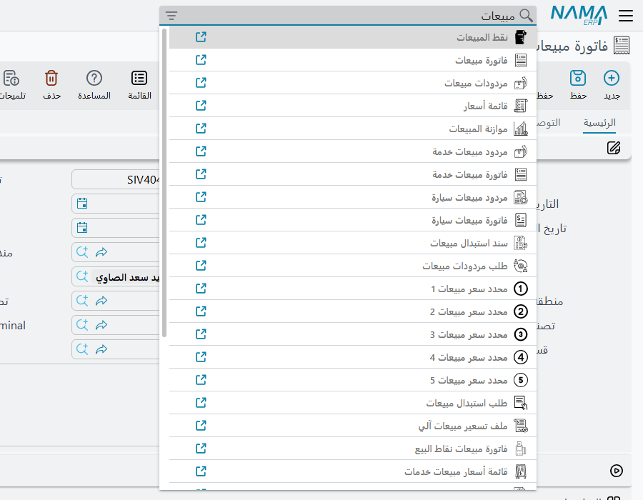
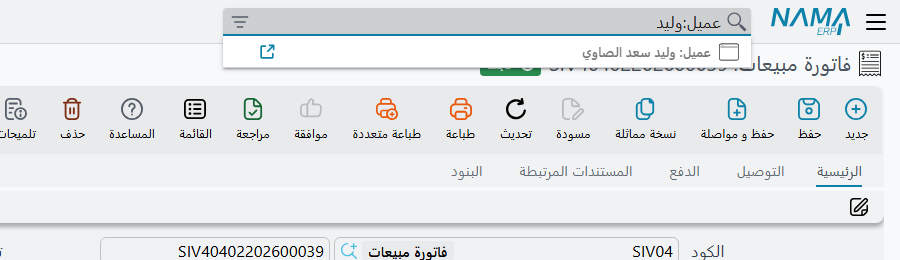
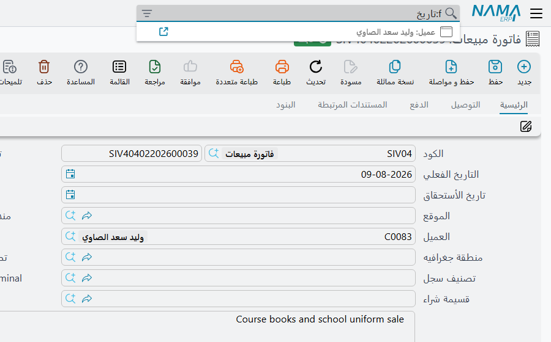

# البحث من الشريط العلوي

في «نما» خانتا بحث في متناول اليد دائمًا. خانة **القائمة الجانبية** تجد وصلات القائمة، وخانة **الشريط
العلوي** تجد كل شيء تقريبًا غير ذلك — شاشةً، أو سجلًّا، أو حقلًا في الشاشة المفتوحة. ومعظم شكاوى «لا أجده»
ترجع إلى الطريقة التي تقرر بها خانة الشريط العلوي أيَّ هذه الثلاثة قصدت، وهذا ما تشرحه هذه الصفحة.

| الخانة | المفتاح | ما تجده |
|---|---|---|
| الشريط العلوي — *بحث بكود - اسم الملف* | **Ctrl + K** | الشاشات، والسجلات، والحقول في الشاشة المفتوحة |
| القائمة الجانبية | **Ctrl + U** | وصلات القائمة — انظر قسم «كيف تجد وصلة دون أن تنقّب عنها» في [كيف تُبنى القائمة](/ar/platform/menus/menu-structure) |

والمفتاحان هما الافتراضيان ويمكن تغييرهما — انظر [اختصارات لوحة المفاتيح](/ar/platform/everyday-tools/shortcuts).

## الشاشات أولًا، والسجلات ثانيًا

اكتب في الشريط العلوي فتقارن الخانة أولًا ما كتبته **بأسماء الشاشات** — الاسم العربي والاسم الإنجليزي
وصيغتي الجمع والاسم الداخلي للشاشة معًا. فإن طابقت أي شاشة عرضت القائمة **الشاشات وحدها**، واختيار إحداها
يفتح قائمة سجلاتها.

ولا تذهب الخانة إلى الخادم وتبحث عن **السجلات** إلا إذا **لم يطابق أي اسم شاشة**. هذا هو السلوك الذي يجب
تذكّره، لأنه يفسّر الشكوى المعتادة: يكتب المستخدم جزءًا من اسم عميل، فتعرض الخانة *فاتورة مبيعات* و*أمر
بيع* و*مردودات مبيعات* بدل العميل — لأن الاسم تصادف أنه يحوي «مبيعات». والحل أن تخبر الخانة بنوع السجل
الذي تريده (القسم التالي).

ومطابقة الشاشات تتسامح مع أخطاء الكتابة المعتادة: أ وإ وآ وا تُعامل حرفًا واحدًا، وكذلك ة وه، وى وي؛ والنص
المكتوب ولوحة المفاتيح على اللغة الخطأ يُجرَّب بالاتجاهين، فـ `f` المكتوبة بدل `ب` تجد الشاشة أيضًا.

وحين يُبحث عن السجلات فإن الخانة:

- تطابق النص في أي موضع من **كود** السجل أو **كوده البديل** أو **اسمه العربي** أو **اسمه الإنجليزي**؛
- تعامل المسافة على أنها «أي شيء بينهما»، فـ `احمد علي` تجد *احمد محمد علي* — لكن الكلمات يجب أن تأتي
  بالترتيب الذي كُتبت به؛
- تعرض حتى 50 سجلًّا، كلٌّ منها مسبوق باسم شاشته — *عميل: C-0192 احمد علي*؛
- إن لم يطابق شيء أصلًا جرّبت مرة أخرى على الأكواد الإضافية التي تُعرف بها السجلات؛
- تقبل المعرّف الداخلي للسجل ملصوقًا كاملًا، فتذهب إلى ذلك السجل مباشرة.

## تسمية نوع السجل — البحث في

لتتخطى مطابقة الشاشات وتبحث في سجلات نوع واحد فقط، اضغط أيقونة التصفية في الطرف الآخر من الخانة واختر
نوعًا تحت **البحث في**. يتغير عنوان الخانة إلى *البحث في العملاء* (أو النوع الذي اخترته)، ويذهب كل بحث بعدها
مباشرة إلى سجلات ذلك النوع. ونجمة حمراء صغيرة على الأيقونة تذكّرك بأن التصفية مضبوطة؛ امسح الاختيار
لتعود إلى المعتاد.

ويمكن كتابة الشيء نفسه، وهو أسرع متى عرفته: ضع النوع قبل نقطتين رأسيتين — `عميل:احمد`، أو بالإنجليزية
`Customer:Ahmed`. ويُطابَق ما قبل النقطتين مع الاسم الإنجليزي والعربي والداخلي للشاشة. فالمطابقة التامة
تختار ذلك النوع وحده، والجزئية تبحث في كل نوع يحوي اسمُه ما كتبت. وفي الحالتين لا يُبحث إلا في الأنواع التي
يُسمح للمستخدم بفتح قائمتها.

## القفز إلى حقل — البادئة `f:`

في شاشة تحرير طويلة بعشرة تبويبات يصبح العثور على الحقل المطلوب بحثًا من نوع آخر. ابدأ النص بـ `f:` (أو
`p:`) فتبحث الخانة في **الشاشة المفتوحة** بدلًا من ذلك: حقولها وأعمدة جداولها وأزرار إجراءاتها، بعناوينها.
وكل نتيجة تُظهر موضعها — التبويب والمجموعة أو الجدول — واختيارها ينقل المؤشر إليها، مبدّلًا التبويب إن
لزم. وعلى لوحة المفاتيح العربية تكتب المفاتيح نفسها `ب:` و`ح:`، وهما تعملان أيضًا.

## فتح ما وجدته

**Enter**، أو الضغط، يفتح النتيجة المحددة في التبويب الحالي. وأيقونة الرابط في آخر كل نتيجة تفتحها في
تبويب جديد من المتصفح، وكذلك **Ctrl + ضغطة** أو **Alt + ضغطة**. والأسهم تتنقل بين النتائج، و**Escape**
يغلق القائمة.

## صفحات أدوات لمدير النظام

لـ `admin`، وللمستخدمين الذين يُعاملون معاملة المدير، تحوي قائمة الشاشات أيضًا خمس صفحات ليست كيانات:
**Utilities** و**View Users** و**Monitor Tasks** و**SQL Runner** و**View Web Socket Sessions**، وأسماؤها
بالإنجليزية في الواجهتين. وكتابة `utils` تسردها كلها. ولا يراها غيرهم في الخانة.

## ما الذي يضبطها

في قاعدة بيانات كبيرة، البحث غير المقصور على نوع واحد يمر على كل سجل في النظام. وخياران في تبويب **الأداء**
من الإعدادات العامة يتحكمان في ذلك — انظر قسم «سلوك البحث» في
[الإعدادات العامة — الأداء والبحث](/ar/platform/global-config/global-config-performance):

- **يجب اختيار ملف أو مستند في البحث في قبل البحث على الخادم** يمنع الخانة من البحث عن السجلات أصلًا حتى
  يُختار نوع تحت **البحث في** — وكتابة النوع بالنقطتين لا تكفي ما دام مفعّلًا. أما الشاشات والبحث عن
  الحقول بـ `f:` فتظل تعمل، لأنها لا تصل إلى الخادم.
- ولا يسري إلا مع **عرض حقل "البحث في"**؛ أما أيقونة التصفية نفسها فموجودة في الخانة دائمًا.

أما أي السجلات يستطيع المستخدم فتحها بعد ذلك فيقرره ملف صلاحياته، كما في كل مكان آخر.
