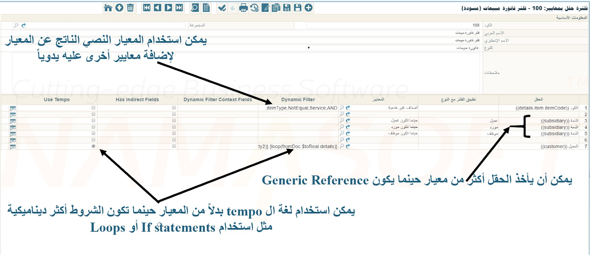

# فلتر الحقل بالمعايير (Field Filter with Criteria)

يمكنك استخدام شاشة **فلتر الحقل بالمعايير** لتطبيق فلاتر مخصصة عند البحث داخل حقول محددة في أي شاشة من شاشات Nama ERP.

على سبيل المثال:
- في **فاتورة الشراء**، قد ترغب في عرض الأصناف التي يكون موردها الافتراضي هو نفس مورد الفاتورة فقط.
- في **فاتورة المبيعات**، قد ترغب في إظهار **الأصناف غير الخدمية** فقط عند اختيار الصنف.

## كيفية تعريف فلتر الحقل بالمعايير

1. **إنشاء سجل المعايير**
    - في ملف *تعريف المعايير*، حدد الشرط الذي تريد تطبيقه (مثل: الأصناف غير الخدمية).

2. **إنشاء سجل فلتر الحقل**
    - افتح شاشة **فلتر الحقل بالمعايير** وأنشئ سجلاً جديداً.
    - حدد **نوع المستند** (مثل: فاتورة المبيعات).
    - حدد **الحقل** الذي سيُطبَّق عليه الفلتر (مثل: `details.item.item`).
    - أسند **المعايير** المعرَّفة مسبقاً إلى هذا الحقل.

3. **إسناد فلتر الحقل**
    - انتقل إلى أحد مواقع الإعداد التالية وأسند الفلتر في حقل **فلتر الحقل**:
        - نوع المستند
        - دفتر المستند
        - مجموعة ملفات رئيسية
        - تحديث تعريف القائمة
    - أو اختر خيار **تلقائي** لتطبيقه تلقائياً.

4. **احفظ** التغييرات.

> إذا كان فلترك يتطلب منطقاً ديناميكياً مثل الحلقات أو الشروط، استخدم **لغة Tempo** بدلاً من تعريف المعايير.



---

## مثال: فلترة الأصناف غير الخدمية في فاتورة المبيعات

لعرض الأصناف غير الخدمية فقط عند اختيار صنف في شاشة **فاتورة المبيعات**:

1. في ملف *تعريف المعايير*، عرِّف شرطاً للأصناف غير الخدمية.
2. أنشئ سجلاً جديداً في **فلتر الحقل بالمعايير**:
    - نوع المستند: فاتورة المبيعات
    - الحقل: `details.item.itemCode`
    - المعايير: معاييرك للأصناف غير الخدمية
3. احفظ الفلتر باسم مثل `NonService`.
4. في **توجيه فاتورة المبيعات** الخاص بك، عيِّن **فلتر الحقل = NonService**.
5. أنشئ فاتورة مبيعات جديدة باستخدام ذلك التوجيه.
6. عند اختيار الأصناف، ستظهر الأصناف غير الخدمية فقط.

::: tip
- يجب إسناد الفلتر في حقل **فلتر الحقل** الموجود في نوع المستند أو الدفتر أو مجموعة الملفات الرئيسية أو تحديث القائمة.
- لاختبار معاييرك:
    - فعِّل **الاستخدام في شاشة القائمة** في سجل المعايير.
    - افتح قائمة الأصناف وأدخل فلترك في حقل **فلتر إضافي**.
    - يجب أن تعرض القائمة الأصناف المطابقة فقط.
- يمكنك استرجاع **المعايير النصية** من سجل المعايير لعرض شروط الفلتر أو تعديلها يدوياً.
- للمنطق المتقدم، استخدم **لغة Tempo**.
  :::

---

## مثال: فلتر ديناميكي باستخدام Tempo

لنفترض أن **فاتورة مبيعات** مبنية على **أمر مبيعات** يحتوي على عدة عملاء في السطور. تريد إدراج العملاء الذين لا تزال لديهم كميات متبقية (`unsatisfiedQty2`) فقط عند اختيار العميل في فاتورة المبيعات.

استخدم كود **Tempo** التالي في حقل `Dynamic Filter` لفلتر الحقل:

```
{loop(fromDoc.$toReal.details)}
  {if(fromDoc.$toReal.details.unsatisfiedQty2)}
    code,Equal,{fromDoc.$toReal.details.customer.code},OR;
  {endif}
{endloop}
```
