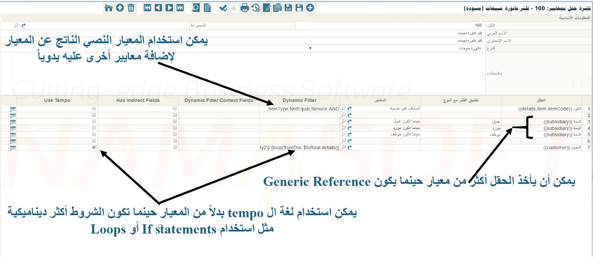

# فلتر الحقل بالمعايير (Field Filter with Criteria)

يمكنك استخدام شاشة **فلتر الحقل بالمعايير** لتطبيق فلاتر مخصصة عند البحث داخل حقول محددة في أي شاشة من شاشات Nama ERP.

على سبيل المثال:
- في **فاتورة الشراء**، قد ترغب في عرض الأصناف التي يكون موردها الافتراضي هو نفس مورد الفاتورة فقط.
- في **فاتورة المبيعات**، قد ترغب في إظهار **الأصناف غير الخدمية** فقط عند اختيار الصنف.

::: info ليست هي شاشة «فلترة الحقول»
بجوار هذه الشاشة في القائمة شاشة أخرى باسم قريب هي **فلترة الحقول**. تلك الشاشة لا تأخذ شرطًا أصلًا — كل ما تقرره هو هل يُضيَّق حقل المرجع بفرع المستند وشركته وبقية محدداته أم لا. فإن كان السؤال «لماذا لا يستطيع هذا المستخدم اختيار مخزن من فرع آخر» فاقرأ [فلترة الحقول بالمحددات](/ar/platform/field-filtering/field-filtering-by-dimension).
:::

## كيفية تعريف فلتر الحقل بالمعايير

1. **إنشاء سجل المعايير**
    - في ملف [تعريف المعايير](/ar/platform/criteria-definitions)، حدد الشرط الذي تريد تطبيقه (مثل: الأصناف غير الخدمية).

2. **إنشاء سجل فلتر الحقل**
    - افتح شاشة **فلتر الحقل بالمعايير** وأنشئ سجلاً جديداً.
    - حدد **نوع المستند** (مثل: فاتورة المبيعات).
    - حدد **الحقل** الذي سيُطبَّق عليه الفلتر (مثل: `details.item.item`). ولا بد أن يكون حقل المرجع نفسه — الذي يختار منه المستخدم — لا الكود أو الاسم الذي يحاكيه، فحقول مثل `details.item.itemCode` تُملأ *من* حقل المرجع، والفلتر الموضوع عليها لا يصل إلى نافذة الاختيار.
    - أسند **المعايير** المعرَّفة مسبقاً إلى هذا الحقل.

3. **إسناد فلتر الحقل**
    - انتقل إلى أحد مواقع الإعداد التالية وأسند الفلتر في حقل **فلتر الحقل**:
        - نوع المستند
        - دفتر المستند
        - مجموعة ملفات رئيسية
        - وصلة في القائمة، على [تعريف قائمة أو تعديل قائمة](/ar/platform/menus/menu-structure)
    - أو اختر خيار **تلقائي** لتطبيقه تلقائياً.

4. **احفظ** التغييرات.

> إذا كان فلترك يتطلب منطقاً ديناميكياً مثل الحلقات أو الشروط، استخدم **لغة Tempo** بدلاً من تعريف المعايير.

::: tip طريق مختصر حين يجب أن يسري الفلتر دائماً
الخطوتان 2 و3 أعلاه موجودتان ليتاح تفعيل الفلتر نفسه على توجيه أو دفتر بعينه وتركه في غيره. أما حين يجب أن يسري الفلتر دائماً على حقل ما، فهناك طريق أسرع: سجّل المعايير مباشرة على الحقل في جدول **Extra Filter** ضمن [أعدادات الحقول و الشاشات](/ar/platform/fields-and-entities-settings/fields-settings-reference-lookups). فلا سجل فلتر تسميه ولا إسناد تقوم به — بل يبدأ حقل المرجع بالالتزام بالمعايير بمجرد الحفظ.
:::



---

## مثال: فلترة الأصناف غير الخدمية في فاتورة المبيعات

لعرض الأصناف غير الخدمية فقط عند اختيار صنف في شاشة **فاتورة المبيعات**:

1. في ملف *تعريف المعايير*، عرِّف شرطاً للأصناف غير الخدمية.
2. أنشئ سجلاً جديداً في **فلتر الحقل بالمعايير**:
    - نوع المستند: فاتورة المبيعات
    - الحقل: `details.item.item`
    - المعايير: معاييرك للأصناف غير الخدمية
3. احفظ الفلتر باسم مثل `NonService`.
4. في **توجيه فاتورة المبيعات** الخاص بك، عيِّن **فلتر الحقل = NonService**.
5. أنشئ فاتورة مبيعات جديدة باستخدام ذلك التوجيه.
6. عند اختيار الأصناف، ستظهر الأصناف غير الخدمية فقط.

::: tip
- يجب إسناد الفلتر في حقل **فلتر الحقل** الموجود في نوع المستند أو الدفتر أو مجموعة الملفات الرئيسية أو تحديث القائمة.
- لاختبار معاييرك:
    - فعِّل **الاستخدام في شاشة القائمة** في سجل المعايير.
    - افتح قائمة الأصناف وأدخل فلترك في حقل **فلتر إضافي**.
    - يجب أن تعرض القائمة الأصناف المطابقة فقط.
- يمكنك استرجاع **المعايير النصية** من سجل المعايير لعرض شروط الفلتر أو تعديلها يدوياً.
- للمنطق المتقدم، استخدم **لغة Tempo**.
  :::

---

## مثال: فلتر ديناميكي باستخدام Tempo

لنفترض أن **فاتورة مبيعات** مبنية على **أمر مبيعات** يحتوي على عدة عملاء في السطور. تريد إدراج العملاء الذين لا تزال لديهم كميات متبقية (`unsatisfiedQty2`) فقط عند اختيار العميل في فاتورة المبيعات.

استخدم كود **Tempo** التالي في حقل `Dynamic Filter` لفلتر الحقل:

```
{loop(fromDoc.$toReal.details)}
  {if(fromDoc.$toReal.details.unsatisfiedQty2)}
    code,Equal,{fromDoc.$toReal.details.customer.code},OR;
  {endif}
{endloop}
```

## الشرط يُكتب بحقول الشاشة التي يُبحث فيها

هذا هو الخطأ الذي يقف وراء أغلب الفلاتر الديناميكية التي لا تعيد شيئًا. لسطر الفلتر نصفان، وكل نصف يسمّي حقولًا في شاشة مختلفة:

- عمود **الحقل** يسمّي حقل المرجع في مستندك *أنت* — أي المكان الذي يُطبَّق عليه الفلتر؛
- والشرط يسمّي حقولًا في الشاشة التي *يبحث فيها* حقل المرجع — الصنف أو العميل أو المخزن.

لنفترض أن مستند جرد يحمل **مرجع 1** في سطور التوجيه، وتريد أن يعرض هذا الحقل الأصناف المُدخلة في التفاصيل فقط. هذا الفلتر يبدو صحيحًا ولا يعيد شيئًا:

```
{loop(details)}
termsLines.ref1,Equal,{details.item.item.code},OR;
{endloop}
```

مكان `termsLines.ref1` هو عمود **الحقل** لا الشرط، فشاشة الصنف التي يُبحث فيها ليس فيها حقل بهذا الاسم. اكتب الشرط بحقول الصنف نفسه، واترك متغيرات Tempo تقرأ من مستندك:

```
{loop(details)}
code,Equal,{details.item.item.code},OR;
{endloop}
```

أو بدقة أكبر، بمعرّف السجل:

```
{loop(details)}
id,Equal,{details.item.item.id},OR;
{endloop}
```

## مثال: عرض الأصناف حسب الرصيد المتاح

طلب متكرر: أن يعرض سند الصرف المخزني الأصناف التي لها رصيد فقط، وأن يعرض سند التوريد المخزني الأصناف التي لا رصيد لها فقط.

**الأصناف التي لها رصيد، في سند الصرف.** يحمل الصنف أرصدته في مجموعة `quantities`، فيمكن للشرط أن يقرأها مباشرة. استيراد هذا السجل ينشئ الفلتر:

::: details JSON للاستيراد المباشر

```json
{
  "forType": "StockIssue",
  "automaticUsage": true,
  "lines": [
    {
      "fieldId": "details.item.item",
      "dynamicFilter": "quantities.data.net,GreaterThan,0,AND;"
    }
  ]
}
```

:::

**الأصناف التي لا رصيد لها، في سند التوريد.** العكس البديهي — `quantities.data.net` أصغر من أو يساوي صفرًا — لا ينجح. فالصنف الذي لم يتحرك قط **ليس له سطر كميات أصلًا**، فلا يجد الشرط ما يقارنه، وهذه بالضبط هي الأصناف المطلوب عرضها. والحل أن يُحفظ الإجمالي في حقل رقمي احتياطي في الصنف (هنا `n5`) ويُفلتر عليه.

أولًا، [مهمة مجدولة](/ar/platform/scheduled-tasks) تكتب إجمالي كل صنف في `n5` — وصفرًا للصنف الذي لا سطور له:

::: details JSON للاستيراد المباشر

```json
{
  "scheduleType": "Action",
  "className": "com.namasoft.infor.domainbase.util.actions.EAExecuteUpdateQuery",
  "title1": "Update Query",
  "parameter1": "update i set n5 = coalesce(qty.net,0) from InvItem i\nouter apply (\nselect sum(q.net) net from ItemDimensionsQty q where q.item_id = i.id\n) qty",
  "title2": "Evict Cache After Execution(true,false)",
  "parameter2": "true",
  "actionDescription": "Execute update query specified in first parameter"
}
```
:::

ثم الفلتر على سند التوريد:

::: details JSON للاستيراد المباشر

```json
{
  "forType": "StockReceipt",
  "automaticUsage": true,
  "lines": [
    {
      "fieldId": "details.item.item",
      "dynamicFilter": "n5,LessThanOrEqual,0,AND;"
    }
  ]
}
```
:::

قيمة `n5` حديثة بقدر آخر تحديث لها فقط. ولتحديثها لحظة تحرك المخزون بدل انتظار المهمة، شغّل الاستعلام نفسه من [مسار كيان](/ar/platform/entity-flows/) يعمل بعد حفظ سند صرف أو توريد أو تحويل واكتمال معالجة كمياته. المسار التالي يفعل ذلك عند الحفظ وعند الحذف؛ وقيمة `entityTypeList` فيه هي كود [قائمة أنواع](/ar/platform/entity-type-lists) تضم أنواع المستندات الثلاثة، ويجب أن تكون موجودة قبل الاستيراد.

::: details JSON للاستيراد المباشر
```json
{
  "entityTypeList": "StockIssueReceiptTransfer",
  "runAfterCommitDocAndEffectOnDB": true,
  "waitForQuantityProcessing": true,
  "details": [
    {
      "className": "com.namasoft.infor.domainbase.util.actions.EAExecuteUpdateQuery",
      "parameter1": "update i set n5 =  coalesce(qty.net,0) from InvItem i\nouter apply (\nselect sum(q.net)  net from ItemDimensionsQty q where q.item_id = i.id\n) qty",
      "parameter2": "true",
      "targetAction": "PostCommit"
    },
    {
      "className": "com.namasoft.infor.domainbase.util.actions.EAExecuteUpdateQuery",
      "parameter1": "update i set n5 =  coalesce(qty.net,0) from InvItem i\nouter apply (\nselect sum(q.net)  net from ItemDimensionsQty q where q.item_id = i.id\n) qty",
      "parameter2": "true",
      "targetAction": "PostDelete"
    }
  ]
}
```
:::

واحتفظ بالمهمة المجدولة أيضًا لتعمل مرة يوميًا: فهي تلتقط ما لا يراه المسار، كالاستيرادات الكبيرة والتعديلات المباشرة.
