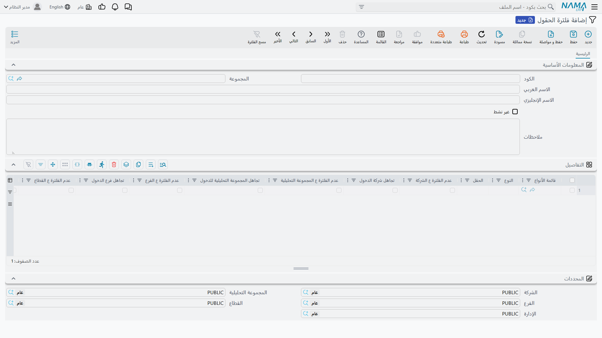

# فلترة الحقول بالمحددات (Field Filtering)

أمين مخزن دخل على فرع الرياض، يفتح سند تحويل مخزني، ويضغط على حقل المخزن، فلا يجد إلا مخازن الرياض. أما مخزن جدة الذي يريد التحويل إليه فليس في القائمة، فيتصل بالدعم قائلًا إن المخزن «اختفى».

لم يختفِ شيء. فكل حقل مرجع في نما يُضيَّق بالمحددات — الشركة والفرع والقطاع والإدارة والمجموعة التحليلية — وفي أغلب الحقول هذا بالضبط ما تريده. وشاشة **فلترة الحقول** هي المكان الذي تُرخي فيه هذا التضييق لحقل واحد في شاشة واحدة، دون أن تمس صلاحيات المستخدم ولا حقول المرجع لدى غيره.

## ما يعرضه حقل المرجع افتراضيًا

حين يبحث المستخدم في حقل مرجع داخل مستند، تُضيَّق السجلات المعروضة على كل واحد من [المحددات](/ar/platform/shared-master-files/dimensions-and-composite-dimensions) الخمسة:

1. **بمحددات المستند نفسه.** إن كان المستند الذي تعدّله يحمل فرع جدة، فالبحث يجري كأنك في جدة — ولو كانت جلستك على فرع الرياض.
2. **بما يحق للمستخدم الوصول إليه.** لا يتجاوز البحث أبدًا المحددات التي يجوز للمستخدم الدخول عليها.

السجل الذي محدده **عام** (PUBLIC) يمر على هذا المحدد في كل مكان، وبعض الملفات الرئيسية يعاملها النظام كملفات عامة فلا تُضيَّق أصلًا. والمحدد الذي لا تستعمله [إعدادات النظام](/ar/platform/global-config/global-config-dimensions) في التحكم بالوصول لا يُضيَّق عليه كذلك — فلا شيء على هذه الشاشة ترخيه فيه.

## الشاشة

افتح **إدارة النظام ← تخصيص شكل النظام ← فلترة الحقول**. السجل كود واسم ومفتاح **غير نشط** وجدول **التفاصيل**؛ وكل سطر في الجدول يختار حقلًا واحدًا في شاشة واحدة، ويحدد كيف يتعامل حقل المرجع هذا مع كل محدد.

| العمود | عمله |
|---|---|
| **النوع** | الشاشة التي ينتمي إليها الحقل — سند تحويل مخزني، فاتورة مبيعات. |
| **قائمة الأنواع** | [قائمة أنواع](/ar/platform/automation-and-rules/entity-type-lists) محفوظة، حين يجب أن يتصرف الحقل نفسه بالطريقة نفسها في عدة مستندات. املأ هذا أو النوع أو كليهما. |
| **الحقل** | حقل المرجع الذي تغيّر سلوكه، مثل `warehouse` لمخزن رأس المستند أو `details.specificDimensions.warehouse` للمخزن في سطوره. سمِّ حقل المرجع نفسه، لا الكود أو الاسم الذي يُملأ منه. |
| **عدم الفلترة ع الشركة** / **ع الفرع** / **ع القطاع** / **ع الإدارة** / **ع المجموعة التحليلية** | التوقف عن أخذ هذا المحدد من المستند. |
| **تجاهل شركة الدخول** / **تجاهل فرع الدخول** / **تجاهل قطاع الدخول** / **تجاهل قسم الدخول** / **تجاهل المجموعة التحليلية للدخول** | التوقف عن التضييق بهذا المحدد كليًا. |

الجدول عريض: مرّر أفقيًا لتصل إلى أعمدة القطاع والإدارة.

## المفتاحان، وأيهما تحتاج

لكل محدد مفتاحان، وكل منهما يجيب عن شكوى مختلفة.

**عدم الفلترة ع …** يلغي الخطوة 1 أعلاه لهذا المحدد. فيتوقف حقل المرجع عن نسخ المحدد من المستند ويرجع إلى المحدد الذي دخل عليه المستخدم. استعمله حين يكون محدد المستند أضيق مما ينبغي لهذا الحقل — مستند صادر لفرع فرعي ويجب أن يعرض حقله كل ما يعرضه فرع المستخدم نفسه. وهو لا يوسّع البحث أبدًا أبعد من جلسة المستخدم.

**تجاهل … الدخول** يُخرج المحدد من البحث تمامًا. فيبحث حقل المرجع كأن المحدد «عام»، ويتخطى التحقق مما يحق للمستخدم الوصول إليه، فيعرض سجلات **كل** الفروع (أو القطاعات أو الشركات). وهذا هو مفتاح أمين مخزن الرياض: فعّل **تجاهل فرع الدخول** على المخزن المحوَّل إليه، فيظهر مخزن جدة.

وإن فُعّل المفتاحان معًا لمحدد واحد، فالغلبة لـ«تجاهل … الدخول».

::: warning «تجاهل … الدخول» يتخطى قيود المستخدم نفسه
المستخدم المقيَّد بفرع واحد سيرى — في هذا الحقل وحده — سجلات فروع لا يستطيع فتحها في غيره. وهذا غالبًا هو المقصود، فالتحويل لا بد أن يسمّي المخزن الذي يذهب إليه، لكنه ثغرة مقصودة في قيد الفرع، فاقصره على الحقول التي تحتاجه.
:::

## مثال عملي: التحويل إلى مخزن أي فرع

يحوّل فرع الرياض بضاعة إلى جدة بسند تحويل مخزني. المخزن المحوَّل منه يجب أن يبقى مقصورًا على الرياض، والمخزن المحوَّل إليه يجب أن يعرض كل الفروع.

1. افتح **فلترة الحقول** وأضف سجلًا، وليكن `TRANSFER-ANY-BRANCH`.
2. أضف سطرًا: **النوع** = سند تحويل مخزني، **الحقل** = `toWarehouse` (حقل **إلى مخزن** في رأس السند)، وفعّل **تجاهل فرع الدخول**.
3. احفظ. في المرة التالية التي يفتح فيها مستخدم من الرياض حقل «إلى مخزن» ستظهر له مخازن جدة؛ أما حقل المخزن المحوَّل منه فيبقى على الرياض وحدها، لأنه لا سطر له.

يسري الحفظ فورًا — دون إعادة تشغيل، ودون أن يحتاج المستخدمون إلى الدخول من جديد.

::: tip اختيار السجل ليس كحفظه
هذه الشاشة تغيّر ما *يعرضه* حقل المرجع فقط. وعند حفظ المستند يظل التحقق المستقل من تناسق المحددات يقارن السجل المختار بالمستند، وبحسب [مستويات التناسق في إعدادات النظام](/ar/platform/global-config/global-config-dimensions) قد يرفض الحفظ أو يحذّر. فإن رُفض الحفظ بعد أن نجح المستخدم في اختيار السجل، فأوقف هذا التحقق على الحقل نفسه عبر **تجاهل تناسق المحددات لحقول** في [أعدادات الحقول و الشاشات](/ar/platform/fields-and-entities-settings/fields-settings-relaxing-restrictions).
:::

## أمور تستحق المعرفة

- **سطر واحد لكل شاشة وحقل.** احتفظ بسطر واحد لكل زوج من شاشة وحقل عبر كل سجلات فلترة الحقول. فإن غطى سطران نشطان الزوج نفسه، يُستعمل أحدهما فقط، ولا تملك اختيار أيهما.
- **السطر يسمّي شاشة أو قائمة شاشات.** حفظ سطر بلا أيٍّ منهما يُرفض برسالة:
  «يجب عليك إدخال إما النوع أو قائمة الأنواع»
- **«غير نشط» يوقف السجل كله.** تفعيل **غير نشط** في الرأس يوقف كل سطوره، وهي أسرع طريقة لاختبار هل هذا السجل هو سبب سلوك غريب في حقل مرجع.
- **يغيّر حقول المرجع ولا شيء غيرها.** شاشات القوائم والتقارير والسجلات التي يجوز للمستخدم فتحها لا تتأثر. ولتضييق حقل المرجع *بشرط* بدلًا من ذلك — الأصناف غير الخدمية فقط، أصناف هذا المورد فقط — استعمل [فلتر الحقل بالمعايير](/ar/platform/field-filtering/field-filter-with-criteria).
- **لمدخلات التقارير مفتاحها الخاص.** حقل اختيار السجل في نموذج مدخلات التقرير ليس حقلًا في مستند؛ ويُرخى في تصميم التقرير بخصائص المدخل `ignoreLogin…` الموصوفة في [دليل التقارير](/ar/platform/reports/reports-guide).
