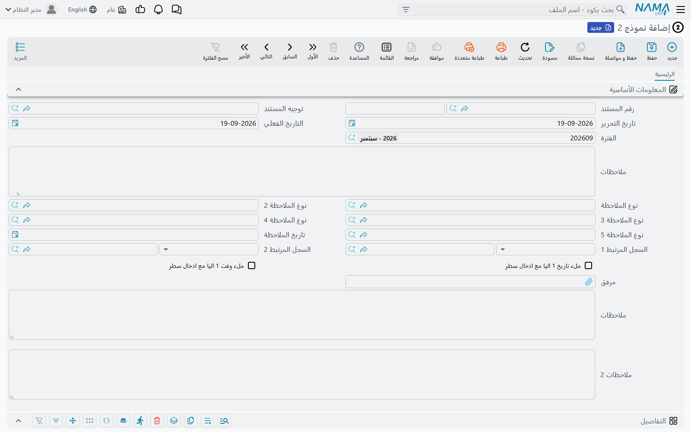
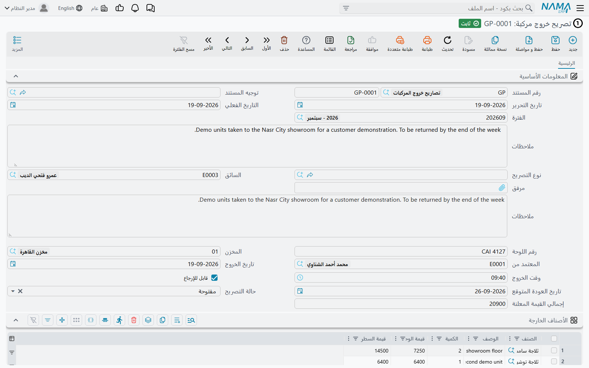
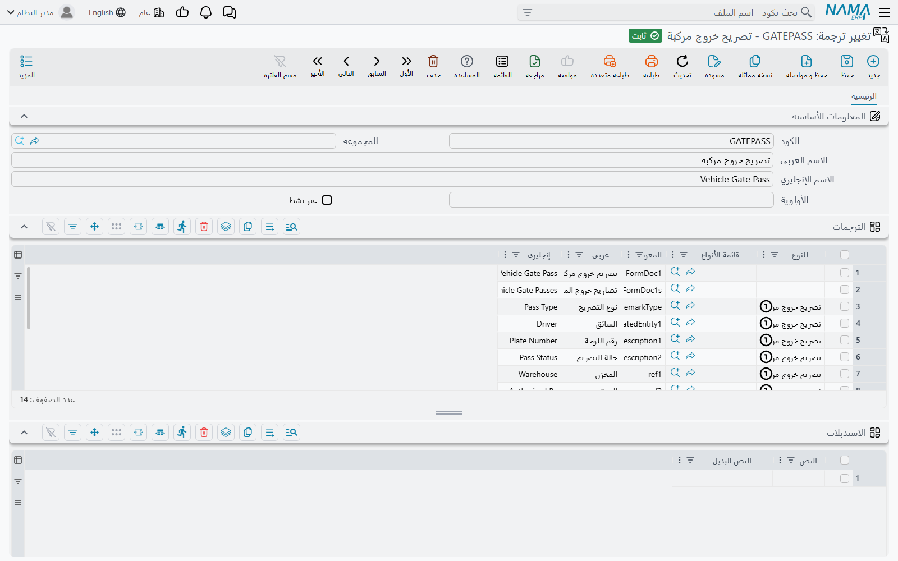
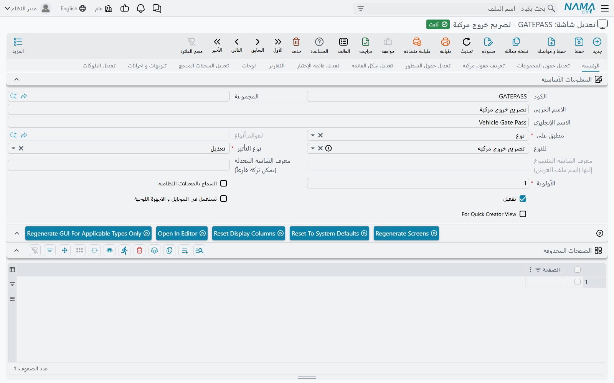
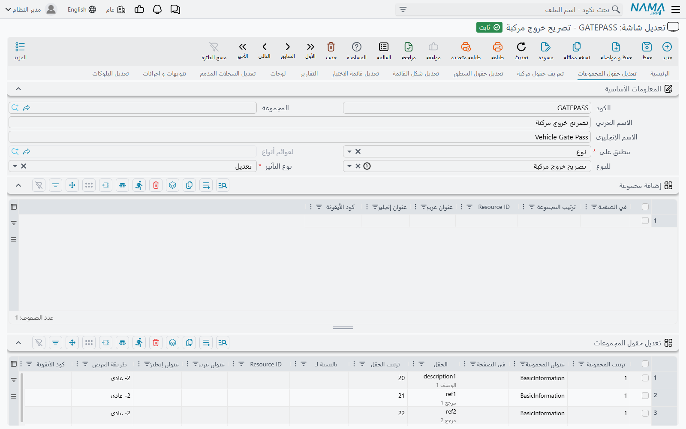
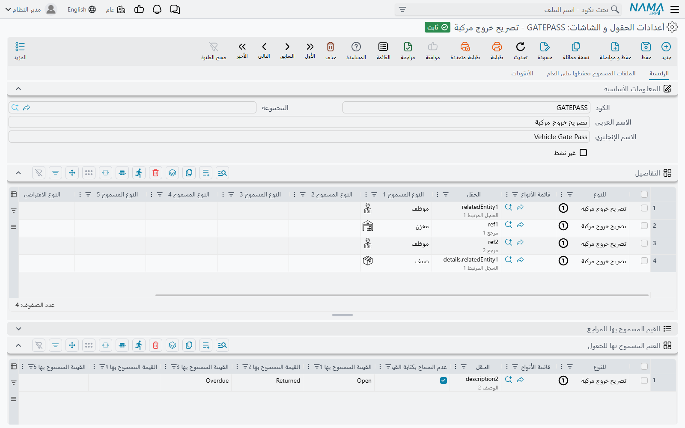
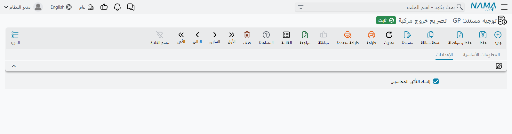

# النماذج — باب الخروج الآمن

بين حين وآخر يطلب عميل مستنداً لا وجود له في أي مكان آخر. محجر يريد **تصريح خروج من القبان** يسجل
اسم السائق ورقم اللوحة وصورة للحمولة. عيادة تريد **نموذج إقرار** تملؤه الممرضة ويعتمده الطبيب. مقاول
يريد **تقرير زيارة موقع** فيه خمس ملاحظات، لكل واحدة تاريخها وصورتها.

لا شيء من هذا فاتورة مبيعات أو إذن صرف متنكراً. كل واحد منها يحتاج أربعة أو خمسة حقول، وعملية حسابية
صغيرة، وطباعة — وكل واحد منها، على ما يبدو، خاص بذلك العميل وحده. بناء شاشة مخصّصة له يعني إضافة نوع
مستند إلى المنتج لن يفتحه أحد غيره أبداً.

**النماذج** هي الجواب. يقدّم نما ستة عشر منها — نموذج 1 حتى نموذج 16 — وهي فارغة عن عمد، فراغاً يكاد
يكون صارخاً. كل نموذج مستند حقيقي من كل ناحية بنيوية (له دفتر وكود وتواريخ ومحددات وموافقات وشكل طباعة
ومسودات وإلغاء) لكنه لا يحمل أي معنى تجاري على الإطلاق. خلف الشاشة تقبع مجموعة كبيرة من الحقول بلا
أسماء وبلا استعمال: خمسون رقماً، وثلاثون نصاً، وعشرون تاريخاً، وعشرون مفتاحاً، وعشرون حقل مرجع، وعشرون
جدولاً. يعطي فريق الدعم هذه الحقول أسماء، ويُظهر ما يحتاجه منها على الشاشة، ويضيف عملية حسابية أو
اثنتين، فيفتح العميل مستنداً اسمه **تصريح خروج مركبة** يتصرف تماماً كما طلب.

::: warning راجع فريق التطوير أولاً — في كل مرة
النموذج هو الجواب الصحيح لمتطلَّب خاص فعلاً بعميل واحد. وهو الجواب **الخاطئ** لميزة لم يبنِها نما بعد.

الحالتان تبدوان متطابقتين من مكتب الدعم. «العميل يريد تسجيل تسليم العهدة للفنيين» قد تكون ممارسة محلية
غريبة — وقد تكون فجوة اصطدم بها ثلاثة عملاء آخرون، وعندها مكانها المنتج ويستفيد الجميع. وما إن تبنيها
كنموذج حتى تضيع هذه الإشارة: لا يصل المتطلَّب إلى خطة التطوير، ويبقى العميل مع إعداد لا يفهمه غيرك.

فالقاعدة إذاً: **اعرض الطلب على التطوير أولاً.** التطوير هو من يقرر أنه «خاص بهذا العميل» — وحين يكون
كذلك سيساعدك في تشكيل النموذج. وحين لا يكون، تحصل على ميزة حقيقية بدلاً منه، وهي نتيجة أفضل للجميع.
:::

## النماذج الستة عشر وتكلفتها

تُرخَّص النماذج في أزواج، فيشتريها العميل اثنين اثنين:

| النماذج | كود الترخيص |
| --- | --- |
| نموذج 1، 2 | `basic-forms-1-2` |
| نموذج 3، 4 | `basic-forms-3-4` |
| نموذج 5، 6 | `basic-forms-5-6` |
| نموذج 7، 8 | `basic-forms-7-8` |
| نموذج 9، 10 | `basic-forms-9-10` |
| نموذج 11، 12 | `basic-forms-11-12` |
| نموذج 13، 14 | `basic-forms-13-14` |
| نموذج 15، 16 | `basic-forms-15-16` |

لا يمكن شراء نموذج 3 وحده — الزوج يأتي معاً. وعملياً تستعمل أغلب المواقع واحداً أو اثنين، والنماذج ذات
الأرقام الأصغر هي الأكثر استعمالاً بفارق كبير، لسبب بسيط هو أن الناس تبدأ من هناك.

وكلها تسكن الموضع نفسه في القائمة:

> **الأساسيات ← الملاحظات ← نموذج 1**

::: tip استعملها بالترتيب، ودوّن ما خُصّص له كل واحد
لا شيء يمنعك من جعل نموذج 7 هو تصريح الخروج ونموذج 2 هو نموذج الإقرار. لكن بعد ستة أشهر لن يعرف أحد
أيهما أي شيء إلا من الاسم الذي أعطيته. ابدأ من 1 واصعد، واحتفظ بملاحظة — في وثائق العميل نفسه، أو في
ملحوظة على السجل، أو في ملف التسليم — تبيّن أي نموذج يحمل أي غرض.
:::

## ما على الشاشة وما خلفها

افتح نموذجاً جديداً وستجد أقل مما تتوقع بكثير:



هذه هي الشاشة كاملة. ترويسة المستند (الدفتر والكود والتوجيه وتاريخا التحرير والتاريخ الفعلي والفترة)،
وخمسة مستويات تصنيف، وتاريخ ملاحظة، وحقلا ارتباط عامان، ومفتاحان يختمان تاريخ اليوم والوقت الحالي على
السطر الجديد، ومرفق واحد، وصندوقا ملاحظات، وجدول واحد باثني عشر عموداً عاماً، وكتلة المحددات المعتادة
في الأسفل.

والفراغ هنا مقصود. فخلف هذه الشاشة يحمل المستند أصلاً أكثر بكثير مما يُظهر:

| ماذا تملك | كم |
| --- | --- |
| أرقام | 50 — من `n1` إلى `n50` |
| نصوص بسطر واحد | 30 — من `description1` إلى `description30` |
| صناديق نص طويل | 5 — صندوق الملاحظات و`remarks2` إلى `remarks5` |
| تواريخ | 20 — من `date1` إلى `date5` ثم من `d6` إلى `d20` |
| أوقات | 7 — من `time1` إلى `time5` إضافة إلى «من وقت» و«إلى وقت» |
| مفاتيح نعم/لا | 20 — من `b1` إلى `b20` |
| حقول مرجع | 20 — من `ref1` إلى `ref20` إضافة إلى السجل المرتبط 1 و2 |
| مرفقات | 11 — مرفق رئيسي و`attachment1` إلى `attachment10` |
| مستويات تصنيف | 5 — من نوع الملاحظة إلى نوع الملاحظة 5 |
| جداول | 20 — `details` و`details2` إلى `details20` |

ولكل واحد من هذه الجداول العشرين مجموعة الأعمدة السخية نفسها على كل سطر: خمسة سجلات مرتبطة، وعشرة حقول
مرجع أخرى، وثلاثون نصاً، وخمسة نصوص طويلة، وخمسون رقماً، وخمسة تواريخ، وخمسة أوقات، وخمسة مفاتيح، وخمسة
مرفقات.

الجدول الأول وحده، وباثني عشر عموداً منه فقط، هو ما يظهر افتراضياً. **وكل ما عداه يجب وضعه هناك عن
قصد**، وهذا هو موضوع بقية هذه الصفحة.

## بناء واحد — مثال عملي

المثال الذي سنبنيه هو **تصريح خروج مركبة**: تصريح يسجّل من أخرج ماذا من أي مخزن، ومتى يُتوقع رجوعه،
وكم كانت قيمته. وهو بالضبط نوع الطلب الحقيقي الصغير الخاص بعميل واحد.

وهذا هو الشكل النهائي، لتعرف إلى أين نحن ذاهبون:



لم يُبرمَج شيء في هذه الشاشة. إنها نموذج 1، وخلفه ستة سجلات إعداد.

### 1. قرّر الشكل قبل أن تلمس أي شيء

اكتب الحقول أولاً على ورقة، واربط كل واحد منها بحقل احتياطي. امنح المسألة خمس دقائق — فالحقل الذي
تختاره بشكل سيئ يصعب نقله جداً بعد أن يصير للعميل ألف سجل فيه.

| ما يسميه العميل | الحقل الذي سنستعمله |
| --- | --- |
| السائق | السجل المرتبط 1 |
| رقم اللوحة | `description1` |
| المخزن | `ref1` |
| المعتمد من | `ref2` |
| تاريخ الخروج / وقت الخروج | `date1` / `time1` |
| تاريخ العودة المتوقع | `d6` |
| قابل للإرجاع | `b1` |
| حالة التصريح | `description2` |
| إجمالي القيمة المعلنة | `n1` |
| الصنف / الوصف / الكمية / قيمة الوحدة / قيمة السطر | الجدول 1: `relatedEntity1` و`text1` و`number1` و`number2` و`number3` |

عادتان تستحقان التبني. استعمل **أصغر رقم متاح في كل عائلة** بدل تشتيت الحقول عبر المدى — فذلك يُبقي
التقارير وملفات التصدير مقروءة. واترك فجوة حيث يكون واضحاً أن العميل سيطلب المزيد: إن كانت هناك ثلاثة
مبالغ اليوم فستكون خمسة العام القادم.

### 2. غيّر اسم المستند وأسماء حقوله

**تغيير الترجمة** (الأساسيات ← الإعدادات ← تغيير ترجمة) يحوّل `Form Document 1` إلى «تصريح خروج مركبة»
في كل موضع يظهر فيه — القائمة، وعنوان الشاشة، وشاشة العرض بقائمة، والتقارير، والتنويهات.



نوعان من السطور يقومان بالمهمة:

- **تغيير اسم المستند نفسه.** اترك **للنوع** فارغاً وضع معرّف النموذج في عمود **المعرف** —
  `FormDoc1` للمفرد و`FormDoc1s` للجمع الذي تستعمله شاشات القوائم والقوائم. نفّذ الاثنين؛ فشاشة عنوانها
  «تصريح خروج مركبة» وقائمتها ما زالت «نماذج 1» تبدو غير مكتملة.
- **تغيير اسم حقل.** اضبط **للنوع** على النموذج («تصريح خروج مركبة» بعد أن يسري السطر الأول) وضع معرّف
  الحقل في عمود **المعرف** — `n1` أو `description1` أو `ref1`. أما عمود الجدول فاكتب الجدول والعمود
  معاً: `details.text1` و`details.number1`.

املأ عمودي **عربي** و**إنجليزي** كليهما، حتى لو كان العميل لا يعمل إلا بلغة واحدة. فالتقارير وملفات
التصدير وشاشات اللغة الأخرى كلها تقرأ العمود الذي تركته فارغاً.

::: tip التغيير يحتاج إعادة تحميل
الترجمات مخزّنة مؤقتاً. اضغط **إعادة تحميل الترجمات** على سجل تغيير الترجمة بعد الحفظ، ثم حدّث المتصفح.
وإن بقي عنوان ما على حاله القديم فهذا هو السبب في أغلب الأحيان.
:::

### 3. ضع الحقول التي تحتاجها على الشاشة

الحقول موجودة لكنها غير ظاهرة. **تعديل الشاشة** (إدارة النظام ← تخصيص شكل النظام ← تعديل شاشة) هو ما
يُظهرها. وجّهه إلى النموذج، واتركه على **تعديل**، وأشّر على **تفعيل**:



ثم في صفحة **تعديل حقول المجموعات**، سطر واحد لكل حقل تريد رؤيته:



كل سطر يسمّي المجموعة التي يُضاف إليها الحقل (ومجموعة الترويسة الوحيدة في النموذج هي
`BasicInformation`)، ومعرّف الحقل، والترتيب الذي يظهر به. وصفحة **تعديل حقول الجداول** تفعل الشيء نفسه
لأعمدة الجداول، وهي أيضاً موضع ضبط عرض كل عمود.

وما دمت هناك، استعمل **الحقول المحذوفة** لإخفاء كل ما لن يستعمله العميل — مستويات التصنيف الأربعة غير
المستعملة، والسجل المرتبط الثاني، ومفتاحي الختم الآلي، وأعمدة الجدول التي تركتها فارغة. فالنموذج الذي
يعرض خمسة عشر حقلاً ذا معنى يُقرأ كشاشة مصمّمة. أما الذي يعرض خمسة عشر حقلاً ذا معنى وعشرين حقلاً
فارغاً فيُقرأ كحلٍّ التفافي.

::: warning ثلاثة أمور تُوقع الناس هنا
**ترتيب المجموعة إلزامي.** سطر «تعديل حقول المجموعات» بدونه يرفض الحفظ، والرسالة تذكر رقم السطر لا اسم
الحقل — ومجموعة الترويسة الوحيدة في النموذج ترتيبها `1`.

**تغيير اسم *عمود* في الجدول** يمكن من هنا (عمودا «عربي» و«إنجليزي» على سطر تعديل حقول الجداول) أو من
تغيير الترجمة بكتابة `details.text1`. كلاهما يعمل؛ اختر واحداً والتزم به، لأن سجلّين يغيّران اسم الشيء
نفسه لغزٌ لمن يأتي بعدك.

**تغيير اسم *الجدول* نفسه** — العنوان الذي يعلو الجدول — ليس أياً منهما. مكانه صفحة **الكتل المعدّلة**:
سطر واحد يسمّي الصفحة (`main`) والكتلة (`details`) ونوع التأثير **تعديل** والعنوانين العربي والإنجليزي
اللذين تريدهما.
:::

ولا تظهر التغييرات قبل إعادة بناء الشاشة. زر **إعادة إنشاء الشاشات للأنواع المعنية فقط** على سجل تعديل
الشاشة يفعل ذلك بالضبط، وهو أسرع بكثير من إعادة إنشاء كل شيء.

### 4. علّم الحقول ما الذي يُسمح لها أن تحمله

حقول المرجع مفتوحة عن عمد — `ref1` يقبل عميلاً أو مخزناً أو صنفاً أو أي شيء آخر، وهذا بلا فائدة على
شاشة حقيقية. و**أعدادات الحقول و الشاشات** (الأساسيات ← الإعدادات ← أعدادات الحقول و الشاشات) هي ما
يضبطها:



جدول **التفاصيل** يقيّد حقل المرجع: سطر لكل حقل، يسمّي النموذج ومعرّف الحقل وحتى خمسة أنواع سجلات يجوز
له أن يشير إليها. وبنوع واحد مسموح يتوقف الحقل عن كونه أداة من جزأين («اختر نوعاً ثم اختر سجلاً») ويبدأ
بالتصرف كحقل بحث عادي — وهذا ما يجعل «المخزن» في تصريح الخروج يبدو أصيلاً.

أما جدول **القيم المسموحة للحقول** فهو الحيلة الأهدأ والأجدر بالمعرفة: أعطه حقلاً نصياً وقائمة قيم،
وأشّر على **تقييد الاختيار**، فيتحوّل صندوق النص العادي إلى قائمة منسدلة. هكذا تعرض «حالة التصريح»
مفتوحة / مرتجعة / متأخرة ولا شيء غيرها — بلا ملف رئيسي، وبلا تطوير، وبلا مجال لأن يكتب أحدهم «مفتوحه».

::: tip القيم المسموحة تمرّ على قاموس الترجمة
تُحفظ القيم كما تكتبها تماماً، لكن الشاشة تمرّرها على قاموس ترجمة نما المعتاد قبل عرضها. فالقيمة التي
تصادف كلمة يعرفها نما ستظهر مترجمة على شاشة اللغة الأخرى — كتبنا `Open` فأظهرتها الشاشة العربية
«مفتوحة». راجع اللغتين قبل تسليم الشاشة.
:::

وعلى الشاشة نفسها جدول ثالث، **الحقول المعطّلة**، لحقل ينبغي أن يراه المستخدم دون أن يكتب فيه — وهو
مفيد لكل ما تملؤه عملية حسابية.

### 5. احسب

النماذج لا تجري أي حساب من تلقاء نفسها. و**مسار الكيان** الموجّه إلى النموذج، بإجراء **حساب قيم
الحقول**، هو ما يملأ حقلاً مشتقاً. سطران يكفيان لتصريح الخروج — الأول يضرب قيمة كل سطر، والثاني يجمعها
في الترويسة:

```
details.number3=sql(select isnull(try_cast({details.number1} as decimal(20,6)),0)
                         * isnull(try_cast({details.number2} as decimal(20,6)),0))
```

```
n1=totalize(details,details.number3)
```

شغّل الاثنين على **ما قبل تحديث الحقول المحسوبة**، بهذا الترتيب، حتى ترى عملية الجمع قيم السطور التي
كُتبت لتوّها.

::: warning احرس كل رقم تضربه
كتابة `{details.number1}*{details.number2}` تُقرأ سليمة تماماً وتعمل إلى أن يضيف أحدهم سطراً ويترك
خانة فارغة — فيفشل الحفظ كله بخطأ فني لا يذكر المسار من قريب ولا بعيد. فالخانة الرقمية الفارغة تصل
كقيمة خالية بلا نوع، وقاعدة البيانات ترفض ضربها.

وتغليف كل قيمة بـ `isnull(try_cast(… as decimal(20,6)),0)` كما في الأعلى لا يكلّف شيئاً ويجعل العملية
محصّنة ضد ذلك. افعلها من البداية، لا بعد أول اتصال دعم.
:::

وأبقِ المنطق صغيراً. فالنموذج الذي يحتاج خمسة مسارات وإجراء Groovy لم يعد نموذجاً لمرة واحدة — صار
ميزة، وحان وقت الرجوع إلى فريق التطوير.

### 6. تحقّق

**التحقق بناءً على المعايير** هو ما يوفّر القواعد التي لا يملكها المستند. سطر واحد، باستعلام يُرجع `1`
حين يكون السجل مقبولاً و`0` حين لا يكون، مع الرسالة التي يجب أن يراها المستخدم:

```sql
select case when {d6} is not null and {d6} < {date1} then 0 else 1 end
```

> تاريخ العودة المتوقع لا يمكن أن يكون قبل تاريخ الخروج

أشّر على **مع الإضافة** و**مع التعديل** و**مع المسودة** ليسري الشرط كلما كُتب السجل. وصفحة
[التحقق بناءً على المعايير](/ar/platform/criteria-based-validation.md) تغطي لغة الاستعلام ورموز
`{الحقل}` وكيفية وضع رابط قابل للنقر إلى السجل المخالف داخل الرسالة.

### 7. أعطه دفتر مستندات

هذه هي الخطوة التي ينساها الناس، لأن النموذج لا يبدو محتاجاً إليها.

لكنه محتاج. النموذج مستند حقيقي، فيحتاج **دفتر مستندات** يعطيه رقماً، ويجب أن ينتمي إلى شركة فعلية —
فالشركة المشتركة `PUBLIC` غير مقبولة على الحركات. أنشئ الدفتر من الأساسيات ← الإعدادات ← دفتر مستند،
ووجّهه إلى النموذج، واضبط التكويد الآلي (`GP-0001` و`GP-0002` …) كما تفعل مع أي فاتورة.

أما **توجيه المستند** فاختياري، ولا يلزم غالباً إلا لمفتاح المحاسبة الموصوف تالياً.

## التأثيرات المحاسبية

النموذج كما يأتي لا يُرحّل **شيئاً**. لا يُنشئ قيداً، ولا يحتوي توجيهه على حسابات تُضبط — فصفحة
الإعدادات كاملةً في توجيه أي نموذج هي مربع اختيار واحد:



ومربع الاختيار هذا، **إنشاء التأثير المحاسبي**، لا يقرّر بنفسه أي حسابات. ما يفعله هو أن يجعل المستند
يرفع طلب تأثير محاسبي أصلاً — طلباً فارغاً. ثم تأتي السطور من مسار كيان بإجراء **إضافة تأثير محاسبي**،
يقرأ مبلغاً من حقل ويرحّله إلى جانبين محاسبيين تسمّيهما:

```
details.number1=10,09
n1=07,10
```

كل سطر يقول: «خذ هذا المبلغ، واجعل الجانب الأول مديناً والثاني دائناً». والجوانب نفسها هي
[إعدادات الجانب المحاسبي](/ar/platform/accounting-side-config.md) — وهناك يُقرَّر الحساب والذمة والبيان.

::: warning لا مفتاح، لا قيد
النصفان مستقلان، وكل واحد منهما صامت بمفرده. فمع وجود المسار وإطفاء المربع لا يوجد طلب تضاف إليه
السطور ولا يُرحَّل شيء. ومع تشغيل المربع دون مسار يرفع المستند طلباً فارغاً لا يقيّد شيئاً.

فإن لم يكن النموذج يصل إلى دفتر الأستاذ، افحص مربع الاختيار أولاً — فهو على التوجيه، والمستند الذي
حُفظ بلا توجيه لم يملكه أصلاً.
:::

وهذا أيضاً سبب كون النموذج اختياراً رديئاً لأي شيء ذي أثر مالي حقيقي. سيُرحّل نعم، لكن لا شيء فيه
مُتحقَّق منه: لا تأكّد من أن القيد يوازن مصدراً، ولا أعمار ديون، ولا تأثير تكلفة، ولا تقرير قياسي يعرف
ماذا يعني هذا المستند. وللمال الذي يهم، استعمل المستند المبنيّ له.

## ما تحصل عليه مجاناً رغم ذلك

من السهل التفكير في النموذج بوصفه «شاشة فيها بعض الحقول»، ثم المفاجأة بمقدار ما يستطيع استعماله من
المنصة أصلاً. كل ما يلي يعمل بلا أي إعداد إضافي:

- **دفاتر المستندات** — سلاسل الترقيم والبادئات والتصفير السنوي.
- **الموافقات** — وجّه تصريح خروج إلى مدير المخزن تماماً كما توجّه فاتورة.
- **المسودات** و**المراجعة وإلغاء المراجعة** و**مستند إلغاء المستندات**.
- **بناءً على** — إنشاء نموذج جديد من نموذج قائم، بنسخ الترويسة والجداول.
- **المرفقات**، على الترويسة وعلى كل سطر في الجداول.
- **الملحوظات والأجندة ومهام العمل**، من قائمة «المزيد» كأي سجل آخر.
- **الاستيراد والتصدير**، ليحمّل العميل سنة من التاريخ من ملف Excel.
- **التقارير وأشكال الطباعة** — يتعامل معه معالج التقارير ومعالج شكل الطباعة كمستند عادي، وهذه عادةً
  الطريقة التي يحصل بها العميل على نسخته الورقية الموقّعة.
- **لوحات المعلومات** و**التنويهات** و**المهام المجدولة** و**قوالب القيم الافتراضية**.
- **تطبيق الموبايل** — يمكن ملء النماذج من 1 إلى 10 من تطبيق نما للموبايل، لكن جزءاً من الحقول فقط
  متاح هناك (مستويات التصنيف الخمسة، و`ref6`–`ref15`، و`description6`–`description15`، و`n6`–`n15`،
  والجداول الثلاثة الأولى). فإن كان النموذج سيُستعمل على الهاتف، فوزّع حقولك على **هذه** المديات بدل
  البدء من 1.

## حدود تستحق المعرفة قبل أن تَعِد بشيء

**فلترة التصنيف لا تغطي إلا النماذج الخمسة الأولى.** يمكن وسم نوع الملاحظة بأنه غير مستعمل مع الملحوظة،
والملحوظة المفصلة، وملحوظة الاجتماع، والنماذج من 1 إلى 5 — وهذه هي القائمة كلها. أما في النماذج من 6
إلى 16 فحقل نوع الملاحظة غير مفلتر: يعرض كل نوع في النظام، بما في ذلك العقد الأب غير الطرفية. فإن كان
التصنيف المرتّب مهماً، أبقِ النموذج في المدى 1–5.

**«بناءً على» لا ينسخ كل شيء.** إنشاء نموذج من نموذج قائم ينسخ أغلب الترويسة والجداول العشرة الأولى.
ولا ينسخ `n1`–`n5` ولا `n21`–`n50` ولا `date1`–`date5` ولا `description1`–`description5` ولا صناديق
النص الطويل الإضافية ولا المرفقات ولا الجداول من 11 إلى 20. فإن كان العميل يعتمد على «بناءً على»، أبقِ
الحقول التي يتوقع نسخها داخل المديات التي تُنسخ فعلاً.

**لا يوجد أي تحقق مدمج من أي نوع.** النموذج يُحفظ وكل حقوله فارغة. وكل ما يجعله جديراً بالثقة — الحقول
الإلزامية، والمديات المعقولة، ومنع التكرار — إعدادٌ تضيفه أنت. ومكان ذلك هو
[الحقول الإلزامية](/ar/platform/required-fields.md) و
[التحقق بناءً على المعايير](/ar/platform/criteria-based-validation.md).

**معرّفات الحقول إلى الأبد.** بعد وجود السجلات، نقل «رقم اللوحة» من `description1` إلى `description2`
يعني ترحيل بيانات، وإعادة كتابة كل تقرير ومسار وتحقق وتصدير يذكره، وإعادة تسمية الشاشة. وهذه أقوى حجة
للخطوة الأولى.

**النموذج غير مرئي لبقية المنتج.** لا تقرير قياسي يعرف بوجوده، ولا وحدة تطابقه، ولا ترقية ستحسّنه
يوماً. فكل ما يفعله يفعله لأن أحداً أعدّه — وهذه بالضبط هي المقايضة التي تعقدها.

## إلى أين بعد ذلك

إن كان الشيء الخاص الذي يحتاجه العميل ليس *مستنداً* بل *ملفاً* — سجلاً لشيء ما، أو قائمة أطراف، أو
تصنيفاً لا يملكه غيره — فالفكرة نفسها موجودة للملفات الرئيسية. انظر
[الملفات الرئيسية الاحتياطية](/ar/platform/spare-master-files.md).
