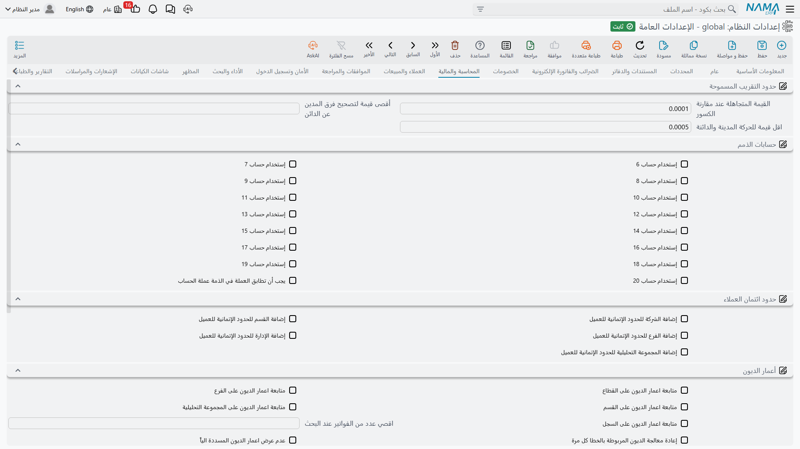

# المحاسبة والمالية

تجمع هذه الصفحة الإعدادات التي تقرر متى يكون الفرق صغيراً بما يكفي لتجاهله، وكم خانة حساب يحملها العميل أو المورد، وكيف تُتابَع حدود الائتمان وأعمار الديون، وكيف تتصرف المدفوعات والموازنات والتكاليف.

## حدود التقريب المسموحة

أي نظام يضرب الكميات في الأسعار ويطبّق النسب سينتج في النهاية إجمالي مدين وإجمالي دائن يختلفان بجزء من القرش. وهذه الأرقام الثلاثة تخبر النظام متى يتغاضى ومتى يرفض.

**هامش الخطأ المسموح** `value.info.lowMargin` *(الافتراضي 0.0001)* — «المبلغ المهمَل» العام في النظام. ويُرجَع إليه في مواضع كثيرة: قيود اليومية، والتحويلات بين الشركات، والحركات المحاسبية، وحصر المقاولات، والتحقق من الأسعار. وأي فرق أصغر منه يُعامل كصفر.

::: warning أبقِ الهامش صغيراً
الاسم وعد. فالنظام يرفض حفظ قيمة أكبر من 10 ويعترض صراحةً بأن الرقم «ليس صغيراً على الإطلاق»، لأن الهامش الكبير يبتلع في صمت اختلالات حقيقية. والقيمة الافتراضية 0.0001 مناسبة للجميع تقريباً.
:::

**أقصى تصحيح لفرق المدين والدائن** `value.info.maximumDrCrDiffCorrection` — أكبر اختلال يصححه النظام في صمت بدل رفضه عند كتابة حركة محاسبية. وموقعه فوق هامش الخطأ: فما دون الهامش لم يحدث شيء، وما بين الاثنين يصححه النظام، وما فوقه يُرفض القيد.

**أقل قيمة للمدين والدائن** `value.info.minDebitCreditValue` *(الافتراضي 0.0005)* — المبالغ الأقل من هذا تُعدّ صفراً عند تحديد جانب القيد مديناً أو دائناً، فيمنع ذلك كسراً متبقياً من إنشاء سطر أحادي بلا معنى.

## حسابات الذمم

يحمل العميل أو المورد أو الموظف مجموعة خانات حسابات — مدينون، ودائنون، وسُلف، وغيرها. خمس منها موجودة دائماً، والخانات من 6 إلى 20 اختيارية.

**استخدام الحساب 6** حتى **استخدام الحساب 20** `value.info.useAccount6` … `value.info.useAccount20` — كل مفتاح يضيف خانة حساب واحدة إلى شاشات الملفات الأساسية المعنية. فعّل ما تستعمله فقط: فكل خانة تفعّلها حقل إضافي على كل شاشة عميل ومورد وموظف.

**عملة الذمة يجب أن تطابق عملة الحسابات** `value.info.subsidiaryCurrencyShouldMatchAccountsCurrency` — يتحقق من أن كل حساب مرتبط بالذمة يحمل عملة الذمة نفسها، ويرشّح قائمة اختيار الحسابات وفق ذلك. ويستحق التفعيل حيثما تتعامل بأكثر من عملة، لأن الحساب غير المطابق لا يُكتشف إلا حين ترفض الأرصدة أن تتطابق.

## حدود ائتمان العملاء

**إضافة الشركة / القطاع / الفرع / الإدارة / المجموعة التحليلية لائتمان العملاء** `value.info.addLegalEntityToCustCredits`, `...addSectorToCustCredits`, `...addBranchToCustCredits`, `...addDeptToCustCredits`, `...addAnalysisSetToCustCredits` — كل خيار يضيف ذلك المحدد عموداً في جدول حدود ائتمان العميل، فيمكن منح العميل الواحد حداً مختلفاً لكل فرع أو لكل شركة. فعّل المحددات التي تميّزها سياسة الائتمان لديك فعلاً، فكل واحد منها يضاعف عدد الأسطر التي على إدارة الائتمان صيانتها.

## أعمار الديون

أعمار الديون هي الطريقة التي يربط بها النظام المقبوضات بالفواتير التي تسددها، وبها يجيب عن سؤال «كم عمر هذا الرصيد؟».

**متابعة أعمار الديون على القطاع / الفرع / الإدارة / المجموعة التحليلية / السجل** `value.info.trackDebtAgesOn.trackDebtAgesOnSector` وأخواته — المحددات التي تكوّن المفتاح الذي تُتابع الديون وتُربط عليه. وإضافة محدد هنا تعني أن سند قبض في فرع لن يرتبط بفاتورة في فرع آخر. وهو صحيح حين تكون الفروع دفاتر منفصلة فعلاً، ومزعج حين لا تكون كذلك.

**أقصى عدد فواتير في قائمة الاقتراحات** `value.info.trackDebtAgesOn.maxInvoicesInSuggestionList` *(الافتراضي 256)* — يحدّ عدد الفواتير المفتوحة المعروضة عند ربط سند قبض. ارفعه للعملاء ذوي القوائم المفتوحة الطويلة جداً؛ وكل سطر إضافي يكلّف وقتاً على الشاشة.

**إعادة معالجة كل أعمار الديون غير المرتبطة في كل مرة** `value.info.trackDebtAgesOn.reprocessAllUnmatchedDebtAgesEveryTime` — يفحص كل دين غير مرتبط في كل تشغيل بدل الجديد وحده. شامل، لكنه يبطؤ تدريجياً كلما كبر تراكم غير المرتبط.

**عدم عرض أعمار الديون المرتبطة آلياً** `value.info.trackDebtAgesOn.doNotDisplayAutomaticMatchedDebitAges` — يخفي الأسطر التي ربطها النظام بنفسه، فلا تبقى على الشاشة إلا ما يحتاج قراراً بشرياً.

**عدم إظهار الديون غير المسددة قبل** `value.info.trackDebtAgesOn.doNotShowUnpaidDebtsBefore` — تاريخ فاصل. فالديون القديمة غير المسددة قبله تكفّ عن تكديس شاشة الربط، وهو مفيد بعد ترحيل جلب سنوات من البنود المفتوحة التاريخية.

**اختصار أعمار الديون في نفس المستند** `value.info.trackDebtAgesOn.shortenDebtAgesInSameDocument` — يقاصّ المدين والدائن العائدين للمستند نفسه قبل الربط، فتتلاشى الفاتورة مع إشعار الخصم الخاص بها بدل ظهورهما بندين مفتوحين.

**عدم ربط أعمار الديون آليا (يدويا فقط)** `value.info.trackDebtAgesOn.neverAutoMatchDebtAges` — يعطّل الربط الآلي تماماً. اختره حيث يصرّ الفريق المحاسبي على أن يقرر كل تخصيص بنفسه.

## المدفوعات والمقبوضات

**استخدام المدخلات النظامية لمستندات القبض والصرف** `value.info.usePayReceiptDocsSysEntries` *(مفعل افتراضياً)* — تنشئ مستندات القبض والصرف مدخلات نظامية على الفواتير التي تسددها، وهذا ما يجعل الفاتورة على علم بما سُدِّد منها.

**خصم القبض والصرف من المتبقي** `value.info.deductPaymentAndReceiptInRemaining` — تنقص هذه المدفوعات أيضاً من *متبقي* الفاتورة. ويعتمد هذا الخيار على سابقه؛ ويرفض النظام حفظه وحده ويخبرك بذلك.

**تفعيل عدد الأيام قبل السماح بالمرتجع حسب طريقة الدفع** `value.info.enableDaysBeforeAllowingReturnInPaymentMethod` — يفعّل القاعدة الخاصة بكل طريقة دفع بأن البيع لا يُرتجع إلا بعد مرور عدد معيّن من الأيام. وتسويات البطاقات هي السبب المعتاد.

## الموازنات

**السماح بتغيير قيم السنة 1 / 2 / 3 / 4** `value.info.allowValuesChangeOfYear1` … `...Year4` — يقارن سيناريو الموازنة حتى أربع سنوات، ويحدد كل مفتاح هل تُعدَّل أرقام تلك السنة. وعادةً تُقفل السنوات الماضية وتُترك السنة الجاري تخطيطها مفتوحة.

**استخدام «إلى فترة» في الموازنة المالية** `value.info.useToPeriodInFinancialBudget` — يضيف عمود «إلى فترة» إلى جداول الموازنة المالية وسيناريو الموازنة، فيغطي السطر الواحد مدى فترات بدل فترة واحدة. فعّله حيث تُوضع الموازنات ربع سنوية أو سنوية لا شهراً بشهر.

## التكاليف

**تعطيل تسوية المخازن** `value.info.disableWarehousesAdjustment` *(مفعل افتراضياً)* — عند تفعيله لا ينتج النظام أسطر تسوية تكلفة لكل مخزن، ويتخطى فحص توازن تلك التسويات. وهو مفعّل افتراضياً لأن معظم التركيبات لا تتابع التكلفة على مستوى المخزن. لا توقفه إلا إذا كنت تحتاج تسوية التكلفة على مستوى المخزن فعلاً، وتوقّع أسطر قيود إضافية وتشغيل تكلفة أبطأ.

**تفعيل الطلبات المسبقة لدفتر التكاليف** `value.info.enablePresendRequestsForCostLedger` — يسمح بإنشاء طلب أعمال قبل حفظ المستند المالك له. وهذا ما يتيح إلحاق آثار محاسبية بصرف مخزني أو إذن إضافة أو تحويل عبر مسار كيان؛ ويرفض المسار العمل بدونه ويخبرك بذلك.
