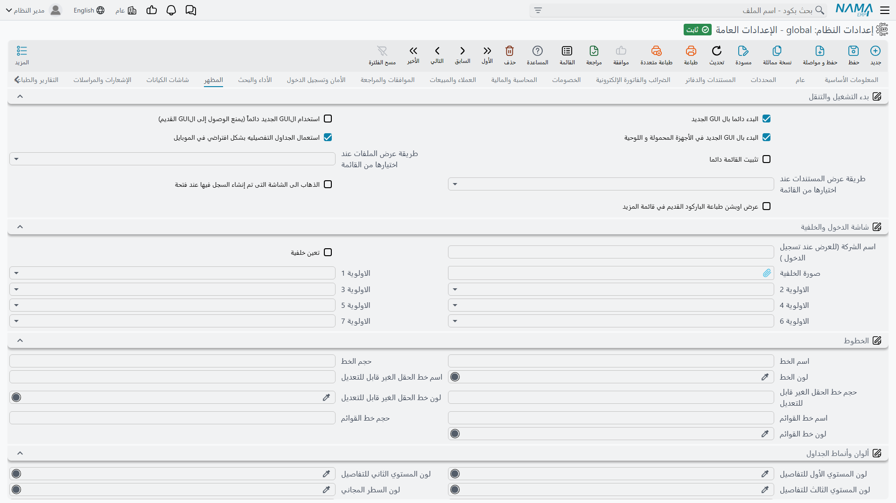

# المظهر

كيف يبدو النظام وكيف يتنقل فيه المستخدمون: ماذا يُفتح عند بدء التشغيل، وماذا تعرض شاشة الدخول، وأي الخطوط والألوان تُستعمل، وكيف تتصرف النوافذ المنبثقة والمساعدات السريعة.

## بدء التشغيل والتنقل

**البدء دائما بالواجهة الجديدة** `value.info.startAlwaysByNewGui` *(مفعل افتراضياً)* — تفتح جلسات الويب الواجهة الحديثة بدل القديمة.

**استخدام الGUI الجديد دائماً (يمنع الوصول إلى الGUI القديم)** `value.info.alwaysUseNewGUI` — الخيار السابق لا يقرر إلا أين *تبدأ* الجلسة، ومن يعرف عنوان الواجهة القديمة يستطيع فتحها. وبتفعيل هذا يُغلق ذلك الباب: فكل محاولة لفتح شاشة قديمة يُعاد توجيهها إلى الواجهة الحديثة. وهذا هو الإعداد المناسب بعد أن تُتمّ التركيبة انتقالها — فما دامت الواجهتان متاحتين، سيظل قليل من المستخدمين يعملون على القديمة ويبلّغون عن مشكلات عولجت في الجديدة منذ أشهر. واتركه موقوفاً ما دام مسار عمل حقيقي يحتاج الشاشات القديمة. وللخادم كذلك أن يمنع الواجهة القديمة من تلقاء نفسه عبر الخاصية `disable-old-ui`، فإن بقيت الشاشات القديمة ممنوعة مع إيقاف هذا الخيار فابحث هناك.

**البدء في الموبايل بالواجهة الجديدة** `value.info.startInMobileByNewGui` *(مفعل افتراضياً)* — القرار نفسه لمتصفحات الهواتف.

**استخدام الجداول التفصيلية في الموبايل** `value.info.useDetailedGridsInMobile` *(مفعل افتراضياً)* — يعرض الهاتف جداول كاملة بدل تخطيط البطاقات المضغوط. فالجداول التفصيلية تحمل معلومات أكثر، والبطاقات أسهل في اللمس. واختر بحسب ما يفعله مستخدمو الهاتف فعلاً — فمراجعة الأرقام تريد جداول، وإدخال بضعة حقول يريد بطاقات.

**تثبيت القائمة كشريط جانبي** `value.info.fixMenuAsSideBar` — يثبّت القائمة الرئيسية مفتوحة كشريط جانبي بدل طيّها. مناسب على الشاشات العريضة حيث يتنقل المستخدمون باستمرار.

**طريقة العرض الافتراضية لملفات البيانات الأساسية** `value.info.mfDefaultMenuItemBehavior` — ماذا يحدث حين يختار المستخدم ملفاً أساسياً من القائمة: **مطالعة القوائم** تفتح قائمة السجلات الموجودة، و**سجل جديد** تفتح سجلاً فارغاً. والمطالعة تناسب البيانات المرجعية التي يبحث فيها الناس، و«سجل جديد» تناسب الملفات التي تُنشأ غالباً.

**طريقة العرض الافتراضية للمستندات** `value.info.docDefaultMenuItemBehavior` — والمثل مع وصلات المستندات في القائمة. والتركيبات كثيفة الإدخال تضبط المستندات على «سجل جديد» والملفات الأساسية على «مطالعة القوائم» عادةً.

ويُقرأ هذان الإعدادان أثناء بناء القائمة لا أثناء استعمالها، فتغيير أيٍّ منهما لا يمسّ القائمة القائمة بالفعل — انظر [كيف تُبنى القائمة](/ar/platform/menus/menu-structure).

**إعادة التوجيه لشاشة التعديل** `value.info.shouldRedirectEditView` — حين يكون للسجل شاشة تعديل مخصصة معرّفة، يعيد فتحه التوجيه إليها بدل عرض الشاشة القياسية.

**إظهار قائمة الباركود القديمة** `value.info.showOldBarcodeMenu` — يبقي قائمة الباركود القديمة ظاهرة. ولا تلزم إلا حيث ما زال مسار عمل باركود قديم مستعملاً.

## شاشة الدخول والخلفية

**اسم الشركة في شاشة الدخول** `value.info.companyNameForLoginPage` — الاسم المعروض على شاشة الدخول.

**استخدام صورة خلفية** `value.info.useBackgroundImage` و**صورة الخلفية** `backgroundImage` — هل تُعرض صورة خلفية، والصورة نفسها.

**الأولوية الأولى** حتى **الأولوية السابعة** `value.info.firstPriority` … `value.info.seventhPriority` — يمكن تعريف صورة الخلفية على سبعة مستويات: الإعدادات العامة، والشركة، والقطاع، والفرع، والإدارة، والمجموعة التحليلية، والمستخدم نفسه. وهذه الخانات السبع ترتّب تلك المستويات، ويستعمل النظام أول مستوى تكون له صورة فعلاً. ضع **المستخدم** أولاً إن أردت أن يخصص الناس خلفياتهم مع الرجوع إلى صورة الشركة حين لا يفعلون، وضع **الشركة** أولاً في مجموعة شركات يجب أن تُظهر كل تابعة فيها هويتها البصرية.

## الخطوط

**اسم الخط** / **حجم الخط** / **لون الخط** `value.info.fontInfo.fontName`, `...fontSize`, `...fontColor` — خط الواجهة الرئيسي.

**اسم / حجم / لون خط الحقول المعطلة** `value.info.fontInfo.disabledFontName`, `...disabledFontSize`, `...disabledFontColor` — شكل عرض الحقول المعطلة. ويستحق ضبطاً مقصوداً: فالمستخدم يحتاج أن يميّز بنظرة أن الحقل للقراءة فقط، والرمادي المفرط في الفتوح يُقرأ «معطوب» لا «مقفل».

**اسم / حجم / لون خط القائمة** `value.info.fontInfo.menuFontName`, `...menuFontSize`, `...menuFontColor` — خط القائمة.

## ألوان وأنماط الجداول

يستعمل النظام اللون ليحمل معنى داخل الجداول، وهذه الإعدادات تحدد شكل كل معنى.

**لون المستوى الأول / الثاني / الثالث في الجداول** `value.info.gridLevel1Color`, `...gridLevel2Color`, `...gridLevel3Color` — ألوان الأسطر لمستويات التداخل الثلاثة في جدول التفاصيل، فيرى القارئ بنظرة أي الأسطر تتبع أي أصل.

**لون السطر المجاني** `value.info.freeLineColor` — الأسطر الحاملة أصنافاً مجانية.

**لون السطر التابع** `value.info.slaveLineColor` — الأسطر المولَّدة كأبناء لسطر آخر.

**لون الصنف المرتجع** `value.info.returnedItemColor` — الأسطر التي أُرجعت.

**نمط السطر المرسل** / **نمط السطر المرسل غير الصالح** `value.info.sentLineStyle`, `value.info.inValidSentLineStyle` — الأسطر المرسلة بالفعل إلى نظام خارجي، وتلك التي فشل إرسالها في التحقق. اختر لونين مختلفين بوضوح: فتمييز «مرسل» من «مرسل ومرفوض» بنظرة هو الغاية كلها.

**السماح بلف النص في الجداول** / **في مطالعة القوائم** `value.info.allowTextWrapInGrids`, `value.info.allowTextWrapInListViews` — يتيح لنص الخلية أن يلتف على أكثر من سطر بدل بتره. أوضح للقراءة، لكن عدد الأسطر التي تسع الشاشة يقل.

**عدد الأسطر في الجداول** `value.info.linesCountInGrids` — عدد الأسطر الافتراضي في صفحة الجدول.

**أنماط إضافية للواجهة القديمة** `value.info.legacyUIExtraStyles` — تنسيقات إضافية تُطبَّق في الواجهة القديمة، للتركيبات التي تحتاج مظهراً بعينه هناك.

::: tip لون وأيقونة لنوع سجل واحد أو حقل واحد
كل ما سبق يلوّن النظام كله على نمط واحد. فإن كان المعنى الذي تريد الإشارة إليه أضيق — أيقونة على فاتورة المبيعات في القائمة، أو لون على حقل *العميل*، أو أيقونة مختلفة لكل قيمة من قيم حالة ما — فاضبطه في [أعدادات الحقول و الشاشات](/ar/platform/fields-and-entities-settings/fields-settings-field-icons)، وهي تتيح أيضاً أن تعطي كل أيقونة لوناً للوضع الفاتح وآخر للوضع الداكن فتبقى واضحة في الحالتين.
:::

## النوافذ المنبثقة والمحررات

**إخفاء عمود الاختيار في نافذة الاختيار** `value.info.hideSelectColumnInSelectorPopup` — يزيل عمود الاختيار من نافذة اختيار السجلات.

**إخفاء عمود العدد في نافذة الاختيار** `value.info.hideCountColumnInSelectorPopup` — يزيل عمود العدد من النافذة نفسها. وكلاهما يشذّب نافذة اختيار يجدها المستخدمون مزدحمة.

**استخدام مربع نص دائما في نافذة الأرقام المسلسلة** `value.info.alwaysUseTextAreaInSerialPopup` — يستعمل إدخال الأرقام المسلسلة مربعاً متعدد الأسطر دائماً، وهو ما يناسب لصق قائمة طويلة من الأرقام الممسوحة.

**عدم استخدام الأوصاف في الحقول** `value.info.doNotUseDescriptorsInFields` — تعرض حقول المرجع الكود والاسم فقط بدل النص الوصفي الأطول. فعّله حيث تكون الأوصاف طويلة إلى حد يدفع الجزء المفيد من الحقل خارج الشاشة.

**استخدام محرر Kendo الغني** `value.info.useKendoRichEditor` — تستعمل حقول النص الغني محرر Kendo.

**إنشاء المستند الارشيفي في شاشة منبثقة** `value.info.createDMSDocInPopUpWindow` *(مفعل افتراضياً)* — يفتح إجراء «إنشاء مستند ارشيفي» [المستند الأرشيفي](/ar/platform/dms/dms-documents.md) الجديد في نافذة منبثقة بدل الانتقال بعيداً، فلا يفقد المستخدم السجل الذي كان يعمل عليه.

## المساعدات السريعة

**موضع المساعدة السريعة** `value.info.tooltipPosition` — هل تظهر المساعدة السريعة أعلى الحقل أم أسفله.

**تثبيت المساعدة السريعة** `value.info.pinToolTip` — يبقي المساعدة مفتوحة بدل اختفائها، وهو ما يعين المستخدمين وهم يتعلمون شاشة جديدة.
