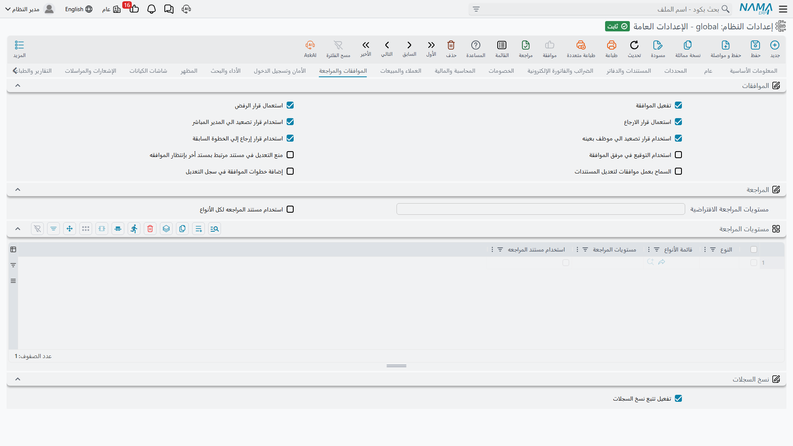

# الموافقات والمراجعة

في النظام طريقتان منفصلتان لوضع فحص بشري بين «أدخل أحدهم هذا» و«تصرّف النظام بناءً عليه». **الموافقات** توجّه المستند إلى من يجب أن يوافقوا عليه، و**المراجعة** تشترط أن يسم عددٌ من الأشخاص السجل بأنه روجع. وتضبط هذه الصفحة كليهما، إضافةً إلى تتبع نسخ السجلات.

## الموافقات

**تفعيل الموافقات** `value.approvalEnabled` *(مفعل افتراضياً)* — المفتاح الرئيسي لمنظومة الموافقات كلها. ومع إيقافه تُتجاهل قواعد الموافقة في كل مكان.

وتحدد الخيارات التالية الأزرار التي يراها المعتمِد فعلاً. وكل خيار تتركه مفعّلاً قرار إضافي على المعتمِد أن يزنه، ولذلك تُنتج القائمة القصيرة المقصودة قراراتٍ أسرع وأكثر اتساقاً في الغالب.

**استخدام قرار الرفض** `value.info.useRejectDecision` *(مفعل افتراضياً)* — يُظهر **رفض**، وهو ينهي الموافقة ويرفض المستند.

**استخدام قرار الإرجاع** `value.info.useReturnDecision` *(مفعل افتراضياً)* — يُظهر **إرجاع**، وهو يعيد المستند إلى كاتبه ليصححه ويعيد تقديمه بدل إنهائه.

**استخدام التصعيد للمدير** `value.info.useEscalateToSupervisor` *(مفعل افتراضياً)* — يُظهر **تصعيد للمدير**، فيرفع القرار في الهيكل التنظيمي.

**استخدام التصعيد لموظف محدد** `value.info.useEscalateToSpecificEmployee` *(مفعل افتراضياً)* — يُظهر **تصعيد لموظف**، فيختار المعتمِد من يقرر بدلاً منه.

**استخدام الإرجاع للخطوة السابقة** `value.info.useReturnToPreviousStep` *(مفعل افتراضياً)* — يُظهر **إرجاع للخطوة السابقة**، فيعيد المستند مرحلة واحدة في سلسلة الموافقة بدل إعادته إلى كاتبه.

**استخدام التوقيع في مرفق الموافقة** `value.info.useSignatureInApprovalAttachment` — يطبع صورة توقيع المعتمِد المحفوظة على المرفق الناتج عن الموافقة، فيحمل السجل المطبوع توقيعاً مرئياً.

**منع تعديل المستند والمستندات المرتبطة أثناء الموافقة** `value.info.preventUpdateDocAndRelatedDocInApproval` — يقفل المستند *والمستندات المرتبطة به* أثناء انتظار القرار. وبدونه يستطيع الكاتب أن يغيّر في صمت ما ينظر إليه المعتمِد.

**السماح بالموافقات عند تعديل المستندات** `value.info.allowApprovalsOnDocumentsUpdate` — يعيد تشغيل قواعد الموافقة عند تعديل مستند سبقت الموافقة عليه، فيعود التغيير الجوهري إلى السلسلة بدل أن يرث الموافقة القديمة.

**إضافة خطوات الموافقة لسجل الإجراءات** `value.info.addApprovalStepsToActionHistory` — يكتب كل خطوة موافقة في سجل إجراءات السجل، فيعطي أثراً دائماً لمن قرر ماذا ومتى. ويستحق تكلفته التخزينية الصغيرة حيثما كان للموافقات وزن.

## المراجعة

المراجعة أخفّ من الموافقة: لا توجيه ولا قرارات، بل عدد مطلوب من الاعتمادات قبل أن يُعدّ السجل مفحوصاً.

**مستويات المراجعة الافتراضية** `value.info.defaultReviseLevel` — عدد مستويات المراجعة التي تسري على الكيانات التي ليست لها قاعدة خاصة. والقيم السالبة مرفوضة.

**استخدام مستند المراجعة لكل الكيانات** `value.info.useReviseDocumentForAllEntities` — تُراجع كل الكيانات عبر مسار مستند المراجعة المنفصل بدل مراجعتها في مكانها على السجل نفسه.

**مستويات المراجعة** `value.info.entitiesReviseLevels` *(جدول)* — قواعد لكل كيان. كل سطر يذكر نوع كيان (أو قائمة أنواع)، وعدد مستويات المراجعة التي يحتاجها، وهل يستعمل مستند المراجعة. وبهذا تشترط اعتمادين على قيود اليومية ولا شيء على التحويل المخزني.

## نسخ السجلات

**تفعيل تتبع نسخ السجلات** `value.trackVersionsEnabled` *(مفعل افتراضياً)* — يحفظ تاريخاً كاملاً لنسخ السجلات، فترى كيف كان المستند قبل التعديل ومن غيّره. ويمكن لكل كيان تجاوز هذا عبر إعداداته الخاصة.

::: tip التاريخ يكلّف مساحة لا سرعة
يكتب تتبع النسخ نسخة من السجل عند كل تغيير. وعلى المستندات كثيفة الحركة يتراكم ذلك على مدى سنوات، ولهذا وُجد التجاوز على مستوى الكيان — أبقِ التاريخ الكامل على السجلات التي سيسأل عنها المراجع، وأوقفه على السجلات التشغيلية سريعة التغيّر التي لا يعود إليها أحد.
:::
