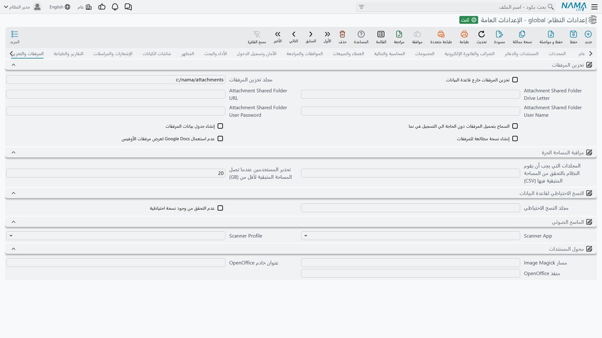

# المرفقات والتخزين

أين تعيش الملفات المرفقة، وكيف تُراقَب مساحتها على القرص، والأداتان الخارجيتان اللتان يستعملهما النظام لمسح الورق وتحويل المستندات.

::: tip أرشفة المستندات الورقية
تحكم هذه الإعدادات تخزين كل مرفق في النظام بما فيه المستندات الأرشيفية. فإن كنت تحفظ أوراقاً مادية —
عقوداً أو تراخيص أو صكوكاً — بمواقع رفوف وتاريخ استعارة، فذلك هو [إدارة المستندات](/ar/platform/dms/)،
وإعدادات الماسح الضوئي والمحوّل أدناه هي مدخلها.
:::

## تخزين المرفقات

تُخزَّن محتويات المرفق داخل قاعدة البيانات افتراضياً. وهذا بسيط ويجعل النسخ الاحتياطية مكتفية بذاتها، لكن بضع سنوات من الفواتير الممسوحة ستجعل قاعدة البيانات أكبر بكثير من بيانات العمل التي تحملها.

**تخزين المرفقات خارجياً** `value.info.externalizeAttachments` — يخزّن محتوى المرفقات على القرص بدل قاعدة البيانات، فلا تحتفظ القاعدة إلا بالبيانات الوصفية ومؤشر إلى الملف.

::: warning التخزين الخارجي يغيّر خطة النسخ الاحتياطي
بمجرد أن تعيش الملفات على القرص، لم تعد النسخة الاحتياطية لقاعدة البيانات تحتويها. فيجب أخذ نسخة من المجلد أيضاً واستعادته مع القاعدة — فقاعدة تُستعاد بلا مجلد مرفقاتها ستُظهر كل مرفق مفقوداً.
:::

**مجلد المرفقات الخارجي** `value.info.externalAttachmentsFolder` *(الافتراضي `c:/nama/attachments` على ويندوز و`/var/nama/attachments` على غيره)* — المجلد الجذر لتلك الملفات.

**حرف محرك المشاركة** / **رابط المشاركة** / **مستخدم المشاركة** / **كلمة سر المشاركة** `value.info.attachmentShareDriveLetter`, `value.info.attachmentShareURL`, `value.info.attachmentShareUser`, `value.info.attachmentSharePassword` — حين يكون المجلد مشاركة شبكية لا قرصاً محلياً، فهذه الحقول تربطه. واملأ أياً منها يصر حرف المحرك والرابط مطلوبين؛ ويخبرك النظام أيها ناقص عند الحفظ.

**السماح بتحميل المرفقات دون توثيق** `value.info.allowDownloadAttachmentWithoutAuthentication` — تعمل روابط المرفقات دون جلسة. ويحتاجه بعض العارضين والبوابات الخارجية، لكنه يعني أن كل من يملك الرابط يستطيع جلب الملف — فلا تفعّله إلا حين تعلم أن ذلك مقبول.

**إنشاء جدول معلومات المرفقات** `value.info.createAttachmentInfoTable` — يصون جدولاً منفصلاً يصف المرفقات ويعرضه في القوائم والشاشات، فتستطيع رفع تقارير عمّا هو مرفق وأين وكم يشغل من مساحة.

**إنشاء معاينة ومصغّرة للمرفق** `value.info.createAttachmentPreviewAndThumbnail` — ينتج معاينة وصورة مصغّرة لكل ملف مرفوع. والمصغّرات تجعل تصفح قائمة المرفقات أيسر بكثير، مقابل بعض المعالجة عند الرفع وقليل من المساحة الإضافية.

**عدم استعمال Google Docs لعرض مرفقات الأوفيس** `value.info.dontUseGoogleDocsForOfficeFilesPreview` — لا يستطيع المتصفح وحده عرض ملفات وورد وإكسل وباوربوينت، فيعرضها النظام افتراضياً بتضمين عارض المستندات العام من Google موجَّهاً إلى عنوان الملف. وهذا يعمل، لكنه يسلّم العنوان إلى خدمة خارجية، ويشترط أن يكون الملف قابلاً للوصول من الإنترنت العامة — وهو ما لا يتحقق عادةً على خادم داخلي، فلا تُحمَّل المعاينة أصلاً. وبتفعيل هذا الخيار يكفّ النظام عن تضمين العارض: فتقول نافذة المعاينة إن الملف غير قابل للعرض وتطلب من المستخدم تنزيله. فعّله حيثما كان الخادم غير مرئي من الخارج، أو حيثما كان تسليم عناوين المستندات إلى طرف ثالث غير مقبول.

## مراقبة المساحة الحرة

**المجلدات المراد فحص مساحتها** `value.info.foldersToCheckSpace` — المجلدات التي يراقب النظام مساحتها الحرة. اذكر هنا مجلد المرفقات وكل موضع يوقف امتلاؤه العمل.

**التنبيه عند وصول المساحة الفارغة إلى (جيجابايت)** `value.info.notifyWhenEmptySpaceReachesGB` *(الافتراضي 20)* — دون هذا العدد من الجيجابايتات الحرة يرفع النظام رسالة حرجة. اضبطه عالياً بما يكفي ليجد أحدهم وقتاً للتصرف — فالقرص الذي يمتلئ تماماً يوقف المرفقات والتصدير وقاعدة البيانات نفسها في الغالب.

## النسخ الاحتياطي لقاعدة البيانات

النسخة الاحتياطية التي لا يفحصها أحد نسخة غير موجودة. فخطة الصيانة التي توقفت بهدوء عن كتابة الملفات منذ ثلاثة أسابيع تبدو تماماً كخطة تعمل — حتى يأتي اليوم الذي تحتاج فيه إلى الاستعادة. لذلك يراقب النظام مجلد النسخ الاحتياطي نيابة عنك، ويرفع رسالة حرجة حين تغيب النسخة الحديثة.

**مجلد النسخ الاحتياطي** `value.info.backupFolder` — المجلد الذي تكتب فيه مهمة النسخ الاحتياطي لقاعدة بياناتك، **كما يراه خادم التطبيق**. يفحص النظام هذا المجلد وحتى مستويين من المجلدات الفرعية تحته، فتظل الخطة التي تكتب مجلداً لكل يوم أو لكل قاعدة بيانات مفهومة. ويبحث عن الملفات المنتهية بـ `.bak` أو `.dbak`، ويعدّ الملف حديثاً إذا حمل اسمه تاريخ اليوم أو الأمس بصيغة `YYYYMMDD`، أو إذا كان آخر تعديل عليه في أي وقت منذ بداية يوم أمس.

**عدم التحقق من وجود نسخة احتياطية** `value.info.doNotCheckForBackupExistence` — يعطّل الفحص كله. استعمله حين تُؤخذ النسخ الاحتياطية في موضع لا يراه النظام — لقطة على مستوى وحدة التخزين، أو خدمة قاعدة بيانات سحابية، أو وكيل ينقل الملفات مباشرة خارج الجهاز — فيتوقف الخادم عن الإبلاغ عن نسخة مفقودة لا سبيل له إلى إيجادها.

::: warning النظام يفحص النسخة ولا يأخذها
تعبئة المجلد لا تجدول شيئاً. فنسخة قاعدة البيانات لا يزال يجب أن تنشئها خطة الصيانة في SQL Server أو الأداة التي تستعملها؛ وهذا الإعداد لا يفعل إلا أن يدل النظام على موضع النتيجة لينظر فيه.
:::

يعمل الفحص عند بدء تشغيل الخادم ويتكرر كل ساعة، وقد يرفع إحدى ثلاث رسائل في قائمة الأخطاء الحرجة: المجلد لم يُملأ أصلاً، أو المجلد مملوء لكن الخادم لا يستطيع الوصول إليه، أو المجلد متاح لكنه لا يحوي شيئاً بتاريخ اليوم أو الأمس. وكل رسالة ترتبط مباشرة بحقل **مجلد النسخ الاحتياطي**، فالضغط عليها يفتح هذه الشاشة والحقل في بؤرة التركيز. وتجد علاج كل حالة في [الأسئلة العامة](/ar/admin/troubleshooting/general-faq).

::: tip وجّهه إلى مسار يصله حساب خدمة الخادم
يحلّ خادم التطبيق هذا المجلد لا متصفحك. فالمسار المحلي مثل `D:/backup` مباشر؛ والمشاركة الشبكية تصلح أيضاً، لكن يجب أن يملك حساب ويندوز الذي يعمل به Tomcat صلاحية الوصول إليها — فالمشاركة التي تفتح عندك في مستكشف الملفات تبقى بعيدة المنال إن كانت الخدمة تعمل بحساب محلي.
:::

## الماسح الضوئي

**تطبيق المسح الضوئي** `value.info.scannerApp` — أي تكامل مسح يستعمله إجراء «إرفاق من الماسح»: **cScanTwain** أو **DynamicWebTWAIN**.

**ملف تعريف المسح** `value.info.scannerProfile` — إعدادات المسح الافتراضية: **مستند أبيض وأسود** أو **مستند ملون** أو **تدرج رمادي** أو **إظهار واجهة الماسح** ليختار المستخدم في كل مرة. والأبيض والأسود يبقي مسح المستندات صغير الحجم؛ ولا تستعمل الألوان إلا حيث يحمل اللون معلومة، كأصل مختوم أو موقّع.

::: tip زر مسح لحقل بعينه — أو مكان للتوقيع
تحدد هذه الإعدادات *كيف* يعمل المسح، لكنها لا تضع زر مسح في أي مكان. ولإضافة زر، علّم حقل المرفق كحقل مسح ضوئي في [أعدادات الحقول و الشاشات](/ar/platform/fields-and-entities-settings/fields-settings-field-appearance) — فيحصل الحقل على زره الخاص الذي يمسح مباشرة إليه بدل المرور بقائمة المرفقات العامة. والشاشة نفسها تحوّل حقل المرفق إلى **لوحة توقيع**، فيوقّع العميل على إذن التسليم على الشاشة بإصبعه أو بقلم، ويُحفظ الرسم كمرفق.
:::

## محول المستندات

يحوّل النظام ملفات أوفيس والصور إلى PDF للمعاينة والطباعة، مستعملاً أداتين خارجيتين.

**مسار ImageMagick** `value.info.docConverterSettings.imageMagicPath` — مسار ملف ImageMagick التنفيذي على الخادم، ويُستعمل لتحويل الصور.

**عنوان خادم OpenOffice** / **منفذ خادم OpenOffice** `value.info.docConverterSettings.openOfficeServerAddress`, `...openOfficeServerPort` — عنوان ومنفذ خدمة التحويل LibreOffice أو OpenOffice التي تحوّل ملفات وورد وإكسل وأمثالها إلى PDF.

::: tip هذه مسارات على الخادم لا على جهاز المستخدم
يشير الإعدادان إلى برامج مثبّتة على خادم التطبيق لا على جهاز المستخدم. فإن توقفت معاينة المستندات بعد نقل الخادم، فهاتان أول قيمتين تفحصهما.
:::
