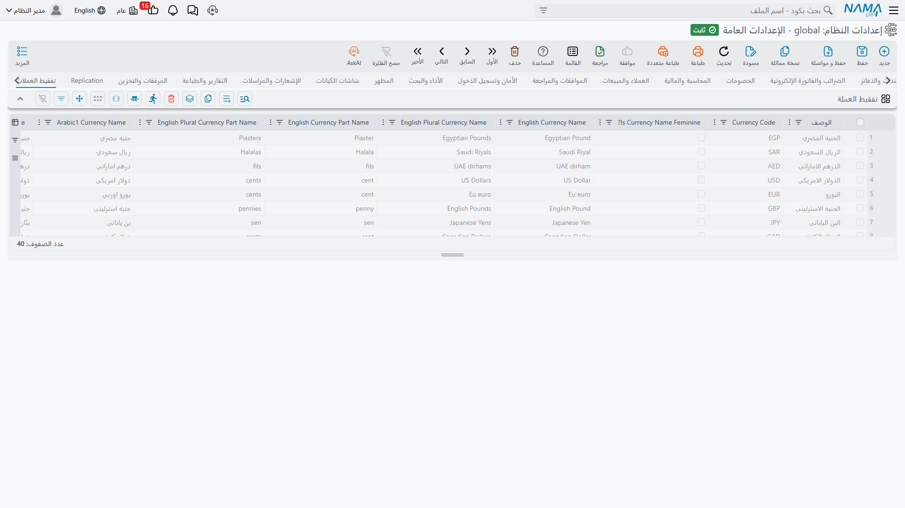

# تفقيط العملات

التفقيط هو كتابة المبلغ بالحروف — ذلك السطر على الشيك أو الفاتورة الذي يقرأ «ألف ومئتا جنيه مصري وخمسون قرشاً فقط لا غير». وتحمل هذه الصفحة المفردات التي يحتاجها النظام ليكوّن تلك الجملة صحيحةً.

## لماذا تحتاج العملة الواحدة كل هذه الأعمدة

تحتاج العملة في الإنجليزية كلمتين: *pound* و*pounds*. أما العربية فأصعب، لأن الاسم يتغيّر شكله بحسب عدده. ولذلك يخزّن النظام أربع صور لاسم كل عملة وأربعاً لاسم كسرها:

| العدد | الصورة المخزّنة | مثال |
|---|---|---|
| 1 | `arabic1CurrencyName` | جنيه مصري |
| 2 | `arabic2CurrencyName` | جنيهان مصريان |
| 3 – 10 | `arabic310CurrencyName` | جنيهات مصرية |
| 11 – 99 | `arabic1199CurrencyName` | جنيهاً مصرياً |

والصور الأربع نفسها موجودة للوحدة الكسرية — القرش والهللة والفلس — تحت `arabic1CurrencyPartName` و`arabic2CurrencyPartName` و`arabic310CurrencyPartName` و`arabic1199CurrencyPartName`.

ويهمّ التذكير والتأنيث أيضاً، لأن لفظ العدد يجب أن يطابقه. ويسجّله حقلا **اسم العملة مؤنث** (`currencyNameFeminine`) و**اسم كسر العملة مؤنث** (`currencyPartNameFeminine`) — فالليرة السورية مؤنثة والجنيه المصري ليس كذلك.

## الجدول

**تفقيط العملات** `value.info.tafqeetInfo` *(جدول)* — سطر لكل عملة. ويأتي النظام بنحو أربعين عملة مملوءة سلفاً، تغطي العالم العربي والعملات العالمية الرئيسية، فلا تلمس معظم التركيبات هذه الشاشة أبداً.

ويحمل كل سطر:

- **الوصف** و**كود العملة** — اسم العملة ورمزها الثلاثي (`EGP`، `SAR`، `USD`)، وبه يُطابَق السطر بالمبلغ.
- **اسم العملة بالإنجليزية** و**اسم العملة بالإنجليزية جمع** — المفرد والجمع، وهو كل ما تحتاجه الإنجليزية.
- **اسم كسر العملة بالإنجليزية** و**اسم كسر العملة بالإنجليزية جمع** — والمثل للوحدة الكسرية.
- الصور العربية الثماني وعلامتَي التأنيث الموصوفتين أعلاه.
- **دقة الكسر** — كم خانة عشرية للوحدة الكسرية. ومعظم العملات تستعمل 2 (مئة قرش للجنيه)، بينما الدينار الكويتي والبحريني والأردني والريال العماني والدينار التونسي والليبي والعراقي تستعمل 3 (ألف فلس للدينار). وإن أخطأت فيها كُتب المبلغ 1.500 ديناراً بخمسين فلساً بدل خمسمئة.

::: tip أضف سطراً لعملة تفقّطها فعلاً فقط
يحكم هذا الجدول المبالغ المكتوبة بالحروف، لا أسعار الصرف ولا المحاسبة. فالعملة التي تتاجر بها ولا تكتبها بالحروف على مستند لا تحتاج سطراً هنا. وحين تضيف سطراً فاملأ الصور العربية الأربع — فالصورة الناقصة تنتج جملة خاطئة نحوياً على شيك، وهو بالضبط نوع المستندات التي يُلحَظ فيها ذلك.
:::

وتُحمَّل القيم في الذاكرة عند حفظ الإعدادات، فيسري التصحيح على أول مستند تطبعه بعده.
